# 如何有效地让用户使用你的移动应用？—泽西乌姆

> 原文：<https://medium.datadriveninvestor.com/how-to-effectively-onboard-users-to-your-mobile-app-zesium-1907f188eac?source=collection_archive---------20----------------------->

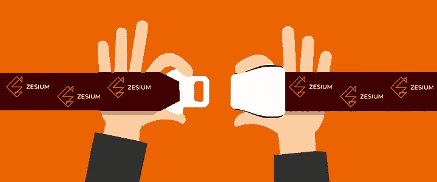

Source: zesium.com

当用户下载你的手机 app 时，你得给**留下好的第一印象。**

与你的应用程序的最初互动应该有助于用户决定你的应用程序值得经常使用。

通过消息向你的应用介绍新用户被称为[入职](https://zesium.com/the-importance-of-onboarding-users-to-your-mobile-app/)，这是你的应用成功的重要组成部分。

没有确保你的应用成功的神奇公式，但是实施以下一些最佳的入门实践可以帮助你成功地吸引和留住用户。

# 移动应用入门的最佳实践

## 首先提供价值

人们下载你的应用是有原因的，入职流程需要表明你会满足他们的期望。

不要炫耀你的应用程序的最佳功能，更重要的是解释用户将从使用你的应用程序中获得什么，并通过产品参观或功能轮播或任何其他方式来提升应用程序的价值。

用户更感兴趣的是对他们有什么好处，而不是你的应用如何工作——他们受他们的需求驱动，你的应用应该是帮助他们实现目标的工具。

 [## 2019 年移动应用开发之路|数据驱动的投资者

### 任何在移动应用程序开发行业工作的人，无论他们是专注于在伦敦开发 iOS 应用程序还是…

www.datadriveninvestor.com](https://www.datadriveninvestor.com/2019/01/15/the-path-of-mobile-app-development-in-2019/) 

例如，移动支付 Venmo 通过展示应用程序的各种用途和受欢迎程度的实时交易显示其核心价值。

> **坚持帮助用户体验应用价值的关键特性*。***

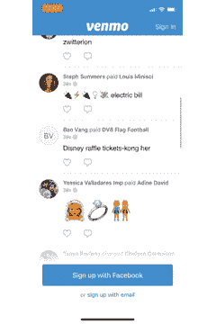

Source: venmo.com

## 只要求必需品

创建任何流程(*注册/注册/支付/入职*)时，尽可能使其简单，并且只询问必要的个人信息和权限。

例如，如果你有一个活动应用程序，你应该请求一个位置访问权限(*并解释需要它来查找附近的活动)*但你不应该请求访问他们的相机或联系人，因为这可能会产生反作用，最终导致用户放弃该应用程序。

尽快入职，因为过去的 Clutch 研究显示 [72%的用户表示，入职不到一分钟](https://clutch.co/app-developers/resources/mobile-app-onboarding-survey-2017)对于决定是否继续使用该应用很重要。

Source: peoplestreme.com

一旦用户完成简短的入职培训，您可以稍后显示其他选项，如注册奖励流程、促销优惠券或其他激励措施。

> 保持简单，不要要求超过你需要的。

## 使它紧凑和简单

人们厌倦了一页又一页的说明，重要的是不要一次用太多的输入字段淹没他们。

一个好的选择是使用插图和应用程序截图来传达重要的信息，因为这将避免沉重的文本解释，这可能会使新用户气馁。

一些需要详细说明的复杂应用程序可能会使用渐进式入职方法，因为它会将流程分解为一步一步的指南，这样就不那么繁琐了。

> 确保内容简短，用尽可能少的话告诉用户他们需要知道的东西。

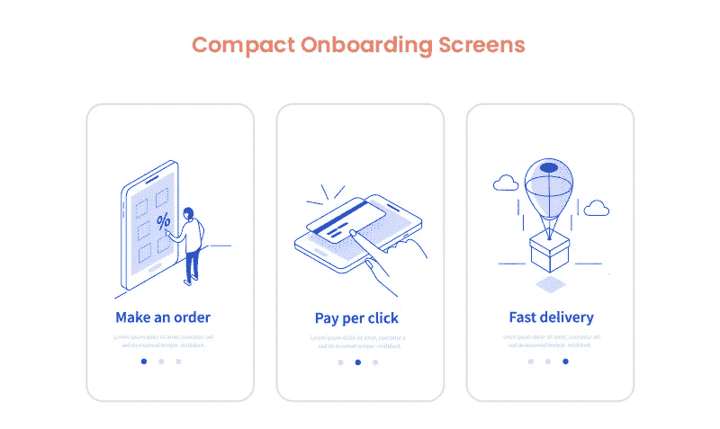

Source: orangemantra.com

## 确保注册简洁

复杂的注册过程可能是客户流失的主要原因。

永远记住，人们在移动中使用你的应用，没有人愿意花很长时间来完成输入字段。

你可以选择通过脸书、Linkedin、Gmail 等注册。因为这将节省他们的时间和精力，并从过程中消除大量的摩擦点。

例如，WhatsApp 会自动检测短信，以简化电话验证，这样用户就不必离开应用程序来输入代码。这使得这个过程非常快，并带来了很好的用户体验。

> **确保注册过程尽可能简单。**

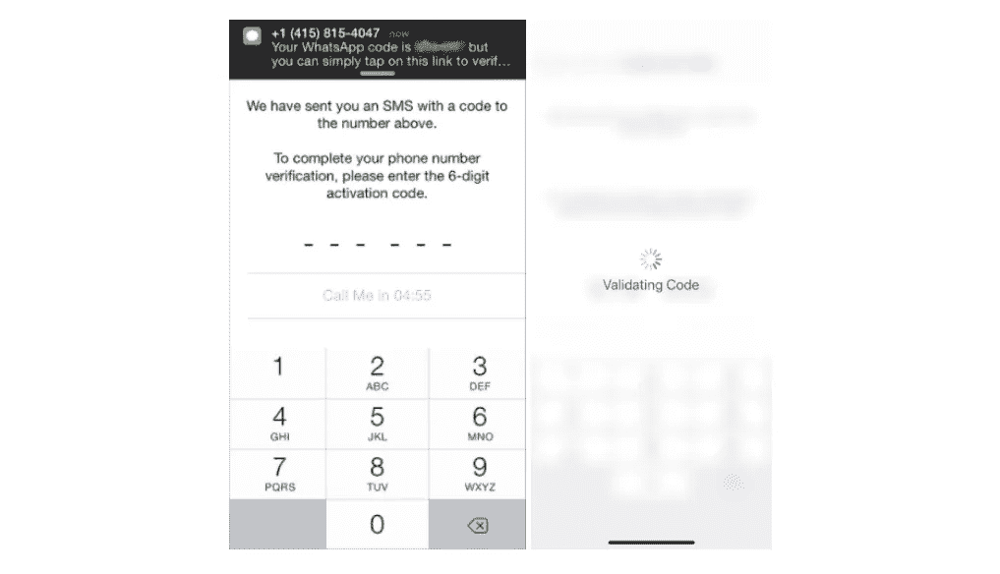

## 总是请求许可

该应用程序最重要的部分之一是请求许可——记住这一点，尤其是当你需要使用用户数据的时候。

在各种原因中， [30%的应用](https://www.dotcominfoway.com/blog/infographic-why-users-uninstall-your-app/#gref)由于安全和隐私问题而被放弃。根据 Clutch 的研究， [82%的用户表示，了解应用程序询问某些权限、支付信息或个人信息](https://clutch.co/app-developers/resources/mobile-app-onboarding-survey-2017)的原因很重要。

如果您的应用程序需要摄像头或麦克风的功能，您应该请求允许使用它。

这种方法让人们感到舒适，并帮助他们信任你的应用程序。

> **让您的用户确切了解他们正在注册什么，这可以提高选择加入率。**

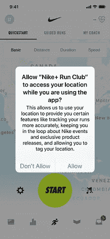

## 推广您的应用程序内容

有时候，注册过程本身就代表了用户和你的应用之间的障碍。

在要求用户注册之前，你应该让用户跳进你的应用程序并体验它——这是一个加快新用户认识到你的应用程序价值的过程的好方法。

例如，如果你有一个电子商务应用程序，你应该允许用户在创建账户之前浏览你的产品目录。如果用户试图购买产品，那么你可以要求他们创建一个新帐户。

一个很好的例子是 AirBnB——他们的用户可以浏览可用的住宿和日期，但只有当他们准备好预订旅行时，才会被要求注册。

> 如果你事先让用户看到你的应用程序提供了什么，他们就会知道你的应用程序对他们有多大价值。

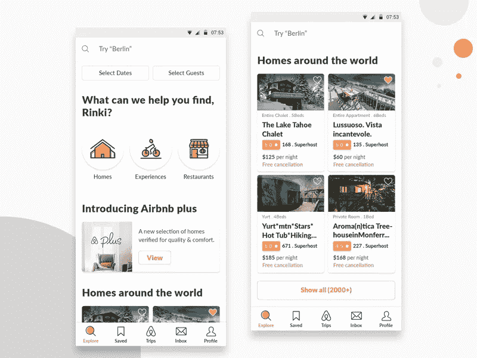

## 提供“跳过”选项

不是每个人都想在入职过程中被打扰——有些人可能想直接进入应用程序，自己探索它，而不是等待应用程序之旅结束。

一个好主意是给你的用户提供一个跳过这个过程的选项，同时你可以监视什么对你的用户更好。

今天，许多应用程序都提供了**【跳过】**选项，这已经被证明是有价值的——一个例子是视频流媒体应用程序 Vevo，它增加了**【跳过】**选项，并报告说[的登录次数增加了近 10%](https://apptimize.com/blog/2015/10/vevos-app-defies-user-onboarding-best-practices-heres-why/) 。

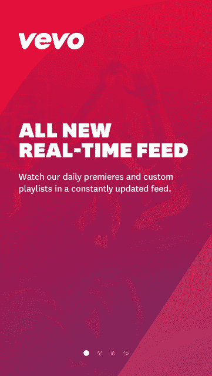

另一个例子是[Slack](https://slack.com/intl/en-rs/?eu_nc=1)——与其他在入职流程开始时提供**“跳过”**按钮的应用相反，Slack 在每个入职屏幕上都提供了选项。

通过这种方式，用户可以在他们觉得准备好使用该应用程序时立即离开该流程，这为他们提供了一个选择，以防他们感到无聊或沮丧——他们不是离开应用程序，而是退出入职流程。

> **为用户提供跳过入职培训的选择将满足他们的需求，并让他们留下来。**

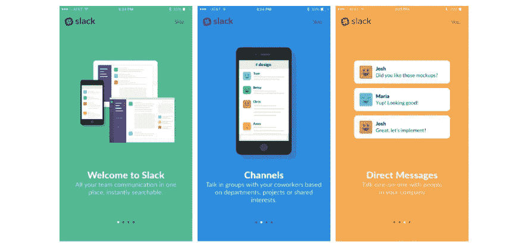

## 激励首次转化

如果你希望下载你的应用程序的人继续使用它，你应该为他们完成入职任务提供一定的激励。

你激励用户的方式将取决于你的应用的性质——使用应用内购买作为货币化的应用将受益于*限时折扣*，而免费增值应用可以通过*基于使用的奖励*来激励用户。

奖励积分、优惠券、专业内容访问、促销代码、免费送货和其他优惠将帮助您激活新用户，鼓励用户参与，并帮助[推动转化](https://owdt.com/maximizing-mobile-device-conversion-rates/)。

一个很好的例子是[星巴克](https://www.starbucks.com/)——他们的应用程序提示用户创建一个账户，奖励在应用程序的价值主张中扮演重要角色。

在接下来的屏幕上，星巴克甚至说“*加入奖励*”而不是“*注册*”，向用户清楚地表明，他们可以通过加入他们的应用程序来省钱。

> 你的一个小小的激励对于你的应用程序的成功来说可能是一笔很大的交易。

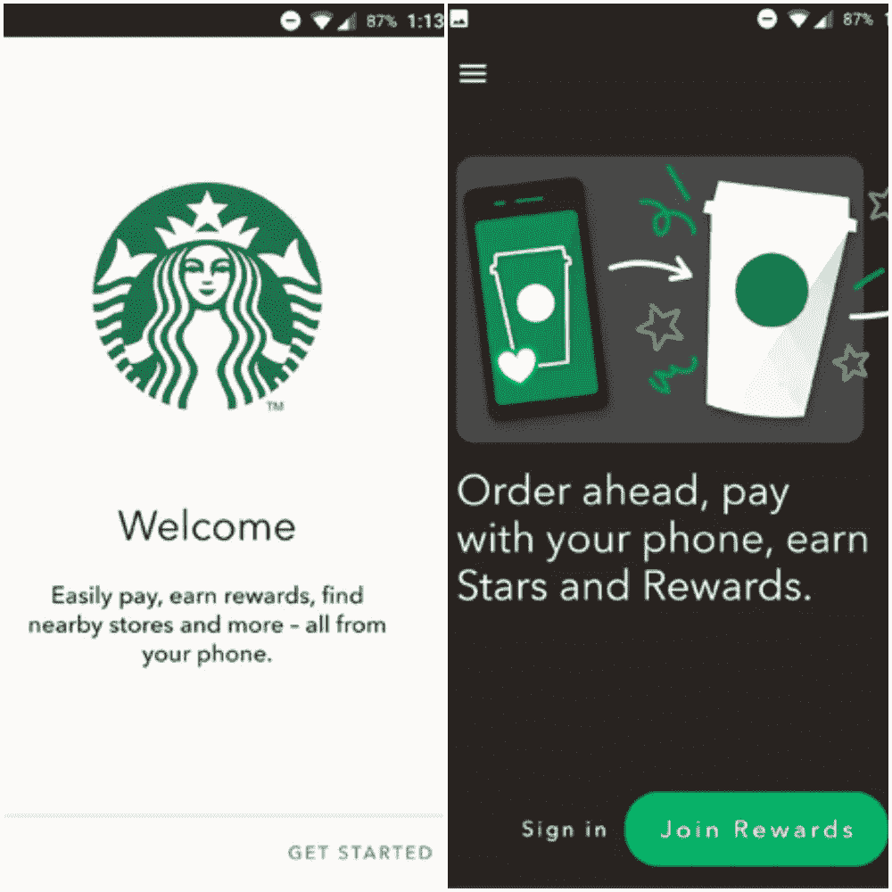

## 使用跨渠道消息传递

你的应用程序应该以简短提示和通知的方式与用户沟通，引导他们完成整个过程。

不要显示意想不到的弹出窗口或消息，而是要传达流程还剩多少，让用户感到受欢迎并感谢他们的时间。

[欢迎邮件](https://optinmonster.com/welcome-email-examples-that-build-trust-with-subscribers/)、[推送通知](https://www.leanplum.com/blog/7-most-creative-push-notifications/)和[应用内消息](https://www.appcues.com/blog/in-app-messages-best-examples)可以协同工作，帮助用户体验应用的价值，并推动他们完成入职流程。

您可以结合文本(*例如查看新功能*)、电子邮件和推送通知(*例如完成注册过程*)来吸引用户，鼓励他们再次打开应用并执行特定任务。

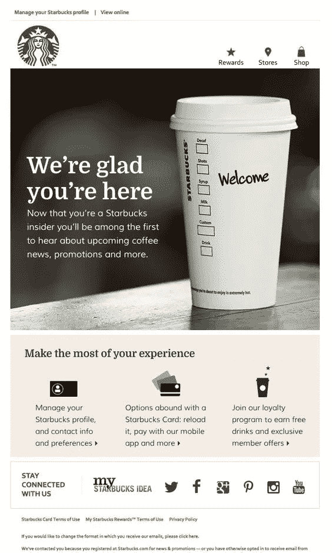

您所有的入职信息都应该简单直接，带有可见的 CTA(行动号召)。

> **不要向用户发送大量垃圾邮件，也不要试图在一封邮件中涵盖所有功能或优势。**

## 测量结果

为了实现有效的入职，您必须监控您的指标。

分析是一种了解用户行为的强大工具——你可以使用各种工具进行用户细分，这可以帮助你按照特定的操作对用户进行分组，并为每个组创建定制的消息。

监控使用情况和应用程序分析可以洞察哪些用户在哪里遇到了问题。跟踪用户的痛点可以帮助您减少任何潜在的摩擦点。

> **有** [**各种平台**](https://www.businessofapps.com/guide/app-analytics/) **帮你监控 app 使用，跟踪其成功与否。**

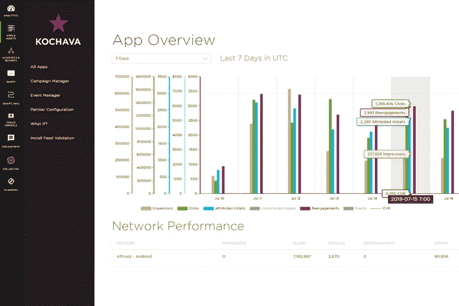

# 最后的

最后，在提供给用户之前，不要忘记测试整个过程。入职体验和应用程序体验一样有价值，所以要确保这个过程简单而简短。

良好的入职培训需要恰当地结合教育用户如何使用你的应用程序和展示你提供的价值。

结果是值得的用户参与，这将增加你的应用程序的成功。

*原载于 2020 年 3 月 17 日 https://zesium.com**的* [*。*](https://zesium.com/how-to-effectively-onboard-users-to-your-mobile-app/)

通过以下链接安排与[**Maja Dakic**](https://app.ddichat.com/experts/maja-dakic)**的 DDIChat 会话。**

** [## 马贾达基奇-迪迪恰特

### 技术行业(软件、移动应用、物联网、人工智能等)的资深作家。)以及在…

app.ddichat.com](https://app.ddichat.com/experts/maja-dakic)**