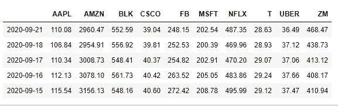
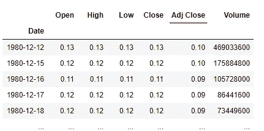
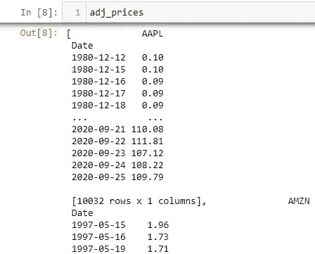

# 如何用 reduce()合并 Python 中的股票数据

> 原文：<https://medium.datadriveninvestor.com/how-to-efficiently-merge-stocks-data-in-python-with-reduce-5ea9e233a5f7?source=collection_archive---------4----------------------->

## 下载历史股票价格，并使用强大的 reduce()函数将它们合并成一个数据集。


Photo by [Artem Podrez](https://www.pexels.com/@artempodrez?utm_content=attributionCopyText&utm_medium=referral&utm_source=pexels) from [Pexels](https://www.pexels.com/photo/light-marketing-businessman-man-5716052/?utm_content=attributionCopyText&utm_medium=referral&utm_source=pexels)

如果您刚刚开始使用 Python 分析历史股票价格，目的是可视化趋势并构建投资策略，或者如果您是一名经验丰富的程序员，厌倦了使用循环，您应该继续学习如何使用`reduce()`函数来改进您的脚本。

例如，假设您选择了许多股票报价机，您的任务是下载每家公司的历史*调整收盘价*，并将它们合并到一个独特的干净数据集中，如下所示:



The Adj. Close Prices of ten stocks merged in a single DataFrame

在这种情况下，在将股票价格附加到一个列表(或另一个 *iterable 对象*)后，您可以使用下面的代码合并它们:

```
#The historical stock prices saved in adj_prices are passed to 
#reduce()to apply the merge function recursively from left to rightreduce(lambda x, y: pd.merge(x, y, left_index = True, right_index = True, how=’outer’), adj_prices)
```

上面的函数遵循以下语法:

```
reduce(function, iterable [, initializer])
```

当可迭代对象是列表`adj_pricest`时，(*λ*)函数是`lambda x,y: pd.merge(x,y,left_index = True, right_index = True, how='outer')`，初始化器被省略了。

用于生成上述数据集的完整脚本将在本文稍后分享，但在对此进行评论之前，让我们通过回顾一些理论来理解`reduce()`函数的作用。

[](https://towardsdatascience.com/airflow-how-to-refresh-stocks-data-while-you-sleep-part-1-a464514e45b7) [## 气流:如何在睡觉时刷新股票数据——第 1 部分

### 在这个关于 Apache Airflow 的第一个教程中，学习如何构建一个数据管道来自动提取、转换和…

towardsdatascience.com](https://towardsdatascience.com/airflow-how-to-refresh-stocks-data-while-you-sleep-part-1-a464514e45b7) 

## 一点理论

在 Python 3 中，`reduce()`函数属于`functools`模块，这意味着它可以通过以下两种方式之一导入:

```
**import functools** # Imports the full module and then use functools.reduce()**from functools import reduce** # Only imports reduce() from functools to use it directly
```

`reduce()`函数被认为是**高阶函数**，因为它将其他函数作为参数并对其进行操作。更详细地说，`reduce()`功能实现了一种称为**缩减**(或*折叠*)的技术，包括:

*   **对可迭代对象的前两项应用**双自变量函数(*从左到右*)以生成部分结果，
*   **使用**iterable 中带有下一项的部分结果获得另一部分结果，
*   通过重复该过程将 iterable 减少到单个累积值，直到没有剩余的项目。

例如，让我们使用`reduce()`来计算一系列数字的乘积:

```
from functools import reducenumbers = [7,2,5,9]def simple_prod(x,y):
 return x * yreduce(simple_prod, numbers)Output:
630
```

或者，可以使用 lambda 函数执行相同的计算:

```
from functools import reducenumbers = [7,2,5,9]reduce(lambda x,y: x * y, numbers)Output:
630
```

*注意:*因为`reduce()`通过多次应用函数来工作，所以在某些情况下可能会导致性能不佳，并且*自定义函数*的使用会影响代码的可读性。出于这个原因，评估是否存在一种更 Pythonic 化的方法来解决每个特定的用例总是明智的。正如您将在下面看到的，依赖于`reduce()`对于本文中执行的任务是有意义的，因为它避免了循环的产生，使代码更加紧凑。

## 将理论付诸实践

下载历史调整价格并将其合并到唯一的*数据框架*中的完整脚本如下所示:

下面是对我所采取的每一步的简短评论:

1.  **导入模块:**首先，我导入了 ***熊猫*** 、 ***yfinance*** 和****functools***模块(或者只是上面所示的 *reduce* 函数)。特别是， [yfinance](https://pypi.org/project/yfinance/) 模块在这里起着关键作用，因为它提供了许多获取历史价格和公司基本面的方法。*
2.  ***将 ticker 保存到 Iterable:** 我的原始代码包括 200 多个通过 csv 导入的 ticker，并保存到一个列表中。实际上，在实践中你可能会用到几十个报价器，但是为了简单起见，我只选择了 10 个。*
3.  ***从雅虎财经下载调整收盘价格:**然后我使用`yf.download()`功能轻松下载了`tickers`列表中每家公司的历史股价。在可用的列中，我特别选择了 Adj. Close 列:*

**

*Example of yf.download() function applied on AAPL.*

*4.**删除缺失值和重复值:**缺失行值已使用`dropna()`全部删除，重复日期被过滤掉，以获得每个日期的唯一*调整收盘价*。最终，每组价格都被添加到(最初为空的) *adj_prices* 列表中:*

**

*Single groups of prices appended to the adj_prices list*

***5。用 Reduce()合并历史价格:**然后，我将 *adj_prices* 列表传递给`reduce()`函数，将合并函数从左到右成对地应用于每组价格，使用公共的`Date`索引将它们连接起来。请注意，我使用了一个`outer`连接，因为不同的股票在不同的时间报价，目标是保持可用价格的完整性。最后一个操作是按降序对日期进行排序(最近的排在最前面)。*

*如果您运行这段代码，您将获得一个与我在文章开头分享的数据帧相同的*数据帧。正如您所看到的，只需要几行代码就可以下载股票价格历史，并生成一个干净的数据集，然后为您的投资策略提供信息。**

# *结论*

*`reduce()`函数只是 Python 中众多强大的函数式编程特性之一。尽管递归通常不是最有效的方法，但在本文中，我已经展示了如何有效地在 merge 上应用 reduction 技术来生成一个干净的数据帧，包括针对多个分笔成交点的 *adj、close prices* 。如果你知道一个更优雅的方法来达到同样的效果，请随时留下评论。*

# *您可能还喜欢:*

*[](https://levelup.gitconnected.com/15-git-commands-you-should-learn-before-your-very-first-project-f8eebb8dc6e9) [## 在你开始第一个项目之前，要掌握 15 个 Git 命令

### 您需要掌握的最后一个 Git 教程是命令行版本控制。

levelup.gitconnected.com](https://levelup.gitconnected.com/15-git-commands-you-should-learn-before-your-very-first-project-f8eebb8dc6e9) [](https://towardsdatascience.com/8-popular-sql-window-functions-replicated-in-python-e17e6b34d5d7) [## Python 中复制的 8 个流行的 SQL 窗口函数

### 关于如何利用业务分析中的 Pandas 高效复制最常用的 SQL 窗口的教程…

towardsdatascience.com](https://towardsdatascience.com/8-popular-sql-window-functions-replicated-in-python-e17e6b34d5d7) [](https://medium.com/swlh/5-pythons-sets-problems-to-solve-before-your-coding-interview-41bb1d14ac25) [## 5 套算法解决之前，你的 Python 编码屏幕

### 你对 Python 中的集合了解多少？用这些“简单”和“中等”的 LeetCode 问题挑战自己。

medium.co](https://medium.com/swlh/5-pythons-sets-problems-to-solve-before-your-coding-interview-41bb1d14ac25)*