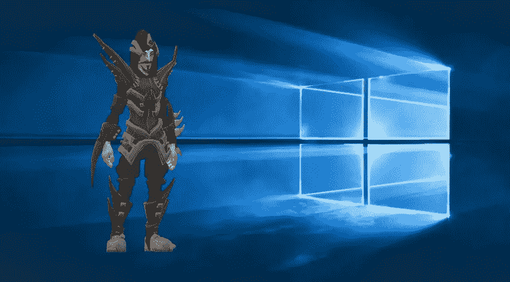
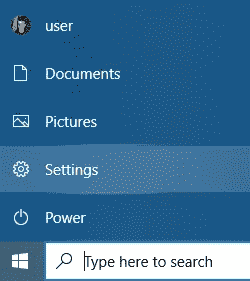
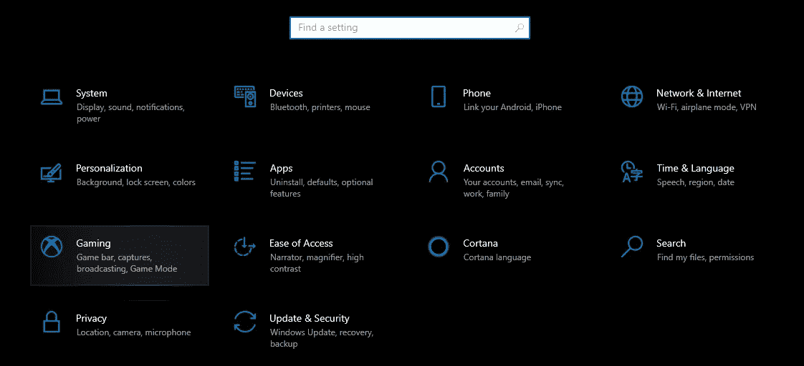
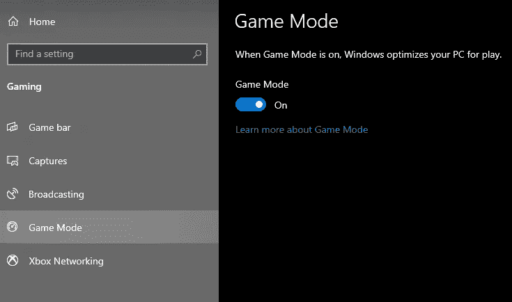
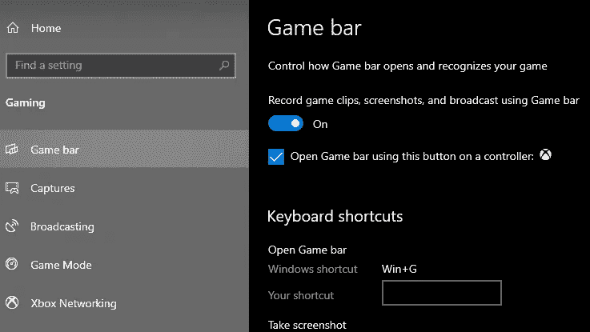

# 如何在 Windows 10 上启用游戏模式

> 原文：<https://medium.datadriveninvestor.com/how-to-enable-gaming-mode-on-windows-10-2581bb782863?source=collection_archive---------21----------------------->

微软 Windows 10 是最受欢迎的操作系统之一，它提供了许多功能。其中一个是最近加入的游戏模式。让我们了解一下如何启用这个特性，以及它的实际作用。

# 游戏模式特点是什么？

游戏模式是 Windows 10 的一项功能，可以增强游戏玩家的游戏体验。启用这一新功能将极大地帮助您在 PC 上玩喜爱的游戏。它允许用户流畅地玩游戏并优化系统。这项功能以前可以从 Windows 10 游戏栏中获得，但现在已经转移到不同的地方。让我们通过下面的步骤来了解在哪里可以找到并启用这个特性。

 [## 吸引我还是激怒我:游戏化将主宰世界|数据驱动的投资者

### 不要只想着游戏。想想我们整个生活世界的游戏化。网飞已经认为游戏是一个更大的…

www.datadriveninvestor.com](https://www.datadriveninvestor.com/2020/10/01/engage-me-or-enrage-me-gamification-will-run-the-world/) 

**第一步。**按下“**开始**按钮，选择“**设置**

**第二步。**从设置页面按下“**游戏**”选项。

**第三步。**按下**游戏模式**，从游戏页面启用。

**第四步。**在游戏页面屏幕上，同时启用“**游戏条**”选项。

现在你完成了当你打开一个新的游戏，它会显示游戏栏，如果你也想它，并会自动为你启用游戏模式。它工作得很好，因为这种方式 windows 将有助于提高性能，而且它不会在游戏进行中用通知来打扰你。我建议你使用这个功能，因为它在网上对你有益，而且没有缺点。

## 访问专家视图— [订阅 DDI 英特尔](https://datadriveninvestor.com/ddi-intel)