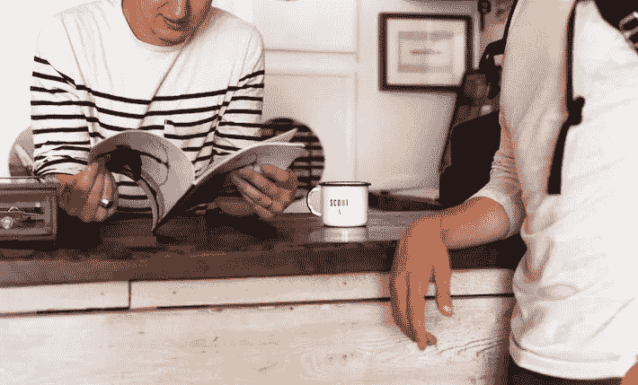
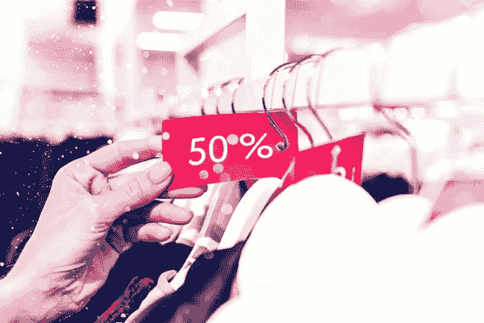

# 如何提升你的品牌，即使你已经“下班”了

> 原文：<https://medium.datadriveninvestor.com/how-to-enhance-your-brand-even-when-youre-off-duty-4373819ae274?source=collection_archive---------42----------------------->

Photo by Crew on Unsplash.

詹姆斯刚从为期三天的周末研讨会回来就打电话给我。加上交通费和住宿费，他花了 3000 美元。

“太棒了！”我说。“我印象深刻。你投资了自己。”

“嗯，”詹姆斯说，“我不得不透支我的签证来支付研讨会和机票——别问了。基于我所学到的，我需要一个全新的网站。你知道有哪个网页设计师愿意和我交换吗？”

在这次谈话之前，我准备推荐詹姆斯作为一个成功的专业人士。但詹姆斯只是给自己重新贴上了惊慌失措的标签。

Photo by Priscilla Du Preez on Unsplash.

在我职业生涯的早期，我与亨丽埃塔建立了一家合资企业。我们谈到了她需要的资源来完成她的细节。

“就用你的信用卡吧，”我说。

“我没有信用卡，”亨丽埃塔承认道。"我正在努力摆脱财务困境。"

信息太多了。亨丽埃塔需要拓展界限。如果她有经济问题，她需要一个理财顾问，也许还有更稳定的收入来源。

> 当你和任何一个潜在客户或推荐人交谈时，你就“上了”

当你谈论自己的时候，即使是随意的，你也有机会提升或破坏你精心培育的品牌。

很多看似无辜的举动，却能困住你。在我商业生涯的早期，我会在一个公开的商业论坛上提问。

我一直相信，“没有愚蠢的问题。”

我仍然相信。但不是每个人都这样…有时最好把这些问题留到与你不会做生意的人的私人场合。

我们从来没谈过这么多。事实是，商业朋友和私人朋友不一样。他们可以建立你的事业，也可以毁掉你的事业。这里有一些指导方针。

## **①去淘金。**

詹姆斯没有必要分享他的资金来源——他也不应该。不可避免地，有人会说，“如果他这么成功，为什么他需要一大笔贷款？”他可能有很好的理由，但只有他的顾问需要知道。

一位生活教练曾在她的电子杂志中写道，“我要去参加一个会议，是的，这是一笔很大的开支。但这很重要。”

坦率地说，对我来说，花费似乎并不多，可能她的大多数读者也有同感。你可以感觉到她的信誉消失在空气中。

 [## 给数字营销工作者的 5 本书推荐|数据驱动的投资者

### 随着就业率的上升，由于疫情和人们花更多的时间在网上，数字营销的技巧…

www.datadriveninvestor.com](https://www.datadriveninvestor.com/2020/10/28/5-book-recommendations-for-those-who-work-with-digital-marketing/) 

## **(2)投资很少涉及单一的、一次性的支付。**

当我第一次买房子的时候，我被警告说，“在关闭成本之后省钱。你将需要小修理、安全服务等等。”

这个明智的建议也适用于创业投资。正如更大的房子可以改变你的生活方式一样，高端教练、社交活动或会议可以改变你的业务。

但是这些机会也伴随着成本。你可能需要升级你的衣柜(尽管现在已经不那么担心了)。你可能需要在设计和文案上花费资源。

路易莎告诉我她在职业生涯早期犯的一个错误。她开始和一个高端教练合作。付款是一种延伸。更糟糕的是，教练(明智地)鼓励路易莎修改她的网站。

Photo by Amani Nation on Unsplash.

“我不想把钱花在一个新网站上，”路易莎现在回忆道。“所以我会付钱给教练，让他给我一些我无法实施的建议。

“现在我明白了，如果直接去找设计师和文案，我会做得更好，就像我现在做的一样。我得到了很多好的建议，我可以把它们付诸实践！我看到了结果。”

> 如果你负担不起后续费用，就跳过大型会诊。

做你生意中较小的部分。学习文案、网络开发和博客的基础知识。

## **(3)避免易货和打折。**

詹姆斯是大中型公司的商务教练。所以网页设计师和文案可能不需要他的服务。易货对他来说没有意义。

有人邀请我用写作来换取个人培训、按摩，甚至是油画。那些服务非常个性化。没有理由相信我会想要一个随机的按摩师或私人教练。我绝不会以物易物！

Photo by Artem Beliaikin on Unsplash.

无论如何，物物交换和折扣几乎总是会导致伤害感情、痛苦的分手和质量差的工作。我不再向我自己的客户提供这些选择，我也不再为自己要求折扣，即使是从朋友那里。

与 20 年前相比，今天的界限更加模糊，这意味着更容易放松……也更容易让你的品牌陷入困境。

**这不是个人恩怨……这是生意。**

如果你想更多地了解你的客户——以及他们的真实想法——你可以[在这里](http://cathygoodwin.com/baggage)下载我的免费指南。

*原载于*[*https://cathygoodwin.com*](http://cathygoodwin.com/brandoff)*。*

**访问专家视图—** [**订阅 DDI 英特尔**](https://datadriveninvestor.com/ddi-intel)