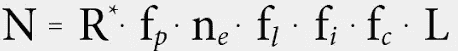

# 如何利用科学找到一对情侣

> 原文：<https://medium.datadriveninvestor.com/how-to-find-a-couple-using-the-science-1c06714fe6f8?source=collection_archive---------13----------------------->

## 你在寻找你的灵魂伴侣吗？放心吧！我要教你如何使用世界上最好的工具，科学！

Photo by [Scott Broome](https://unsplash.com/@scottbroomephotography?utm_source=medium&utm_medium=referral) on [Unsplash](https://unsplash.com?utm_source=medium&utm_medium=referral)

情人节就要到了，如果你还是单身，不要担心，因为你很幸运！今天我将教你如何在**找到你生命中的真爱**，或者至少知道**有比你想象的多得多的人** — *成千上万*如果你不是生活在一个四口之家的话——等着被发现。

 [## 成功人生的 25 种自我提升方式|数据驱动的投资者

### “我活得越久，学到的就越多。学的越多，体会的越多，知道的越少。”―米切尔·莱格兰德时间到…

www.datadriveninvestor.com](https://www.datadriveninvestor.com/2019/03/12/25-self-improvement-ways-for-a-successful-life/) 

为此，我们将使用一个简单的数学公式叫做 [***德雷克方程***](https://en.wikipedia.org/wiki/Drake_equation) 。别担心，你不需要大学文凭就能理解它，**非常简单！**

# 德雷克方程

德雷克方程是一个数学公式，当时被用来估计我们银河系中可能存在的文明的数量。然而，由于它的简单性，它是一个适用于许多其他领域的方程。

## 这是方程式👴🏻

Source: [Wikipedia](https://en.wikipedia.org/wiki/Drake_equation)

用一种简单的方式:

*   N 代表可能存在的文明数量
*   R 代表银河系中“正常”恒星形成的年速率。
*   其余参数权重为 R，乘以 **0。X 连续**，其中 **X 是在其轨道上有行星的那部分恒星的加权因子** r，在恒星的可居住区内运行的那些行星的数量，在可居住区内已经有生命发展的那些行星的比例…

**真的**，方程的展开由**称量初始尺寸**组成。

# 可能的情侣

Photo by [mauro mora](https://unsplash.com/@mauromora?utm_source=medium&utm_medium=referral) on [Unsplash](https://unsplash.com?utm_source=medium&utm_medium=referral)

现在你已经大致了解了德雷克方程，我建议在保持其本质的同时对其进行修改，在我们的例子中:

*   *N* 代表候选人数。
*   R 将是你所在城市或你通常居住地区的总人口。
*   从这里开始，你要将所有这些乘以你希望那个人拥有的许多因素，以及和你一样寻找其他人的许多因素。

## 你从哪里得到这些数据的？

简短回答，**互联网**。

长回答，最近的统计数据来源很多。从**公共资源**到**约会网站**进行他们的**公共研究**。

每个人都是一个世界，你想要多少参数就有多少。教育水平、年龄、性取向、肤色、情感状态…

**相信我**，找到这些数据并没有那么难！

## 我应该怎么做？

只要让他们适应一个 **0。X-style** **权重**其中 **X** 是百分比。

我们举个例子:

*   根据你当地的人口普查，你住在一个有 70，000 人的城镇。
*   你是男的找，**女的**。
*   根据你们当地的人口普查，47%的人口是女性。
*   将 47 除以 100，得到 0.47 的**系数。**
*   现在你必须将 70，000 乘以 0.47，结果是 **22，090 个可能的候选者**。
*   下一步，**用另一个因素**重复这个 22，090 人，并作为你拥有的因素重复多次。

简单吧？😉

**记住**基础数学，它的作用是**将你拥有的数量**减少 47%,然后得到的数量将被另一个数量加权，以此类推。

**别急**，想放多少因素就放多少，最后你会看到还有多少人！

我希望你喜欢这篇文章，如果你曾经在寻找灵魂伴侣的过程中失去了希望，它可以帮助你重新获得希望。另外，如果你有任何问题，请随时问我，我很乐意提供意见！😊

如果你能和我分享这个故事，我将不胜感激，我相信这将帮助不止一个人😉