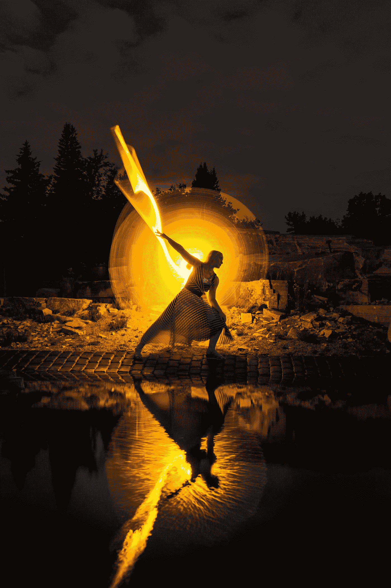
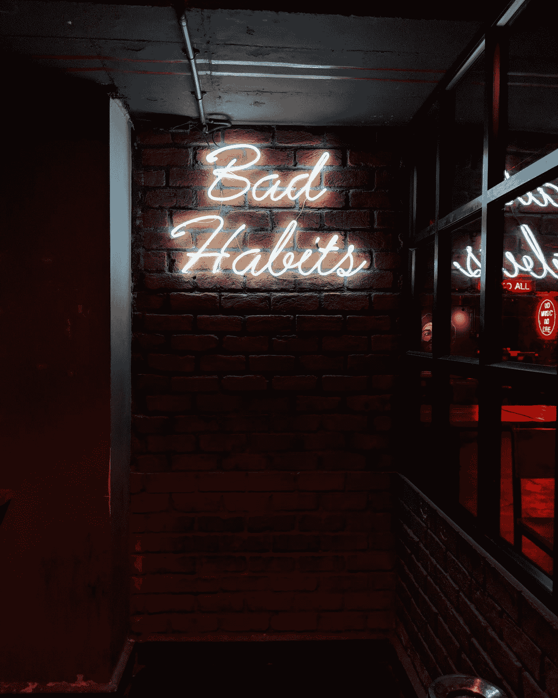
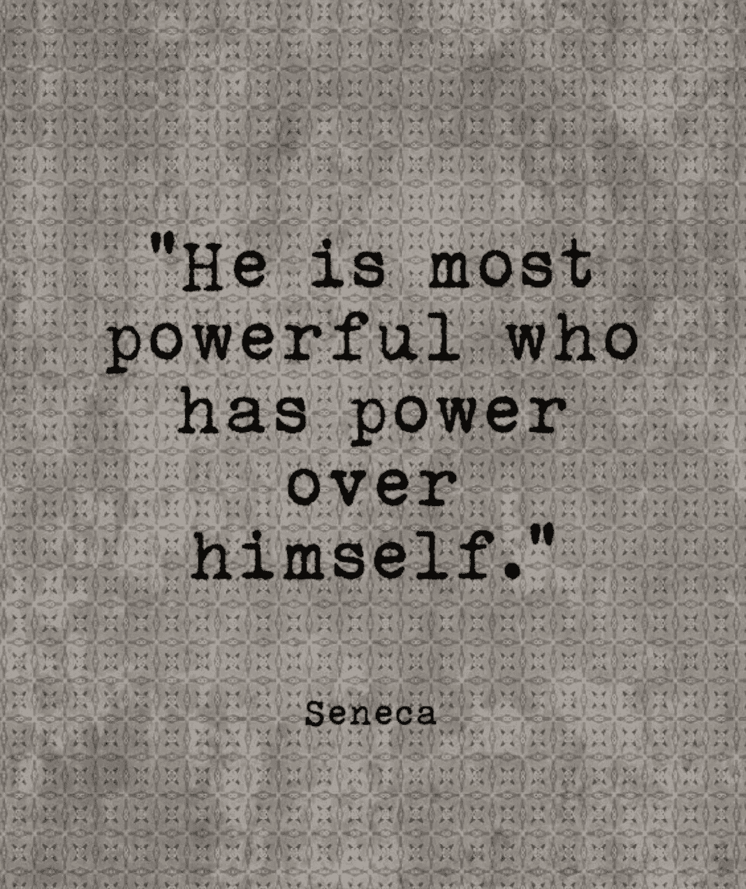

# 2020 年提高自我意识和正念的 8 个步骤

> 原文：<https://medium.datadriveninvestor.com/how-to-find-self-awareness-my-pro-athlete-8-step-guide-to-a-better-self-f9bd60f4bb9?source=collection_archive---------10----------------------->

## 让 2020 年成为你有史以来最好的自我意识和正念之旅的 8 个真实步骤…

Photo by [Xuan Nguyen](https://unsplash.com/@darthxuan?utm_source=medium&utm_medium=referral) on [Unsplash](https://unsplash.com?utm_source=medium&utm_medium=referral)

作为一名职业运动员，你如何发现自我意识并练习正念？“这是我经常被问到的问题。

我应该多冥想吗？每周接受一次治疗？我应该每天早上对着镜子自言自语吗？你是怎么获得自信的？

这些是我从艾克哈特·托尔这样的作家和精神导师那里偷来的自我意识和正念步骤。马克·曼森。狄巴克·乔布拉。唐·路易斯·鲁伊斯。[山姆·哈里斯](https://wakingup.com/)。

*我妈。*

我实话实说。今年很艰难。我在职业教练的第一年就迷失了自我。我知道这将是对精神毅力的考验。压力管理。在压力、戏剧、胜利和失败之后找到最好的自己。在职业运动员的世界里，有一种压力会让精神管道爆裂。有尖叫的人群。愤怒的粉丝。糟糕的裁判。热衷于戏剧的记者。然而，通过这一切，选择这条道路意味着坚持享受生活过程的目标，并尽最大努力生活在和平、快乐和幸福中。

如果你不想继续读下去，请记住这一点:我们的自我意识和正念系统(包括习惯培养、信念形成和身份改变)允许我们有多强，我们就有多强。

# 1.第一步:开始倾听自己和自己的对话

是的，这听起来很疯狂。开始倾听内心的声音。你对自己的评价。“猴子思维”想什么说什么。当你的思想漂浮在意识的河流上时，开始观察它们。如果你每天都听到(或看到)这些想法，就把它们写下来。照下你听到的东西。想象他们。

Photo by [Manan Chhabra](https://unsplash.com/@manancfc23?utm_source=medium&utm_medium=referral) on [Unsplash](https://unsplash.com?utm_source=medium&utm_medium=referral)

例如，当我开始早晨的正念冥想时，这是我奇怪但无尽的想法的快照:“我是一个糟糕的教练。我为什么不好？你真的很坏吗？这是我第一年，放松。顺便问一下，谁开兰博世？真的吗？不过，开一辆会很有趣。我需要赚更多的钱。我真的想结束赚钱吗？我不擅长组织。那壶咖啡还开着。 *Dang！那壶咖啡还开着。*

> 我今天还会只吃*蛋黄酱和煮土豆吗？"*

等等等等。

然后我提醒自己深呼吸。

5–4–3–2–1.

*伍萨*。

我发现，有时我只是把想法写下来(相当不经意地)并不带任何判断地观察它们，而不是去评判它们。我意识到这些想法的存在没有其他原因，除了我们的大脑想要像喝醉的海盗 7 月 4 日罗马蜡烛节一样发射电脉冲和神经元。

> 你知道吗，神经学家估计一个普通人每天有超过 40，000 到 80，000 个想法？

嗯，所以，是的，拿出笔，寻找经过的相同的思维云，写下你一遍又一遍听到的思维云。这些思维模式将是我们接下来要讨论的。

# 2.自我意识的下一步是正念训练

你为什么相信你所相信的？

我们允许保留而不去挑战的想法成为了思维习惯。久而久之习惯就变成了信仰，然后就变成了你的身份。如果你不去清除它们，每一个你允许在你大脑中循环的消极想法最终都会变成自我限制的信念和身份。

这是你必须开始工作的部分。伸展那巨大的大脑肌肉。这就像去健身房锻炼身体一样，只是锻炼的是你的大脑。

> 步骤 2b。意识到你不能控制每一个想法或阻止每一朵飘进地平线或你大脑的云。没有人能阻止思想。如果可以，请告诉我你是如何停止思绪，然后像佛一样飘洋过海来到我身边的，拜托了，因为你开导了我的朋友。
> 
> 步骤 2c。用积极的、有挑战性的或有力量的想法取代每一个消极的想法(在你意识到观察到它的几秒钟后)。

“T2，我是个糟糕的教练，”我的意识说。"为什么我忘了让那个玩家加入游戏？"

为什么我会这么想？谁知道呢。

我没有让它停留下来，而是抹去了消极的想法，取而代之的是:“我正带领一队成年男子进入四强。我正在学习如何指导，并一天天变得更好。我今天过得不错。每次我选择指导一名球员，我的系统都在改进。”

> 这通常是我的自我意识和正念训练加上积极的自我对话的方式。

完美主义者倾向于对自己苛刻到减缓成长的程度。担忧者倾向于一遍又一遍地过度分析他们的下一步行动，可能比他们已经做的事情超前 10 步。拖延者(我就是这样)需要把他们的思想和精力集中在行动上。迈出这一步。离开他们的沙发。写第一个中字。

这一步更好的自我意识允许你观察想法，但也用积极的、更感恩的、有力量的和真实的想法取代坏想法。

对我来说，这是一个改变人生的顿悟——*神圣的蝙蝠侠*，我会成为我一直在想、做、说的那个人吗？

# 3.真正的力量存在于不可征服的头脑中

取代不好的想法是一种超能力，尤其是如果你能在每次它发生的时候就开始这么做。想坏的想法并不坏，除非你让坏的想法成为你思考的习惯。信念就是这样开始的。当没有希望或动力去改变一种消极的内部状态时……人们会通过 Instagram、脸书、分心、药物、酒精和其他物质来逃离这种状态。

> 问自己这 25 个问题，并日复一日地回答它们，让自己变得不可阻挡。

日复一日地为一个更好、更强、更有能力的你(是的，她或他就在那里)投上一票，最终你会变成你习惯练习的样子。

想让系统受到新的信念和精神挑战的冲击吗？试试用维姆·霍夫[冷疗](https://www.wimhofmethod.com/)，迷走神经呼吸，或者下载山姆·哈里斯的(我的 ***最喜欢的晨练习惯*** ) [醒神冥想](https://wakingup.com/)。

你也可以尝试独自环游世界，但是无论你做什么，通过新的实践、方法和惯例来建立一个不可征服的头脑。

# 4.你的信仰体系是什么，是如何形成的？

让我把这种健康比喻为没有自我意识和正念的生活:离开不能带你去任何地方的自我限制思维跑步机，开始奔向你想去的地方。

photo credit: mark manson

当我们开始取代出现的消极想法，开始赋予我们的思想和身体超越消极静态的能力时，这些重要的想法和积极的行动开始在我们大脑的信念系统中占据优先地位。我们开始跑下坡，而不是上坡。

> 这是成为你想要的生活的一个关键组成部分，因为预测你命运的最好方法是创造它。

每个人都有不同的信仰之路。对生活中的刺激做出反应。保持正念和呼吸。你的童年和成长与我不同，你创造的微观文化、数百万个想法、行为和习惯已经成为你信仰体系的一部分。

自我意识和正念永远是一项进行中的工作。我一会儿掉下马车，一会儿又试图重新回到马车上。这就是生活的方式。

## 5.为了让我们的自我意识变得牢不可破，我们必须开始劈开自己内心的木头

改变我们自我限制的信念始于理解所有人都拥有的一个关键特征:

> 我们可以改变自己。

我可以不买夹心面包和加工食品了。我可以每天早上醒来去跑步或散步。我能举起来。我可以冥想。当我感到焦虑时，我可以深呼吸。我可以改变主意。我的信仰体系。我的态度。我能更好地对刺激做出反应。我可以留意那些腐蚀性的消极想法，它们会把我引向不快乐的自我和生活。

然而，改变伴随着责任……这始于自我意识，知道我们必须自己砍柴，为个人成长做艰苦的工作。问问你自己，“当我的感觉告诉我不要这样做时，我将如何选择一个更好的回应？”

这是一个你必须意识到要反复回答的问题。

## 6.一旦我们开始做自我意识和正念的工作，我们的心态开始改变我们的行动

现在我们来谈谈行动。我喜欢看[撞击理论](https://www.instagram.com/impacttheory/)。我喜欢个人成长播客，它教我如何开始在我的正念练习中实施新的想法。这是一次自我意识的学习之旅。

削马铃薯皮有 1000 种方法。

当我们开始从固定心态转向成长心态时，我们的内部环境会从消极转为积极。从自满到上进。从不健康到健康。从情感发育不良到情感聪明。从受害者到胜利者。

## 7.心态的力量是不可估量的

希望比仇恨更强大。爱情的力量比意志力更强大。这是理解失败、成长以及平衡你想要成为的人和你现在的人的过程的时候了。

罗马不是一天建成的，但是罗马的观念可以在一天之内在你的脑海里种上一千次。不要让任何人或任何事阻碍你的愿景或积极的想法。

我们必须弄清楚谁，什么，如何，在哪里，以及[为什么我们想要某样东西](https://medium.com/grandstandcentral/my-failed-tryout-with-the-7-seconds-or-less-phoenix-suns-dcc8b97197ff)。

问自己这 25 个问题来帮助你弄清楚[你在生活中真正想要的是什么。](https://medium.com/@Trevor_Huffman/the-sports-lab-a-pro-athletes-24-tips-on-living-a-happier-life-b0005f539c7)

成为一名数字流浪者？

从你的公司隔间里解放出来？

与家人和朋友共度更多美好时光？

要经济独立？

## 8.回答关于[如何通过有意义的价值观和愿景创造更好的自己](https://medium.com/datadriveninvestor/9-ways-to-make-a-happy-soul-695551856b50)的问题

Photo by [Lesly Juarez](https://unsplash.com/@jblesly?utm_source=medium&utm_medium=referral) on [Unsplash](https://unsplash.com?utm_source=medium&utm_medium=referral)

知道什么样的行为和价值观推动你最好的自我和脚步前进，你就开始了自我意识的过程。

一旦我们开始采取步骤来创建这些日常步骤并建立一个系统，我们将开始了解我们最真实的自我，即使是在每天生活的觉醒和涟漪中。这是内在繁荣、和平和快乐的无限源泉。

我是里奇·博伊尔！

好吧，很抱歉突然爆发，但是说真的，一颗感恩的心是一颗[更快乐](https://medium.com/datadriveninvestor/9-ways-to-make-a-happy-soul-695551856b50)更富有的心。你不必成为一名僧侣或狄巴克·乔布拉来寻找平静、自我意识或更多的正念。你可以从事地球上压力最大的工作，但仍能保持自我意识，尽最大努力与正念带来的更健康的副产品一起生活。

不断寻找最佳自我的边缘，

[特雷弗·霍夫曼](https://medium.com/u/5e7157084b29?source=post_page-----f9bd60f4bb9--------------------------------)

PS。嘘。在这里。[加入我的简讯](https://mailchi.mp/7d6321e1c471/growing-medium)。