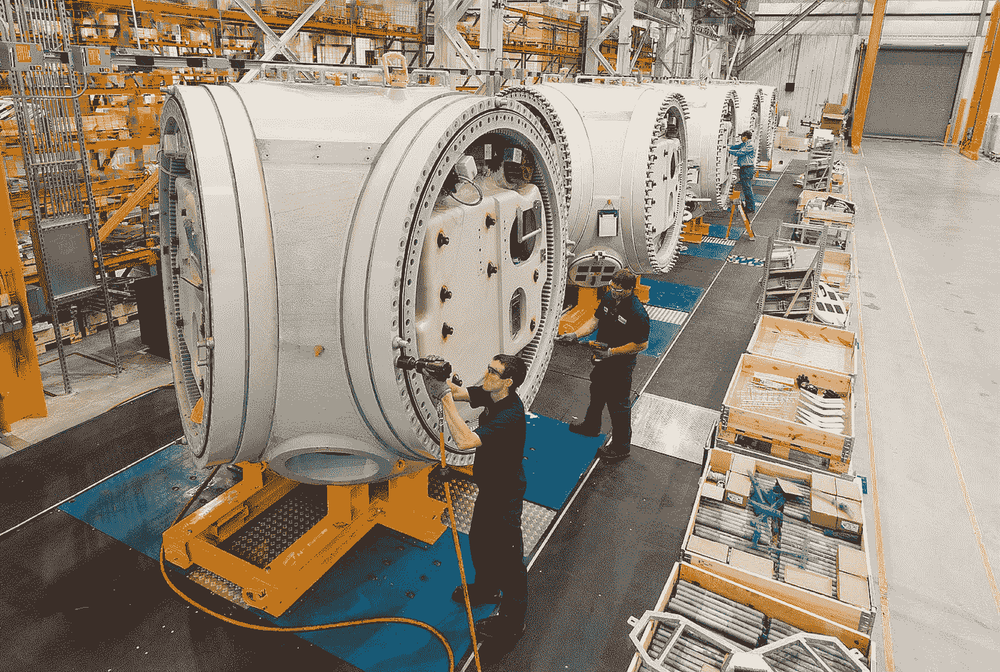
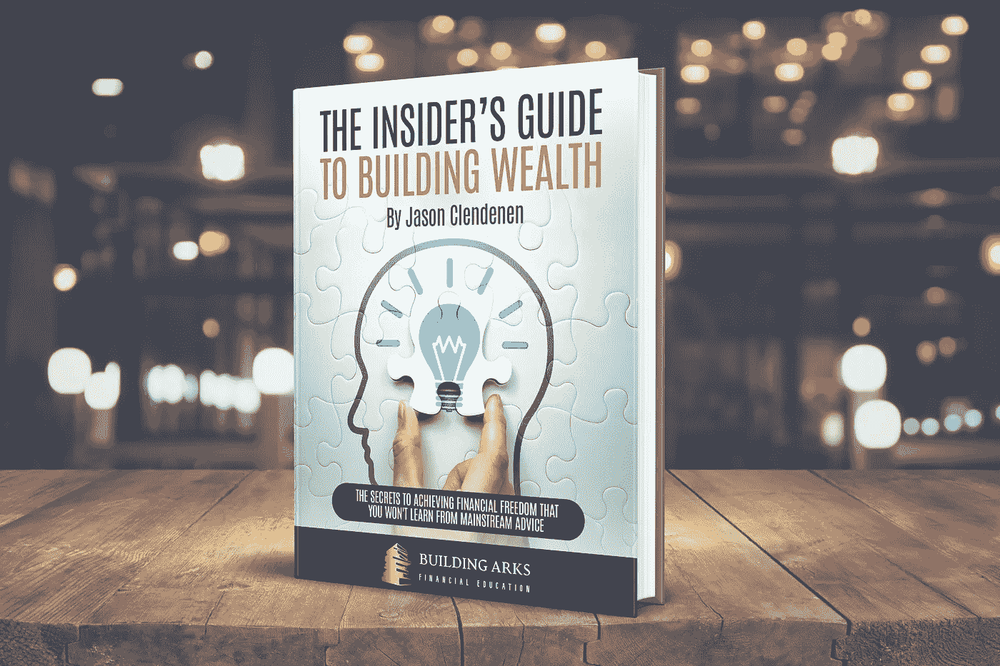

# 如何通过投资获得成功

> 原文：<https://medium.datadriveninvestor.com/how-to-find-success-with-investing-411fb59d54f8?source=collection_archive---------8----------------------->

## 来自本杰明·格拉哈姆的永恒教训

Photo by [Lloyd Blunk](https://unsplash.com/@blunkorama?utm_source=medium&utm_medium=referral) on [Unsplash](https://unsplash.com?utm_source=medium&utm_medium=referral)

通过追随前辈，我们可以对一个领域有更多的了解。本杰明·格拉哈姆(1894-1976)用他实用而科学的证券分析方法彻底改变了投资界。 ***许多著名的投资者跟随格雷厄姆的想法赚了很多钱，包括他最著名的学生沃伦·巴菲特。***

格雷厄姆是一个不拘一格的人，他在许多领域都取得了成功。他写了一部成功进入百老汇的戏剧，他开发了一种新的货币储备体系来取代金本位制(受到称赞，但从未被采纳)，他还通过编纂一种科学的证券分析和股票选择方法，创立了价值投资。

他的投资方法与当时和现在统治华尔街的投机截然相反。大多数股票购买都是凭直觉或对价格走势的猜测进行的。

对格雷厄姆来说，这不是投资。购买一家几乎没有盈利能力的公司的“热门”股票，比如特斯拉(Tesla)或尼古拉(Nikola)，希望股价上涨，这更像是赌博，而不是投资。而且，正如我们在一次又一次的市场崩盘中所看到的那样，投机者通常输的比赢的多。

为了采取更有纪律、更科学的投资方法，格雷厄姆坚持使用几个至今仍然适用的原则。下面详细解释三个最重要的想法。

# 购买企业，而不是股票

绝大多数投资者不认为自己是企业主。他们每天都在交易价格波动的股票代码。这导致了与商业基本面的脱节。如果你有沃伦·巴菲特的钱，你会在特斯拉过去四个季度仅产生 19 亿美元自由现金流的情况下，以 5900 亿美元(当前市值，或所有已发行股票的总价值)收购它吗？这是 310 倍的自由现金流(P/FCF)价格比！这意味着你购买的公司每投资 310 美元就会产生 1 美元的现金流，投资回报率只有 0.3%。

人们购买特斯拉是因为它受欢迎，他们认为价格会上涨。这是试图预测市场的方向，依靠你预测人类情绪的能力。我宁愿找另一种不需要我准确预测大众情绪的赚钱方式。

别担心，我没有反对特斯拉的意思！我喜欢他们的产品，相信埃隆·马斯克在做不可思议的事情。但我不打算以目前的价格购买任何特斯拉股票，因为我不会以目前的市场价格购买整个公司(不仅仅是因为我的银行账户上少了几美元)。

Photo by [Science in HD](https://unsplash.com/@scienceinhd?utm_source=medium&utm_medium=referral) on [Unsplash](https://unsplash.com?utm_source=medium&utm_medium=referral)

格雷厄姆教导我们，不要把购买股票视为对股票代码价格的投机，而应该把它视为对基础业务的投资。你买的是他们的收入流，他们的资产，他们的负债和债务，以及他们的利润。 ***如果你像一个业主一样思考，看待整个企业，你就能更好地了解基本面，知道该不该投资。***

我并不是说特斯拉不是一家好公司，但成为一家好公司并不足以让它成为一项有吸引力的投资。你为你所得到的付出的代价也必须是好的。

相比之下，伯克希尔哈撒韦公司目前的市值为 5200 亿美元，比特斯拉低约 700 亿美元。然而，伯克希尔哈撒韦公司在过去四个季度产生了 269 亿美元的自由现金流，其市盈率为 19.3 倍。这意味着伯克希尔为其所有者创造的每 1 美元现金，投资者必须支付 19.30 美元——投资回报率为 5.2%。不算了不起，但比 0.3%强！

我并不是推荐伯克希尔作为投资机会，但两者之间的差别是明显的。如果你有 50，000 美元从一个朋友那里购买一个小企业，你会从朋友 A 那里购买最近开始销售流行产品但年利润只有 150 美元的产品吗？或者你会从朋友 B 那里购买，他已经经营了很长时间，并且不管是好是坏，每年都能产生 2600 美元的利润。

我知道我会同意格雷厄姆的观点，走过朋友 A 的家去和朋友 b 谈判。 ***像一个企业主那样思考，你就能错过市场上发生的那么多蠢事。***

# 市场先生

股票市场上有两个主要的思想阵营——有效市场阵营和认为市场无效的阵营。

我是格雷厄姆/巴菲特价值投资阵营的后来者(该阵营试图利用市场的低效)。在我成年后的大部分时间里，我一直相信[有效市场假说](https://www.investopedia.com/terms/e/efficientmarkethypothesis.asp)，即国家股票总是合理定价，试图寻找价格和价值之间的差异是徒劳的。关于这个话题，我最喜欢的一本书是伯顿·马尔基尔的《华尔街漫步》。这让我开始关注低成本共同基金的指数投资，无论如何，这都是一个不错的开始。

最近，我开始阅读大量关于股票市场的文章，并最终找到了本杰明·格拉哈姆和大卫·多德的《证券分析》,该书提出了通过价值投资来利用市场低效的理由。格雷厄姆用来解释市场无效率的一个概念是虚构的角色——市场先生。

市场先生是股票市场每日波动的化身，它对好消息和坏消息都反应过度。他建议我们想象自己与市场先生合伙经营一家企业。我们一起投资，我们愉快地销售产品/服务并获得利润。我们业务的基本面不会因为一分钟、一天或一周而改变，而是会随着时间的推移而改变。

Photo by [Benedikt Geyer](https://unsplash.com/@b_g?utm_source=medium&utm_medium=referral) on [Unsplash](https://unsplash.com?utm_source=medium&utm_medium=referral)

然而，市场先生有点躁郁症，情绪波动很大，影响了他的商业敏感性。每天市场先生都会来找你，要么卖给你他的股票，要么买你的股票，这取决于他目前的态度。如果他高兴，他会提出以高于你支付的价格购买你的股份。然而，如果他不开心，他会以低于你所知的价格向你出售他的股份。

作为企业主，你知道你的企业值多少钱。市场先生可以每天来找你，为一个没有根本改变的企业报出截然不同的价格，这对你来说似乎很奇怪。 然而这正是股票市场上发生的事情。每天都有一个你拥有(或希望拥有)的企业的报价，这个报价通常与企业的基本面没有什么关系。

现在我理解了这个概念，我更专注于寻找那些售价明显低于其价值的公司，因为市场先生目前对它们感到沮丧。但是 ***作为一个长期投资者，我知道市场先生最终会放松下来，至少会给我公司的价值，让我在这个过程中轻松获利。***

# 安全系数

最后但同样重要的是，投资的一个关键是始终保持安全边际。在工程中，我们称之为安全系数。如果你设计一座桥，假设最大载荷是 100 万磅，你就不会为 100 万磅设计这座桥。那是个坏主意，会害死很多人。

为什么为精确的最大值设计是危险的？

*   你对最大值的预测可能是错的。如果有一天堵车，几辆大卡车停在你的桥上，总共 110 万英镑，怎么办？会崩溃吗？
*   如果你的计算错了，或者你的假设错了，桥在 800，000 磅的压力下倒塌了怎么办？
*   如果这座桥没有 100%正确建造，从而降低了它经受时间考验的能力，那该怎么办？
*   如果，如果，如果？

***工程师知道不要去设计一个没有安全系数的东西，投资者应该知道，没有安全边际你是买不到投资的。***

Photo by [David Martin](https://unsplash.com/@davidmartinjr?utm_source=medium&utm_medium=referral) on [Unsplash](https://unsplash.com?utm_source=medium&utm_medium=referral)

那么什么是投资的安全边际呢？简单来说，就是得到的东西比付出的多。 如果通过仔细分析你意识到你想购买的一处投资房产价值 25 万美元，你不应该乐意支付 25 万美元。你应该努力少花钱，以确保你在购买时有一个安全边际。如果房地产市场下跌，或者你发现一些意想不到的维修问题，如果你只支付 20 万美元，在你开始亏损之前，你有一个安全边际。我写了一篇关于我如何在房地产[做到这一点的文章。](https://medium.com/datadriveninvestor/the-secret-to-building-wealth-cab646114422)

股票也是如此。如果你找到一家估值为 100 美元/股的公司，你就不应该买这家公司的股票，除非它们的售价明显低于 50 美元/股。这样 ***即使你错了，或者市场变化了，你的投资也是有保障的。此外，如果你是对的，你将购买会产生更高回报的投资*** ，所以尽管这需要更多的工作，但这对你来说是一个双赢的局面。

记住，你不必知道你想买的东西的确切价值。正如格雷厄姆在《证券分析》中指出的:

> **“很有可能通过观察来判断一个女人是否到了投票年龄而不知道她的年龄，或者一个男人是否比他应该的要重而不知道他的体重。”**

所以不要因为不知道一处房产或一家公司的确切价值。使用较大的安全边际来确保，即使你错了很多，你仍然会赚钱。

# 结论

如果投资者遵循上面详述的三个概念，他们的投资将是丰厚的。总而言之:

*   专注于购买产生现金流的业务，而不是试图猜测上下波动的股票代码的方向
*   要知道，事实上，市场是无效率的，你可以利用这一点，记住市场先生
*   投资时一定要留有安全边际，以保护你的下跌空间，增加你的上涨潜力

所以前进吧，带着对如何找到成功的新理解去投资吧！

## [看看我的电子书《积累财富的内幕指南》](https://buildingarks.gumroad.com/l/mmrro)

image by author

# 建造方舟

在职业生涯早期，我遵循传统的理财建议，努力积累财富，之后我开始学习投资。十多年后，我在经济上有了保障，并通过房地产和股票市场朝着完全财务独立的方向努力。我已经成功地建造了我的金融方舟，帮助我度过任何可能到来的风暴。

我创建了 [Building Arks](https://buildingarks.medium.com/about-building-arks-fa2edcf2f584) 来帮助像你这样忙碌的专业人士忽略主流建议，建立真正的财富。

Image by [jeffjacobs1990](https://pixabay.com/users/jeffjacobs1990-7438739/) on pixabay

如果你想在我每次发布新故事时收到邮件通知，你可以在这里加入我的邮件列表[。](https://buildingarks.medium.com/subscribe)

***想开始通过在媒介上写作赚取额外收入？我第一年挣了 6000 多美元。加入这里成为会员，每月只需 5 美元。我将免费为你赚取一部分订阅费，你可以无限制地阅读像我这样的作者的数千篇文章，还可以开始自己的写作事业。***

*本文仅供参考。不应将其视为财务或法律建议。并非所有信息都是准确的。在做任何重大财务决定之前，先咨询财务专家。*