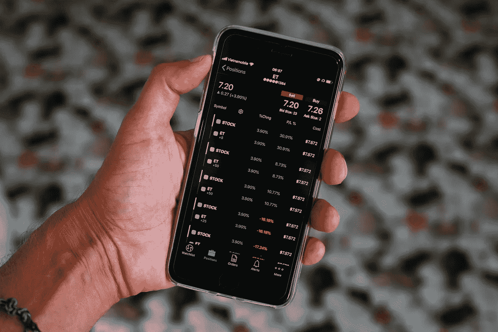
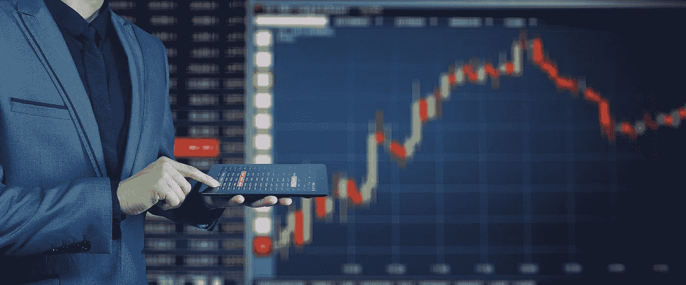
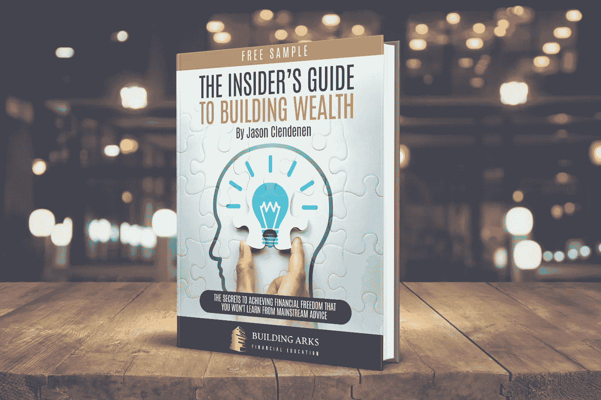

# 如何通过选择获得成功

> 原文：<https://medium.datadriveninvestor.com/how-to-find-success-with-options-efd9bcb7c813?source=collection_archive---------3----------------------->

## 我用来学习强大新技能的资源

Image by [Sergei Tokmakov, Esq.](https://pixabay.com/users/sergeitokmakov-3426571/?utm_source=link-attribution&utm_medium=referral&utm_campaign=image&utm_content=5183941) from [Pixabay](https://pixabay.com/?utm_source=link-attribution&utm_medium=referral&utm_campaign=image&utm_content=5183941)

不久前，我只是股票市场的普通投资者。我对挑选个股或期权交易了解不多。我所有的股市财富都存在税收优惠账户中的低成本指数基金里。

几年前开始学习期权，去年终于开始用真金白银了。在一些最初的新手错误之后， ***我终于找到了一个为我工作的系统，自从我 2020 年开始使用它以来，它让我获得了可观的利润。***

我已经在其他文章中介绍了我的系统(参见文章末尾的参考资料部分)，所以这里我想把重点放在我曾经在短短几年内从一个完全无知的人变成一个有能力的从业者的参考资料上。

## 选项基础

首先，对于那些不熟悉期权的人，我想简单介绍一下期权是什么以及它们是如何工作的。

根据[投资指南](https://www.investopedia.com/terms/o/option.asp):

> 期权是[金融工具](https://www.investopedia.com/terms/f/financialinstrument.asp)，是基于股票等基础证券价值的[衍生品](https://www.investopedia.com/terms/d/derivative.asp)。期权合约为买方提供了买入或卖出标的资产的机会，这取决于他们持有的合约类型。[与期货](https://www.investopedia.com/ask/answers/difference-between-options-and-futures/)不同，持有者不需要购买或出售资产，如果他们选择不这样做的话。

这意味着， ***你买的不是股票本身，而是一份在未来某个日期(称为到期日)以约定价格(称为执行价)*** 买入或卖出股票的期权合约。有两种类型的期权:看跌期权允许所有者在商定的价格和日期出售股票，而看涨期权允许所有者在商定的价格和日期购买股票。购买期权合约，你必须支付它(称为溢价)。

举个例子，如果你拥有 100 股特斯拉(TSLA)股票，你去年以每股 100 美元的价格买入，现在每股 850 美元，你可能想找到一种方法来保护你的收益。 ***与其卖掉你的股票来锁定你的利润(这也放弃了未来可能的收益)，不如买一份特斯拉的看跌期权合约。***

每份期权合约都是 100 股股票，所以你只需要一份看跌期权就可以保证你所有的 100 股股票。购买期权时，你必须权衡执行价格、到期日和支付的溢价。 行权价越高，到期日越长，你要为期权支付的溢价就越多。以 500 美元的执行价格(每股 2.20 美元)为你的 100 股特斯拉股票投保 1 个月，比以 800 美元的执行价格(每股 205.85 美元)为你的股票投保 1 年要便宜得多。你可以在你的经纪账户或[雅虎上查看期权价格。财务](https://finance.yahoo.com/quote/TSLA/options?date=1642723200&p=TSLA)。

这是因为你从每股 500 美元的特斯拉 1 个月看跌期权中获得任何东西的机会(意味着股价在接下来的一个月内必须跌破每股 500 美元)非常小。比你从 1 年 800 美元的看跌期权中获利的机会要小得多，如果特斯拉的价格在下一年的任何时候都低于 800 美元，你就能获利。

Image by [Gerd Altmann](https://pixabay.com/users/geralt-9301/?utm_source=link-attribution&utm_medium=referral&utm_campaign=image&utm_content=3087396) from [Pixabay](https://pixabay.com/?utm_source=link-attribution&utm_medium=referral&utm_campaign=image&utm_content=3087396)

## 例子

在这个例子中，我们将选择一个执行价格为 500 美元的 1 年期看跌期权，每股价格为 61.82 美元。这意味着，如果特斯拉的价格在未来一年的任何时候跌破 500 美元，我可以以每股 500 美元的价格出售我的股份。当然，我支付了这份期权合同，所以特斯拉的价格需要降至每股 438.18 美元以下(500 美元的执行价——溢价 61.82 美元)，我才能胜出。如果特斯拉跌破这个，我可以每股 500 美元卖掉套现。如果特斯拉没有下跌这么多，那么我的看跌期权将失效。

这种使用看跌期权来为你的资产保险的做法被称为保护性看跌期权，是老练的投资者用来降低他们在股票市场风险的一种方法。

> 大多数业余投资者不知道你可以像我们为房子一样为股票买保险，所以他们在市场上玩，没有很多方法来降低他们的下行风险。

看涨期权是一种参与股票价格上涨的方式，而不必拥有标的股票本身。坚持使用特斯拉，你可能会因为各种各样的原因相信价格会在明年继续上涨。你可以在 TSLA 以未来的价格购买未来某个日期的看涨期权，而不是现在以每股 850 美元的价格购买特斯拉，其中包括价格下跌的风险。

例如，我们以每股 191 美元的价格，以每股 1000 美元的执行价格购买 1 份特斯拉的 1 年到期的看涨期权(100 股)。如果特斯拉的价格超过每股 1000 美元(盈亏平衡是 1191 美元= 1000 美元的执行价格+191 美元的溢价)，我就可以以每股 1000 美元的价格购买 100 股特斯拉股票。因此，如果股价涨到每股 1500 美元，我可以用 1000 美元买入，然后要么保留，要么以每股 1500 美元的价格立即卖出，将差价收入囊中。注意，我只保留了 19，100 美元(100 股 x 每股 191 美元)的权利，而不是以 85，000 美元的价格购买 100 股特斯拉股票。 ***买入看涨期权是以更少的资金参与股票增长的一种方式。***

在华尔街买的所有东西，肯定有人在卖。如果你购买期权是为了保护你的资产或者分享股票收益，那么其他人也在出售这些期权。

如果你卖出一个看跌期权，你会得到溢价，但如果期权在到期前被所有者行使，你必须以执行价买入股票。如果你卖出一个看涨期权，你会得到溢价，但如果期权在到期前被所有者行使，你必须以执行价格卖出股票。

专业期权交易者会在不持有标的证券的情况下买卖期权，寻找随着股价波动而上下波动的溢价。他们还会买卖和多重执行价格来对冲他们的赌注和降低他们的风险。 ***它可以很快变得非常复杂*** 用花式技术像[铁蝴蝶](https://www.investopedia.com/articles/active-trading/030314/what-iron-butterfly-option-strategy.asp)或[秃鹰展开](https://www.investopedia.com/terms/c/condorspread.asp)。这些高级策略超出了本文的范围，但是可以在下面的参考资料中了解。

Photo by [Oladimeji Ajegbile](https://www.pexels.com/@diimejii?utm_content=attributionCopyText&utm_medium=referral&utm_source=pexels) from [Pexels](https://www.pexels.com/photo/man-working-using-a-laptop-2696299/?utm_content=attributionCopyText&utm_medium=referral&utm_source=pexels)

## 从哪里了解选项

了解期权的来源有很多，我当然不全知道。但是，如果您想了解这个复杂但重要的主题，我想提供一些关于从哪里开始的想法:

**书籍:**

*   安迪·唐纳的《股票市场现金流》是我第一次开始学习期权的概念以及它们如何运作的地方；这是一个开始的好地方。
*   乔治·雅布尔的《期权交易者手册》，如果你想学习更高级的策略。

**课程:**

*   安迪·唐纳有一家提供期权培训的公司，名为“现金流学院” 。去年我参加了他的 [**投资的四大支柱**](https://thecashflowacademy.com/products/4-pillars/) 课程，这让我开始使用期权来增加我的财富。

**网站:**

*   [**Cboe**](https://www.cboe.com) ，正式名称为芝加哥期权交易所，在他们的网站上有很多资源和培训。你必须注册，但有许多免费的点播课程，你会发现很有用。

**模拟器:**

*   **Investopedia** 有一个[股市模拟器](https://www.investopedia.com/simulator/)可以让你用纸币交易期权。
*   TD Ameritrade 有他们强大的桌面应用程序，也可以在“纸币”模式下运行，进行期权交易。我用这个系统来评估我所有的期权想法，即使我的 TD Ameritrade 账户里没有钱(我用另一家经纪公司做我的实际交易)。这个平台将显示股票价格向前移动的概率曲线以及你的期权交易的风险图。强大的东西。

Image by [PourquoiPas](https://pixabay.com/users/pourquoipas-257574/?utm_source=link-attribution&utm_medium=referral&utm_campaign=image&utm_content=841171) from [Pixabay](https://pixabay.com/?utm_source=link-attribution&utm_medium=referral&utm_campaign=image&utm_content=841171)

## 摘要

期权是强大的，但也是危险的。重要的是要明白期权的价值比基础股票更不稳定，因此股票下跌 20%会给相关期权合约带来更大的损失。

> 在你冒险投入真正的美元之前，首先阅读、研究和实践纸币，给这个话题以应有的尊重是很重要的。

在我开始使用真钱之前，我花了三年时间在纸上学习和练习，我仍然犯了一些新手错误，在前几个月花了我几千美元。

然后我参加了上面提到的课程来更深入地学习，我从买入期权转换到卖出期权。对我来说，卖出期权要简单得多，对我预测价格变动的能力的依赖也小得多。这也简单得多，因为我不必担心在多种执行价格下的多支策略会成功。

我以我乐意购买的价格卖出我乐意拥有的股票的期权(由经典基本面分析决定)，所以如果我被分配了股票，我就赢了，如果没有，我就赢了。自从我去年开始投资以来，它帮助我在市场上做得相当好，几乎没有下跌风险。

> 然而，每个人都必须找到适合自己的方法。不要像我一样做——学习期权是如何运作的，找到你自己的策略，你可以成功地执行它来创造收入。

你如何使用期权来提高你的回报？

## [点击这里获得我的新电子书的免费样本:“积累财富的内幕指南”](https://buildingarks.gumroad.com/l/rykij)

image by author

# 建造方舟

在职业生涯早期，我遵循传统的理财建议，努力积累财富，之后我开始学习投资。十多年后，我在经济上有了保障，并通过房地产和股票市场朝着完全财务独立的方向努力。我已经成功地建造了我的金融方舟，帮助我度过任何可能到来的风暴。

我创建了“建造方舟”来帮助像你这样忙碌的专业人士忽略主流建议，建立真正的财富。

Image by [jeffjacobs1990](https://pixabay.com/users/jeffjacobs1990-7438739/) on pixabay

如果你想在我每次发布新故事时收到邮件通知，你可以在这里加入我的邮件列表。

***想开始在介质上写作赚取额外收入？我第一年挣了 6000 多美元。加入这里成为会员，每月只需 5 美元。我将免费为你赚取一部分订阅费，你可以无限制地阅读像我这样的作者的数千篇文章，还可以开始自己的写作事业。***

这里有一些关于积累财富和投资的深度文章，你可能会觉得有用:

 [## 我如何在一个月内从股票市场赚了 6000 多美元的现金流

### 学习如何让市场为你服务

medium.com](https://medium.com/datadriveninvestor/how-i-made-over-6-000-in-cash-flow-from-the-stock-market-in-one-month-ab29fed5abc8)  [## 去年我如何在股票市场获得超过 50%的回报

### 我用来在 2020 年战胜市场的 7 步系统

medium.com](https://medium.com/datadriveninvestor/how-i-made-over-50-return-last-year-in-the-stock-market-db28b8c4fbc3)  [## 如何通过投资获得成功

### 来自本杰明·格拉哈姆的永恒教训

medium.com](https://medium.com/the-innovation/how-to-find-success-with-investing-411fb59d54f8) 

*我与列出的任何网站都没有关系，也没有从任何合作伙伴或我的文章推荐中赚钱。我不是律师，会计师，或注册理财规划师。所有材料都是基于我的知识和经验，出于提供信息的目的而真诚呈现的。它无意取代专业建议。在做出任何法律、税务或财务决定之前，你都应该向专家咨询。*