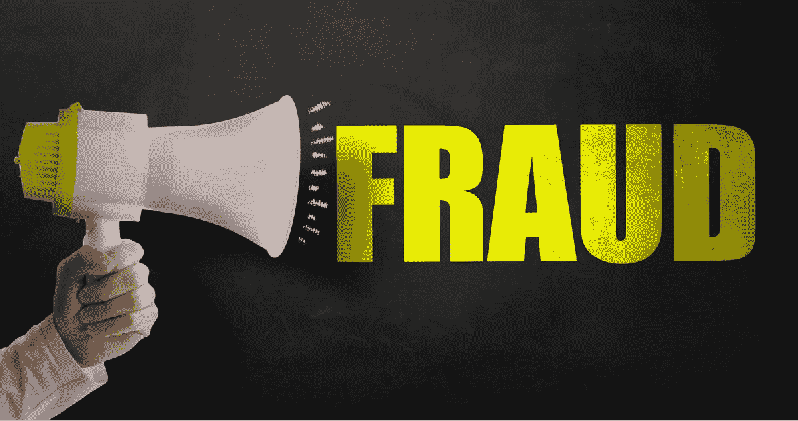
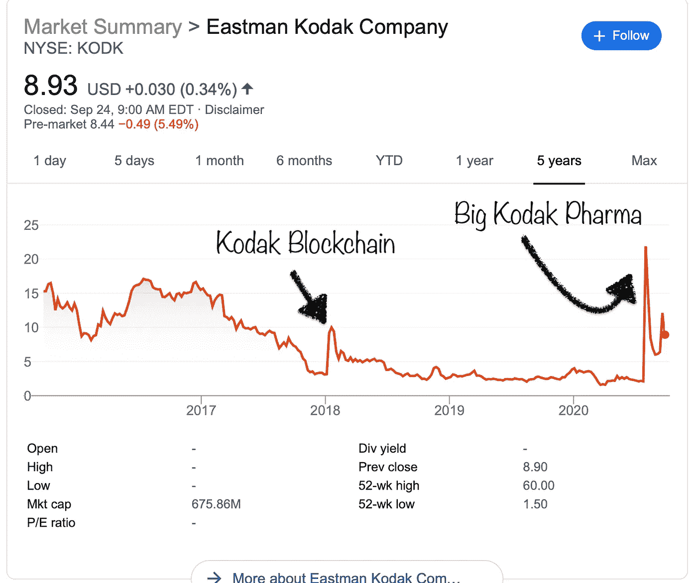

# 如何找到下一只尼古拉股票

> 原文：<https://medium.datadriveninvestor.com/how-to-find-the-next-nikola-stock-e6336920dd16?source=collection_archive---------8----------------------->

每个人都想要下一个成功的故事，但是一场火车事故也同样有利可图

当 Nikola 因强有力的证据被指控欺诈，他们的创始人下台时，我觉得股票最终会跌至 0 美元，并被摘牌。

我决定投点钱在我的观点上，看看它是否成立。

我从来没有卖空一只股票，因为你会让自己遭受无限的损失，尽管买入看涨期权并卖空 100 股可以保护你免受无限的损失。

我没有保证金账户，因为我不想玩别人的钱…尤其是现在。

但我可以用我的账户交易期权，我决定买几天后到期的尼古拉看跌期权。

如果你买入看跌期权，你实际上是希望股价继续下跌。

如果你购买期权，重要的是只投资你愿意损失的部分。如果期权合约到期时，你的执行价和资金都没有了，你的投资就变成了 0 美元……就像继续持有 Nikola 的人会发生什么一样。

然而，期权可以带来你通过买入并持有策略永远看不到的异常收益。

有了这个解释，我决定投资 421.38 美元到两个看跌合约中。

我几乎从不买期权，但我看到了一个机会。尼古拉股票一直在自由落体，这是有充分理由的。

没几天，我就把最初的 421.38 美元变成了 1150.58 美元。

这比股票市场未来几年的回报率都要高。

尼古拉股票的整个经历让我思考…我如何才能找到下一只尼古拉股票。

很多人专注于寻找下一只亚马逊股票，理由很充分。他们想要巨大的收益。

顺便说一下，如果你真的想找到下一只亚马逊股票，请务必阅读我的文章，我在文章中解释了如何做到这一点…

 [## 如何找到下一只亚马逊股票

### 亚马逊已经相当成功了。

medium.com](https://medium.com/the-innovation/how-to-find-the-next-amazon-stock-dff0fc3c938a) 

但找到一只注定会长期亏损的股票也是相当有利可图的。

如果你想找到下一个尼古拉股票，寻找这些特征…

# 在公司成功之前大肆宣传

尼古拉拥有电动汽车股票的所有炒作，有朝一日可能成为下一个特斯拉。许多投资者认为这是他们的第二次机会，大量涌入该股。

Nikola 还通过特殊目的收购公司(特殊目的收购公司)进入公开市场，这也是一种高度投机的投资。当你购买特殊目的收购公司时，你基本上是希望特殊目的收购公司能帮助一家稳健的公司上市。

SPACs 是比传统途径更容易上市的途径，传统途径使像 Nikola 这样的公司更容易获得投资者的资金。

过度炒作并不是你想做空股票或买入看跌期权的唯一原因。一些股票不负众望，而过度炒作阶段持续的时间可能远远超过你的预期。

Nikola 在几个月内立即从大约 10 美元/股飙升至近 100 美元/股，这主要是由炒作和 FOMO 推动的。

 [## 收盘，但没有雪茄-股票市场目标在停滞的 COVID 救济中创新高|数据驱动…

### 专家聊天程序:一个协作市场，在这里人们可以和能够解决他们问题的专家聊天。是……

www.datadriveninvestor.com](https://www.datadriveninvestor.com/2020/08/18/close-but-no-cigar-stock-market-targets-record-highs-amidst-stalled-covid-relief/) 

# 没有实质内容的承诺

嗯，导致尼古拉短期飙升的并不完全是炒作。这位创始人还做出了崇高的承诺，承诺公司会成为什么样的公司，以及如何成为未来的重要组成部分。

承诺很好，但我需要证据。

当杰夫·贝索斯创办亚马逊时，它最初是一家网上书店，因为书籍易于运输。一旦这个概念得到证实，贝佐斯设法获得更多资金，亚马逊就逐渐演变成了今天的庞然大物。

# 叙述中的谎言和重大漏洞

尼古拉的领导层明白，人们希望看到证据。这就是为什么他们向投资者展示他们的卡车送货的视频。投资者对这种产品在 2021 年或 2022 年推出的可能性感到兴奋。

然而，后来发现该视频是假的。尼古拉没有取得投资者看到的那种进展。

他们不仅对投资者撒谎，而且增长叙事中也出现了重大漏洞。最初，他们说这种车将在 1-2 年内推出，一段假视频助长了这种说法。一旦尼古拉暴露了，这种说法就不攻自破了。

随便你怎么说埃隆·马斯克，但路上有成千上万辆特斯拉汽车可以自动驾驶。自动驾驶功能并不完美，但我们可以看到它的运行，并想知道它在 5-10 年内会走多远。

# 换挡以驾驭热门趋势

当 Nikola 上市时，它是作为一个游戏玩家上市。作为一家电动汽车公司上市没有什么错，但他们这样做的时候，每个人都在嚷嚷着要另一家电动汽车公司，希望获得第二次机会来收购一家能够像特斯拉一样产生收益的公司。

虽然这一点上的冒犯并不特别适用于 Nikola 作为一家上市公司的旅程，但它适用于一些乘着热门趋势看到短期股票价值增长的公司。

在网络时代，苦苦挣扎的公司会打耳光。他们的股价随后瞬间飙升。在柯达成为大柯达制药公司之前，柯达推出了柯达硬币加密货币，当时你只要说一声“区块链”，股价就会翻倍。

在柯达的案例中，股价在接下来的交易时段上涨了两倍多。

但是仅仅因为你说你变成了别的东西并不意味着你变成了那个新的身份。在这两种情况下，没过多久现实就出现了，股价回落到合理水平。

如果你在这个阶段做空股票，强烈建议你每做空 100 股就买入一个看涨期权。虽然在制药公司发布公告时，柯达已经被高估到每股 20 美元，但他们仍然设法在顶峰时达到每股 60 美元。

# 领导层放弃了这艘船

当我听说特雷弗·米尔顿辞职时，我开始买入尼古拉看跌期权。如果你是无辜的，你不会在欺诈指控中辞职。

如果有人有资格知道这家公司是否完全是个骗局，那就是创始人、首席执行官和食物链顶端的其他高管。

就他所知，他弃船可能有很好的理由。

当你把弃船和前面提到的因素结合起来，你就有了一个灾难的配方。

每个人都想找到下一只亚马逊股票。我一直在寻找长期来看能显著跑赢市场的公司。

然而，股票价格不一定要上涨才能显著跑赢市场。你可以找到一家像 Nikola 这样的公司，它正坠入深渊，通过这些类型的投资以及你希望永远持有的长期股票来战胜市场。

# 想了解更多股票投资知识吗？确保你订阅了 YouTube 上的《战胜市场》

## 获得专家视图— [订阅 DDI 英特尔](https://datadriveninvestor.com/ddi-intel)