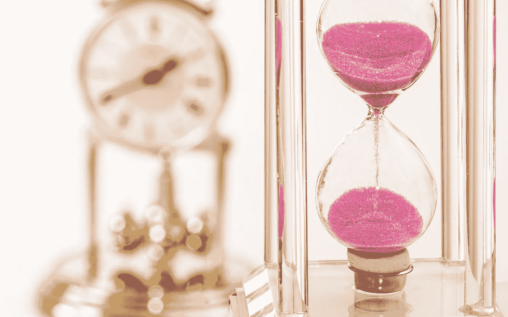

# 如何为你的梦想和目标找到时间

> 原文：<https://medium.datadriveninvestor.com/how-to-find-the-time-for-your-dreams-and-goals-4165d480d150?source=collection_archive---------5----------------------->

# 这可能是本周、本月或今年你会读到的最重要的文章。因为没有时间去实现你的梦想和目标，你将永远无法实现它们。

在我们十几岁的时候，甚至更早的时候，我们都梦想着我们会成为什么样的人，我们会住在什么样的房子里，我们会有什么样的家庭，我们会开什么样的车，我们会过什么样的假期，等等。然而，**随着年龄的增长，我们被教导要更加“现实”，**我们被教导没有时间去实现梦想。**我今天想告诉你，你知道！**

如果你遵循了这篇文章中的建议，你不必相信我，你会发现你不仅有时间实现你的梦想和目标，甚至还有时间留给你自己。我这么说是什么意思？一会儿你就知道了，但首先，让我们谈谈你的时间。

 [## 投资区块链前要问的三个简单问题(也是一个困难的问题)|数据…

### 现在是了解区块链的最佳时机。不同货币之间的增长率，比如…

www.datadriveninvestor.com](https://www.datadriveninvestor.com/2020/03/12/three-simple-questions-and-one-difficult-one-to-ask-before-investing-in-a-blockchain/) 

我打赌你们的日程已经很忙了，你们大多数人不会整天躺在沙发上无所事事。我想说的是，你可能没有充分利用时间。

> 你有记录时间的笔记本吗？

我知道这听起来很荒谬，但是对我们大多数人来说，包括我自己，**我们没有注意到我们在那些不能让我们更接近目标的事情上花了多少时间。**

为了给我们的目标找到时间，我们首先需要看看我们的时间去了哪里。

你会注意到，我们的大量时间要么浪费在任务之间，要么浪费在重复性的任务上，或者浪费在不能让我们走向 T21 的事情上。是的，我们将在以后的文章中讨论如何设定你的目标，但是让我们把重点放在你需要什么来让你到达那里。

> 不要只是读了这篇文章就告诉自己应该为你的未来做点什么，甚至在你完成这篇文章之前，现在就去找本日记，甚至一张纸，在上面写下“时间清单”

现在在上面写下当前的日期和时间；在时间旁边，写下，“阅读——自我提升。”一旦你将完成阅读并进入下一个任务，写下开始时间，你已经花了时间，和结束时间。**在函数之间不要遗漏；珍惜每一分钟，因为这几分钟很重要。**

> 承诺只写一周的日记。

如果你坚持一个月，你会更好地理解你的时间，但是你会在不到一周的时间里找到追求梦想所需的时间。

不要试图每天找一个小时来实现你的目标，而是**评估什么是重要的事情**，比如积极地花时间和家人在一起，锻炼，以及你一天中其他重要的部分；还有**对你未来的自己没有贡献的元素是什么？**

现在，如果你花 40 个小时在工作上，问问你自己**如何优化你的时间，在不消耗你所有的精力和让你自己筋疲力尽的情况下，给你的公司带来更好的结果？你能更有效率吗？这会带来晋升和更高的收入吗？**

我们假设**你每周工作 40 小时**。这样一来，除了工作之外，你每周还有 128 个小时。如果你睡了 7 个小时，请记住，许多成功人士每天睡 5 个小时，你每周仍有 79 个小时的 T21。

事实是，这对完成你的大部分目标来说已经足够了。是的，我知道你会告诉我你一天中有很多其他的事情要做，比如照顾你的孩子和个人卫生，而我却忽略了这些。

> 我的问题是，你知道这 79 个小时你在做什么吗？

让我们来看看对许多美国人来说最受欢迎的下班后活动有哪些。根据美国人口普查局为劳工统计局进行的 2019 年 [**美国时间使用调查**](https://www.bls.gov/news.release/pdf/atus.pdf) 的结果，以下活动占用了美国人的时间:

**睡眠平均每天占用 8.84 小时**。通过适当的锻炼和营养，很少有人需要每天 8.84 小时的睡眠来保持身心健康，你可以利用这段时间来实现你的目标。

而**照顾和帮助家里的孩子用了不到 23 分钟**。这个数字应该更高。你应该花更多的时间和你爱的人在一起。

男性每天看电视的时间为 2.81 小时，男性每天看电视的时间为 3 小时。是的，**看电视占用了人们更多的时间，比致力于自己的目标、花时间陪伴自己所爱的人、致力于自我提升的时间加起来还要多。**

如果我们比较工作日和周末，这是值得的。周末**美国人平均睡眠时间为 9.5 小时**，但他们花在爱人身上的时间仍不到 30 分钟。

**周末的教育活动**占用**不到 13 分钟**，工作日**不到 35 分钟**。

看电视的时间从每天几乎 3 小时增加到 3.5 小时。

当我们看着人们在他们的黄金时期为他们的目标而努力时，统计数据变得更糟，20 至 24 岁的人每天花 4.91 小时在休闲(电视)和体育上，25 至 34 岁的人每天花 4.28 小时在 T21，35 至 44 岁的人每天花 4 小时

> 每天花 4 个小时在你的目标上，一周可以累积 28 个小时，一年就是 1456 个小时。

我们将在这个项目上每周花费 20 个小时，即使我们有两周的假期，一年也要花费 1000 个小时。你会每年花 1000 个小时来建立一个价值 1000 万美元的投资组合吗？

当你改善了生活中的一个方面，你生活中的其他方面也会随之改善。找时间做更多的工作意味着你需要更多的精力来继续做下去。这意味着**戒掉快餐**并开始**吃得更健康**并开始**每天锻炼**将会**改善你的健康并给你所需的能量**。是的，这也意味着你应该为你的目标优化**每周 30 小时**而不是**20 小时**。

在说你不可能每周找到 30 个小时之前，问自己几个问题，你看电视吗？你看体育节目吗？你出去参加聚会吗？你浪费时间拖延吗？你会花时间滚动社交媒体应用吗？你会花时间在可以消除或优化的任务上吗？

> 对自己诚实；你放弃的是你的梦想来换取那些东西。

最后，你需要了解复合动量和**没有额外时间**的概念。复合动力的力量需要更长的时间来解释，我会写另一篇关于这个主题的文章，但是让我们来谈谈**“没有额外时间”的概念**，因为它与这篇文章相关。这个想法很简单；你可以同时做两件事。我知道你被教导不要一心多用，但是有些时候你会花时间在关键任务上，这可能会带来另一个好处。例如，当我遇到交通堵塞时，我会听一些能让我更成功的有声读物。这意味着**我不会增加每天学习的时间，但我会优化我的通勤时间。**

**我也花时间和有相似人生目标的人在一起**，激励我，作为回报，我会带领他们走向成功，而不是花时间和喜欢去俱乐部和聚会的人在一起。我不是在告诉你谁应该是你的朋友，但正如那句名言所说的那样，你是你五个最亲密朋友的平均值。

现在我已经结束了对时间有多重要的咆哮，**请帮我一个忙，掌控你的时间**，即使这意味着花更多的时间和你爱的人在一起，而不是加入一个梦幻足球联盟。

**访问专家视图—** [**订阅 DDI 英特尔**](https://datadriveninvestor.com/ddi-intel)