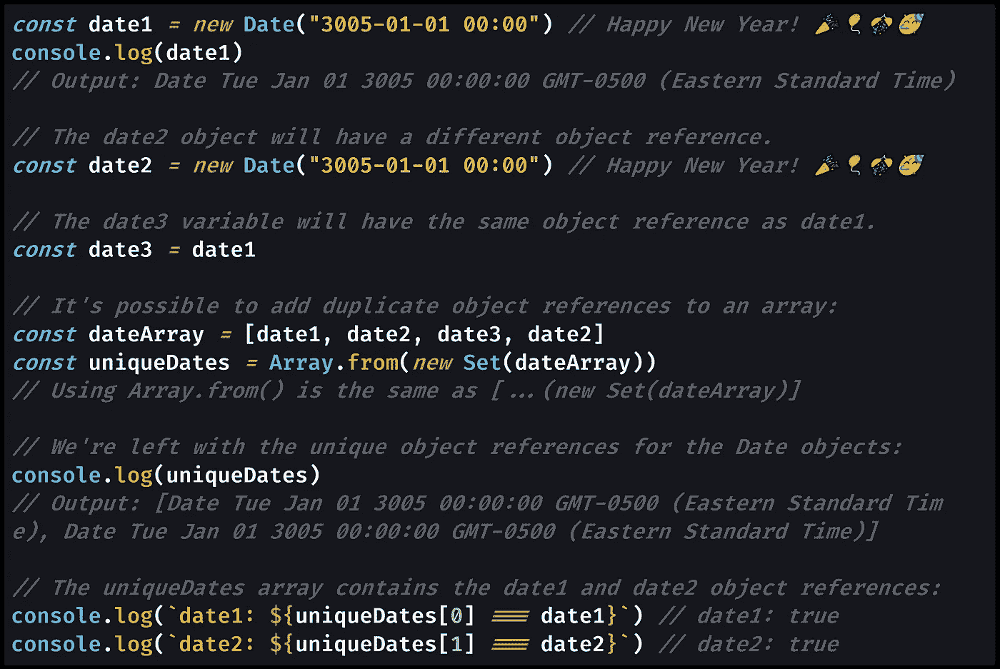
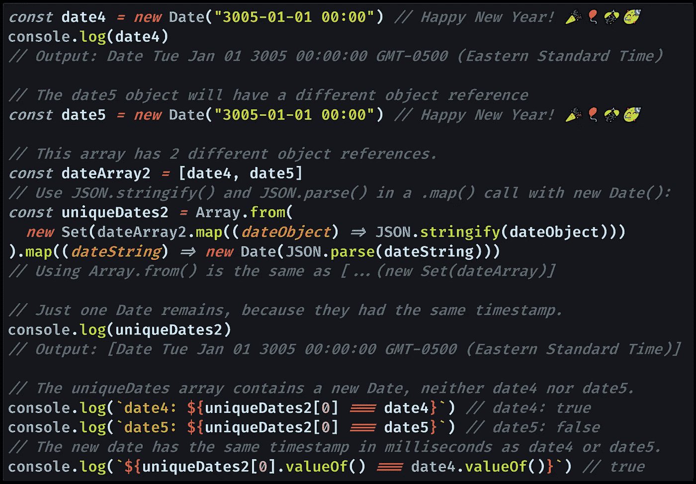
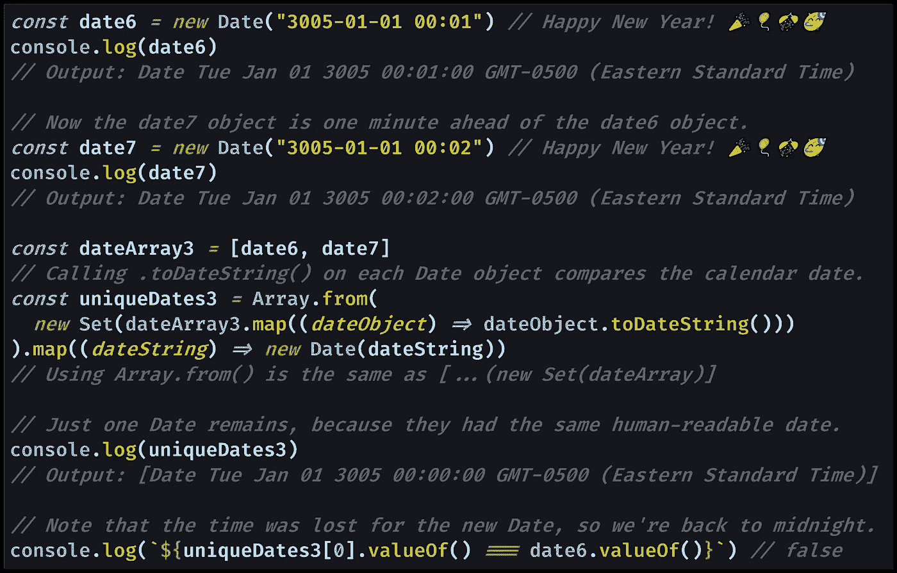

# 如何在 JavaScript 中查找数组中的唯一日期

> 原文：<https://medium.datadriveninvestor.com/how-to-find-unique-dates-in-an-array-in-javascript-efd87ecfea66?source=collection_archive---------7----------------------->

## JavaScript 有三种方法来定义 Date 对象是否惟一:它是否具有惟一的对象引用、惟一的时间戳(以毫秒为单位)或者惟一的可读日历日期。

Photo by [Elena Mozhvilo](https://unsplash.com/@miracleday?utm_source=medium&utm_medium=referral) on [Unsplash](https://unsplash.com?utm_source=medium&utm_medium=referral)

# 是什么让`Date`独一无二？

💐当然是花。**🌹**

但是，我们说的是 JavaScript。JavaScript 不在乎你对浪漫爱情的物质表达。

JavaScript 关心的是，如果您试图使用`[Set](https://medium.com/coding-at-dawn/how-to-use-set-to-filter-unique-items-in-javascript-es6-196c55ce924b)`从内置`[Date](https://developer.mozilla.org/en-US/docs/Web/JavaScript/Reference/Global_Objects/Date)`对象的[数组](https://medium.com/javascript-in-plain-english/how-to-check-for-an-array-in-javascript-6ad20f7a0e21)中找到唯一的日期，内存中会有什么。

JavaScript 使用某些标准来比较`Date` s:

1.  每个`Date`在内存中都有唯一的“对象引用”吗？
2.  每个`Date`都有以毫秒为单位的唯一时间戳吗？
3.  每个`Date`会产生一个独特的人可读的字符串吗？

让我们逐一分析。

# 1 —每个`Date`在内存中都有唯一的“对象引用”吗？

每个 JavaScript 对象都有一个唯一的“对象引用”——它在计算机内存中的确切位置。

这意味着根据 JavaScript 的定义，具有相同内容的对象在技术上是不同的对象。

如果你有一个调用了`Set`的`Date`对象数组，那么你将得到和以前一样多的`Date`对象。

这是因为每个对象都有唯一的对象引用，使得每个`Date`对象都是唯一的:`new Date() !== new Date() // true`。

只有当同一个变量被多次添加到数组中时，`Set`才会从数组中删除重复的`Date`。

让我们看看 JavaScript 中通过对象引用查找唯一日期的确切含义:

[View raw code](https://gist.github.com/DoctorDerek/a32c460f1e9869e41ae55141da22a92d) as a GitHub Gist

您可以使用`[Array.from()](https://levelup.gitconnected.com/how-to-copy-an-array-in-javascript-with-array-from-298c7e66eebc)`或`[...](https://medium.com/coding-at-dawn/how-to-use-the-spread-operator-in-javascript-b9e4a8b06fab)`[扩展操作符](https://medium.com/coding-at-dawn/how-to-use-the-spread-operator-in-javascript-b9e4a8b06fab)调用`Set`来创建唯一的`Date`对象引用数组。您使用哪个并不重要，但是您需要跟踪您的对象引用。

在这个例子中，我们最终得到了两个唯一的对象引用，尽管两个`Date`对象都指向相同的确切时间。

由于`Set`保持了原始数组的[插入顺序](https://developer.mozilla.org/en-US/docs/Web/JavaScript/Guide/Keyed_collections)，我们以第一个`Date`对象是`date1`结束，然后是`date2`。

通常，通过引用来比较`Date`对象并不是您在试图从数组中找到唯一的`Date`对象时想要的，但这是`Set`的默认行为。

# 2 —每个`Date`都有唯一的时间戳(以毫秒为单位)吗？

每个 JavaScript `Date`对象都包含一个精确的时间戳，因为`Date`只是一个包装器，用于包装自 1970 年 1 月 1 日[UTC](https://en.wikipedia.org/wiki/Unix_time)以来经过的精确的[毫秒数](https://currentmillis.com/)。

这意味着根据时间戳，任何两个相差一毫秒的`Date`对象都是不同的`Date`对象。

为了在`Date`对象中找到精确到毫秒的唯一时间戳，我们需要将`Set`与:

1.  `[JSON.stringify()](https://medium.com/javascript-in-plain-english/how-to-use-stringify-and-parse-in-javascript-6b637b571a32)`，
2.  `[JSON.parse()](https://medium.com/javascript-in-plain-english/how-to-use-stringify-and-parse-in-javascript-6b637b571a32)`，
3.  `[Array.prototype.map()](https://developer.mozilla.org/en-US/docs/Web/JavaScript/Reference/Global_Objects/Array/map)`，以及
4.  `[Date()](https://developer.mozilla.org/en-US/docs/Web/JavaScript/Reference/Global_Objects/Date/Date)`建造者。

当我们将一个`Date`对象转换成 [JSON](https://medium.com/swlh/what-is-json-used-for-in-javascript-programming-9d71284359a9) 格式时，我们实际上得到的是一个[字符串](https://medium.com/javascript-in-plain-english/how-to-check-for-a-string-in-javascript-a16b196915ff)，因为`Date`对象不是 [JSON 安全的](https://developer.mozilla.org/en-US/docs/Web/JavaScript/Reference/Global_Objects/JSON/stringify#Description)。

然而，我们可以使用`.map()`通过`Date()`构造函数将每个字符串映射回一个`Date`对象。

这些字符串基于精确的时间戳——精确到毫秒——所以使用 JSON 可以比较毫秒。

[View raw code](https://gist.github.com/DoctorDerek/a32c460f1e9869e41ae55141da22a92d) as a GitHub Gist

这里的`JSON.stringify()`的行为和对`Date`对象本身调用`.toISOString()` ( `[Date.prototype.toISOString()](https://developer.mozilla.org/en-US/docs/Web/JavaScript/Reference/Global_Objects/Date/toISOString)`)是一样的。

这意味着您可以在上面的第一个`.map()`调用中用`.toISOString()`代替`JSON.stringify()`。如果你这样做了，你就永远不必在第二个`.map()`中调用`JSON.parse()`。

您甚至可以对`Date`对象本身使用`.valueOf()` ( `[Date.prototype.valueOf()](https://developer.mozilla.org/en-US/docs/Web/JavaScript/Reference/Global_Objects/Date/valueOf)`),因为该函数将`Date`的时间戳的原始值作为[号](https://medium.com/javascript-in-plain-english/how-to-check-for-a-number-in-javascript-8d9024708153)返回。

# 3 —每个`Date`会产生一个独特的人类可读的字符串吗？

我们在日常语言中称之为日期的东西并不是 JavaScript 所考虑的`Date`对象。

当然，我们使用“日期”一词仅指一个月、一天和一年——日历上的日期，一年 365 天中的一天。

为了找到唯一的日历日期，您需要对`Date`对象本身调用`.toDateString()` ( `[Date.prototype.toDateString()](https://developer.mozilla.org/en-US/docs/Web/JavaScript/Reference/Global_Objects/Date/toDateString)`)方法。在最后一个例子中，这将代替`JSON.stringify()`，意味着我们不需要调用`JSON.parse()`。

`.toDateString()`方法将把`Date`对象作为人类可读的字符串返回，比如`"Tue Jan 01 3005"`。这非常适合比较日历日期。

[View raw code](https://gist.github.com/DoctorDerek/a32c460f1e9869e41ae55141da22a92d) as a GitHub Gist

您可能更喜欢使用不同的标准在数组中查找不同的日期，JavaScript 提供了多种选择:

*   `[Date.prototype.toTimeString()](https://developer.mozilla.org/en-US/docs/Web/JavaScript/Reference/Global_Objects/Date/toTimeString)`
*   `[Date.prototype.toLocaleDateString()](https://developer.mozilla.org/en-US/docs/Web/JavaScript/Reference/Global_Objects/Date/toLocaleString)`
*   `[Date.prototype.toLocaleTimeString()](https://developer.mozilla.org/en-US/docs/Web/JavaScript/Reference/Global_Objects/Date/toLocaleTimeString)`
*   `[Date.prototype.toLocaleString()](https://developer.mozilla.org/en-US/docs/Web/JavaScript/Reference/Global_Objects/Date/toLocaleString)`

这些函数可以让你做任何你想做的比较，比如以分钟为单位的时间，而不是以秒为单位。

只需插入最适合您的一个，您将根据您的标准在一组`Date`对象中找到唯一的日期。

**编码快乐！**📅🕛⏳🎉🎊

[德里克·奥斯丁](https://www.linkedin.com/in/derek-austin/)博士是《职业编程:如何在 6 个月内成为一名成功的 6 位数程序员 一书的作者，该书现已在亚马逊上架。