# 如果你现在有点迷茫，如何找到对你有意义的职业

> 原文：<https://medium.datadriveninvestor.com/how-to-find-work-that-you-love-2794431ba3cb?source=collection_archive---------1----------------------->

## Ikigai 是日本人寻找自己热爱的工作的概念

Photo by [Clay Banks](https://unsplash.com/@claybanks?utm_source=medium&utm_medium=referral) on [Unsplash](https://unsplash.com?utm_source=medium&utm_medium=referral)

我获得了 4 年的学位，在世界上一些最好的公司担任了 5 个开发职位，这才意识到我走错了路。

你知道吗，当我第一次决定成为一名工程师时，我以为我的生活会定下来。在大学里聚会，通过一些测试，毕业。然后我会找到我的理想工作，我的梦中情人，并继续我人生的下一个篇章。但我已经决定转向。

从经济上来说，做一名 FullStack 开发人员是非常值得的。但我感到空虚。我正在做的工作感觉没有真正的影响，我觉得我在浪费时间。总之，我没有任何目标。

直到偶然遇到 Ikigai 这个概念，我才明白。我失去了生活中的这些基本要素。没有他们，我感到空虚。

[Ikigai](https://en.wikipedia.org/wiki/Ikigai) 不仅仅是关于目的。这是一个理由，一个每天早上从床上跳起来，兴奋地面对新挑战，发现你真正热爱的新事物的理由。

# 人们会给你的建议

## 1.获得职业

我的父母在 80 年代末来到加拿大。移民。他们来到这个国家不仅是为了他们自己，也是为了他们的孩子。他们想确保我们不会在极度贫困的环境中成长。他们希望我有一份经济稳定的 [***职业***](https://en.wikipedia.org/wiki/Profession) ***，*** 所以他们基本上给了我三个选择:医生、律师、工程师。

我相信每个移民家庭的孩子都会有同感。

但对我来说，我真的不太介意。我喜欢阅读关于科学和技术的书籍。但问题是，在一个总是缺钱的环境中长大。我努力争取财务自由胜过一切。比起激情，我更在乎金钱，因为我认为金钱真的会让我更快乐。

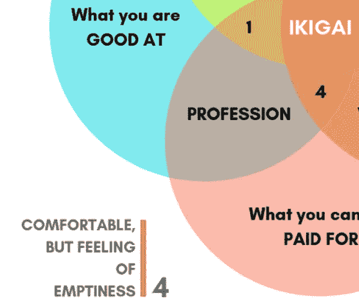

[Taken](https://inuidea.com/wp-content/uploads/Ikigai-How-to-find-your-passion-and-pursue-a-career-you-love.png) from [Inuidea](https://inuidea.com/)

所以我决定成为一名工程师。但随着我继续做越来越多的实习，我意识到我对工作非常厌倦，对任何工作都不感兴趣。我们一遍又一遍地制作看似相同的网络应用。

我觉得自己就像一台机器上的一个齿轮，几个星期过去了，但我并不觉得自己在任何实质性的事情上取得了任何进展。

这有点像原地跑步。我努力工作，但最终哪儿也不去。

这是做一些没有意义的事情的根本问题。在你害怕做其他事情的地方，你会感到足够舒适。但是这种空虚感来自于没有意义的工作。

> "没有有意义的工作，就很难有有意义的生活."—吉姆·科林斯

## 2.追随你的激情

别人告诉我，我应该追随我的*。找到我喜欢做的事情，然后去做。最终，钱会跟着来的。*

*但是激情不一定能转化为金钱。例如，我喜欢篮球。我几乎每天都玩，我会说我的技术高于平均水平。问题是我不是一个 6 尺 7 寸的精英运动员。*

*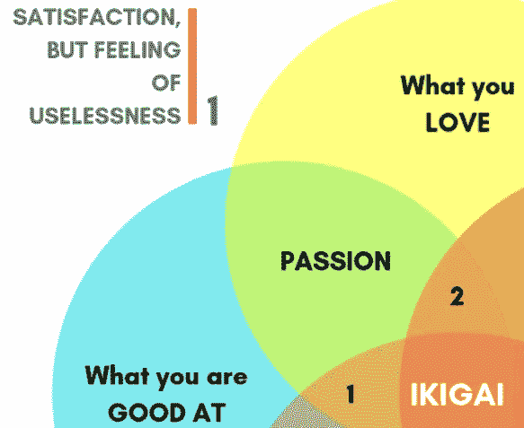*

*[Taken](https://inuidea.com/wp-content/uploads/Ikigai-How-to-find-your-passion-and-pursue-a-career-you-love.png) from [Inuidea](https://inuidea.com/)*

*激情对你的工作是必要的。但是我们可以有多种激情，最重要的是利用你有信心帮助你成功的激情。*

*这并不是说你不应该继续追求你热爱的其他东西。但是当追求事业时，金钱应该被认为是一种工具。它让你有时间关注和练习你所关心的事情。金钱提供了不必担心食物和住所的特权。这就是为什么重要的是保住你的工作，同时追求你的激情，直到你看到一条可行的道路，让你的工作有利可图。*

*激情本身可能是孤独的。你曾经亲手制作过东西吗？一旦你完成它，你会有一种巨大的满足感，对吗？但你知道什么感觉比这更好吗？与他人分享你的工作。当你看到有人欣赏你的工作，甚至从你的工作中受益，你会有一种内在的幸福感。你变得对别人有意义。*

*出于某种原因，每个人都喜欢做某事。我奶奶喜欢缝纫和修改衣服。但是我注意到她从缝纫到帮助别人是最快乐的。如果追随你的激情令人满意，我认为分享你的激情令人满足。*

> *“选择一份你热爱的工作，你一生中一天都不用工作。”——孔子*

## *3.帮助世界*

*然后有些人跟着一个 ***使命*** 或者事业。他们为了人类的更大利益而做的事情。自愿为他人的利益牺牲自己的时间。*

*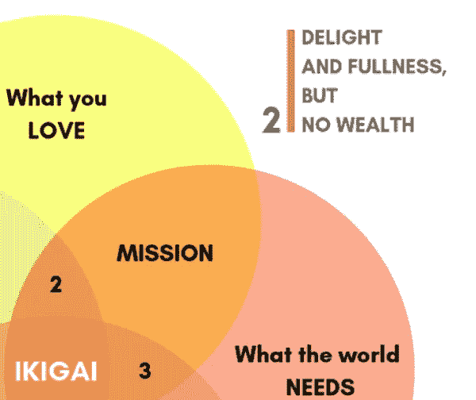*

*[Taken](https://inuidea.com/wp-content/uploads/Ikigai-How-to-find-your-passion-and-pursue-a-career-you-love.png) from [Inuidea](https://inuidea.com/)*

*我缺少这个。这种使命感，这种为更伟大的事业而不仅仅是为我自己做事的使命感。我所做的工作，我希望以一种对我合适的方式对其他人有价值。*

*我也不是说你的任务需要大规模的。它只需要是你相信世界上应该存在的东西。一些让你觉得“我现在做的有意义”的事情。*

> *“没有人因为给予而变得贫穷。”―安妮·弗兰克*

## *4.找到你的使命*

*最后，还有一个*。人们需要的东西，但也可以是一个可行的收入来源。教学，宗教工作，和其他事情。这些通常被视为高尚的事业，通常是出于无私的原因。**

****

**[Taken](https://inuidea.com/wp-content/uploads/Ikigai-How-to-find-your-passion-and-pursue-a-career-you-love.png) from [Inuidea](https://inuidea.com/)**

**可以说是另类职业。这份工作令人兴奋，但有一种不确定感，有时很难成长。尤其是如果你是数以千计的薪酬极低且不受重视的高中教师之一。**

> **“我不能教任何人任何东西；我只能让他们思考。”——苏格拉底**

# **寻找 Ikigai**

*****大致翻译成*** 的意思是:**

> **“存在的理由”**

**你需要一个存在的理由。没有它，你就根本没有活着。**

## **为什么激情是不够的**

**孤立地做自己喜欢的事而不去帮助别人，最终会变得毫无意义。你希望能够与其他人分享你的激情，甚至希望让他们从你的工作中受益。**

## **为什么钱不够**

**一开始，赚大钱是件好事，它能帮助你摆脱财务困境，但不会以任何方式改善你或你的人际关系。随着时间的推移，你会对追求金钱或名誉感到不满。你需要一个目标，一个真正活着的目标。钱只是让你做事的工具，不多不少。**

## **为什么技能还不够**

**做自己擅长的事情而没有激情，会让你痛苦。擅长某件事和爱做某件事完全是两码事。没有人喜欢钉钉子，人们喜欢建造。有时我们太专注于技能，以至于忘记了它的目的是用来创造。我擅长编程，但我不爱编程。不过，我喜欢做东西。我的技能再次成为增强我欲望的工具，它们不是我的目的。**

# **你需要一个目标。存在的理由**

**你需要一个目标。你生活中的某种激励因素，促使你早上醒来时精力充沛地处理一天的问题。有一个目标会引导你做所有其他的决定，从你选择花时间在什么事情上，到你决定和什么人在一起。**

**你会积极地追求那些和你有同样想法的人。这让你置身于一种自身具有激励性的关系中。**

**你需要在技能、爱情、金钱和对他人有用之间找到平衡。 ***Ikigai 是这四个概念的交集。*****

**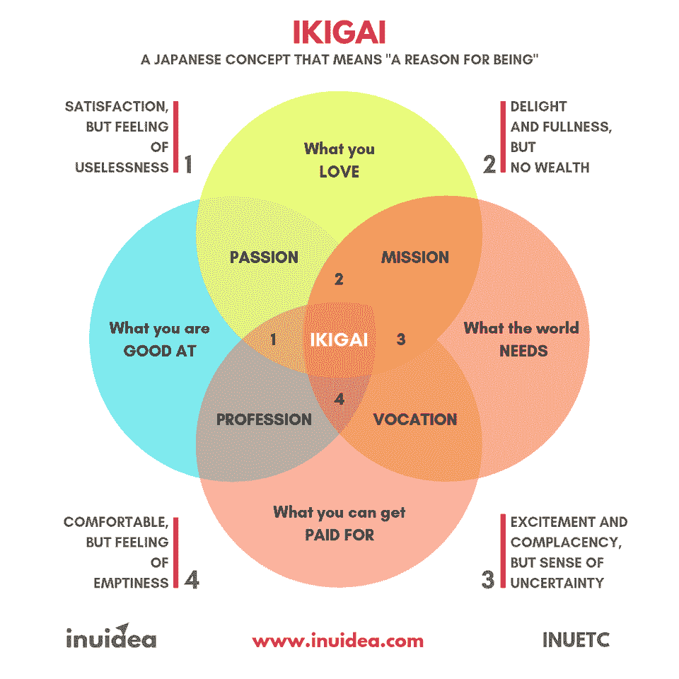**

**[Taken](https://inuidea.com/wp-content/uploads/Ikigai-How-to-find-your-passion-and-pursue-a-career-you-love.png) from [Inuidea](https://inuidea.com/)**

**我处在第四个位置，我很舒服，但我感到空虚，那不是我想要的生活。**

**仅仅拥有这四个方面中的两个对于充实的生活来说是不够的。我们需要能够把自己放在我们热爱我们所做的事情的位置上，但也要不断地接受挑战和成长。我们需要做一些帮助他人的事情，同时确保我们能够养活自己和家人。我们需要平衡。**

> **“就是这条路”——曼达洛人**

# **拥有 Ikigai(存在的理由)会如何改变你**

## **你会对你所做的事情更加自信**

**寻找目标给人一种…毫无歉意的自信。因为你不再隐藏自己了！你正在做你喜欢的事情，你可以看到它对人们的影响。**

**其他一切都变得不重要，更容易拥抱真实的自己。你不太关心完美，更关心如何实现目标，因为你几乎每天都感受到激情和兴奋。简而言之，你会希望每天早上醒来就开始新的一天。**

## **你会想冒更多的风险**

**冒险将成为你的一部分，因为你不再害怕失败。你知道即使是失败本身也是进步。它们成为学习和变得更好的机会。**

> **"最快的成功方法是加倍你的失败率."——老托马斯·沃森**

**当你有一个真正想要实现的目标时，你会发现很难让任何事情阻挡你，尤其是失败。这将会让你成功，比别人走得更远。**

## **规划你的未来**

**你会有一个与生俱来的雄心和目标，你会开始为如何达到目标制定策略。你会意识到你会做出更明智的决定，对自己的目标有更好的认识。**

**但是你也会注意到，当新的机会出现时，你会接受改变和改变。拥有这种能力会让你积极探索新的人生道路，踏上属于你自己的旅程。**

**那么，我们如何找到 Ikigai 呢？让我们最后看一看。**

# **寻找 Ikigai 的演练**

**我们可以使用上面图表中的框架来找到我们的 Ikgai，或者至少将我们推向正确的方向。所以，让我来告诉你我是如何找到我的目标的，你也是如何找到你的目标的。**

## **第一步:写下你喜欢做什么？**

**写下你喜欢做的每件事。所有的活动，所有的东西，所有的人，所有你可能想到的，都写下来。**

**这个类别的特点是它是动态的。当你探索新事物、尝试新事物时，你会发现你喜欢做的新事情。这就是为什么对**来说，尝试做你能做的任何事情都是如此重要，尤其是在你年轻的时候。**探索新事物是我们作为个体成长的方式，也是我们成为更全面的个体的方式。**

**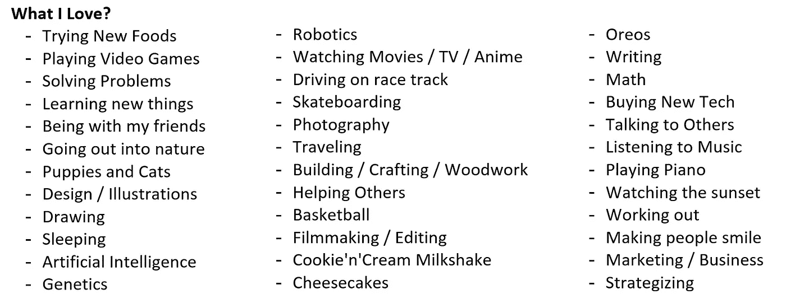**

**Screencapture by Author [Bruce Ironhardt]**

**这是我想出来的清单。我可能还能想到 1 亿多件事情，但这些是我当时想到的事情，已经足够好了。**

**你要真正关注那些你基本上离不开的东西。更进一步，你甚至可以排列出对你来说最重要的 10 件事情。这将帮助你了解什么事情对你最重要。**

## **第二步:写下你的天赋或技能**

**这是最难的部分。尤其是当你像我一样认为自己什么都不擅长的时候。但是不用担心。只要写下你至少处于*的一切。***

***如果你需要更多的训练来变得更好，就把它放在括号里，“**需要更多的训练**”。***

***如果你打算随着时间的推移变得更好，你也可以放下你不擅长的事情。例如，如果你计划参加一个在线编程课程，你仍然可以把编程作为你的技能之一，也许可以在它旁边加上一个“*”。****

***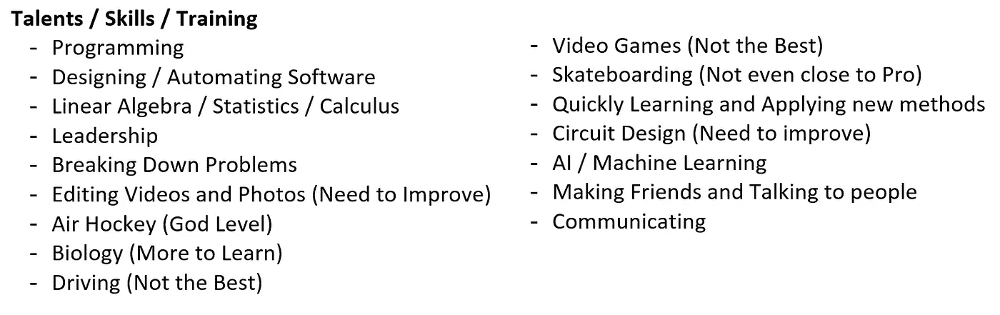***

***Screencapture by Author [Bruce Ironhardt]***

***这些东西是我个人想出来的。看着这个列表，我知道的竟然如此之少。但同时，这也意味着我有更多的东西需要学习和练习。***

***列出一些你有兴趣学习的技能可能是个好主意。技能是另一个动态的、不断变化的东西。通过列出你认为将来可能有用的东西，你可以更好地了解你在生活中寻找什么。***

***对我来说，我知道我想成为一名更好的作家，更善于表达我的想法，并提高我的公众演讲能力。这些是一般的软技能，几乎可以提升我选择的任何职业。***

***稍后，当你找到你的 Ikigai 时，你要集中精力写出你可能还没有发展的技能，这些技能可以进一步提高你的 Ikigai，让你更有效率。***

## ***第三步:写下赚钱的事情***

***这很简单。想想你能想到的每一个可能的职业或市场。写下像工程这样的普通职业和像自由作家这样的小众工作。***

***试着想想与你热爱或擅长的相关的职业或机会。***

***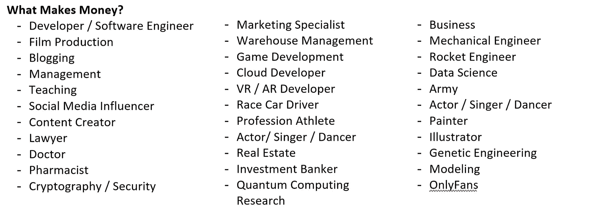***

***Screencapture by Author [Bruce Ironhardt]***

***这个列表很短。即使是现在，我还能想到更多可能存在的潜在赚钱机会，所以拿着我的清单，尽可能地添加更多的东西。记得要一般地、具体地思考。所以“博客”可能是一种职业，但“猫博客”可能是另一种职业。专注于你喜欢和享受的领域是很重要的。***

## ***第四步:写下人们需要什么***

***弄清楚人们需要什么或想要什么，并帮助他们实现，这将使你的 Ikigai 完整，因为它是最后一个组成部分。***

***你想做的事情完全有可能是人们甚至还不知道他们想要的。例如，自我鞋带鞋可能是人们没有想到的。但是，如果我们生活在一个每个人的鞋子都是自动解鞋带和系鞋带的世界里，那些人会回到需要手动系鞋带的鞋子上去吗？答案可能是否定的。***

***所以，写下一张清单，用你能想到的所有不同方式来帮助这个星球或人类。像以前一样，试着把它和你喜欢或擅长的联系起来。这些部分需要你尽可能地发挥创造力，所以如果你真的需要的话，给自己多几天时间。没必要着急。***

***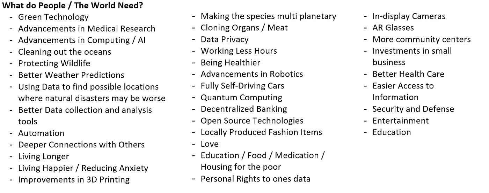***

***Screencapture by Author [Bruce Ironhardt]***

***再一次，你可以随意把我的清单作为一个起点，然后在上面添加更多的东西。一旦你完成了，突出那些对你影响最大的问题，去掉其他的。试着把这个列表保持在 20 条以下，这样你以后会更容易。或者只对前 20 项进行排名，其余的不进行排名。***

***你们都吃完了吗？好吧，让我们找到你的 Ikigai。***

# ***让我们找到你的目标***

***这就是你的创造力再次发挥的地方。你想把这四个类别中的每一个都去掉，然后把它们组合成一个潜在的职业。***

## ***当考虑一个职业是否适合你时，问自己以下 5 个问题***

1.  ***这让我兴奋吗？***
2.  ***如果没有钱，我会这么做吗？***
3.  ***10 到 30 年后，我会后悔没有这么做吗？***
4.  ***我愿意看到它通过吗？***
5.  ***当你想做什么的时候，你的头脑会回到那个职业吗？***

***这是我想到的第一个例子。***

***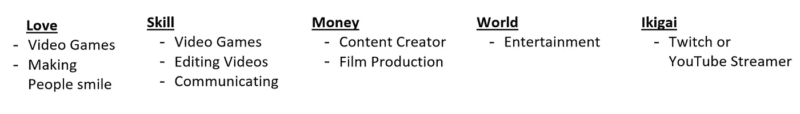***

***Screencapture by Author [Bruce Ironhardt]***

***在这里，我写道，一个可能的 Ikigai 可以是 Twitch 或 Youtube 流。这是基于这样一个事实，我喜欢视频游戏，我可以相当体面地编辑和制作视频。根据其他来源，这甚至是一个可能的收入来源。***

***需要注意的重要一点是，在将每一项整合到框架中时，您都应该具体。例如，***(Twitch 或 YouTube)上的一个喜剧频道，我在那里与观众在线互动并编辑/制作自己的内容，*** 比我最初写的要好得多。***

**接下来，我需要问自己 4 个问题:**

*   ****它让我兴奋吗？**耶！我喜欢制作自己的内容，也喜欢玩游戏**
*   **如果没有钱，我会这么做吗？我已经有时这样做了，这很好。**
*   **10-30 年后，我会后悔没有这么做吗？坦率地说，答案是否定的。虽然我喜欢做这件事，但如果我停止了，我也不会后悔。我认为游戏对我来说只是和朋友一起玩的一种方式，仅此而已。**

**所以，这个职业显然不是我的 Ikigai。所以，我们再试一次。**

**这是一份新的清单，这次更多地依靠我的一些更强的技能。**

**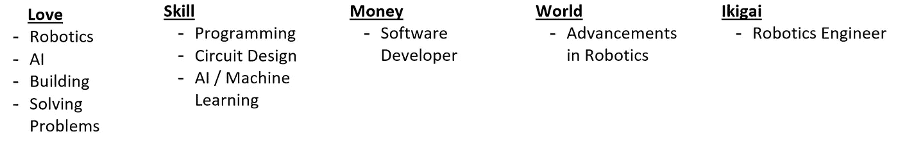**

**Screencapture by Author [Bruce Ironhardt]**

**你有时不能马上对你的 Ikigai 非常具体。暂时没关系。**

**对我来说，机器人听起来很棒，无论我是加入一个研究团队来制造具有脑机接口的机器人，还是建造下一个高达机翼，我都觉得很兴奋，所以我决定保持它的通用性。**

**这为我勾选了几乎所有的框。这听起来非常有趣，我觉得我会满足于追求这条道路。但是它不检查最后一个。**

*****当你想到你想做的事情时，你的头脑是否回到了那个职业？*****

**再说一次，我热爱机器人技术，我想制造和修补。但是我并不总是想着这件事。它太棒了，我仍然想买。**

**我举埃隆·马斯克的例子。我们知道他主要是因为特斯拉，我们知道马斯克热爱人工智能和汽车以及整个特斯拉业务…但我们也知道他被火星吸引，以至于他说如果他能死在那里，他会的。**

> **“我说过我想死在火星上，只是不想被撞击。”——埃隆·马斯克**

**火星是他的 Ikigai(我会假设)，但特斯拉，OpenAI，Neuralink 都是他热爱和信仰的东西，所以他也追求它们。但我认为，如果他被迫选择一样东西，那就是 SpaceX。那是他的 Ikigai。**

**你不必只关注一件事，但你应该知道你的 Ikigai 是什么，并把它作为你做其他事情的主要动力。**

**经过深思熟虑，我来到了这里。**

**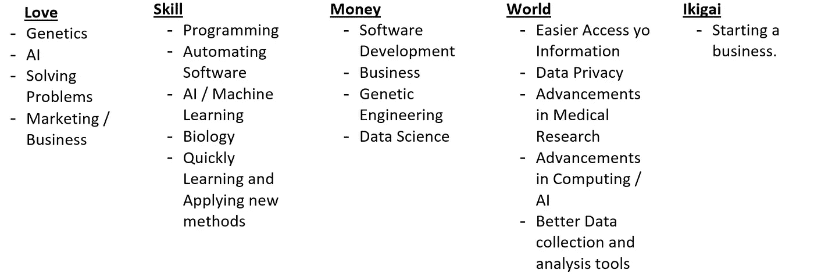**

**Screencapture by Author [Bruce Ironhardt]**

**我想开始创业，追求基因工程和人工智能的进步。更具体地说，我想研究允许人体内基因改变的技术，并希望有一天能够安全地改变它们。**

**我花了一段时间才来到这里，但我认为这是我生活中的主要动力。**

**如果你也能找到你的目标，或者至少认为你知道谁想去的方向，那么**太棒了，请留言告诉我你的目标是什么！如果您有任何问题或需要帮助，也请随时询问！****

**但是你们中的一些人可能已经意识到没有什么在和你说话。没关系。你需要不断尝试和做新的事情。我在大学三年级的时候发现了自己对遗传学的兴趣，当时我选修了这门课。我只因为符合我的时间表才选的那门课对我产生了真正的影响。它引发了我对这个领域的好奇心，后来引导我做出了这个决定。所以不要觉得你需要马上把一切都想清楚。给自己成长的时间。**

**这就是为什么不断探索新事物和接触新思想如此重要。你永远不知道什么会激发你的好奇心。**

****

**[Image](https://en.wikipedia.org/wiki/File:Steve_Jobs_Headshot_2010-CROP_(cropped_2).jpg) from [Wikipedia](http://wikipedia.org)**

> **“做伟大工作的唯一方法是热爱你所做的事情。如果你还没找到，继续找。不要和解。就像所有与心灵有关的事情一样，当你找到它时，你就会知道。”—史蒂夫·乔布斯**

****

**你看看我写在这里的东西！**

** [## 男人很难在情感上脆弱的 4 个原因

### # 2——有时你只是还没准备好。

psiloveyou.xyz](https://psiloveyou.xyz/4-reasons-why-guys-find-it-hard-to-be-emotionally-vulnerable-d2b6d5c5361e)  [## 你不需要意志力，你需要策略

### 提高工作效率，减少疲劳

medium.com](https://medium.com/illumination/you-dont-need-willpower-you-need-a-strategy-8802f5902143)**