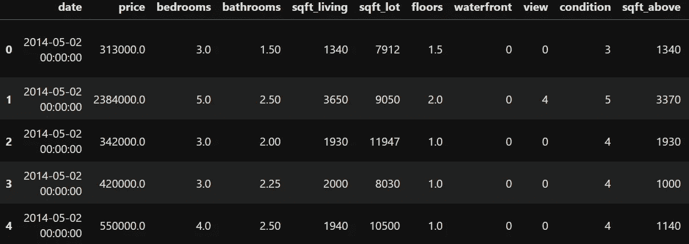
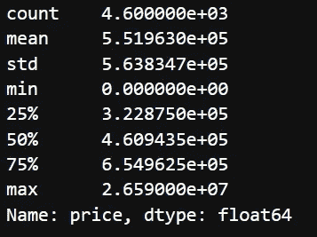
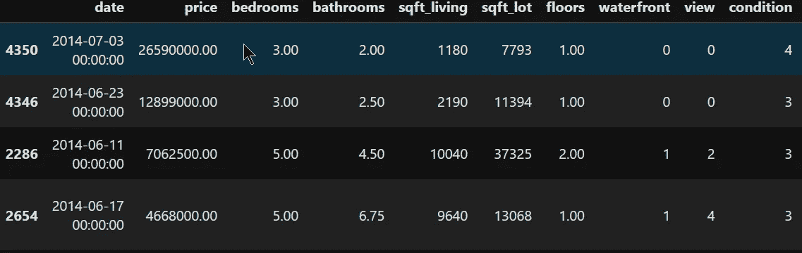
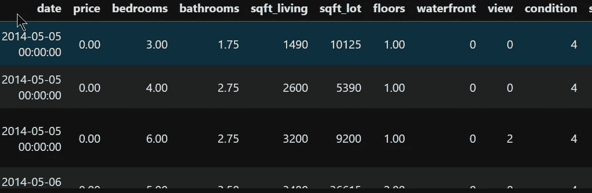

# 如何洞察数据(数据科学视角)

> 原文：<https://medium.datadriveninvestor.com/how-to-gain-insight-of-data-data-science-perspective-619c2966e178?source=collection_archive---------6----------------------->

Photo by [Rohan Makhecha](https://unsplash.com/@rohanmakhecha?utm_source=medium&utm_medium=referral) on [Unsplash](https://unsplash.com?utm_source=medium&utm_medium=referral)

嗨，欢迎回到另一篇文章，而在这篇文章中，我试图不要太技术性，因为我知道所有阅读我文章的人不仅仅是数据科学家，或者许多人想知道数据科学是什么以及它的影响。所以我用了一个稍微不同的话题，关于如何从数据中获得洞察力。如你所知，许多人似乎对数据感兴趣，尤其是数据科学，但当他们知道数据科学有多*复杂时，许多人就会回头。*

* [## 将定义 2020 年就业前景的五大数据科学和机器学习趋势|数据驱动…

### 数据科学和 ML 是 2019 年最受关注的趋势之一，毫无疑问，它们将继续发展…

www.datadriveninvestor.com](https://www.datadriveninvestor.com/2020/02/19/five-data-science-and-machine-learning-trends-that-will-define-job-prospects-in-2020/) 

我不会去评判那些转身的人，因为这可能不适合他们。有些人可能知道，要学习数据科学，他们应该理解数学并进行一些编程，但实际上另一件重要的事情是如何分析数据并找到一些见解，如何学习呢？

# 找一些数据

你当然应该找一些数据来检查，对不对？它可以是你每周的交易，或者是来自当前公司的数据，或者是你感兴趣的来自互联网的数据。任何数据都有用，因为如果我们想了解更多，首先从燃料开始，数据。有人说，数据是新的燃料，因为如果你使用石油作为燃料，有一天它会缺货，但数据，因为我们的人类和彼此连接，数据将会存在，从智能手机到计算机，所有这些东西收集了如此多的数据。我的建议是试着找到你最喜欢的数据，因为它会导致下一步。

# 获得你的好奇心

是的，作为一个数据科学学科，你应该找到或者拥有这个，好奇心。它可以在任何地方，这就是为什么我建议查看一些有趣的数据，它可以是政治，金融，或定价或任何你想要的，这是因为数据科学是基于数学，编程和**领域的知识。**这就是为什么在任何背景下，当你有一些数据时，你可以学习如何最大化它们，如果是描述性的，而不是预测性的。因此，获得你的好奇心，你将导致另一个步骤。

# 找到问题

这很重要，因为如果你不知道自己想做什么，好奇心就不会受到影响。找到一些目标，它可以是问题或者你不知道的问题并寻找它。只要确保你知道你想做什么，否则你会迷失方向，从而停止做这些事情。这可能就像我们多年来的交易，在互联网上销售的最多的产品是什么，类似的事情，你可以找到那个目标，只要找到它，你就会比以前更加专注。

# 尽量注意细节

在这一部分中，我认为在每一部分都注意细节是很重要的，这非常重要，因为你需要知道这些年来发生了什么变化，它会怎样，或者类似的事情。也许你需要从不同的角度来看，对于销售数据，也许你可以从卖方和买方的角度来看，它重要还是不重要。

House Price dataset

例如，我正在使用房价数据，目标是基于这些数据预测价格列。从很多角度来看，你知道价格取决于位置，房子有多大，有多少房间和楼层，诸如此类。所以我们试图知道如何预测，下一步是非常重要的，因为它会引导我们…

# 基于你的好奇心去寻找(探索性数据分析)

在你获得好奇心之后，你就知道你要先查哪一栏了，因为在这个例子中我们用的是房价，所以我们先根据价格来查。

Summary of price column

正如我们看到的，有一些数字，e+一些数字意味着 10 的某次方，如果 e+03 意味着 10 的 3 次方。但是你看到一些奇怪的数字了吗？是的，因为在 75%或第三个四分位数和最大值之间有一些巨大的数字，从 654962 到 26590000，这太疯狂了。为什么有些房子有这么贵的价格？让我们找出答案。我使用由贵到便宜的排序价格。

Top 4 expensive prices

从这几个 top 4 我们可以看出，最贵和第二是有一些差距的，所以看到这一点真的很重要。当有一些值远远超过其他值时，它可以被称为异常值。你可以获得另一种见解，为什么有一些房子，但价格是 0 根据上面的图片？让我们再检查一遍。

House with price 0

有这么多房子没有价格标签(这是肯定的，因为谁会期待免费的房子)。有 49 所房子没有这个。你对它有另一种见解。从有一些离群值，你应该处理一些与 0 房价。太好了，你已经开始了。

# 练习，练习，再练习

Photo by [Daniel Chekalov](https://unsplash.com/@dchuck?utm_source=medium&utm_medium=referral) on [Unsplash](https://unsplash.com?utm_source=medium&utm_medium=referral)

当然，你也可以去另一个专栏，对它进行研究，因为在我看来，数据科学家也应该对数据进行研究。在你获得所有这些洞察力之后，你可以选择下一步应该使用什么样的洞察力。恭喜你，你现在知道如何基于数据获得洞察力。

但这并不是旅程的终点，你**应该**越来越多的练习，用不同的数据来确保你对顿悟的感觉比第一次好得多。因为洞察需要所有分析数据的额外经验，并且知道那是通过下一步的**钥匙**。* 

*非常感谢你的关注，我希望我所分享的能够真正帮助你们获得洞察力，因为我知道这很难开始。*

*这个项目可以在我的 **Github** [*这里*](https://github.com/rizkysifaul/Workshop_Shopee) 下载，在 2020.pdf 2 月 22 日的 Workshop 查看材料，我如何找到一个见解和一些 Python 代码。关注我的**中**和 **Linkedin** [*这里*](https://www.linkedin.com/in/muhammad-sifa-ul-rizky-63525795/) 看到很有帮助就分享一下。*

*现在，我正在为数据科学开设一个导师项目，所以你可以问我关于你的数据科学之旅，以及我如何能帮上忙。所以如果你有兴趣，可以在***Telegram @ rizkyfaul***和 **Linkedin 上问我。***

*下一篇文章再见。快乐学习，不断分享！*