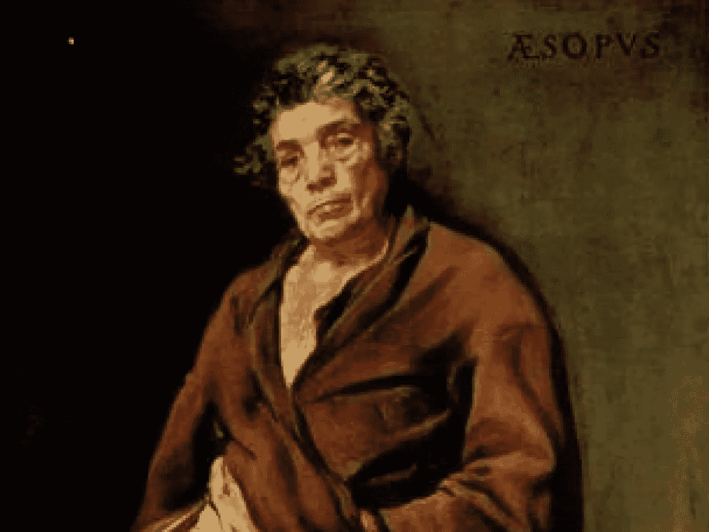
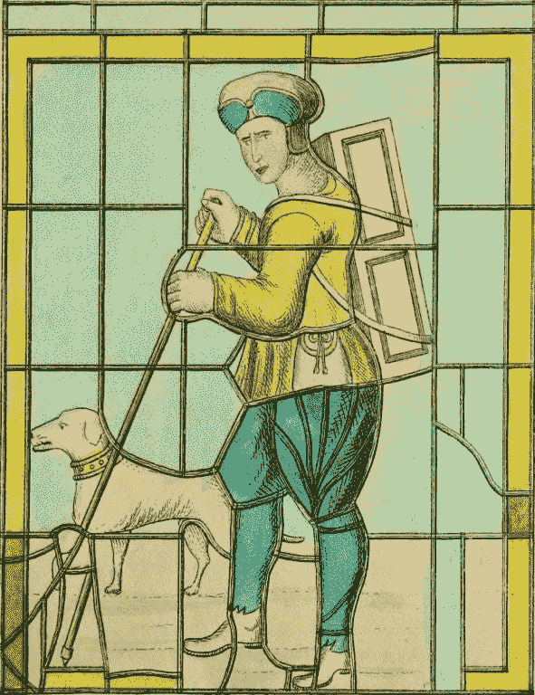

# 如何获得智慧？读一些伊索寓言

> 原文：<https://medium.datadriveninvestor.com/how-to-gain-wisdom-read-some-of-aesops-fables-fcd011976313?source=collection_archive---------4----------------------->

# 如何获得智慧？读一些伊索寓言

每个人都想获得智慧。智慧是人类所拥有的最伟大的品质之一。所以，寻找它，抓住它，分享它，珍惜它。为什么？因为它将帮助你在波涛汹涌的水域中航行，它将把你从绝望的深渊中提升起来，它将帮助你正确看待一切，最终它将把你变成你自己故事中的英雄。但是，你如何获得智慧呢？我建议你从读一些伊索寓言开始。

除了《新约全书》之外，没有任何一部希腊文作品比《伊索寓言》流传得更广、更广为人知。2500 多年来，伊索寓言一直以最有趣、最愤世嫉俗的方式向各个年龄段的人传授宝贵的人生经验。

# 想听一个白手起家的故事吗？见见聪明的傻瓜伊索

伊索的生活读起来就像他的一个寓言。人们认为伊索生活在公元前 620 年至 560 年之间。他出生时是一名奴隶，据说他非常丑陋，身体有些畸形，这还不够不幸，他生来就是哑巴，一句话也说不出来。从积极的一面来看，他聪明、足智多谋、善良。他的生活有了转机，因为他拯救了一个陷入困境的伊希斯女神的女祭司，她在路上迷路了。

From Slavery to Greatness — Meet Aesop who is also known as the Wise-Fool

他对这一善举的神圣回报是演讲的天赋和用希腊语构思和阐述智慧故事的非凡能力。他讲故事的天赋，他的智慧和机智让他真正自由了。伊索同时获得了自由、名誉和财富。对一个丑陋畸形的哑巴来说还不错。他获得了某种名人的地位，与当时最杰出和最有权势的人物交往，主动提出解决他们的问题，给他们提出合理的建议，并沿途讲述寓言。但最终，正是他的成功导致了他的毁灭。

 [## 成功人生的 25 种自我提升方式|数据驱动的投资者

### “我活得越久，学到的就越多。学的越多，体会的越多，知道的越少。”―米切尔·莱格兰德时间到…

www.datadriveninvestor.com](https://www.datadriveninvestor.com/2019/03/12/25-self-improvement-ways-for-a-successful-life/) 

作为一个讲故事的人，伊索过着优裕的生活，从一个城市到另一个城市去表演他的艺术，一路上名利双收。当他到达特尔斐时，他意识到他的机智和讽刺在特尔斐的观众中并不奏效，他们拒绝为他的表现给予任何奖励。由于对这种冷处理感到失望和烦恼，他抨击和嘲笑特尔斐人，把他们比作浮木(从远处看是有价值的东西，但近看就发现一文不值。)他应该就此打住，但继续他的长篇大论，意识到他的侮辱让特尔斐人多么愤怒时已经太晚了。他们把他赶出了城，但他不知道的是，他们在他的行李中藏了一个阿波罗神庙的金杯，当他离开这座城市时，他被逮捕、指控、判处死刑，并被毫不客气地推下悬崖处死。

这个故事的寓意:讲故事和机智可以让你自由，但也可以让你从悬崖上摔下来。

# 想在糟糕的情况下生存？跟着猫，不要跟着狐狸

我不知道伊索蕾死前的最后想法是什么，但我推测他可能已经背诵了自己不久前写的*狐狸和猫的寓言*。

> *狐狸和猫*
> 
> 一只狐狸正在向一只猫吹嘘它逃脱敌人的巧妙方法。他说,我有一整套诀窍，包括一百种逃避敌人的方法。
> 
> “我只有一只，”猫说。但是我总的来说可以应付。
> 
> 就在那时，他们听到一群猎犬的叫声向他们走来，那只猫立刻窜上一棵树，藏在树枝里。
> 
> 这是我的计划，猫说。你打算做什么*？*
> 
> 狐狸先是想了一个办法，然后又想了一个，当他正在辩论的时候，猎狗越来越近，最后，慌乱中的狐狸被猎狗追上，很快被猎人杀死了。
> 
> 一直在一旁看着的猫小姐说，一条安全的路比一百条靠不住的路要好。
> 
> *伊索*

# 想听一个真正鼓舞人心的故事吗？见见斯瓦夫汉姆的彼得拉尔

请允许我带你去英格兰诺福克的一个叫斯沃夫汉姆的小村庄，在那里你会听到斯沃夫汉姆的传说。

> *斯瓦夫汉姆的小贩*
> 
> 传说从前在诺福克郡的斯沃夫汉姆住着一个小贩，他梦见如果他去伦敦桥，站在那里，他会听到一些非常令人高兴的消息，起初他对此不屑一顾，但后来，他的梦被重复了一遍又一遍，他决定试试这个问题，因此他去了伦敦，站在桥上看了两三天，但没有听到任何可能给他带来安慰的消息。
> 
> *最后，碰巧一个店主，注意到他徒劳的立场，看到他既没有出售任何商品，也没有要求任何施舍，走到他面前，最诚挚地请求知道他想要什么，或他的业务；小贩诚实地回答说，他梦见如果他来到伦敦，站在桥上，他应该听到好消息；店主热情地点燃，问他是否是这样一个傻瓜，这样一个愚蠢的差事旅行，并补充道:*
> 
> *“我告诉你，乡下人，昨晚我梦见我在诺福克郡的斯沃夫汉姆，一个我完全不知道的地方，我以为在某个果园的一个小贩的房子后面，在一棵大橡树下，如果我挖我会发现一个巨大的宝藏！他说:“现在你认为我是个傻瓜，为了一个愚蠢的梦而走了这么远的路吗?”？不不不我更聪明。因此，好家伙，向我学习智慧，让你回家，管好你的事。”*
> 
> 小贩注意到他所说的话，他梦见的事，知道这些事与他有关，很高兴听到这样令人高兴的消息，迅速回家，挖到了一笔巨大的财富，他因此变得非常富有；和 Swaffham 教堂大部分倒下，他开始工人和纠正它最华丽的，在他自己的费用；直到今天，有一个法令，他的包在他的背上，他的狗在他的脚跟；直到今天，那个城镇的大多数旧玻璃窗、酒馆和啤酒馆里，也以同样的形式保存着对他的记忆。”
> 
> 来源:西德尼·哈特兰——英语日记和其他民间故事(伦敦，加州。1890 年)，这反过来又指的是亚伯拉罕·德拉·普雷姆的日记——1699 年。在 Creative Commons CC-By-SA-4.0 许可下提供的文本。

*在这段视频中，我将带你去英国诺福克的斯沃夫汉姆村，斯沃夫汉姆的 Peddlar 的传说就是在这里诞生的。* *跟我来……*

这个英国故事引起了我的共鸣，因为它的坦率和从中散发出的寓意。

我自己对这个故事的思考是，这个故事的寓意如下:

*   倾听你内心的声音，你的直觉，你的直觉，你内心的指南针；
*   不要害怕被嘲笑。耐心点。有勇气。有韧性。有信仰；
*   鼓起勇气去实现你的梦想，记住千里之行始于足下；
*   毫无疑问，旅途会充满不确定性、危险、惊喜和一些有趣的遭遇；
*   注意了。听听这些信号。倾听你在旅途中收到的信息和提示。可能会有令人高兴的消息等着你；
*   最终，你的勇气、努力和信念会得到回报，成功会向你涌来，富足会流入你的生活；
*   当幸运降临在你身上时，不要紧紧抓住你所追求的财富不放，而是要保持一种健康的眼光，去看待它的治愈能力，以及它将给予你实现你的目标和在你周围传播美德的能力。

我亲爱的同伴，这就是你的追求！

如果你喜欢这篇文章，你可以在 [Instagram](https://www.instagram.com/author_joanne_reed/) 、 [Pinterest](https://www.pinterest.co.kr/rlreed71/) 或[脸书](https://www.facebook.com/AuthorJoanneReed/)上关注我，或者你也可以喜欢:

我的书《这是你的追求》的音频版本已经推出。请随意查看并使用此[特别促销代码](https://www.audible.com/pd/B08LJQJWRW/?source_code=AUDFPWS0223189MWT-BK-ACX0-219667&ref=acx_bty_BK_ACX0_219667_rh_us)

**访问专家视图—** [**订阅 DDI 英特尔**](https://datadriveninvestor.com/ddi-intel)

Joanne Reed The Author
Author of “This Is Your Quest”. You can’t buy happiness but you can buy books. Your mission, should you wish to accept it is to experience happiness