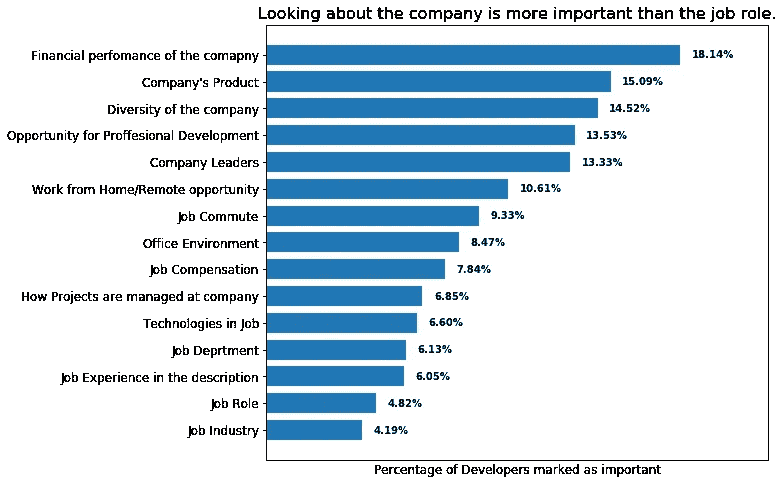
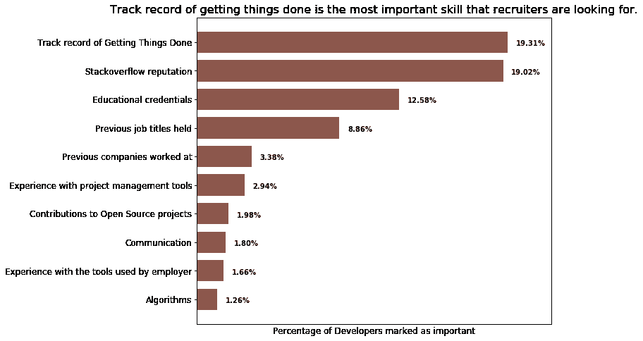
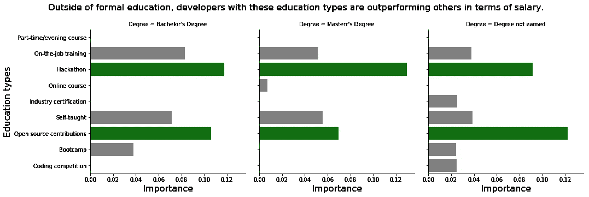
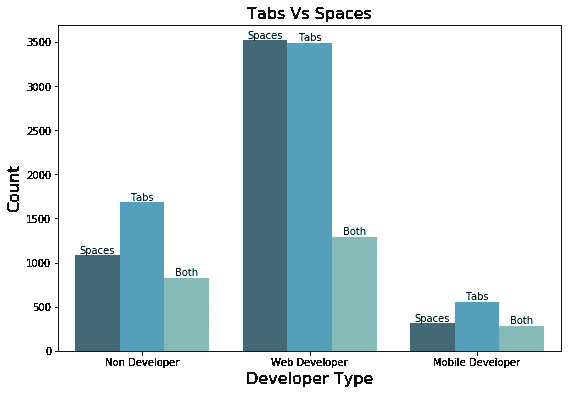

# 如何获得一份开发者的工作？

> 原文：<https://medium.datadriveninvestor.com/how-to-get-a-job-as-a-developer-3397d48994f0?source=collection_archive---------14----------------------->

## 使用 Stack Overflow 的开发人员调查数据的数据驱动方法

## 介绍

作为每一个数据科学的有志之士，我一直渴望与真实世界的数据打交道，并给出对真实世界场景的见解。于是，我拿着 Kaggle 的 Stack Overflow 开发者调查结果来回答如何获得一份开发者的工作？

关于如何找到一份开发人员的工作，有这么多的建议和资源？我们来看看有什么数据推荐。

这些是我想利用这些数据解决的问题:

1.  当你申请工作时，最重要的是什么？
2.  招聘者寻找的必备技能是什么？
3.  除了正规教育，还有哪些教育类型给了开发者优势？
4.  最后，让我们来回答制表符和空格的争论。

调查数据涵盖了来自 213 个国家和地区的 64，000 篇评论。该调查旨在了解与软件开发和数据分析相关的工作的多个方面。作为调查的一部分，共有 150 多个问题。

## 当你申请工作时，最重要的是什么？

*调查问题问开发者:当你评估潜在的工作申请时，以下各项对你来说有多重要？*

下面是选择某个特定事物为重要的开发人员百分比的降序排列。

通常，在申请之前，我倾向于花更多的时间阅读职位描述，而不是公司介绍。

但是，当前开发人员的前 5 名选择都与公司有关，如公司的财务业绩、产品、多样性和职业发展机会。与特定工作相关的信息，如工作角色、部门和技术不太重要。

 [## 在不稳定的数字时代生存|数据驱动的投资者

### 如果你是一名计算机科学家，你可能已经注意到新的框架不断出现。编程…

www.datadriveninvestor.com](https://www.datadriveninvestor.com/2020/02/26/surviving-in-a-digital-age-of-instability/) 

所以，在申请之前要了解这些公司。这听起来可能与我们现在的流程相反。这就是为什么我在谷歌上搜索了更多关于它的信息，发现了一个极好的[博客](https://www.breakinto.tech/blog/2015/9/8/what-are-google-apple-and-facebook-really-like)支持这一说法。

## 招聘者寻找的必备技能是什么？

*调查问题问开发商:恭喜！你刚刚被任命为跨国高科技公司 Globex 的技术招聘主管。这份工作有一个角落办公室，你有一个经验丰富的招聘人员供你使用。他们想知道在招聘软件开发人员时应该优先考虑什么。以下各项在 Globex 招聘流程中的重要性如何？*

下面是开发人员中认为某项技能重要的百分比的降序排列。

一般来说，我们认为面试意味着破解数据结构和算法问题。这是一项重要的技能，但是仅仅这一项并不能让你被录用，因为招聘人员并没有把它作为一项重要的招聘技能。

被录用最关键的能力是“把事情做好”,所以在你的简历、面试中展示你的成就，并建立一个活项目组合。

## 除了正规教育，还有哪些教育类型给了开发者优势？

*调查问题问开发人员:除了您的正规学校教育之外，您还做过以下哪些事情？*

这里，x 轴刻度是线性回归模型的系数。如果你不了解规模，这没关系。

关于他的可视化，我们唯一关心的是那些绿色条，这是最重要的教育类型，黑客马拉松和各种正式教育(学士、硕士、非学位)的开源贡献。这些教育类型对开发人员薪资的影响最大。

这个结果也验证了我们的第二个结果。因为在所有的教育类型中，黑客马拉松和开源贡献最能展示你“把事情做好”的技能。

## 制表符 Vs 空格？

在 web 开发者中，偏爱 space 和 tab 的人比例几乎相同，但略有差异，Spaces 胜出。在移动开发者和非开发者中，Tabs 胜出。

## 结论

以下是这篇文章的摘要。

1.  在申请工作之前，先了解一下这家公司。从长远来看，通过筛选公司可能有助于节省申请过程中的时间。
2.  最重要的招聘技能是“完成工作的记录”。所以，在你的简历和面试中展示你完成工作的能力。
3.  在正规教育之外，黑客马拉松和开源贡献比其他教育类型对工资有更大的影响，因为它展示了你“把事情做好”的技能。因此，在注册任何教育类型之前，问问你自己，在完成之后，我将能够根据你喜欢追求的任何教育类型的选择实施什么。

要了解更多关于这个分析的内容，请点击这里[查看我的 Github 链接](https://github.com/kalyanpesala17/stackoverflow)