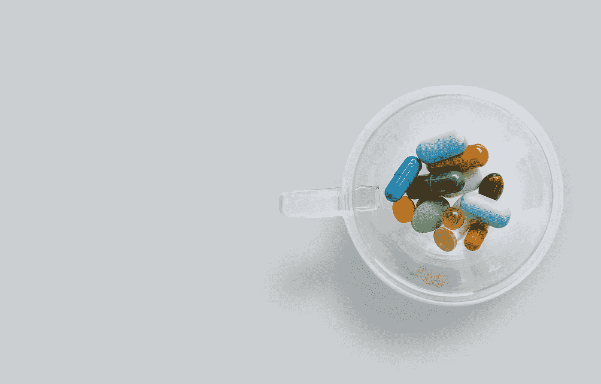

# 如何从健康数据中获取实际价值

> 原文：<https://medium.datadriveninvestor.com/how-to-get-actual-value-from-health-data-3a5563e8d263?source=collection_archive---------20----------------------->

Source: [Unsplash](https://unsplash.com/)

人类产生的数据量呈指数级增长。据 IDC 估计，仅在 2021 年，就将产生约 75 万亿吉字节的数据，即 75 吉字节。在数据科学的帮助下，金融、监控和社交媒体公司等分析这些信息，并在未来许多年为其业务带来额外的好处。尽管如此，并非所有行业都同样擅长适应和利用数据的力量来推动业务发展。

医疗保健行业产生了大量数据，生物技术公司可以利用这些数据为医院和研究实验室提供先进的医疗工具。但是，这个行业由于其非结构化的记录管理、大量的研究和独特的医疗案例而相当保守。有时，在看似相同的病例中，几乎不可能使用相同的治疗方法。

然而，科学家、研究人员和企业一直在努力从健康数据中提取有用的信息，并显示出一些积极的结果。让我们放大今天最有效的实践。

# 体格检查

根据 T2 国家科学、工程和医学科学院的研究，美国每年有 1200 万成年人被误诊。这种情况充满了危险的健康后果。据 [BBC](https://www.bbc.com/future/article/20180523-how-gender-bias-affects-your-healthcare) 报道，美国每年有 4 万到 8 万人死于诊断错误引发的并发症。

在诊断方面，数据科学可以真正改变游戏规则。该市场提供了一整套仪器来快速分析 X 射线、CT 扫描、乳房 X 线照片和其他类型的图像。机器学习算法可以学习解释图像，识别模式，检测癌症，骨骼损伤，内部器官异常等。

数据科学家走得更远，使得从一种图像生成另一种图像成为可能。在医疗保健中，当患者需要在计划放射治疗时必须进行的多种程序(如计算机断层扫描和 MRI)时，这可能是有用的。为了计算辐射剂量，人们必须知道 X 射线将穿过的所有组织的渗透性。

为了准确评估辐射区的轮廓，最好使用核磁共振扫描提供的信息，这对人类无害。然而，MRI 图像没有提供关于组织的 X 射线渗透性的任何数据——这些信息只能通过 CT 扫描获得。然而，计算机断层扫描是基于有害的 X 射线。在 CT 扫描中，各种软组织的轮廓不太明显，因此患者必须同时做 CT 和 MRI，然后将两张照片结合起来。

为了降低辐射暴露水平，特别是如果患者是儿童，并削减手术计划的总成本，科学家们开发了一种特殊的方法，从 MRI 数据中生成合成 CT 图像。一个人工智能驱动的程序学习根据现有的 MRI 扫描生成 CT 扫描。因此，患者只需经历一个过程，而不是两个过程，这减少了检查的时间和成本，最重要的是，减少了辐射剂量。

另一个案例来自[斯坦福大学](https://arxiv.org/abs/1707.01836)，那里的数据科学家开发了一个基于心电图结果检测心律问题的模型。测试表明，该算法比心脏病专家更快地发现异常

# 预测分析

预测分析是医疗保健的主要趋势。通过分析数百万人的健康数据，人们可以发现相关性和模式，并找出为什么某些疾病在特定地区比其他地区更常见。然后，根据收到的信息，人们可以确定风险群体，并在预测的疫情爆发前采取预防措施。

Source: [Unsplash](https://unsplash.com/)

这就是我们开始开发一种预测药物或非药物耐药性癫痫的[解决方案](https://quantumobile.com/case-studies/drug-resistant-epilepsy-prediction/)时所做的。全世界大约有 6500 万人患有这种疾病。有时，几年过去了，医生们才找到合适的药物来帮助他们的病人。为了开发一个预测耐药性的系统，我们使用了 450，000 名癫痫患者的历史数据。利用机器学习，我们创建了一个预测耐药性的算法，准确率为 82%。像这样的预测模型可以帮助医生更快更准确地找到正确的药物。

这是预测分析成功实施的另一个案例。2017 年，总部位于费城的 Penn Medicine 医疗保健系统开始从患者电子病历中收集数据。在过去的三年里，它一直在使用一种机器学习算法来进行预测估计。基于 30 个因素得出的分数有助于医务人员对未来六个月做出预测。最终，该系统在入院时识别出具有最高不良后果风险的患者。这有助于医生认识到这些模式，并积极参与其中。

因此，有了足够多的高质量历史数据，你几乎可以预测医学中的任何案例——从药物处方到特定治疗的结果。

 [## 一瞬间学会数据科学！？数据驱动的投资者

### 在我之前的职业生涯中，我是一名训练有素的古典钢琴家。还记得那些声称你可以…

www.datadriveninvestor.com](https://www.datadriveninvestor.com/2020/07/23/learn-data-science-in-a-flash/) 

# 药房

制药公司花费高达 26 亿美元开发一种新药，需要 12 年时间才能将其投放市场。但是现在，随着各种医疗保健数据处理应用程序的出现，这变得更加容易。药房数据分析允许科学家在几周内处理数十万个临床试验结果，模拟人体对特定药物的反应，并将药物或疫苗的开发速度加快多达一年。数据科学和机器学习是这里的推动者，已经彻底改变了制药行业的 R&D。

2020 年，英国初创公司 Exscientia 和日本公司 Sumitomo Dainippon Pharma 宣布，他们的机器学习算法发明了一种药物分子，将用于治疗强迫症。研究人员表示，该算法仅用了 12 个月就开发出了这种药物，而相比之下，通常需要 5 年才能进行人体试验。

Source: [Unsplash](https://unsplash.com/)

# 研究工作的汇总

数据抽取是自然语言处理的一项重要任务，目的是发现和抽取隐藏在非结构化临床数据中的重要知识。每天，数以千计的新医学文章发表在互联网上，描述疾病的本质和治疗方法。每一项科学工作无疑都对医疗保健的发展做出了巨大贡献；每一个新发现都让人类更接近战胜另一种疾病。

然而，一枚硬币有两面。科学文章有效利用的主要障碍是数量太多，一个关键词搜索不够。因此，研究人员需要昂贵且耗时的文本审查。2020 年，谷歌与微软、美国国家医学图书馆和艾伦人工智能研究所合作，发布了新冠肺炎开放研究数据集(CORD-19)。它将使全球人工智能社区能够使用文本和数据挖掘方法，以及 NLP 技术来寻找解决方案，以应对疫情。

该数据集由 29000 份与新病毒和更广泛的冠状病毒家族相关的文件组成，其中 13000 份已经过处理，以便计算机可以读取基本数据、作者信息以及他们的从属关系。

# 挑战

就像任何新兴趋势一样，数据科学正面临着某些挑战。在医疗保健领域，伦理问题显得尤为突出。[飞利浦的未来健康指数 2019](https://images.philips.com/is/content/PhilipsConsumer/Campaigns/CA20162504_Philips_Newscenter/Philips_Future_Health_Index_2019_report_transforming_healthcare_experiences.pdf) 研究发现，数据隐私是数字健康采用的一个重大障碍。人们想知道他们上传到计算机进行分析或发送给医生的信息有多安全。

当每个人都明白创新不是为了取代医务人员时，人们会更容易接受医疗保健的变化。数字技术只帮助专业人士做出最准确、最明智的决策。神经网络可以根据症状识别疾病，并建议处方选项，但患者可以放心，医生仍然有最后的决定权——只有医疗保健专业人员有权做出最终诊断，并确定必要的治疗。

医疗数据科学不仅面临伦理问题，还面临技术问题。通常，缺乏完整、一致、有代表性、预先标记的数据，这些数据可用于训练机器对材料进行分析和分类并做出预测。健康信息仍然是手工收集和处理的。这是一个费力、单调、耗时的过程，而且往往缺乏资源。

即使有足够的数据，在实现现成算法的阶段也会出现问题。许多疾病会随着时间的推移而演变，常见的疾病可能会表现出各种各样的症状。如果系统面临一个不寻常的情况，预测它将如何表现是不可能的。大多数算法只能通过一个最终的裁决——是或不是，规范或病理。还没有一个算法可以报告说:“我从未见过这个，也不知道它是什么。”因此，应该教会计算机不仅给出答案，还要评估结果的可靠性。

# 健康数据的未来是什么？

新技术的部署可能是一个漫长的过程，会因伦理、法律和财务问题而变得复杂。然而，数据科学在医疗保健领域如此受欢迎的事实证明，它确实有助于我们更有效地处理问题。政府机构已经开始接受这一点，在公共资助的项目中数字化医疗保健，同时大公司继续雇用数据科学专家。

据 [CB Insights](https://www.cbinsights.com/research/report/healthcare-ai-in-numbers-q1-2020/) 报道，每个月，投资者都会发现越来越多的公司和初创公司致力于基于人工智能的医疗保健解决方案。2020 年第一季度，全球医疗保健人工智能创业公司的风险投资金额超过 9.8 亿美元。研究人员预计，创新将很快成为医生日常工作的一部分，并有助于提高世界各地的生活质量。

**访问专家视图—** [**订阅 DDI 英特尔**](https://datadriveninvestor.com/ddi-intel)