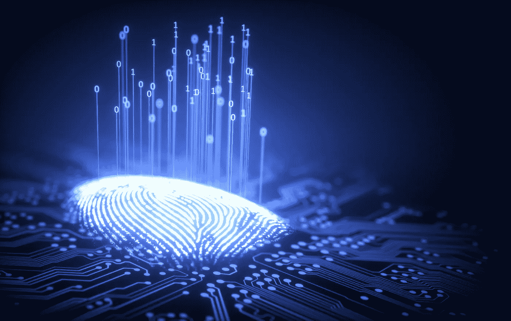

# 2020 年如何办卡及其他关于数字身份的思考。

> 原文：<https://medium.datadriveninvestor.com/how-to-get-carded-in-2020-and-other-thoughts-on-digital-identity-91337dee76a7?source=collection_archive---------10----------------------->

一个女人走进一家酒吧。这不是一个笑话，但它确实为这篇关于数字身份的文章奠定了基础。如果你想知道数字版的“出示身份证”是什么样子，请继续关注。我们很快会谈到这一点，甚至更多。

首先:什么是数字身份？在 Tech on Reg 播客的第 7 集中，我们对这一概念进行了长时间的深入研究——以及其中的一些绊脚石。

 [## 分散金融的出现|数据驱动的投资者

### 当前的全球金融体系为拥有资源、知识和财富的人创造了巨大的财富

www.datadriveninvestor.com](https://www.datadriveninvestor.com/2019/03/14/the-emergence-of-decentralized-finance/) 

我的嘉宾[大卫·伯奇](http://www.dgwbirch.com/)，一位国际公认的数字身份思想领袖，将数字身份定义为现实和虚拟身份之间的桥梁——现实世界中的事物和它们在虚拟世界中的“影子”之间的桥梁。现实世界中的事物映射到数字身份，数字身份映射到虚拟世界中的事物。根据这一定义，一个人可能有多个数字身份，这些数字身份中的每一个都映射到多个虚拟现实。

迷茫？抬起下巴。一会儿我们将通过真实世界的例子来探索这是如何发生的。在此之前，让我们先做好准备。

数字身份是目前影响金融科技的最重要的话题之一。为什么？它解决了一个难题——分配和识别身份，同时保护人们(和企业)的私人信息……隐私。

例如，当我们考虑支付时，问题不在于双方之间交易的电子表格。那是蛋糕。难的部分是数字身份组件。那不是蛋糕。那是…嗯…那是个难题。

英国央行行长马克·卡尼指出，缺乏有效的数字身份基础设施是在线金融服务和一切在线事物摩擦背后的罪魁祸首。

尽管发出了警告，但金融科技——作为一个行业——未能注意到这一概念，让数字身份不再被提及。结果是在让金融服务业更好地为整个社会服务方面陷入僵局，包括降低中介成本和提供更具包容性的服务。

我认为这些是非常重要的(也是基本的)要检查的框，所以让我们更深入地探究为什么会发生这种情况。

一方面，没有人希望人们乱花他们的钱，所以监管是必要的。另一方面，监管者很难找到一个可行的折中解决方案，在不完全压制创新的情况下提供结构(没有人知道如何搞砸创新和拖延事情，比如立法者和律师，对吗？我超级正确。)现在，我们处于最糟糕的中间地带:正好介于上个世纪的监管和下一个世纪的监管之间。

以 KYC(了解你的客户)为例。目前的工作方式是，我们建立一堵墙，把坏人挡在外面，同时让里面的人提交各种报告。

这产生了可以想象的最糟糕的系统。举例来说，想想欧洲刑警组织主任罗布·温赖特(Rob Wainwright)的话，“银行每年花费 200 亿美元来管理合规制度……我们每年在欧洲没收 1%的犯罪资产。”

一个。百分比。

我认为这个系统已经崩溃了。伯奇指出，如果我们今天从零开始，我们会建立一个完全不同的系统。重点不会是把人们限制在我们无法监控他们在做什么的程度。所做的只是迫使罪犯在系统之外工作——用现金(有趣的事实:流通中的 100 美元钞票比 1 美元钞票多)。

将每个人都纳入系统将使我们能够利用人工智能(AI)和机器学习(ML)等新技术来跟踪坏人并加以控制。

# 实现数字身份的“金发女孩”框架

现在，我们面临着要么全有要么全无的局面。到目前为止，美国还没有尝试建立一个数字身份框架。虽然一些私人玩家正在试图解决这一需求，但它在推动身份盗窃、猖獗的欺诈和天文数字的中介成本方面比任何东西都更有效。

另一方面，中国已经一头扎进了一个统一的身份框架中，这个框架可以用于任何事情，这也导致了社会信用评分。也不理想。

最强有力的方法似乎是对一个框架进行逆向工程，该框架支持我们希望数字身份做的事情，并利用现有的和新兴的身份验证和授权技术来实现我们的目标。

这也意味着我们需要停止将隐私和安全对立起来。

隐私和安全不是一个非此即彼的命题。你可以拥有没有隐私的安全，但除非你拥有安全，否则你不可能拥有隐私。任何数字身份基础设施都必须在保护隐私的同时提供安全性。换句话说，人们必须保持对自己隐私的控制。这需要对公众进行一些教育，他们不一定理解这两者之间的区别或联系，尤其是当涉及到技术的作用时。

如果消费者不明白，你认为立法者明白吗？剧透:他们没有。

消费者和立法者都需要一本关于加密的好处及其在数字身份、隐私和安全方面的能力的入门书。我们需要改变无知的观点，我们都只是索引卡上的信息，随风飘动。立法者和消费者不一定需要知道引擎盖下发生了什么，只要他们明白我们可以提供控制和便利的要点。

# 那么，消费者对数字身份是怎么看的呢？

现在，他们很困惑。Mitek 最近的一项研究发现，只有四分之一(25%)的消费者认为他们完全掌握了数字身份的概念。更糟糕的是:超过一半(65%)的人说他们每天都有某种形式的数字身份。那么是什么原因呢？

这实际上反映了供应商和消费者(以及立法者)之间的知识差距，这阻碍了采用率。很多不确定性都围绕着安全性；大多数消费者不相信现有的安全措施足以保护他们的个人信息安全。

这是一个主要问题。但不仅仅如此。

消费者想要方便。我们的目标应该是建立一个满足便利性 ***和*** 的基础设施，确保安全和隐私正常工作。苹果的 TouchID 就是这里的一个典范。在 TouchID 之前，生物识别被外行人视为直接来自詹姆斯·邦德电影的东西。*“快，邦德！我们需要你的指纹来发射核导弹！”*

苹果非常善于将生物识别技术的概念从安全技术转变为便利技术。用指纹解锁手机很简单。指纹登录你的银行 app*方便*。安全性和隐私是存在的，但这发生在引擎盖下，客户不知道背后的螺母和螺栓。

我们需要以同样的方式处理数字身份。

消费者也想要控制。回到 [Mitek 的报告](https://www.miteksystems.com/files/docs/Drivers-challenges-digital-identity-2020-report.pdf)，消费者欣赏数字身份的便利，但希望对最终与应用程序共享的个人信息有更多的控制权，特别是生物特征信息。超过四分之三(75%)的人认为数字身份比使用实体文件更快更简单。然而，只有 17%的受访者表示，与向某人出示驾照等更传统的方法相比，他们更喜欢生物识别身份验证。

# 互操作性:下一个前沿

互操作性是数字身份的一个主要症结。目前，我们在数字身份的互操作性方面缺乏全球标准。问题的一部分是对安全“剧场”的关注以进入酒吧这个简单的行为为例。

如果我走进爱尔兰的一个角落里的小酒吧，出示我的伊利诺伊州驾照，酒吧的保安就没有办法证实我的外国身份证是真实有效的。他只是简单地看了看，然后做出了一个游戏时间的决定，要么说“享受你的夜晚，达拉”要么说“对不起，我不能确认这是真的。”如果我们诚实的话，大多数情况下它会在第一个场景中结束。

那到底是什么？这就是复选框的样子。保镖知道法律要求他核实任何进入的人都是一定年龄的。只要他在安全措施中“发挥他的作用”，一切都好。抛开任何曲球(即我的外国 ID)。

监管者和立法者也是这出戏的同谋。他们已经习惯了检查某些框(这个栏坚持检查 id 的安全措施，所以不需要采取惩罚措施)。只要复选框被选中，就没有人需要关注是否实现了真正的安全性。

如果我们深入了解我们在上述场景中真正想要实现的目标，我们可以找到更好的方法来实现它。实际上，我们依赖于建立在关系基础上的身份认同。保镖不是问我“你超过 XX 岁了吗？”他真正想问我的是“你有*证明*你已经超过 XX 岁，这样我就可以在你被证明撒谎的情况下把责任转移到其他地方。”

如果把容易出错的“梳理”人的方法去掉，把过程数字化，会怎么样？它可能看起来像这样:

1.  酒吧保安要求我确认我是否超过 21 岁
2.  我拿出我的 iPhone，它提示我一个问题:“你希望和欧玛利的酒吧分享你的年龄信息吗？”
3.  我点击“是”,在 TouchID 上按下我的指纹，以确认我，达拉·塔考斯基，正在向酒吧的系统提供验证我年龄的许可
4.  [在幕后，会发生以下情况]:

a.酒吧的系统(可能通过保镖的 iPhone)与我的手机通信，它需要证明达拉·塔尔夫斯基超过 21 岁的凭证。

b.我的手机连接到我的一个应用程序，该应用程序有我的年龄信息，可以提供一个加密令牌(没有个人身份信息)来表明我超过 21 岁。

c.该加密令牌被发送到保镖的 iPhone，iPhone 验证该令牌

5.保镖挥手让我进去，说，“祝你晚上愉快，达拉。”

密码术提供了多种方式来安全地实现数字身份的互操作性，同时维护隐私。让监管者(和其他所有人)走出他们的舒适区，让新技术和新系统能够实现这一点，将是等式的一部分。将需要普及教育。我们需要让人们接受这样一种观点，即检查 Apple Watch 或智能手机比通常的开箱检查方法更方便、更安全、更客观。我们必须向消费者灌输，这将使他们对自己的隐私有最佳的控制。

要收听《技术在线:数字身份》第七集，请查看苹果播客、SoundCloud 或任何您喜欢的流媒体网站。