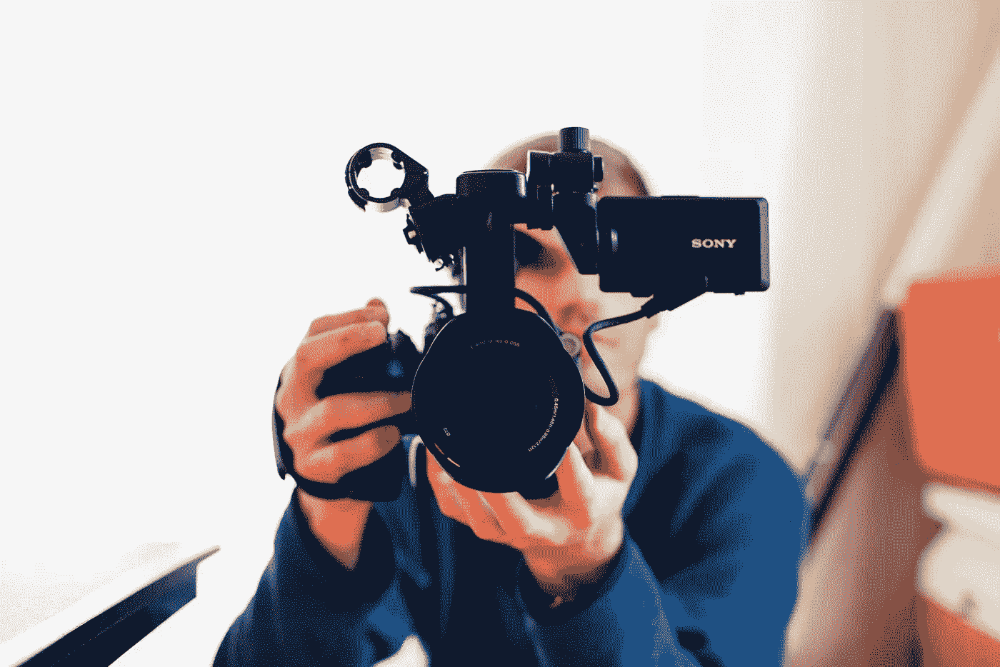
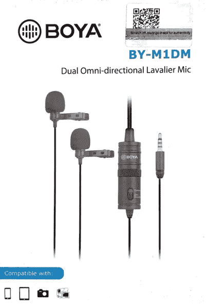
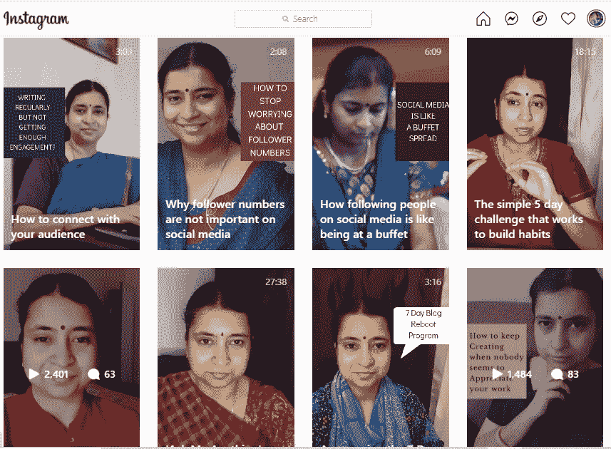

# 如何轻松制作视频

> 原文：<https://medium.datadriveninvestor.com/how-to-get-comfortable-with-making-videos-411806ab3289?source=collection_archive---------37----------------------->

## 帮助你开始的 9 个技巧

Photo by [Seth Doyle](https://unsplash.com/@sethdoylee?utm_source=unsplash&utm_medium=referral&utm_content=creditCopyText) on [Unsplash](https://unsplash.com/s/photos/video?utm_source=unsplash&utm_medium=referral&utm_content=creditCopyText)

制作视频对我来说不是很自然的事情。我只是一直觉得写下我的想法更舒服，退一步，等待读者参与其中。

但是一年多以前，我开始涉足为我的社交媒体频道制作视频的艺术，特别是在我的 Instagram 页面上。

那是我最投入的观众发现我和我的作品的地方。

从我在 Instagram 直播视频上试手开始。我承认，当想到做一个现场视频的想法时，我非常焦虑，甚至给一个经常做视频的创作者发了一条信息。

我收到了一个非常简短的回复，说我应该停止想太多，点击“直播”按钮。虽然我对这种不屑一顾的回答感到有点刺痛，但我还是深吸了一口气，告诉自己我没有什么可失去的。

最坏的情况会是什么？我是说，除了明显的。

我可能会在镜头前笨手笨脚，看起来像个十足的工具，最后会惹恼每一个跟着我的人。

*我可以不停地用“嗯，啊，嗯”来给每三个句子加标点。*

*我可能会变得太温柔或者太大声。*

我可能最终根本不看镜头，而是更担心谁在看我直播。

新闻快讯:我已经设法做到了以上所有的事情，有时还会去做。

然而，我坚持了下来，随着时间的推移，我意识到，我做得越频繁，我就越能坦然面对自己的缺点。

如果你感兴趣的话，这里有一些非常基本的提示会对你有所帮助。

## 深呼吸

不，这不是瑜伽课，但相信我，在视频开始前深呼吸真的很有帮助。在你打开相机之前的几分钟内，集中注意力，放松自己。

## 挑选一台像样的相机或一部好的智能手机

你不需要花哨的设备或昂贵的软件。例如，我所有的视频都是用笔记本电脑的内置摄像头或三星 M31 的前置摄像头拍摄的。(没有，我没有 iPhone)；)

*   三脚架是可选的，但值得一试，如果你有预算的话

## 选择一个光线好的地方

理想情况下，在自然光下拍摄会很棒，这样你就能在镜头前恰当地出现。

如果你需要在晚上拍摄，如果你房间的灯光不够亮，可以买一个简单便宜的环形灯。

*我的环形灯配有一个合适的三脚架和一个智能手机支架，所以这是一种三合一的交易。

## 说话的时候看着镜头

这似乎是显而易见的，但我无法告诉你有多少次，当我说话时，我的脸盯着我，而不是相机镜头。

看着镜头有助于观众和你进行眼神交流。保证你看镜头的好方法？我的朋友吉尔有一个 [**快速、30 秒的提示**](https://www.instagram.com/p/CHkHAcHBDNu/) 在这里给你。

## 拿一个翻领麦克风

翻领式话筒非常便宜，是一种非常有价值的工具，因为它可以消除环境中的所有噪音，并为观众放大您的声音。

你可以在亚马逊上买到非常便宜的。这是我的一个。

[P](https://commons.wikimedia.org/wiki/File:Boya_Dual_Omni-Directional_Lavalier_Mic_01.png)hoto Credit: [Wikimedia Commons](https://commons.wikimedia.org/wiki/File:Boya_Dual_Omni-Directional_Lavalier_Mic_01.png)

## 决定是要直播还是录制并上传视频

这两种格式各有优势。实时视频将帮助您与您的关注者实时联系，参与他们的问题并在现场提供答案。

这是一个我现场直播的视频:

预先录制的视频是你可以提前准备的东西，然后在上传之前编辑，哪怕是最简单的编辑

这是我预先录制并上传的视频:

## 选择有效的平台

如今，几乎每个社交媒体频道都有视频选项。从脸书到 YouTube，从 Twitter 到 Instagram，当然还有抖音，选择是无穷无尽的。

但是选择一个你认为最舒服的频道，你的观众最容易和你互动的频道。

对我来说，那是在 [**Instagram**](https://www.instagram.com/shailajav/channel/) 上。

## 想想你想在视频上呆多久

现在，在数字时代，视频绝对比文字有优势。如今，人们/客户/顾客/你的观众，一般来说，在谈到视频时，他们的注意力会稍微集中一些。

话虽如此，极长的视频并不能获得很好的牵引力。

所以，试着确保你的视频简短有效，尤其是当它们被预先录制和上传的时候。

长度在 2 分钟到 20 分钟之间的任何东西都是一个很好的拍摄时间。

这条规则的唯一例外是，如果你正在进行视频直播，而你的观众继续和你互动并提问。在这种情况下，即使长达一小时的视频似乎也能很好地工作。

## 脚本视频:是还是不是？

虽然为你的视频写一个脚本的想法非常诱人，但我建议不要这样做。

我们大多数人都进入了记忆模式，结果在镜头前看起来或听起来都很尴尬。

相反，一个好的选择是记下你想在视频中涵盖的几个要点，然后在你说话时专注于这些要点。把它们想象成讲座前的抽认卡。

制作视频不一定要有挑战性或精心制作。有时候就像出现、微笑和对着镜头说话一样简单。

去吧，试一下。我很想听听你是如何找到这个教程的，它是否帮助你克服了制作视频的恐惧。