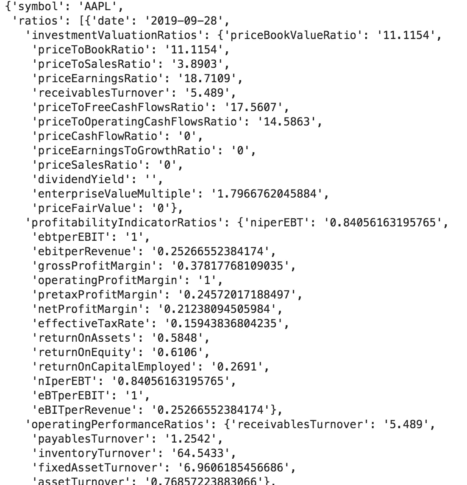

# 如何使用 Python 获得财务比率

> 原文：<https://medium.datadriveninvestor.com/how-to-get-financial-ratios-using-python-18131b63ef29?source=collection_archive---------2----------------------->

## DIY 投资

只用了几行代码


Image by Christopher Gower on [Unsplash](https://unsplash.com/photos/m_HRfLhgABo)

如果你曾经想过有一天把你的钱投资到股票市场，那么你可能会遇到比率分析。然而，当我们听到“比率”时，我们大多数人都会想起高中时让我们沮丧的复杂数学问题。

幸运的是，说到投资，就不一定了。大多数比率，当正确理解和应用时，可以帮助你成为一个更明智的投资者。

> 比率分析是一种定量方法，通过比较财务报表中包含的信息来了解公司的流动性、运营效率和盈利能力。比率分析是基本面分析的基石。[*Investopedia.com*](https://www.investopedia.com/terms/r/ratioanalysis.asp)

## *蟒蛇来了*

*如果您有 Python 的基础知识，那么只需几行代码就可以掌握任何公司的财务比率。在本文中，我们将了解如何实现这一点。所以，事不宜迟，让我们开始编码吧。*

*为了检索股票数据，我们将使用一个免费的 API， [Financialmodelingprep](https://financialmodelingprep.com/developer/docs/) ，它非常易于使用。为此，我们将向 API 端点发出 get 请求，然后解析我们需要的值。*

*[](https://www.datadriveninvestor.com/2019/03/25/a-programmers-guide-to-creating-an-eclectic-bookshelf/) [## 创建折衷书架的程序员指南|数据驱动的投资者

### 每个开发者都应该有一个书架。他的内阁中可能的文本集合是无数的，但不是每一个集合…

www.datadriveninvestor.com](https://www.datadriveninvestor.com/2019/03/25/a-programmers-guide-to-creating-an-eclectic-bookshelf/) 

与任何数据科学工作一样，我们首先需要导入构建 Python 脚本所需的库。

```
#import packages we need
import requests
import json
```

现在让我们使用请求包向 API 发出请求

```
# Get ratios for Apple using request package  
financial_ratios =  requests.get(f"[https://financialmodelingprep.com/api/v3/financial-ratios/](https://financialmodelingprep.com/api/v3/financial-ratios/{stock)AAPL")
financial_ratios = financial_ratios.json()
```

如果我们现在打印我们的 financial_ratios 变量，我们得到一个长字典，我们现在可以解析它。

```
print(financial_ratios)
```



Image showing snapshot of the result

## 解析结果字典

请注意，我们得到的是一个长字典，其中键“ratios”的值是字典的嵌套列表。此外，请注意这些嵌套字典是如何表示不同年份的。在这种情况下，2009–2019 年。

最近一年的比率位于顶部。为了检索它，我们执行下面的代码:

```
recent_ratios = financial_ratios['ratios'][0]
print(recent_ratios)
```

既然我们已经分离出了感兴趣的年份，我们还可以得到具体的比率。在下面的例子中，我们感兴趣的是利润率。

```
profit_ratios = recent_ratios['profitabilityIndicatorRatios']
print(profit_ratios)
```

有多简单？但是如果我们不得不为不同的公司做几次这样的事情呢？不好玩，是吧？别担心，我们可以为任何公司创建一个可以完成所有这些工作的函数。

```
def get_profit_ratios(stock):
    financial_ratios =  requests.get(f"[https://financialmodelingprep.com/api/v3/financial-ratios/{stock](https://financialmodelingprep.com/api/v3/financial-ratios/{stock)}")
    financial_ratios = financial_ratios.json()
    ratios = financial_ratios['ratios'][0]
    profit_ratios = ratios['profitabilityIndicatorRatios']

    return profit_ratios
```

感谢阅读。我希望这篇文章对你有用。你可以在这里找到 Jupyter 笔记本的所有代码。*