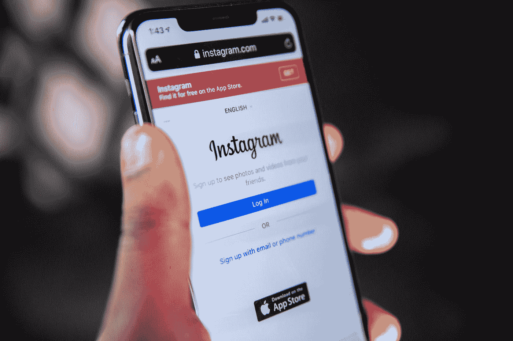
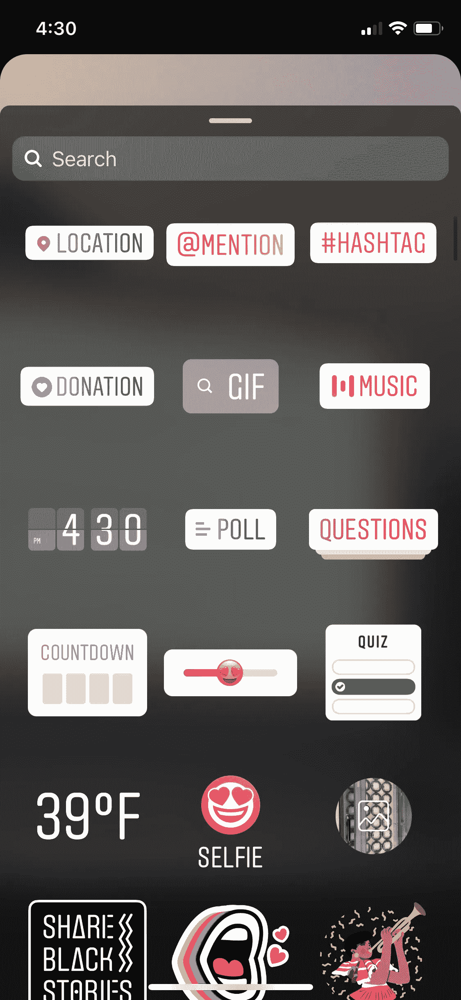

# 如何从 Instagram 故事中获得更多业务

> 原文：<https://medium.datadriveninvestor.com/how-to-get-more-business-from-instagram-stories-32acf83e9f69?source=collection_archive---------36----------------------->

为什么忽略这个特性会让你损失$$$

How Photo by [Solen Feyissa](https://unsplash.com/@solenfeyissa?utm_source=medium&utm_medium=referral) on [Unsplash](https://unsplash.com?utm_source=medium&utm_medium=referral)

今天，我想讨论一下我目前最喜欢的 Instagram 功能之一——这个功能从 2016 年开始就存在了，所以它绝对不是一个新功能，而是我最喜欢的功能之一，因为它很强大。

如果你读完了整篇文章，你会清楚地知道你的企业应该实施什么样的 Instagram 故事策略。

我决定写 Instagram 故事的原因实际上可以归结为两件事:第一，我看到我关注的 Instagram 商业账户数量惊人，没有充分利用故事的力量；第二，因为我个人曾经纠结于 Instagram 故事，以及它们如何可能帮助我发展业务。

> 因此，如果你目前正纠结于如何将 Instagram 故事用于你的业务，我想让你知道**你绝对不是一个人……**

我最近录制了一集[播客](https://podcasts.apple.com/us/podcast/why-should-you-even-care-about-social-media/id1519675410?i=1000479365935)，讲述了作为一名企业主，你为什么应该在乎社交媒体的原因。在那一集里，我真的试图让我的听众明白，你的企业的 Instagram *feed* — 实际上是你在那里创建一个帖子，写一个标题，使用标签等等。—很像一个商业投资组合。

所以，这意味着你要在那里展示你最好的作品，你要把自己放在你潜在的新追随者的位置上。那些在 Instagram 上随机发现你并第一次关注你的人——**你会问自己，为了被说服与你做生意，他们需要在你的 feed 上看到什么。**

现在的问题是…同样的策略适用于 Instagram 故事吗？你应该简单地将你在 feed 上发布的所有内容转发到你的 Instagram 故事吗？用最简单的话来说……不是。

如果是的话，那么 Instagram 最初想出故事的目的是什么？**它们是完全不同的格式，所以我们必须以完全不同的方式看待它**。

接下来，我会解释为什么，然后我会更详细地说明在实施社交媒体战略时，你应该开始做哪些不同的事情，以及如何去做这些事情。

如果你的 Instagram feed 是你的商业投资组合，那么**你的故事需要像你的真人秀**。请允许我解释…

什么构成了电视真人秀？嗯，通常它需要是原始的，真实的，彻头彻尾的真实。它还包含了更多的幕后感觉。

Photo by [Sam Moqadam](https://unsplash.com/@itssammoqadam?utm_source=medium&utm_medium=referral) on [Unsplash](https://unsplash.com?utm_source=medium&utm_medium=referral)

因此，您可能想知道这如何转化为为您的业务做这件事，我说的对吗？

> 我希望你在你的 Instagram 故事中做的是，带你的粉丝经历你公司的“一天”。

故事只能持续 24 小时是有原因的，对吧？它们不会永远持续下去；当然，除非你将它们添加到你的亮点之一，你可以在我的播客第九集[中学习如何做得更好，但同样，当你像对待自己的真人秀一样对待你的 Instagram 故事时，你将让人们——也就是你的追随者，也就是潜在客户——进入你的世界。那么，让我问你几个问题，让你对这个问题有更好的理解…](https://podcasts.apple.com/us/podcast/how-to-use-instagram-highlights/id1519675410?i=1000488452722)

当你第一次走进办公室或工作场所时，你在做什么？如果你是做 spa 的，你会在你的第一个客户出现之前准备好薄荷黄瓜水瓶吗？在客户进门之前，你是否在检查一份清洁清单，以确保一切都整洁干净？你的一些员工在做什么？休息室里到底发生了什么？你是不是刚刚得到了一台新机器，它能为你在企业中创造的任何东西做不可思议的事情？在客户和任务之间你在做什么？你是否拥有一家服装品牌店，并且刚刚进了一批新货？你是否正在你的电脑上创建一个新产品原型，并可以展示一个 8 秒钟的片段？

你明白我在这里做什么了吗？**我正试图将你的企业和你作为企业/企业主的日常生活中发生的事情展现出来。**

同样，你的 Instagram feed 是一个有*这么多不同内容选项供你选择的地方。例如，你有单个图像，多个滑动图像，你有 60 秒的短视频，你有 IGTV 视频，对于某些帐户来说可能长达 1 小时，现在你还有卷轴——insta gram 版的抖音。*

这意味着每种类型的内容都有不同的目标。

作为一名企业主，我最喜欢的故事之一是，它让我的追随者看到了我的徽标、品牌颜色、教程以及我在 feed 中发布的任何其他内容。

这实质上让他们将我视为一个人，而不仅仅是一个企业。猜猜看，当追随者开始更多地将你视为你自己和一个人，而不仅仅是一座建筑或一个标志时，会发生什么？**他们开始真正开始*了解*你，开始*喜欢*你，结果……开始*更加信任*你。**

正如俗话所说…人们和他们认识、喜欢和信任的人做生意。

当你开始转变你的心态和观点，以那种方式对待你的 Instagram 故事时，你就打开了一个全新的可能性世界。

## 我喜欢故事的另一点是，它们不必像你订阅的内容那样疯狂、高度编辑、耗费时间。

他们不需要你花几个小时去创造。他们可能会让你在早上第一件事就是打开办公室的门，并祝每个人早上好。然后当你进入时，你可能会发布一系列 4 个不同的故事，告诉你所有的追随者你当天有不同类型的客户约会，以及你在列表上有什么类型的任务。然后，如果你是一家服务型企业，也许你可以给你的企业拍一张照片，并在接下来的几天里打出 3 个不同的客户空缺。

选择几乎是无限的，因为你每天都在带着人们。这就是为什么它像一个电视真人秀。你开始有这种联系了吗？

既然我们已经谈到了这一点，当谈到 Instagram stories 时，你已经实现了思维转变……让我们来谈谈一些基本的技巧，以确保你能够利用 Instagram stories 允许我们所有企业主访问的所有令人惊叹的功能。

# 1.提高参与度

如果你想利用社交媒体来帮助你发展业务，你需要遵守平台的规则。Instagram 故事的潜规则之一是，他们真的真的很喜欢你通过你创造的故事与你的粉丝互动！那么，你是怎么做到的呢？现在我要你拿出手机，打开你的 Instagram 应用程序，然后假装你要发布一个故事…

快速拍一张照片，然后看看屏幕的右上角。你会看到中间的一个按钮图标，看起来有点像一个带笑脸的正方形，这就是所谓的贴纸图标。当你点击那个贴纸图标时，一堆不同的选项会出现…

**地点//提及//标签//捐赠//GIF//时间//投票//问题//挑战//DM Me//倒计时//滑动条//测验//等等。**

我是说，这个清单还在继续，对吧？所以，现在的问题是，我们选择在我们的故事中包括哪些？更重要的是，哪些能让你的故事和你的追随者之间有更多的参与和互动？

我会给你我最喜欢的 3 个选项:#1 —投票选项#2 —问题选项和#3 —测验选项

**本周我给你们的挑战是在你们本周发布的三个不同的故事中使用这三个**。也许坚持每天使用一个，看看效果如何。看看哪些能让你获得最多的参与度。

*为什么我要挑战你去做这些增加参与度的事情？*

因为当你的粉丝与你的故事互动时，它会告诉 Instagram，“嘿！人们喜欢这个故事，让我们把它推到故事线的前面，这样更多的人可以看到它，享受它“因为…

> Instagram 的最大目标是让用户开心，并确保他们喜欢这个平台，因为当他们喜欢这个平台时，他们会更多地使用它，最终让他们在广告中赚更多的钱——这就是它的工作方式。

# 2.测试什么有效&然后再做一次

出于某种奇怪的原因，企业没有认识到测试的重要性。不，不是在他们 99%的努力和过程中。但是当涉及到社交媒体时。看起来他们只是把他们当时想到的东西都扔了(有时可以，但要继续读),并且在它被发布后不会再去想它。然而，这不会推动你前进，当然也不会增加你将社交媒体追随者转化为实际付费客户的“机会”。

你需要测试。然后再测试一些。哦，看在上帝的份上，再多测试一些吧！完全按照我在以上段落中告诉你的去做(提高参与度),然后留意什么有效。

如果你碰巧是一名房地产经纪人或室内装潢师，你发布的关于他们是否更喜欢瓷砖而不是硬木的民意调查会让你的观众参与进来吗？他们喜欢你在“问题”贴纸上写一句简单的话:“问我任何问题”吗？

跟踪什么是有效的，什么是无效的，这将让你做更多你的观众想要和需要从你那里听到的事情，然后最终足够信任你，交出他们辛苦赚来的钱，成为你的付费客户。

# 3.找点乐子

好的，我要告诉你做的最后一件事非常非常重要，请密切注意，不要错过这个…

用你的 INSTAGRAM 故事享受*乐趣*！

你想知道 Instagram 故事的第二大优点吗？他们会在 24 小时内消失！所以，对于那些因为害怕做错、视频出错、口吃或其他什么原因而对更积极地讲述故事感到紧张的人，你猜怎么着？

**绝对最糟糕的事情是你发布了一个你并不觉得很棒的故事，然后第二天它就消失了，永远消失了！**这不像你的 feed，你所有的新粉丝发现你时都会看到它！

享受你的故事吧。练习露脸，直接和你的粉丝对话。向他们展示你是谁，你是做什么的，为什么你这么棒，为什么你应该成为他们新宠的美学家、律师、房地产经纪人、五金店、服装店或 _ _ _ _ _ _ _ _ _。

> 因为你猜怎么着？也许只是也许他们不想和漂亮的商标做生意。

也许最终促使他们与你预约第一次约会的是在你的故事中了解你。看到你有一个炸弹般的个性，你很有趣，你超越了你的客户，不管是什么——也许你的 Instagram 故事会动摇他们成为你最新的付费客户。

你从这篇文章中学到了什么新东西吗？太好了！关注我，获得更多关于如何利用社交媒体发展业务的建议——你知道你想这样做；)