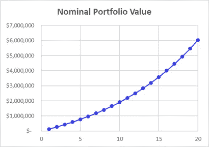
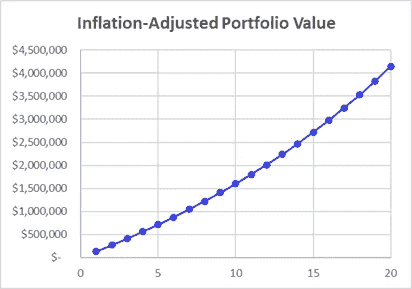
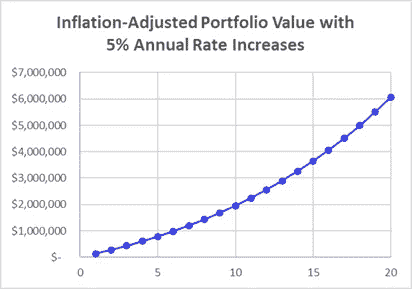

# 如何走上财务独立的快车道

> 原文：<https://medium.datadriveninvestor.com/how-to-get-on-the-fast-track-to-financial-independence-654c82cd501f?source=collection_archive---------9----------------------->

## 我作为顾问的经验教训

## 如何从零开始到经济独立，通过数字…

Photo by [Pietro Mattia](https://unsplash.com/@pietromattia?utm_source=unsplash&utm_medium=referral&utm_content=creditCopyText) on [Unsplash](https://unsplash.com/s/photos/race?utm_source=unsplash&utm_medium=referral&utm_content=creditCopyText)

我真的很喜欢阅读媒体上写得很好的故事。

尤其是在我的金融战略领域，它为专业人士提供个人和小企业金融服务。

这是我今天读到的一篇我非常喜欢的文章，作者是马特·莱恩:

 [## 3 没有人谈论的有利可图的一面

### 雷达下的机会有七位数的潜力

medium.com](https://medium.com/makingofamillionaire/3-profitable-side-hustles-no-ones-talking-about-387b2284c15b) 

在这篇文章中，莱恩提出了三条实现财务独立的途径。详情请阅读他的文章，以下是他的三点建议:

1."*把你的职业变成咨询服务*"

2."*在 Etsy 上卖衬衫*"

3."*制造迷因*"

我认为莱恩先生称这些道路为“*没人谈论*”有点夸张，但我同意它们比大多数其他选择更少被提及。

# 我真的可以使用莱恩先生的任何建议吗？

每个人都喜欢认为自己很有幽默感。

可悲的是，大多数人和我一样。我们可以重复一个笑话，并获得一些笑声。然而，让我创造一个有趣的迷因，一个会像病毒一样传播的迷因，你会无意中看到一些有趣的东西——我脸上的“车灯前的鹿”表情。

同样，虽然我在素描和绘画领域至少比一般人要好一些，但我不认为我能靠创作从虚拟 Etsy 货架上飞下来的 t 恤谋生。

在排除了 Lane 先生的第 3 和第 2 个选项之后，我们来到了我实际上已经完成的一个选项，咨询…

# **我是如何丢掉工作并做出艰难选择的**

那是 2010 年末，我刚刚从我雇主的首席技术官那里听说，我将在 3 周内被解雇，因为我的雇主找不到足够的工作来证明留住我是合理的。

在作为一名研究物理学家在学术界工作了 22 年，并作为一名小型工程服务公司的员工，作为一名支持 NASA 项目的系统工程师短暂工作了两年之后，我突然不得不考虑如何支付我的抵押贷款和汽车贷款，以及如何维持餐桌上的食物。

我必须做出的第一个决定是，我是应该找一份不同雇主的工作，还是自己开业。当雇员的好处是:( 1)不用推销自己就能得到工作保障，以及(2)带薪福利。

然而，我的经验告诉我，第一个是一个神话——没有人会像你推销自己一样推销你，因为当你需要避免失去你的房子时，没有人会像你一样有动力。

此外，如果你是一名雇员，而你的雇主不能很好地推销你的服务，使你的收入超过维持工资的成本，他们会让你走。

就我的雇主而言，我对他们只有亲切的关心，因为他们为我做了额外的工作，还有一些——(a)他们在为我寻找更多工作的时候，让我被架空了几个月；(b)当他们再也负担不起时，他们提前 3 周通知我，而不是告诉我收拾行李离开，这是他们的权利；(c)他们告诉我利用这 3 周时间尝试找到我的下一步，而不是坚持让我为公司工作；(d)他们承诺尽一切努力帮助我完成下一步。不是每个雇主都会这么做。

这就是为什么我从第一手经验中说，在今天的市场中，员工的工作保障早已不复存在，甚至在新冠肺炎搞垮经济之前。

至于第二个优势，有偿福利，这些当然值得一大笔钱。然而，如果你建立了一个独立的咨询业务，带来了足够的钱，你可以支付自己的利益，仍然有更好的收入。

# **我会推迟莱恩先生的演讲**

除了许多好的建议和信息，莱恩先生谈到咨询时说道，“*记住，你是你所在领域的专家，所以要相应地收费。* ***表示最低 60 美元/小时*** *。*(我的强调)

这低得可怜，原因如下。让我们从几个假设开始:

*   你每小时的费用是 60 美元
*   你的利润率是 90%
*   你的有效总税率是 30%(联邦和州所得税加工资税)
*   你付不起聘请高级会计师的费用，也付不起为 401k 留出太多的钱。
*   你找到了 1750 年计费小时的足够工作

正在计算…

*   60 美元 x 1750 = 105，000 美元的总年收入
*   105，000 美元 x 0.9 = 94，500 美元税前净利润
*   94，500 美元 x 0.7 = 66，150 美元税后实得收入

这与美国收入中值相比如何？

 [## 自然语言处理的五种金融应用|数据驱动的投资者

### 过去的五年对于自然语言处理领域来说是革命性的。我们从荣耀的 ctrl-f…

www.datadriveninvestor.com](https://www.datadriveninvestor.com/2020/09/17/five-financial-applications-of-natural-language-processing/) 

根据[美国人口普查局的最新数据](https://www.census.gov/library/publications/2020/demo/p60-270.html#:~:text=Median%20household%20income%20was%20%2468%2C703,and%20Table%20A%2D1).)，2019 年美国的收入中值为 68703 美元。因为那是税前的，我们需要把它与上面的 94，500 美元进行比较。

然而，我们需要首先考虑你必须为自己“购买”的好处。

1.  减去 7.65%的雇主工资税部分。费用:7229 美元。剩余:87271 美元。
2.  减去自己在私人市场购买健康保险的费用。费用:小家庭 16000 美元左右。剩余:71271 美元。
3.  减去 2 周的无薪年假和/或病假。费用:4000 美元。剩余:67271 美元。

这让你的收入低于美国收入中值。

如果你是你所在领域的专家，莱恩先生把你定义为前 1%的专家，你不应该满足于这么少。

# **快速实现财务独立**

如果你想把咨询作为财务独立的快速通道，60 美元/小时显然不够。这里有一个假设的例子，有人通过收取更多的费用做得更好。

> 如果你想把咨询作为财务独立的快速通道，每小时 60 美元是不够的。

首先，我们需要修改我们的假设，从更高的利率开始。

*   你每小时的费用是 200 美元
*   你的利润率是 90%
*   你找到了 1750 年计费小时的足够工作
*   你雇佣了一个优秀的会计师，他会帮你优化税收(包括建立一个按 S-corp 纳税的有限责任公司)
*   你用完了你的 401k
*   由于以上两点，你的有效总税率下降到 20%(联邦和州所得税加上工资税)

用这些修正的假设做数学计算…

*   200 美元 x 1750 = 350，000 美元总年收入
*   35 万美元 x 0.9 = 31.5 万美元的税前净利润
*   315，000 美元 x 0.8 = 252，000 美元税后实得收入

现在我们在积累财富方面处于更有利的地位！

如果你的非业务支出是 120，000 美元，你可以留出总共 132，000 美元，让你踏上财务独立的快车道！

*Portfolio value assuming $132k annual investment with an 8% annual return.*

正如你所看到的，在短短的 10 年里，你达到了近 200 万美元。

到第 15 年，你的投资组合可以在几十年内扔掉超过 120，000 美元的费用(假设初始提款率为 3.5%)。

到第 20 年，你的收入将超过 600 万美元！

 [## 如何让一个简单的华尔街日报退休计算器更好

### 包括逐步说明

medium.com](https://medium.com/financial-strategy/a-useful-retirement-calculator-from-the-wall-street-journal-and-how-to-fix-it-453ab51942e4) 

然而，以上忽略了通货膨胀的影响。假设年率为 2%，你的结果变得不那么乐观，但仍然充满希望。

*Portfolio value assuming $132k annual investment, adjusted for 2% annual inflation.*

以今天的美元计算，第一个十年后你的收入超过了 150 万美元，到第 20 年末超过了 410 万美元。如果你的支出增加了同样 2%的通货膨胀率(也就是说，你避免了生活方式的通货膨胀)，你在 18 岁时就实现了财务独立。

随着你专业知识的增长和人际网络的扩展，你可以(也应该)比通货膨胀更快地提高工资。假设你的利率每年上升 5%，我们会看到以下结果。

*Portfolio value assuming annual investment starting at $132k, increasing 5% annually, with an 8% investment return, adjusted for 2% annual inflation.*

在这里，到第 10 年，你差不多有 200 万美元，如果你把每年的个人开支减少到 68，300 美元，你就可以退休了。

到第 15 年，你的收入超过 360 万美元，让你退休时个人支出保持在按今天的美元计算的 12 万美元。

> 到第 15 年，你的收入超过 360 万美元，让你退休时个人支出保持在按今天的美元计算的 12 万美元。

到第 20 年，你的收入超过 600 万美元，按今天的美元计算，你每年的支出超过 21.2 万美元，比我们假设的 12 万美元高出 75%。

 [## 如何知道你应该留出多少钱

### 邻家的百万富翁的“财富方程式”哪里做得好，哪里不太准确

medium.com](https://medium.com/financial-strategy/how-much-should-you-have-already-set-aside-by-your-age-dd33bfb631e1) 

# **我作为顾问的个人经历**

当我第一次开始兼职咨询时，我还在学术界，在我的新咨询职位中还没有达到前 1%，我的收费是每小时 80 美元。

根据通货膨胀进行调整后，以今天的美元计算，这将是每小时 100 美元多一点。显然，现在我作为顾问更有经验了，我的报酬也更高了。

在我全职咨询的第一年，我找到了 1100 计费小时的客户。虽然这离全职还差得很远，但我挣的钱已经超过了我之前的(6 位数)工资。随着时间的推移，我的收入不断增长。

虽然我的利润远低于莱恩先生提出的 7 位数，但这主要是因为我有意识地选择不雇佣员工。我有理由相信，做出不同选择的同事们确实获得了 7 位数的利润。

不过，我的单人咨询业务让我们在不到 10 年的时间里，让我们的净资产增长了 10 倍以上。

# **底线**

我真的很喜欢莱恩先生的文章，他提出了几个在这个领域不常讨论的选项，这值得称赞。

然而，如果你想继续他的第一个选择，咨询，我会把你的时薪至少定为 100 美元/小时(如果不是两倍的话)。

快速实现财务独立并不意味着你十年后就能实现(除非你愿意大幅削减开支)。正如上述假设的例子所示，即使有相当乐观的假设，也需要 15 年。

如果你想反对这不是真正的快速通道，那就把它和那些工作了 40 多年，但平均储蓄不足 20 万美元的人相比吧。

> 如果你认为 15 年真的不是财务独立的快速通道，那就把它和那些工作了 40 多年但仍有不到 20 万美元积蓄的人做个比较。

# 关于作者

[Opher Ganel](mailto:opher@opherganel.com) 已经成功建立了几个小企业，包括一个支持 NASA 和政府承包商的咨询公司。他最近的冒险是为独立专业人士提供的[金融策略服务](https://www.opherganel.com/)。你可以在那里与他联系，或者关注他的媒体出版物[金融策略](https://medium.com/financial-strategy)。

# 放弃

*本文仅供参考，不应视为财务建议。在做出任何重大财务决定之前，你应该咨询财务专家。*

## 访问专家视图— [订阅 DDI 英特尔](https://datadriveninvestor.com/ddi-intel)