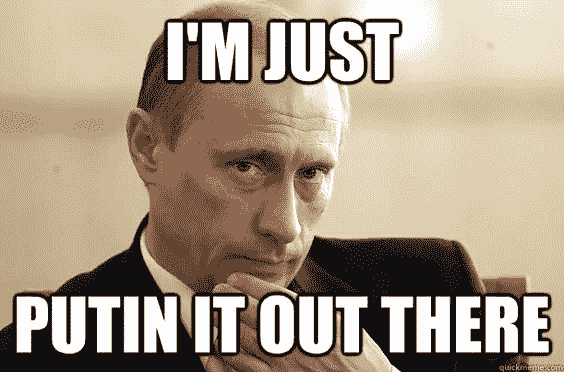

# 如何让普京示好！

> 原文：<https://medium.datadriveninvestor.com/how-to-get-putin-to-play-nice-39dcfd3076c6?source=collection_archive---------17----------------------->

美国可能在冷战(1947-1991)中打败了苏联，然而，普京总统和俄罗斯在勇敢的战争中打败了我们。他们干涉 2016 年至 2020 年的选举以及其他事情，真是大胆。

不为人知的是，我们非常感谢俄罗斯帮助我们赢得了二战…

说真的。也许你的历史书提到了这一点，但我的没有…

1941 年 6 月 22 日，德国入侵俄罗斯，差不多四年后的 1945 年 5 月 9 日，德国在*东线*——俄罗斯人民称之为*卫国战争*结束了入侵。在二战造成的 7000 万到 8500 万死亡中，3000 万发生在东线——其中许多是俄罗斯士兵和……无辜的俄罗斯平民。

如果没有俄罗斯，我们——盟军——可能会在二战中败给轴心国和纳粹。

俄罗斯不仅没有让他们拥有重要的自然资源，还让他们全神贯注，俄罗斯摧毁了纳粹的大部分武装力量。如果纳粹打败了俄罗斯，他们很可能会赢得全世界。

俄罗斯直到现在才被承认，这是一种耻辱。我们不仅应该感谢他们，还应该向他们道歉。代表美国人民，谢谢你…并请接受我们的道歉。对于那些从未听到过男人道歉的女人，我希望我今天创造了更多的历史。

普京总统，是时候让俄罗斯再次为了世界的最佳利益而英勇行动，并停止试图通过有污点的选举和反 vax 运动来破坏美国和公民。提前感谢。