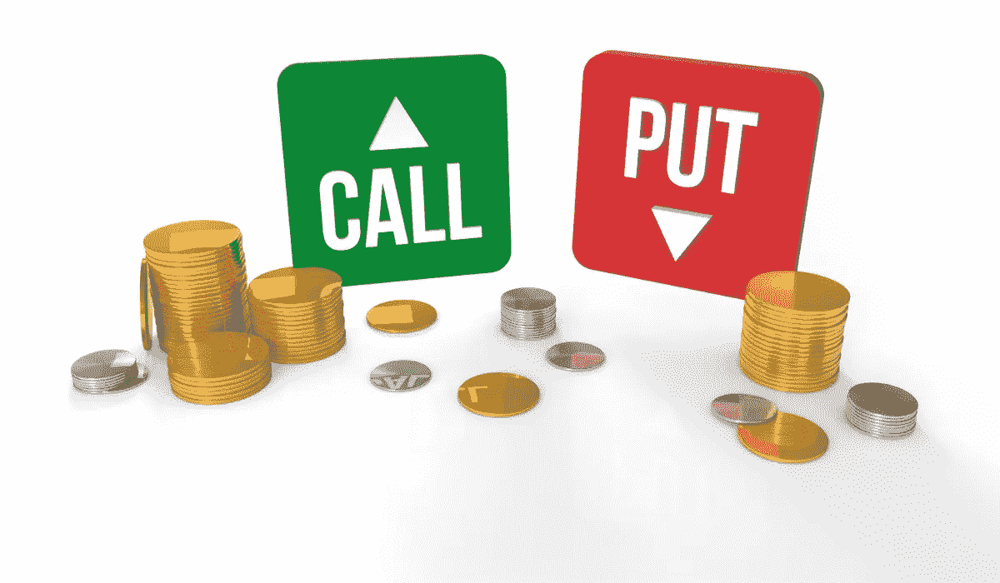
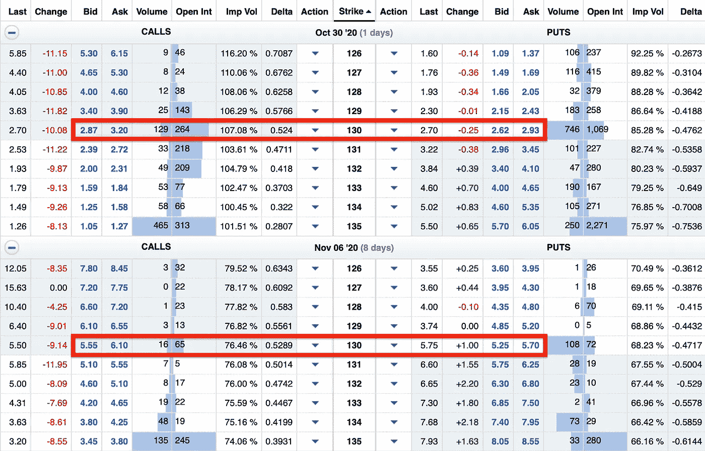
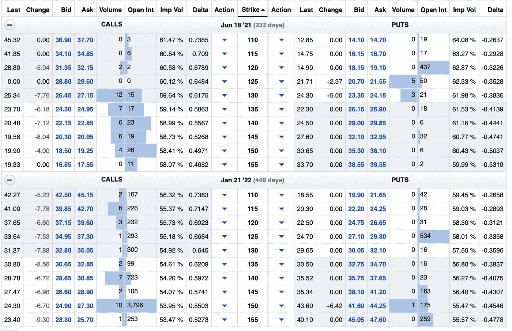

# 期权交易者如何入门

> 原文：<https://medium.datadriveninvestor.com/how-to-get-started-as-an-options-trader-1690af82fb11?source=collection_archive---------5----------------------->

## 许多亿万富翁投资期权。你也应该

几乎每个股票市场的亿万富翁都买卖期权…甚至沃伦·巴菲特。

事实上，巴菲特利用现金担保看跌期权在几分钟内就让自己的净资产增加了 750 万美元，我在下面的文章中概述了这一策略。

 [## 沃伦·巴菲特如何在 5 分钟内赚到 750 万美元

### 使用这个策略在股票市场积累你的财富

medium.com](https://medium.com/datadriveninvestor/how-warren-buffett-made-7-5-million-in-under-5-minutes-79363ac2d52b) 

期权通常被视为比传统股票投资风险更大的复杂投资。

像任何投资工具一样，有减少风险的方法，也有承担不必要风险的方法。

你可以选择的两个选项是看涨期权和看跌期权。看涨期权的价值随着标的股票价格的上涨而增加。当标的股票价格下跌时，看跌期权价值减少。

换句话说，如果你认为某种股票有更大的上涨空间，你会买入看涨期权；如果你认为某种股票在不久的将来会下跌，你会买入看跌期权。

不仅可以买电话，还可以卖电话。

如果你卖出*备兑*看涨期权和现金担保看跌期权，这种策略的风险要小得多。

对于备兑买入期权，你拥有 100 股相关股票。你卖出一个看涨期权，立即获得溢价。你赚取的溢价基于你设定的执行价格和到期日。

对于看涨期权和看跌期权，执行价格越接近实际价格，到期日越远，你将获得越高的溢价。

请注意，Etsy 股票的看涨和看跌期权在距离到期日 8 天时比在距离到期日 1 天时更高。

对于 130 的执行价格，额外的 7 天时间使得看涨期权和看跌期权的价格几乎翻倍。

130 执行价非常接近实际股价。想要保留其 Etsy 股票的股东可以选择更高的执行价格，例如 165 的执行价格。

这导致了较低的溢价，但也降低了你被迫以设定的执行价卖出 100 股股票的几率。

备兑电话是收取额外收入的好方法。如果你选择波动性较低的股票，它们尤其有帮助，尽管溢价不会那么高。

许多股息投资者使用这种方法，通过保守的策略获得额外的 5-10%的回报。

如果你卖出备兑看涨期权，远离收益。如果收益报告非常好，以接近货币执行价的价格卖出会让你错过潜在的收益。

许多投资者使用现金担保看跌期权，以更有吸引力的价格买入他们喜欢的股票。你不需要 100 股，你只需要在你的储备中有足够的钱以你想要的执行价格购买 100 股。

如果你想以 130 美元/股的价格购买 100 股 Etsy 股票，你需要 13000 美元来启动现金担保看跌期权。

如果你卖出 8 天后到期的 130 Etsy 合约的现金担保看跌期权，你将赚大约 580 美元，如果行使现金担保看跌期权，你的成本基础将降至 124.20 美元/股。

然而，你也可以出售将在 1-2 年内到期的期权。对于这个例子，让我们回到 Etsy。

Etsy 目前的交易价格约为 130 美元/股。假设你认为股票被高估，有下跌空间，你想以更有吸引力的价格买入。

你可以卖出 2021 年 6 月 18 日的现金担保看跌期权，价格为 110 美元，即时价格为 1，440 美元(在本例中使用中点)。

如果 Etsy 股票下跌，你被迫以 110 美元/股的价格买入，不管价格如何。即使股票跌到 70 美元/股，你也要以 110 美元/股买入。

然而，这比你今天支付的价格要好得多，额外的 1440 美元缓冲了这一打击，将使你的每股成本降至 95.60 美元。

如果 Etsy 股票继续上涨，看跌期权将一文不值，用这种策略你将拿不到 100 股 Etsy 股票。

然而，对于现金担保看跌期权，你投入了 11，000 美元，并在旅程结束时获得了额外的 1，440 美元。在不到一年的时间里，回报率为 13.1%，高于股市的平均年回报率。

你可以以一种创造双赢局面的方式出售期权。

# 开始的最佳方式

开始越小，学到的东西就越多。几百块钱比几千块钱好学。

还有一种有毒的投机方式，被称为 YOLO，一些投资者相对较快地成为百万富翁，而其他人则血本无归。

下面的文章讨论了 YOLO，但我不会尝试它。

 [## 投资股票风险最大的方式

### 这种策略看起来很有趣，但实施起来压力很大

medium.com](https://medium.com/the-innovation/the-riskiest-way-to-invest-in-stocks-a188a4277753) 

我开始出售一周内到期的备兑看涨期权和现金担保看跌期权，这些期权可能会一文不值。我设定了很高的执行价格，甚至卖出了不到 3 天就到期的期权。

这是一个简单的方法来开始你的首次交易，只是为了更好地理解期权。如果股价上涨，它会大大限制你的上涨空间，但股价上涨的时间不多了。

如果你不介意卖出 100 股(备兑看涨期权)或买入 100 股(现金担保看跌期权)，我也推荐使用这种策略。

卖出足够多的期权，你会看到其中一些跌至零(对你这个卖家来说是好事)，还有一些期权价值会翻倍(对卖家来说是坏事)。

如果你理解了卖出期权，你也会对买入期权有更好的理解。

买入期权呈现出与卖出期权相反的风险和回报，所以你已经牢牢把握住了。

我建议从低于 100 美元的看涨和看跌期权开始。

如果你搞砸了一个主力看跌期权，你不会损失太多钱。如果你搞砸了一个亚马逊电话，你将会损失更多的钱，因为亚马逊电话的价格远远高于普通人的报价。

随着你继续买卖期权，你会对不同的交易策略有更深的理解，并根据你的风险承受能力进行调整。

从小交易开始，你可以做更多的期权交易。你做的交易越多，你学到的就越多。不管你花了几百还是几千，你都会学到同样的东西，所以分散你的钱，而不是把所有的钱都花在一个期权交易上。

## 想学习如何投资股市赚钱？确保你订阅了 YouTube 上的《战胜市场》