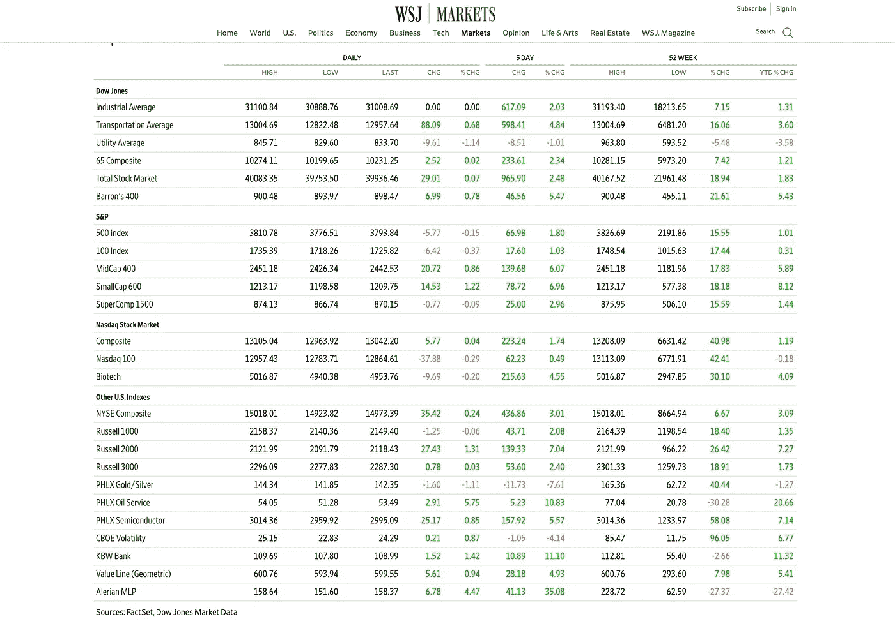
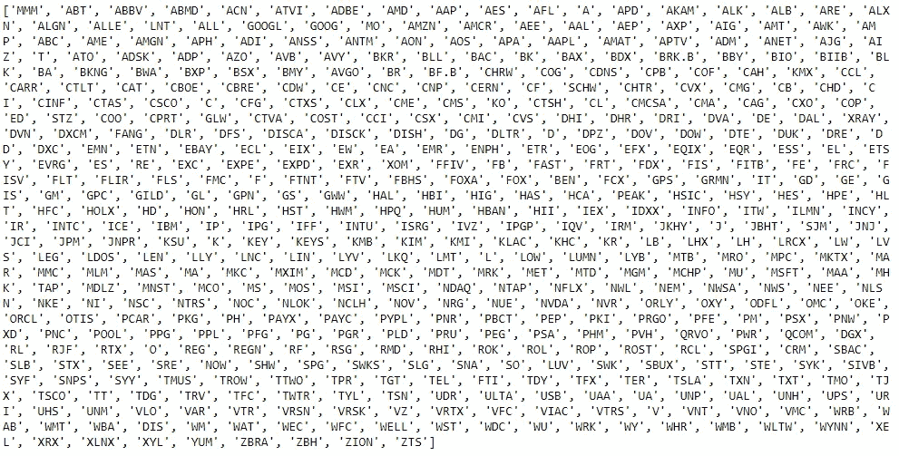
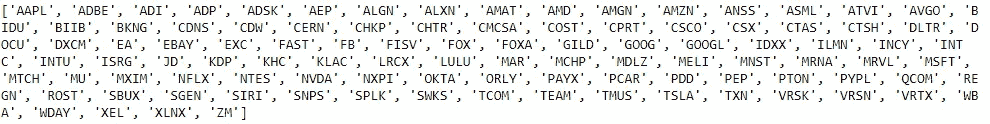
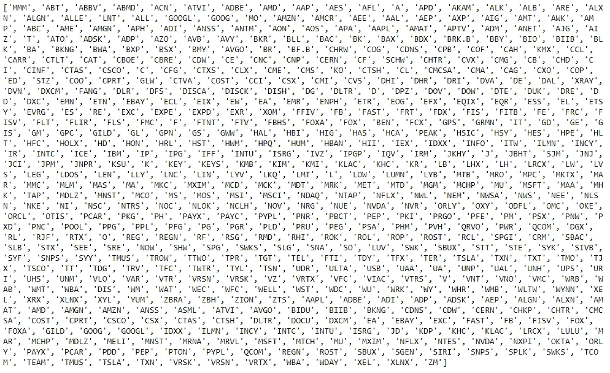

# 如何用 Python 从指数中获取股票报价

> 原文：<https://medium.datadriveninvestor.com/how-to-get-stock-quotes-from-indexes-with-python-4818a5954642?source=collection_archive---------6----------------------->


Photo by [Nataliya Vaitkevich](https://www.pexels.com/@n-voitkevich?utm_content=attributionCopyText&utm_medium=referral&utm_source=pexels) from [Pexels](https://www.pexels.com/photo/magnifying-glass-on-white-paper-6120207/?utm_content=attributionCopyText&utm_medium=referral&utm_source=pexels)

如果你是一个对日交易和股票投资感兴趣的投资者，那么你肯定也在寻找有效的方法来自动进行股票分析，甚至开发定制交易或投资策略的工具。

以我的软件工程背景，我也不例外！

如今，准确的数据是金融市场参与者最宝贵的资产。因此，它不便宜。

雅虎财经和谷歌财经不再允许开发者访问他们的全部 API。因此，现在在处理金融参考数据时，很大一部分努力是获得股票指数的像样的成分数据。例如，就我的目的而言，我再也不能轻易地找出以下美国指数的股票代码列表了:



如果你定期或不时进行日间交易，或者使用更高级的衍生品交易策略，你就会明白每天筛选市场和查看主要股票指数中的公司列表进行分析是多么重要。

在我的例子中，**我需要美国股票的代码/符号来实现我的股票筛选程序。**这将允许我为即将到来的盘中交易选择最好的股票。现有解决方案的问题是:

‣:它们通常很贵(每月 95 美元起)

‣:他们有很多我的策略不需要的数据

不幸的是，免费的实时数据提供商所剩无几。尽管如此，Alpha Vantage 是数据提供商之一，它允许在升级之前每天通过他们的 API 发送 500 个请求，这足以让我实现我需要的工具。

如果你想了解更多关于我将为我的投资和交易策略实施或购买什么样的工具，你可以[加入我的定期简讯(+奖金:每月释放更多现金的 15 大技巧)。](https://ilonacodes.com/financial-tips-for-freeing-extra-money-for-investment/)

我的股票筛选程序是一个可以根据特定标准筛选股票的程序。为了遍历所有股票，我需要获取大多数美国股票代码的列表。

有几种方法可以从金融网站获取这些数据，将其硬编码为列表，或者直接从维基百科或其他索引网站请求索引数据。在从 web 页面获取数据之前，我检查了数据在 HTML 标记中的位置，以找到其中包含的表标记。尽管如此，我决定让它变得更简单，只是下载了**。S & P500，纳斯达克等的 html** 页面。，将股票符号放入表格中:

```
import pandas as pdsp_table = pd.read_html(‘sp500.html’)
sp = sp_table[0]
sp.to_csv(‘sp500-symbols.csv’, columns=[‘Symbol’])sp = pd.read_csv(‘sp500-symbols.csv’)
sp_symbols = sp[‘Symbol’].to_list()
print(sp_symbols)
```



**read_html** 函数正在抓取存储的与 S & P500 数据相关的网页，并返回 DataFrame 对象的列表。在我的例子中，我只愿意从“Symbol”列获取数据:索引为 0 的 DataFrame 对象。然后，我使用 **to_csv** 函数将结果表提取到我的项目目录中。接下来， **to_list** 函数将表格的数据转换成列表类型。

对纳斯达克的股票列表做同样的事情:

```
nasdaq_table = pd.read_html(‘nasdaq.html’)
nasdaq = nasdaq_table[0]
nasdaq.to_csv(‘nasdaq-symbols.csv’, columns=[‘Symbol’])nasdaq = pd.read_csv(‘nasdaq-symbols.csv’)
nasdaq_symbols = nasdaq[‘Symbol’].to_list()
print(nasdaq_symbols)
```



您可以继续从存储的网页中提取不同股票指数的符号。最后一步是将股票符号连接成一个列表:

```
all_symbols = sp_symbols + nasdaq_symbols
print(all_symbols)
```



这个代码应该能够抓取股票指数中大多数符号的细节。

连接的数据可以保存为 CSV 或 JSON 文件。您也可以将数据连接到 MySQL 数据库，而不是将数据写入任何文件。

如果你在交易、投资和金融领域，你可能应该关注各种股票市场上的成千上万只股票。有时候，获得*“ABC 公司的股票代码”*并不是你唯一需要的，大多数 API 都允许你免费这样做。

在下一篇文章中，我将向您展示如何将从指数中提取的股票符号应用到我实现的工具中，为我的一个交易策略找到明确定义的进场点和出场点。

___

*免责声明:作者的观点仅代表其个人观点，不以任何方式构成财务建议。作者发布的任何内容都不构成投资建议，作者发布的任何数据或内容也不应作为任何投资活动的依据。*