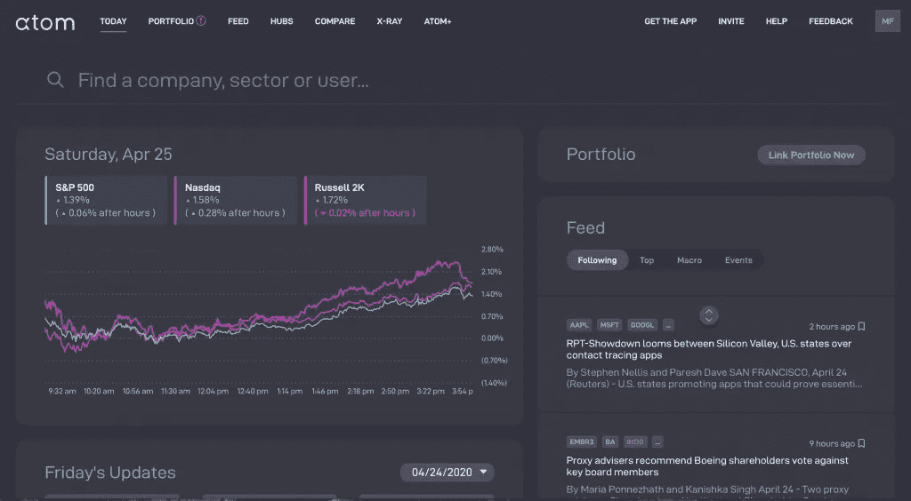
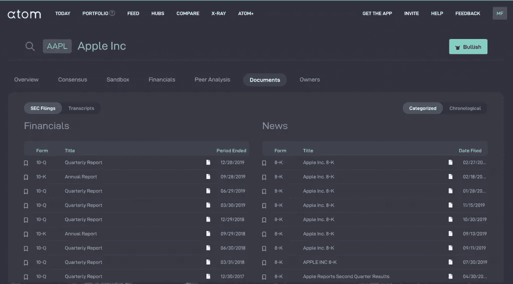
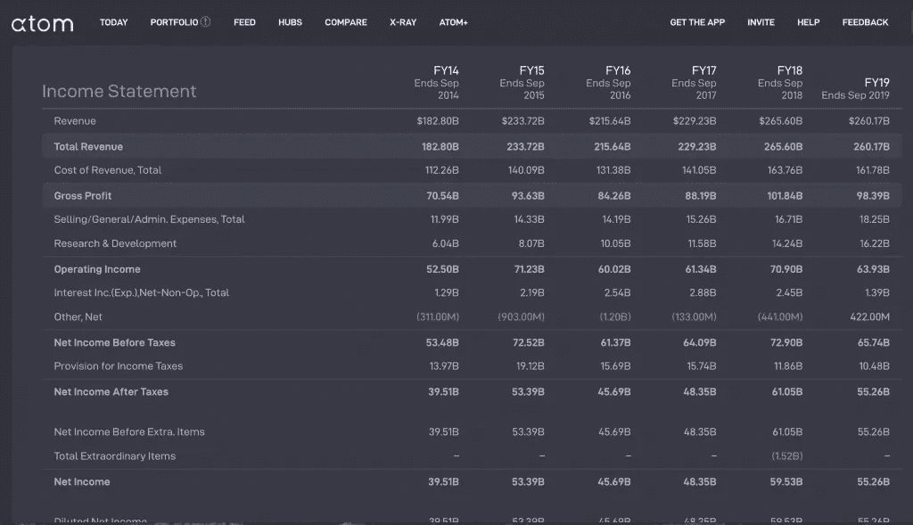

# 如何充分利用 Atom Finance

> 原文：<https://medium.datadriveninvestor.com/how-to-get-the-most-out-of-atom-finance-bc010dec06c1?source=collection_archive---------14----------------------->

Screenshot of Atom Finance Dashboard.

长期以来，对于普通投资者来说，获取股票和基金信息是一件棘手的事情。

这通常意味着在 SEC 网站或公司网站上搜索，以找到你需要的文件。

那就需要你自己去挑选和解释这些信息；这可能要花很长时间，而且需要你非常有条理地抓住一批公司的收益电话会议和股息宣布的所有日期。

 [## 使用谷歌搜索趋势预测首次申请失业救济人数|数据驱动的投资者

### 几年来，我的重点一直是使用多种替代数据来预测宏观经济统计数据…

www.datadriveninvestor.com](https://www.datadriveninvestor.com/2020/03/25/using-google-search-trends-to-predict-initial-jobless-claims/) 

乘以你投资组合中的股票数量，你就有问题了。

长期以来的一个问题是，允许你交易金融工具的平台往往没有给你多少与股票相关的分析和工具，你可以据此决定投资与否。

进入 Atom Finance。

Atom finance 是你能在互联网上免费获得的最接近彭博终端的东西。

几十年来，交易员一直用彭博终端获取股票、基金和行业信息。

你可以搜索任何你想看的公司，它会提供所有你可以用来做投资决定的信息。

# 以下是你如何最大限度地利用它的方法

## 1.连接您的投资组合

你应该做的第一件事是连接你现在拥有的股票和基金投资组合；这将让你更好地跟踪你的投资组合的表现以及未来的表现。

任何与你投资组合中的股票或基金相关的经济事件都会出现在你的投资组合日历上。

## 2.研究你喜欢的股票

Atom 最好的一个方面是，你可以非常迅速地获得关于一家公司的极其详细的信息。

这些信息被呈现出来，并有简单的比较来显示股票在过去几年中的表现。

以苹果电脑为例:

Screenshot of Apples SEC filings.

你可以在这里找到他们提交给美国证券交易委员会的所有公司文件，都在一个地方，并清楚地标注了日期，这样你就可以快速整理并查看它们。如果你想把它们保存在电脑上以便离线时快速浏览，你可以下载它们。

浏览这些文档的一个问题是，找到您需要的信息可能很困难。

比方说，如果你想查看一家公司一年的营业收入，PDF 版本可能意味着你需要筛选大量页面来获得这些信息，这很耗费你的时间。

Atom 为您清楚地标注了这一切，甚至将其与前几年进行比较，以便您可以了解公司的发展方向。

Screenshot showing Apple’s Income Statement for the past 5 Years.

## 3.为你喜欢的股票创建一个观察列表

Atom 的另一个便利特性是，你可以为你打算投资的公司甚至行业创建观察列表。

因此，你可以跟踪一系列公司，看看它们在一段时间内的表现。你从个股研究中获得的所有好处，你还可以从一个地方获得额外的好处。

新闻提要将让你了解你一起挑选的股票的最新变化。

你还可以直接从仪表盘上跟踪整个行业和组成特定行业的股票。

## 4.使用文档 X 射线搜索细节

Atom 有一个方便的功能，你可以放大某个公司的细节来进行研究或好奇。很像 x 光，因此得名。

比方说，你想查看所有提到苹果电脑使用 iPhone 的 SEC 文件和新闻。你只需点击几下鼠标就可以过滤掉那些信息；这使得研究变得更加容易，而以前你不得不通过成堆成堆的文件来获得你想要的信息。

## 5.直接比较股票

可口可乐和百事可乐，你应该投资哪只饮料股票？

有了凌动，你可以很容易地比较这两家公司的指标，如[市值、](https://millennialnetworthjourney.com/what-is-market-cap/)收入、EBITDA 和收入增长。

由此，你可以决定哪种投资更好。你也可以用它来比较两只以上的股票，还可以用大量的其他指标来比较它们。

可悲的是，虽然你不能通过股息收益率来比较公司，但希望这将是将来会增加的东西。

## 6.浏览分析师共识

我发现最有趣的事情之一是在查看股票简介时的分析师共识字段。

这些字段显示哪些公司提供了此分析，以及他们是何时提供的。

在这一部分，你还可以看到这些事情是如何随着时间的推移而变化的，这样你就可以了解分析师和机构认为这只股票的走向，这可以帮助你决定是否投资。

# 概括起来

这项免费服务对以前无法在一个地方获得这类信息的投资者来说是无价的。

这将为散户投资者节省大量时间，此外，它还将让对金融和股票不太感兴趣的人有机会跟上形势，自己做出投资决定。

举例来说，一个彭博终端每年的运营成本为 2 万美元，对于一个刚刚开始投资游戏的人来说，这是一笔巨大的投资。

Atom 本质上做同样的事情，对于普通投资者来说有足够多的功能，而且完全免费。

您可以从这个平台获得的价值几乎是无限的，如果您对 Atom 感兴趣，您可以在上面花费大量时间。

点击这里查看。(我与此链接没有任何关系，也没有从中获得任何利益。)