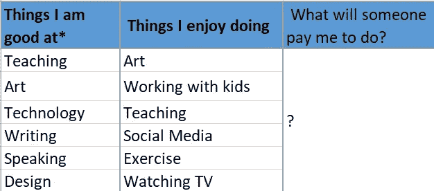
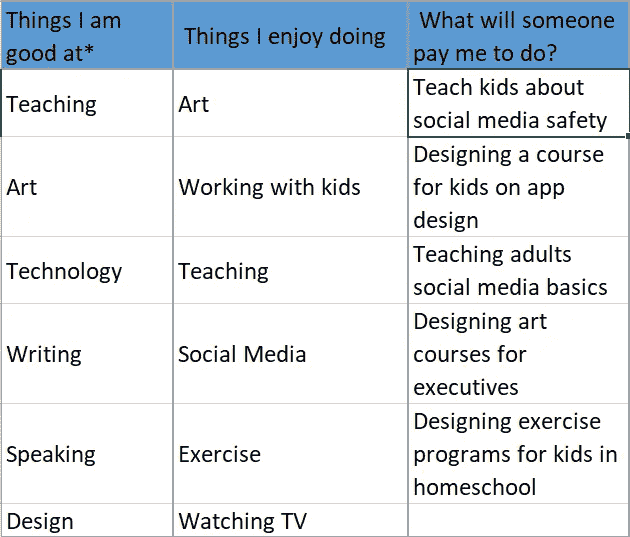

# 如何得到自己真正想要的工作

> 原文：<https://medium.datadriveninvestor.com/how-to-get-what-you-really-want-6100e8e1ba7f?source=collection_archive---------15----------------------->

我要告诉你一个秘密。

申请工作实际上已经不起作用了。

是的，显然公司在招聘，招聘人员在面试候选人，一些候选人被录用了。

但现实是这样的:你在网站上找到一份工作描述，精心制作一封完美的求职信，上传你完美调整过的简历，出于某种原因在方框*中重新输入所有相同的信息*，也许你在 LinkedIn 上与招聘人员取得了联系。然后你等着…*然后等待*……如果你幸运的话，你会收到一封拒绝邮件。如果你非常幸运，你甚至可以获得一次面试机会。很有可能你会被鬼魂缠住。出于这个原因，大多数求职者会申请任何与他们的兴趣和能力有一点点关系的工作，这让问题变得更加复杂。

对每个人来说都很糟糕。

如今，申请入门级工作之外的任何工作都是纯粹的数字游戏，而且这些数字很高。

简历在获得工作和推销自己的过程中大约占 5%的重要部分。有一份好的简历就像你的约会对象吹嘘自己是个好人。是啊，很好，但这是绝对的最低要求。这也不会让他有第二次约会。

显然，你的里程会有所不同。然而，根据我的经验和研究，你在职业生涯中走得越远，就越难通过冷申请找到工作。

在读 MBA 期间，我申请了全国 300 多家实习单位。在寻找全职工作时，我发出了 145 份申请，参加了大约 6 次面试，但没有收到任何录用通知。

我得到了一年中最棒、最有影响力、坦白说也是最有趣的实习机会。后来，当我需要那份全职工作时，我得到了 4 份工作机会(还有一份可能是在初创公司创建自己的部门)。所有人的薪水都是我开始攻读 MBA 时希望的两倍。

**那么，我到底做了什么？**

我不再玩数字游戏了。

让我给你描述一下:

在中国生活是令人着迷的。每天你都会看到上百种你没有上下文的东西，每时每刻都是学习的机会。观点的转变。

每天我都会经过几个 KTV(卡拉 ok)场所。不像美国的卡拉 ok，中国的 KTV 体验是典型的非常优雅的事情，通常商人有非常优雅的事情。

在装饰得像特朗普大厦的巨大场馆里，我会看到几十个年轻漂亮的女人在排队。穿着高跟鞋，完美的妆容，阴沉的表情，还有一个数字。这位客户通常是一位拥有男性雇员的老板，他会选择自己最喜欢的女性。女人们会唱歌，娱乐，用她们的指尖喂男人水果，低声赞美，谁知道还有什么(我从没见过这个过程的这一部分，但读了足够多的资料来做出有根据的猜测)。

从外面我能看到的是女人们痛苦地将她们的重量从一只高跟鞋转移到另一只的无声的线条。是希望被选上还是希望被辞退，谁知道呢。

每次你发出一份完美定制的简历，你都是在这个阵容中竞争。你可能会被选中，但也可能不会。

现在让我问你这个问题——你想被选中来填补那个空缺吗？

还是想做自己的事？

在我攻读 MBA 的第一天，每个人都轮流站着，告诉教室里的人他们长大后想做什么。

我说，*“我想用钱让这个世界变得更好。”*

后来，我的一位同事帮我联系了当地的一家金融科技初创公司，在那里我发现我的教育和写作背景与我的既定目标非常吻合。这绝对不是线性的，但到了夏天，我找到了一份带薪实习。

怎么会？

我采访了公司的人，了解需求和机会，并写了自己的工作描述。推销一个适合我的技能和公司需求的角色让我成为唯一的申请人。

可能有几十个求职者会更适合。但是他们不在一条线上。

在一次暑期后的活动中，我问了每个同学关于他们的实习经历(在百事、亚马逊、高盛等公司)。)和几乎每个人都给了相同的回答；“我学到了很多，很感激有这个机会。我不会再在那里工作了。”

他们申请了一个职位，填补了这个职位，很好地履行了自己的职责，然后继续前进。一些人通过实习找到了全职工作，大多数人没有。

然而，我整个夏天都在做大量随机的互联项目，为公司创造切实的价值。我自己写的工作描述与我的实际工作没有什么关系。它让我迈出了第一步。

有一次进去，发现了十几个问题，自告奋勇想办法解决。解决每个问题都需要新的技能，并拓展了我的思维。没有任何工作描述可以涵盖我所做的工作，我做的工作是令人敬畏的。

接受那份实习是有风险的。起初，我是一名无偿的志愿者，但不到 18 个月，我就有了一份全职的高薪职位，头衔也很有分量。

在寻找 MBA 毕业后的全职工作时，我也耍了同样的花招。当然，我申请了世界上所有的东西。真正起作用的是推销——采访公司以了解他们的需求，并想办法提供自己的解决方案。

在我做过的前五份工作中，没有一份是我申请的(除了走个形式)。每一个都很棒。而且大部分跳跃，我的工资都翻倍了。

**那么，你该怎么做呢？**

> 演员本·斯坦曾经说过:“从生活中得到你想要的东西的第一步是:决定你想要什么。”

决定你想要什么比盲目地在 Glassdoor 上申请工作需要更多的勇气、努力和想象力。

这里有几个问题供您参考:

*   你擅长什么？
*   你喜欢做什么？
*   有人会付钱让你做什么？

将你的内在动机与组织需求联系起来，你就进入了商业领域，尤其是如果你能创造一个不寻常的利基市场。

例如:

我想让世界在金钱方面变得更好。我擅长并喜欢教学和写作。大多数人(*不是全部！喜欢教书和写作的人对金融不感兴趣。我发现一家公司需要一个有兴趣教人们理财的人。直到我提醒他们，公司才知道他们有这种需求。公司雇用我比寻找其他候选人更容易。*

赢了赢了赢了。

把这些东西想象成一个组合盘:

示例:

**好在这里的意思是比平均水平好。你不需要成为一名专家，只要比大多数人更好地记住代际差异就行了。一个对社交媒体有着中等兴趣的 22 岁年轻人可能比普通人更好。*

混搭，直到你找到一个有需求的利基。越奇怪越好。你想做一个对比研究:很多热爱艺术的人也喜欢和孩子们一起工作。因此，把孩子和艺术结合起来的工作通常是过饱和的、被低估的、报酬低的。

想想那些喜欢和孩子一起工作的人通常不喜欢什么:计算机、技术、数学、在办公桌前坐 10 个小时……只是说说而已，但我已经看到了一些有趣的机会。

不要教孩子艺术——教孩子如何制作应用程序。更好的是，设计一门课程，教孩子们制作一个应用程序，然后卖给一家教育公司。与家庭学校团体联系，教孩子们组装电脑。使用社交媒体创建和共享资源，以支持教师与学生讨论社交媒体。

**拉一把辣妈辣妹**

为什么公司应该拥有所有的权力？大胆一点，先采访他们。

在确定了你独特的领域后，寻找可能感兴趣的公司。找到一个职位与你想要的职位相近的人(不是招聘人员)——然后找到那个职位的经理，在 LinkedIn 上与他们联系。伸出手，问一个与你的兴趣相关的独特而真实的问题。

以上面的例子为例，我会寻找一家教育技术公司，然后联系一个有“课程负责人”或“学习技术总监”头衔的人，并写下:*“感谢联系！我很想知道 XYZ 公司是如何考虑教育孩子社交媒体技能的。下周你有 15 分钟时间聊天吗？”。*

用商学院的话来说，这被称为“信息面试”，是你武器库中的一个强有力的工具。

不要抱着找工作的目的进去。带着一个真诚的问题进去。现在，你的工作是尽你所能了解这个行业、这个公司、他们的需求、问题和挣扎。

您的目标是填写第三列。举一个即兴的例子:

当你和这个人聊天的时候，你可能有很多想法，但是不要推销你自己。让想法浸泡。真诚地建立联系。让自己成为一个同龄人，一个有用的联系人。发一篇可能有意思的文章。交个朋友。

做你的研究。

一旦你觉得自己有了明确的需求:你如何解决它？你如何成为他们组织漏洞的完美拼图？建立你的案例。围绕这一需求写几篇文章。确立自己的专家地位。

邀请这个人出去喝一杯(虚拟的现在)，进行一次谈话，谈论他们的需求和你的潜在解决方案。然后推销自己，主动发送一份工作描述。

这里的目标是让招聘经理更容易建立雇佣**你**的案例，而不是相反。

**玩游戏就能赢**

正如我之前写的，我毕业时有 4 份工作，但这需要大量的努力和时间。为了得到这个数字，我采访了我所在地区的 70 个人。我写了 8 份工作描述，创建并发送了几个商业案例，做了大量的无偿研究。

然而，让我们在这里做一些数学计算。

**我申请:**

*   145 份工作
*   与招聘人员进行了 6 次面试
*   收到 0 个报价

**我面试:**

*   大约 70 名专业人员
*   写了 8 个描述
*   收到 4 份报价

**奖金！！！结果:**

*   我联系了很多人
*   我了解了我的兴趣和领域的具体工资范围，使我能够做出更明智的决定——毫不奇怪，我收到的每份工作邀请的工资都比申请的高出 20%或更多
*   我了解了哪些公司非常适合工作，哪些公司应该避开
*   最后，这些机会中的每一个对我来说都比我申请的那些更适合，也更有趣。

**这不是工作量很大吗？**

是的，在开始的时候。然而，一旦你开始明确你自己的目标，你自己的优势，你自己的兴趣——事情就变得容易了。

而且，一旦你理解了市场的需求，你就可以有战略眼光了。

当你是面试者时，询问这些信息会更容易。你不是申请人，而是同行。问这些角色的普通人挣多少钱并不奇怪或咄咄逼人，这是被接受和期待的。既然公司现在不想雇用你，经理也不会隐藏太多的缺点。你也没有隐藏你的秘密。

在工作面试中，你要对他们的问题给出完美的回答。你当然没有撒谎，但你是在装腔作势。但是当你和同龄人、熟人、朋友聊天时，你可以更加坦诚地面对自己的弱点。当你了解组织的需求并抓住机会时，你就能更好地围绕你的弱点设计角色。嘲笑他们。要透明。真实一点。

举个例子:

我不擅长交际。我这辈子都不能闲聊了。见面打招呼让我焦虑。在聚会上，你会发现我吃虾，和主人的宠物坐在角落里。在活动中，我会说*“只要和 5 个人谈谈，然后我们就可以回家了”来给自己打气。*

显然，这种与人交往的方式不是我的强项，如果我把求职策略集中在这类事件上，那将是一个错误。

然而，我擅长采访，擅长问一些冒昧的问题。我擅长深挖，问太多遍“为什么”，搜出问题。

在闲谈游戏中我赢不了一个 MBA 兄弟。我不想做需要这个的工作。

我想要我得到的工作。

**那现在怎么办？**

无论你今天是在找工作，还是想增加你的工作保障，或者只是关注市场，推销自己都是无价的。从长远来看，这比在求职网站上单调乏味地申请要容易得多，有趣得多。

你可以在你的组织之外做这件事，但是从内部做更有效。你知道这个行业，需求，行话，玩家。

无论哪种方式，为了有效，您必须:

*   决定你想要什么
*   了解你的优势
*   阐明你喜欢做什么
*   连接到某人愿意支付的需求
*   建立真正的联系
*   寻找发挥你独特优势的好机会
*   要有足够的勇气为上述机会推销自己
*   克服被拒绝的感觉

谁知道三个月后市场会变成什么样子，更别说三年了。多年来，就业市场一直在发生巨大变化，但 2020 年加快了这一步伐。今天能找到的工作将很快消失，而今天不存在的工作将会因缺乏熟练的申请人而大量出现。

将你自己和你的职业与一份工作描述联系起来，就像是那些 KTV 女演员中的一员，闷闷不乐地举着一个数字，等着被选中或被拒绝。

寻找没有线的机会。

他们更有趣。

**访问专家视图—** [**订阅 DDI 英特尔**](https://datadriveninvestor.com/ddi-intel)