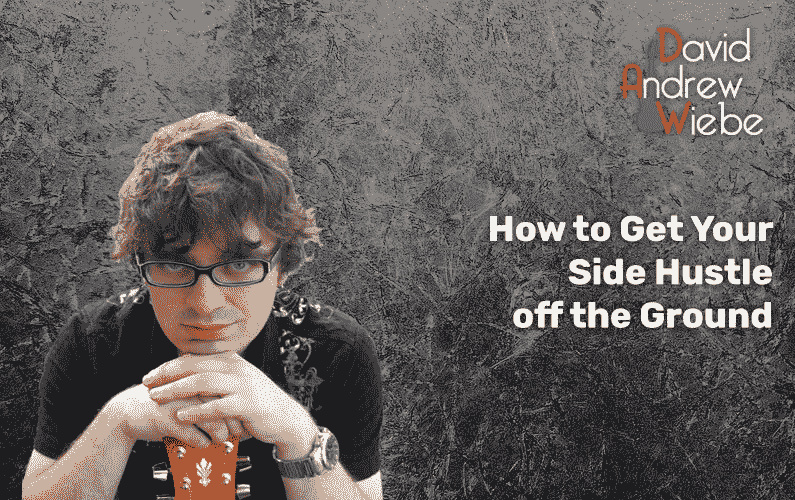

# 如何让你的侧身快速离开地面

> 原文：<https://medium.datadriveninvestor.com/how-to-get-your-side-hustle-off-the-ground-88d1c7b19d72?source=collection_archive---------15----------------------->

## 做你喜欢的事情并获得报酬

作为一名创意人员，拥有一份全职工作并不奇怪。

但是在同等条件下，你可能更喜欢花更多的时间在你的激情上，或者同样有创造性的事情上。

嗯，就我而言，这是历史上最好的时机让一个侧面的骗局开始，不管你的激情、经验或技能如何，都有机会在等着你。

让我们来看看如何让它发生。

# 我的旁门左道

1997 年，我第一次开始为网络写内容。当时的网站相当原始，一般都需要手工编码。

我在 2000 年代中期开始涉足博客，到 2007 年，我已经接受了内容管理系统(CMS ),比如 Movable Type 和 WordPress。

2012 年，我开始写博客赚钱，从那时起，它变得不仅仅是一种兼职。我甚至尝试了[各种利基网站](https://davidandrewwiebe.com/9-niche-sites-i-created/)。

从那以后，我为几十个博客以及企业家和赫芬顿邮报撰稿人代笔。作为自由撰稿人和专职作家，我也写过数百篇博客文章和文章。

今天，写作是我生活的一个重要部分。

想让你的事业蒸蒸日上吗？如果你知道该做什么，去哪里找，你可以比我做得更快。

下面介绍如何发射。

# 第一步——建立一个网站

我知道这与一些人所说的相反，即在社交媒体、YouTube 或 Medium 上建立存在，因为所有的人都在那里。

我喜欢[、YouTube](https://davidandrewwiebe.com/youtube-marketing-for-musicians-an-up-to-date-guide/) 和 [Medium](https://davidandrewwiebe.com/how-to-4x-your-medium-traffic-in-80-days-or-less/) 以及所有其他平台，我甚至经常使用它们。你也非常欢迎在你的营销中使用它们。

但是由于算法的更新和竞争的加剧，你的帖子越来越难被看到，更不用说被关注了。

例如，脸书[今年早些时候宣布了一项算法更新](https://www.socialmediatoday.com/news/facebook-announces-news-feed-algorithm-update-to-put-more-emphasis-on-origi/580827/)，更加强调原创优质新闻内容。

我不是说你的网站一定更容易获得流量。不管怎样，这都需要一些认真的工作。

但是，如果有一件事我可以肯定地说，那就是你将保留对你的网站，它的内容，你如何定位元素，以及其他一切的完全控制。你也不会被封禁或删除。

另外，如果你想吸引客户，我可以向你保证，如果你有一个自定义域名的网站，你会看起来更加专业和可信。

我绝不会把一个潜在的客户送到我的脸书主页上。他们会迷失在所有的噪音和不必要的混乱布局中(尽管我会用脸书来建立联系，为我的网站带来流量)。

最后，你的网站可以——也应该——充当你的作品集。

> 你的网站应该作为你的投资组合。([点击发微博](https://twitter.com/intent/tweet?url=https%3A%2F%2Fdavidandrewwiebe.com%2Fhow-to-get-your-side-hustle-off-the-ground%2F&text=Your%20website%20should%20act%20as%20your%20portfolio.&via=davidawiebe&related=davidawiebe))

如果你想成为一名作家，像我一样，那么你应该定期写博客。

如果你是一名平面设计师，你应该展示你的最新作品。

诸如此类。

如果你明智地使用它，你的网站将成为一个重要的长期资产。

> 如果你明智地使用它，你的网站将成为一个重要的长期资产。([点击发微博](https://twitter.com/intent/tweet?url=https%3A%2F%2Fdavidandrewwiebe.com%2Fhow-to-get-your-side-hustle-off-the-ground%2F&text=If%20you%20use%20it%20wisely%2C%20your%20website%20will%20become%20a%20significant%20long-term%20asset.&via=davidawiebe&related=davidawiebe))

# 第二步——让别人知道你的存在

如果没有人知道你是谁，那么你的网站再漂亮也没用。你找不到任何工作。

你放在网站上的每一点工作都是值得的，因为你可以记录你的旅程，跟踪你的进展，并分享你的工作样本。也就是说，你仍然需要建立意识。

2012 年，我开始为一家[音乐行业初创公司](https://medium.com/datadriveninvestor/my-60-000-dollar-mistake-what-went-wrong-what-i-learned-what-i-would-have-done-differently-390fec787334)担任签约博主/数字营销人员，我开始与发布音乐业务相关内容的所有品牌、博主和播客互动。

无论我去哪里，我都会在博客和社交媒体上发表评论。在我意识到之前，我已经在博客和网站所有者中建立了一定的知名度，我也和他们建立了关系。

我开始交易客座博文。我被邀请参加播客。从长远来看，我甚至被其中一个网站的所有者聘为专职作家。

这也是我最终在代笔领域建立联系的方式。基本上，一个接触会引出另一个。

自由作家艾丽莎·沃克说:

> *考虑到职业关系网，你使用社交媒体越多，你就越能与他人联系——并看到结果。*

她是对的。但我认为你不一定需要“专业”你只需要增加价值。这是通过在其他人的帖子上留下深思熟虑和有见地的评论并保持对话进行来实现的。

还要记住——即使这很伤脑筋，你也可以联系你的整个人际网络，让他们知道你已经开始了你的副业，你可以开始工作了。

 [## 取代你的风投？企业家的 5 条原则|数据驱动的投资者

### 在 Tau Ventures，我们建议所有企业家将融资过程中的勤奋过程视为双向的…

www.datadriveninvestor.com](https://www.datadriveninvestor.com/2020/11/29/replacing-your-vc-5-principles-for-entrepreneurs/) 

# 第三步——了解环境

所以，你已经建立了自己的网站，并开始在社交媒体上互动。

虽然如果你不精通技术，这可能需要更长的时间，但你应该能够在一个周末内完成所有这些工作。我不是说你的网站会在这段时间内完全充实起来，但是你可以在几个小时内拥有一个漂亮的、有一些基本内容的网站。

但是我们还能做些什么来帮助自己走向成功呢？

虽然第一步和第二步是问题的关键，但我们还可以做一件事来让我们的管道充满工作。

好吧，如果你还不知道，有几十个，如果不是几百个网站，你可以列出你的服务，并积极寻找工作。

举例来说，如果你正在考虑专业地写博客，你可以在 [ProBlogger 求职公告板](https://problogger.com/jobs/)上随时找到新的机会。

以下是其他一些值得了解的地方:

*   [Upwork](https://upwork.com/) :几年前，Elance 和 oDesk 合并成为 Upwork，一个自由职业者可以去找工作的地方。我在 Upwork 上取得了很大的成功，像布莱恩·迪恩这样的知名营销人员也是如此。
*   自由职业者:自由职业者很像 Upwork，除了自由职业者对项目投标，人才搜寻者可以雇佣(或购买)他们认为最适合这份工作的人。
*   Fiverr:一个目录，服务提供商可以在其中列出并提供他们的低成本服务。过去所有的服务提供商都收取 5 美元(因此是 5 美元)，但是现在他们根据自己的技能水平和附加服务收取更多的费用。
*   如果你对构建漏斗的任何方面都很熟悉，无论是文案、平面设计、视频制作还是其他，你也可以成功地在漏斗人脉上列出你的服务。

# 侧挤，最后的想法

开始一个侧面的骗局并不复杂。你很有可能会因为你喜欢的东西或者至少是享受的东西而获得报酬。

> 有一个很好的机会，你可以从你喜欢的事情中获得报酬，或者至少是享受。([点击发微博](https://twitter.com/intent/tweet?url=https%3A%2F%2Fdavidandrewwiebe.com%2Fhow-to-get-your-side-hustle-off-the-ground%2F&text=There%E2%80%99s%20a%20good%20chance%20you%20can%20get%20paid%20for%20something%20you%20love%2C%20or%20at%20the%20very%20least%20enjoy.&via=davidawiebe&related=davidawiebe))

根据您要完成的任务的性质，您可能会利用不同的平台，但是您的总体方法可能不会有太大的变化。

祝你在努力中好运！

*你有什么问题吗？还有什么我应该报道的吗？* *在下面的评论里告诉我吧。*

*原载于 2020 年 12 月 14 日 https://davidandrewwiebe.com**的* [*。*](https://davidandrewwiebe.com/how-to-get-your-side-hustle-off-the-ground/)

## 访问专家视图— [订阅 DDI 英特尔](https://datadriveninvestor.com/ddi-intel)