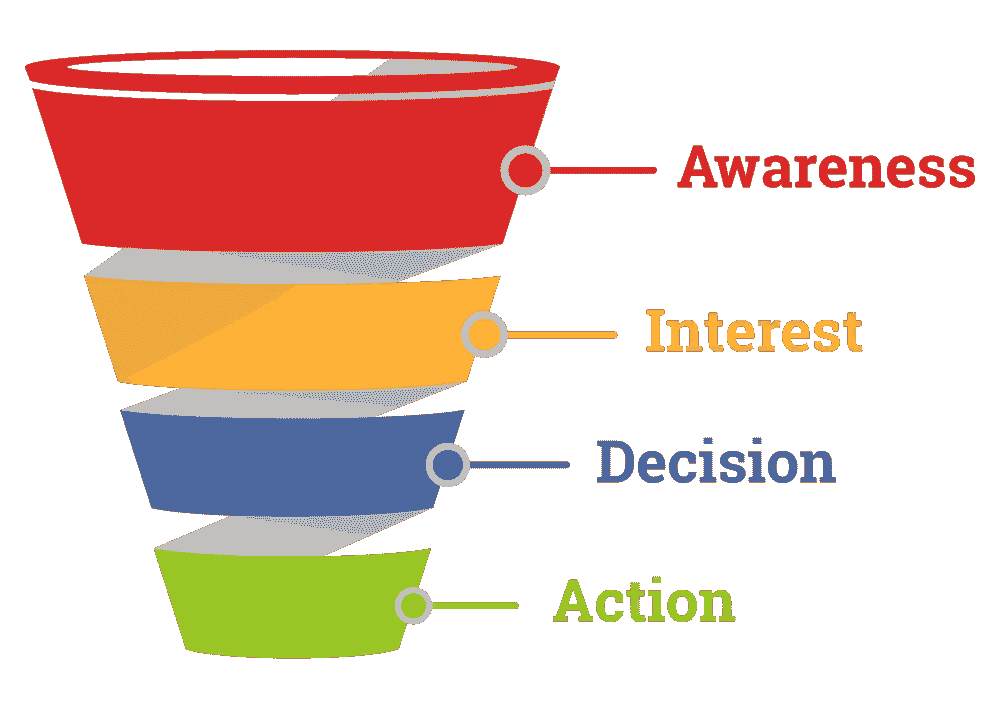

# 如何给你的顾客他们想要的东西，并因此赚钱

> 原文：<https://medium.datadriveninvestor.com/how-to-give-your-customers-what-they-want-and-make-money-doing-so-50c0198bfd4e?source=collection_archive---------5----------------------->

## 销售漏斗与客户旅程不要孤立地考虑它们。

Photo by [Robert Bye](https://unsplash.com/@robertbye?utm_source=medium&utm_medium=referral) on [Unsplash](https://unsplash.com?utm_source=medium&utm_medium=referral)

使用客户旅程或销售漏斗更好？

或者两者都有？

让我们来看看。

# 销售漏斗

销售漏斗从公司的角度描述了你的营销和销售过程。使用 AIDA 模型，您可以将销售周期分为以下四个阶段:

*   意识:潜在客户知道你的存在
*   **兴趣**:潜在客户会了解你能提供什么，以及她是否喜欢你
*   **愿望/决定**:潜在客户信任你和你提供的解决方案。她决定向你购买。
*   **行动:**潜在客户成为客户，现在你的工作是建立长期关系。

如果你知道潜在客户在你的销售漏斗中的位置，你可以回答他们的问题，解决他们的顾虑，并保持他们的兴趣。

该模型显示了从认知到销售的直接路径，并排除了潜在客户在最终销售之前可能经历的所有不同曲折。因此，你不能仅仅依靠你的销售漏斗来洞察你的销售线索的行为。

[https://www.mailmunch.com/blog/sales-funnel/](https://www.mailmunch.com/blog/sales-funnel/)

**了解更多信息:**

 [## 比以往任何时候都更快地发展您的公司需要什么

### 如何捕捉线索，将其转化为客户，并在此过程中获得有价值的见解

medium.com](https://medium.com/datadriveninvestor/what-you-need-to-grow-your-company-faster-than-ever-before-d26de73bf441) 

# 顾客之旅

有了客户旅程图，您可以详细了解客户从第一次接触到销售的路线。它不会像销售漏斗那样简单，因为您的客户会有单独的接触点。网站或企业社交媒体渠道就是这样的接触点。客户甚至有可能在购买前多次访问特定的接触点。

你可以将顾客之旅分为不同的阶段。你必须决定你想要放大到什么程度。我建议您从销售周期的五个主要步骤开始。

**1。意识**

你的潜在客户意识到他有问题。在这个阶段，他在寻找与他的问题相关的信息。他开始在谷歌上搜索，发现了你的内容。也许他在 Instagram 上看到了你的内容，或者看到了一个 add。

**2。考虑事项**

在这个阶段，你的潜在客户寻找信息来解决他的问题。他开始比较不同的选择，试图找出最适合他的。他消费教育内容。作为专家，是你大放异彩的时候了。

**3。转换**

潜在客户为他的问题找到解决方案，决定购买产品，成为你的客户。

**4。保持力**

目标是与您的客户建立关系，并与他们建立长期关系。理想情况下，你可以通过交叉销售和追加销售来提升客户的价值。源源不断的有价值的内容确保你保持相关性。

**5。建议**

你的目标应该永远是让你的客户满意，这样他们才会向他们的网络推荐你的品牌。嘴对嘴的宣传仍然是最有价值的宣传形式之一。

这些只是一般的步骤。你必须选择对你的生意最有意义的。在每个步骤中尽可能详细地填写合理且必要的内容。

Source: [Heart of the Customer](https://heartofthecustomer.com/customer-experience-journey-map-the-top-10-requirements/?utm_source=December+Newsletter&utm_campaign=November+Newsletter&utm_medium=email)

**了解更多:**

 [## 当你的顾客需要时，给他们想要的东西

### 如何准确地知道何时将相关内容交付给你的受众，以便你可以将他们转化为满意的客户

medium.com](https://medium.com/datadriveninvestor/give-your-customers-what-they-want-when-they-want-it-52dff2341358) 

# 结论

对我来说，讨论你应该做客户之旅还是销售漏斗是没有意义的。他们都带来了独特的价值和工作互补。

让我解释一下。

销售漏斗是一种工具，用来识别潜在客户何时何地成为客户。它有助于组织你的营销活动，并知道什么时候特定类型的内容最有意义。您还可以跟踪不同阶段的客户数量，从而计算转化率。

另一方面，顾客之旅有助于你理解顾客是如何对待你的品牌的，以及如何体验你的品牌。这不是衡量的问题，而是改善客户体验的问题。您可以确定需求、痛点和关键时刻。

只有应用这两种方法，你才能从它们的全部潜力中获益，并将你的在线营销提升到一个新的水平。

# **准备好变得无限吗？**

如果你想变得无限并大大加快你的学习速度，看看我的小抄:

[单击此处立即获取备忘单！](https://roadtolimitless.com/cheatsheet/)