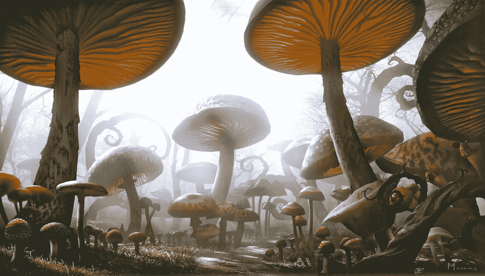
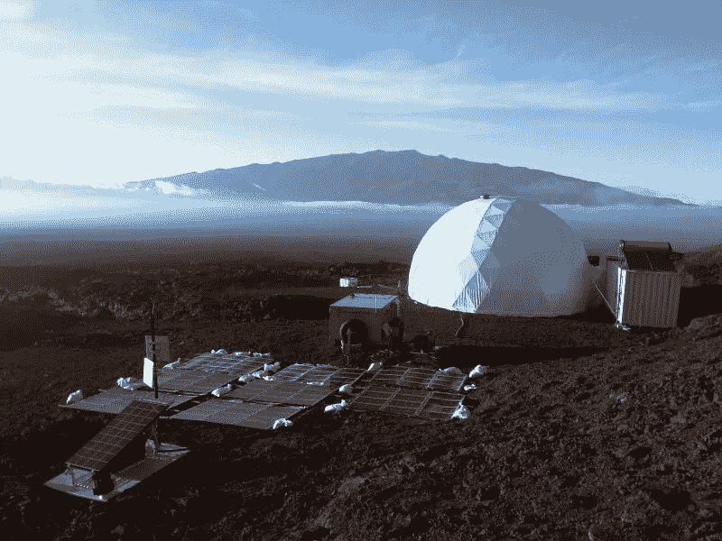
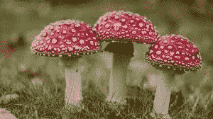
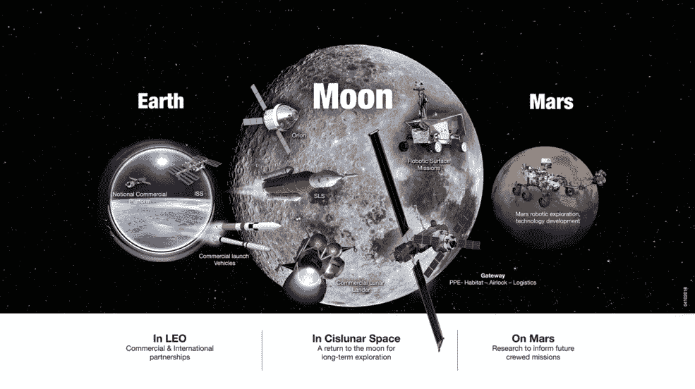
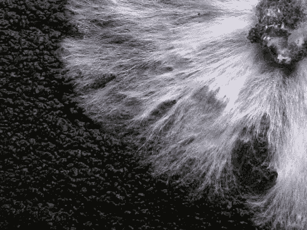
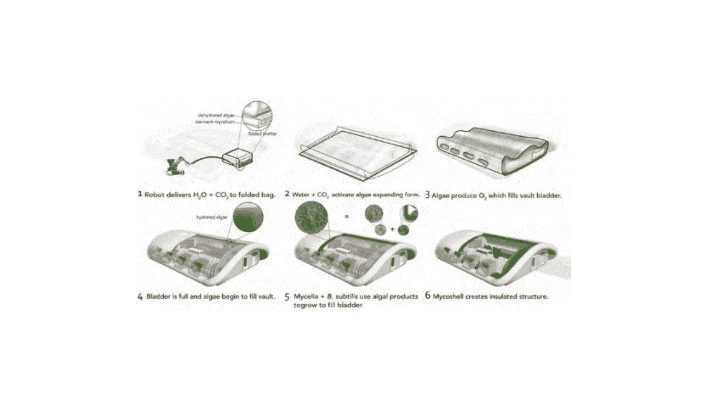
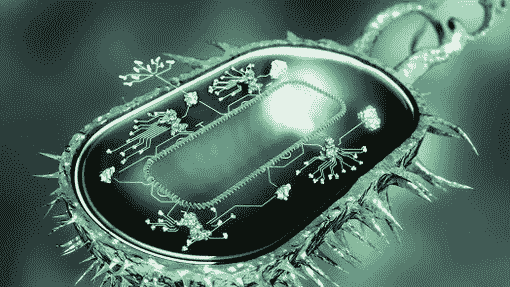
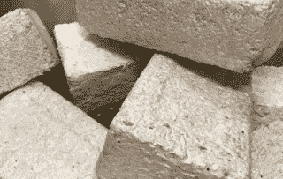
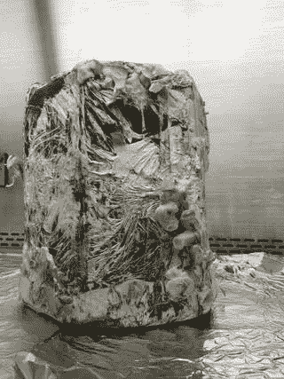
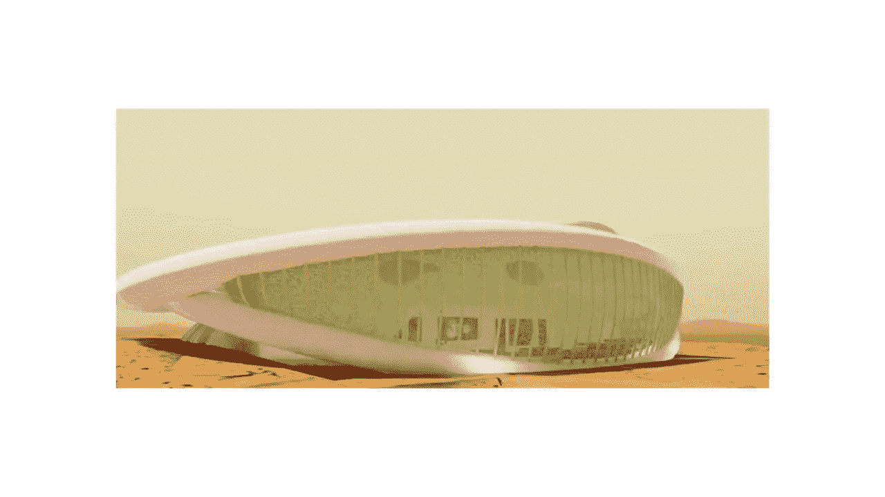

# 如何种植月球基地英尺？蘑菇🍄

> 原文：<https://medium.datadriveninvestor.com/how-to-grow-a-moonbase-ft-mushrooms-835a02bfc41?source=collection_archive---------6----------------------->

## 美国国家航空航天局计划使用真菌菌丝体来种植月球栖息地。

(Credit: NASA)

现在是 2040 年。你是被选中去月球生活的公民宇航员之一。🎉

当你到达时，你可能会期望住在一些由典型的地球材料——玻璃、金属等——制成的栖息地。

然而，情况可能不再如此。

你很可能生活在一个由蘑菇生长而成的建筑里！🍄

Think Alice in Wonderland… but mushrooms with more shape. (Credit: Tim Burton’s Alice In Wonderland)

本周，美国国家航空航天局宣布，它计划将自然融入到创造太空栖息地和其他资源中。🌎

目前，他们的 [**myco-architecture 项目**](https://www.nasa.gov/directorates/spacetech/niac/2018_Phase_I_Phase_II/Myco-architecture_off_planet/) 正在开发可以在月球、火星以及更远的地方“生长”栖息地的原型技术。

 [## 2019 年即将改变世界的技术|数据驱动的投资者

### 很难想象一项技术会像去年的区块链一样受到如此多的关注，但是……

www.datadriveninvestor.com](https://www.datadriveninvestor.com/2019/01/17/the-technologies-poised-to-change-the-world-in-2019/) 

这是一个被称为合成生物学的超级酷领域的一部分(稍后我会深入探讨这个问题)😉)!

# 目前的空间居住想法伴随着高能源成本和缺乏可持续性。👎

> “现在，传统的火星栖息地设计就像一只乌龟——把我们的家背在背上——一个可靠的计划，但需要巨大的能源成本，”—林恩·罗斯柴尔德(myco-architecture 项目的首席研究员。)

我们目前为太空设计的栖息地是由金属等材料制成的大型预制避难所。

计划是把这些结构带到其他星球，并把它们放在那里作为庇护所。

HI-SEAs: A Mars Simulation in Hawaii. One example, of the bulky structures we were planning on utilizing as space habitats. (Credit: HI-SEAS)

这是不可持续的，而且非常昂贵，因为运输这些大件物品需要从我们想要居住的地球➡星球出发几次。

**问题 1:太空旅行需要很多时间。**⌛——从某种角度来看，去火星旅行单程大约需要 9 个月(总共 18 个月)。

火星是一颗离地球相对较近的行星，随着人类成为太空物种，它与我们地球的距离与我们未来可能想要殖民的系外行星的距离相比微不足道。🚀

问题 2:太空旅行需要大量能量。使用所有这些能源来运输太空避难所对我们的环境(地球上)是有害的，并且总体上是不可持续的。

能源消耗、旅行长度和运输这些结构的不可持续性只是我们目前对太空栖息地的方法没有达到它需要的地方的一些主要原因。

美国宇航局的新栖息地研究可以为可持续的太空栖息地铺平道路。

我们可以用地球上的蘑菇在火星上种植。🤯

# 蘑菇又名真菌的简史。

蘑菇是一种真菌，它们可能是太空栖息地的关键。

真菌是任何类型的真核微生物。这包括酵母、霉菌和蘑菇！🍄

(Credit: Earth.com)

我们将集中讨论最后一种——蘑菇。

蘑菇是菌类的*肉质、带孢子的子实体*。

典型地，它们被发现在地面上，土壤上，或者它自己的食物来源上。

**关于真菌的有趣事实！😎**

*   它们是自然界最强大的药物之一。
*   它们具有高度的*细胞间通讯*(基本上它们可以与其他蘑菇/真菌通讯)🤯
*   它们可以保护被移植的器官。
*   更多。

如果你想了解更多关于真菌的超能力，请看 SciShow 的视频:

(Credit: SciShow)

像蘑菇这样的真菌是大自然的超能力成分，我们可以从地球上利用它们来建造我们的真菌庇护所。💡

# 美国宇航局月球基地简史。

1969 年，我们第一次登上了月球！

在那次任务之后，又有五次载人登月任务，在那之后，太空探索停止了一段时间。😞

最近(2017 年 12 月)，美国宇航局决定，他们希望建立一个月球基地，作为他们当年提交给国会的新计划的一部分。

这个计划就是国家太空探索运动，它“呼吁人类和机器人探索任务，以拓展人类经验的前沿，科学发现地球、其他世界和宇宙的自然现象。”✨

😍 (Credit: NASA)

这场运动包含五个战略目标。第 2-4 项与月球活动有关:

*   **领导支持月球表面操作和促进地月空间以外任务的能力部署。(数字二)**
*   **通过一系列机器人任务促进月球资源的科学发现和表征。(数字三)**
*   **让美国宇航员重返月球表面，进行持续的探索和利用活动。(数字四)**

*鸣谢:美国宇航局⬆

美国国家航空航天局的计划是到 2023 年让宇航员绕月飞行，并不迟于 2020 年代末在月球表面着陆！

# 菌丝体有超能力。⚡

足够的背景信息——不是进入菌丝体和真菌架构项目的时候。

真菌架构项目中使用的那部分真菌是*菌丝体*或**菌丝体**。

菌丝体是:“真菌的分枝、线状部分。”🔑

Mycelia! ⚡(Credit: Microscope Master)

那么为什么菌丝体如此粘稠呢？

一言以蔽之，就像很多生命体一样，它有自己的超能力。⚡We 可以利用其中的一些来创造有用的产品，比如月球基地。😉

## **菌丝体超强力分解:**

*   ⬆ **抗弯强度超过钢筋混凝土。💪**
*   **⬆的抗压强度超过木材。**
*   这是一种阻燃剂。🔥
*   **有生长和自我修复的能力(自我修复)。**🤯(当提供了它所需要的条件和养分时)。
*   **这是绝缘体。**
*   **更！😎**

总的来说，我认为很明显菌丝体有一些令人敬畏的超能力！它的许多超能力使它成为生长栖息地的理想成分。

# 菌丝和合成生物的现场生长环境。🌑

目前，美国宇航局正在对菌丝体真菌进行实验，以确定它是否能够在火星土壤中生长。

如果这是成功的，使用菌丝体生长的栖息地很有可能成为他们未来月球基地的庇护所。

## 这是他们的概念性计划:

*   休眠的真菌被运送到月球(或未来的其他星球)。🚀
*   在月球上，真菌被给予水和其他条件来触发它的生长。其中一部分是光合细菌(如藻类)的供应。这是真菌获取营养所必需的。
*   这些真菌会被改造成某种形状。这项工程是合成生物学领域的一部分。(在此列表下有更多相关信息😉).
*   一旦获得预期的结构形状，就对真菌进行热处理。
*   热处理杀死了真菌，留下的是月球基地模型形状的砖状结构。

Diagram of how this could work. (Credit: NASA Ames Research Center)

## 合成生物学包括通过改造生物体使其具有新的能力来重新设计它们。

这太疯狂了。！

它赋予我们创造新生命的能力。🤯

你可以把**合成生物学**想象成*“基因工程 2.0。”* 🧬

It’s like reprogramming life! (Credit: Wallstreet Journal)

合成生物学家重新排列一个由基因、启动子、终止子等组成的库。这些是创造合成生物有机体的基石。

他们还可以设计全新的生物合成途径。

这方面的一个例子就是制造味道像洋葱的藻类。

生物体的味道是生物合成途径，如果这些途径中的基因被重新设计，那么生物体就会有完全不同的味道。😎

菌丝体也可以这样做。

从事真菌结构项目和类似项目的合成生物学家可以创造新的生物合成途径，并重新排列生物部分，以改造真菌，使其以某种形状生长。

他们还可以改造真菌，使其能够在火星土壤中茁壮成长。

有如此多的可能性，像合成生物学这样的新兴技术领域给了我们将这些想法变成现实的超能力！🎉

# 真菌可以用来制造太空旅行的其他产品。

有什么比菌丝体能够帮助我们在太空中建造庇护所更酷的呢？

在合成生物学的帮助下，菌丝体能够帮助我们在地球上创造其他有用的产品！！🎉

美国宇航局的罗斯柴尔德实验室正在开发其他产品，这些产品可以通过将真菌的超能力与合成生物学相结合来创造！

Bricks made of mycelia! (Credit: NASA)

## 几个可能的应用:

*   **生物发光照明💡**
*   **水过滤系统**
*   **生物采矿系统** →从废水中提取矿物质！🤯
*   **湿度调节**
*   **地球的自生栖息地！这将是惊人的，因为目前“地球上 40%的碳排放来自建筑”(美国宇航局)。这可以创造一个更可持续和负担得起的住房解决方案。**
*   **多得多**🎉

Meta 外卖:菌丝体是涂料！🍄

A mycelia stool. (Credit: NASA)

# 🔑外卖:

*   **目前太空栖息地的概念既昂贵又不可持续。**
*   美国宇航局希望在 2020 年代末将宇航员送上月球表面。
*   **真菌有超能力！**
*   **菌丝体是真菌的分枝线状部分。它有许多有价值的特性，这使它成为在太空中生长栖息地的理想选择。**
*   美国宇航局的真菌建筑项目正在研究我们如何将菌丝体的特性与合成生物学结合起来，以建造月球基地。
*   合成生物学是利用基因工程等技术再造生命的领域。
*   菌丝体的特性或超能力也可以被用来创造地球上可持续的和负担得起的产品。这是美国宇航局罗斯柴尔德实验室正在研究的。

# **未来资源**太空栖息地设计师:

*   **美国宇航局栖息地设计竞赛设计灵感的决赛选手:**[https://futurism.com/nasa-mars-habitat-design-competition](https://futurism.com/nasa-mars-habitat-design-competition)
*   **深入探讨 myco-architecture 项目:**[https://www . NASA . gov/directorates/spacetech/niac/2018 _ Phase _ I _ Phase _ II/Myco-architecture _ off _ planet/](https://www.nasa.gov/directorates/spacetech/niac/2018_Phase_I_Phase_II/Myco-architecture_off_planet/)
*   **合成生物学教程:**[https://www.edx.org/course/principles-of-synthetic-biology](https://www.edx.org/course/principles-of-synthetic-biology)
*   **查看美国宇航局 2019 年 Myco-Architecture 报告:**[https://ntrs . NASA . gov/archive/NASA/casi . ntrs . NASA . gov/20190002580 . pdf](https://ntrs.nasa.gov/archive/nasa/casi.ntrs.nasa.gov/20190002580.pdf)

# 为地球和太空的可持续生活铺平了道路。🚀

数十亿年来，大自然一直在完善自己的技术。是时候我们开始研究更多的有机体来发现可以帮助人类创造一个更可持续的未来的超能力了。🌎

myco-architecture 项目对于未来太空和地球上的生命来说是革命性的！

希望今后我们能从这个项目中获得灵感，并开始关注更多基于自然的解决方案来应对挑战。

这个项目仍然相对年轻，但它可能描绘出一幅接近 2040 年月球上生活的画面。💭

Concept art for mycelia habitats on Mars! (Credit: NASA)

嘿！感谢阅读这篇文章。🙏我希望你学到了一些关于菌丝体、太空栖息地和可持续生存的未来的知识。

👋我是阿达拉！一位 17 岁的遗传学研究者、活动家、作家和创新者。我对环境和探索(太空、海洋和陆地)技术有着巨大的热情！我的使命:结合我对技术和社会正义的热情，利用技术帮助实现联合国的一些可持续发展目标(SDG)。🌍我也是一名有抱负的宇航员、飞行员和海洋生物学家。🚀

要继续我的旅程，你可以在 [Twitter](https://twitter.com/astro_adara) 和 [Linkedin 上与我联系。](http://nkedin.com/in/adara-hagman-78a563171/)你也可以在[我的作品集](https://tks.life/profile/adara.hagman)中找到一些我过去的作品，要想获得更多类似本文的文章，我推荐关注我的[媒体博客](https://medium.com/@astronautadara)。

是时候让我深入研究其他空间栖息地概念了！

直到下一个故事，

✌️Dara