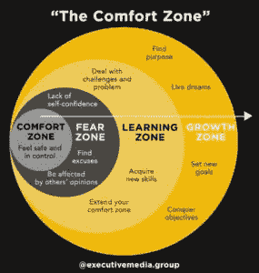
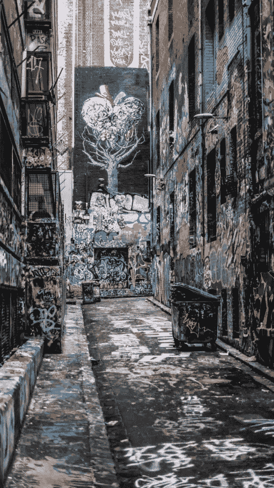

# 如何走出你的舒适区

> 原文：<https://medium.datadriveninvestor.com/how-to-grow-out-of-your-comfort-zone-6de1c9d5f561?source=collection_archive---------21----------------------->

## 我的职业运动员生活日志

Photo by [Eric Prouzet](https://unsplash.com/@eprouzet?utm_source=medium&utm_medium=referral) on [Unsplash](https://unsplash.com?utm_source=medium&utm_medium=referral)

**如何走出你的舒适区**是关于每一个创业领导者，每一段关系，每次你要求加薪，每次你想摆脱一些东西，进入更好的东西。

如果你想要财富，或者爱情，或者健康，或者更多的休息时间，这是关于到达你的舒适区，并穿过它。

许多孩子和家长问，“你如何处理在 ESPN 或欧洲电视上的表演？压力不是很大吗？”

我马上告诉他们我在 ESPN 对泽维尔的比赛中以 2 比 22 获胜，或者在 NCAA 锦标赛的第一轮比赛中，我是如何在哥伦比亚广播公司对坦普尔的比赛中一分未得。我告诉他们我的失误。我的恐惧。我内心深处的想法。

> B 因为没有那些挑战、挫折或创业失败，我们就不能在下一次更深入地去避免它再次发生。

布莱恩·约翰逊称之为英雄酒吧方法。当你感到恐惧、怀疑、不确定，或者当你离开你的舒适区时，是时候伸手去拿英雄(超级食物)棒了，拿出你在失误、挫折和东山再起后拥有的那些成功记忆的声音、味道、气味、触觉和感觉(见下图 1.1)*。我们都有过适应的时候。我们都从失败的关系、糟糕的日子、糟糕的训练中振作起来，重新振作起来，重新出拳。

作为一名前职业运动员，当我面临恐惧、不适或对我来说太大的挑战时，我总是利用我生活中那些伟大的比赛或重大成就。

> 加入我的[职业运动员成长生活简讯](https://mailchi.mp/7600184dc3a3/trevor-huffman-pro-athlete-lessons)。

每个运动员，即使是职业运动员，有时也会感到被征服。我们都以不同的方式面对自己的心魔。我们的疑惑。我们的焦虑。我们的抑郁症。我们的悲伤。我们的悲伤。我们的胜利。每个人在离开舒适区时都会经历这些情绪——那么克服它们的好方法是什么呢？

1.1 where are you?

有什么方法可以让我走出舒适区？

## ***制作英雄棒，需要就吃！***

我们如何制作和烘焙我们的英雄酒吧？

嗯，谢谢你的询问…

在你的生活中，有哪三次你对自己感到惊讶或处于最佳状态？或者说出一些你离开舒适区时真正引以为豪的过去的成就！这些是你生命中的英雄酒吧。

把它们写下来，当你饿的时候就去拿！

**如何走出你的舒适区英雄酒吧:**

1.________________

2.________________

3.________________

# 我喜欢谈论如何离开你作为运动员、旅行者、创业者或父母的舒适区，以优化你的生活，书写你自己的故事。

布莱恩·约翰逊是我的男人。我喜欢看他关于优化、自我保健、健身的视频，以及他对专家和未来思想所写书籍的笔记。如果你喜欢某样东西，你应该集中精力尽可能多地学习它。

今天是我们的英雄在每个篮球孩子，每个父母，每个伙伴，每个企业主中的旅程。虽然我们的旅程是独一无二的，但每天都有数十亿人在向*讲述他们的*故事。当你观察人类时，我们没有什么不同。我们都会醒来。我们都吃饭。深呼吸。爱情。工作。睡觉。花钱。工作。花钱。工作。吃吧。醒来。工作。

# 唯一不同的是[我们为自己写了什么故事](http://www.trevorhuffman.com/how-to-10x-your-basketball-growth-mindset/)。

但是我们当中有多少人学会了如何走出舒适区，在我们热爱的事情上取得成功呢？

我的“如何走出你的舒适区”的故事是篮球。许多运动员利用他们的运动成绩走出他们在商业、创业等领域的舒适区！

但是为什么呢？怎么会？

作为一名前职业运动员，我在做任何事情时都采用舒适区方法。现在，我想达到并掌握写作、教学和辅导孩子和成人成为最好的自己。为了成功，我必须伸手进去吃我的英雄棒，因为这个世界对我来说是陌生的。比如今天，我和 ESPN 的 Brian Windhorst 分享了我的第一个播客，是关于三月疯狂的。

脆弱。

不舒服。

所以我翻出了一个很久以前的英雄吧，那是我在高中英语课上分享第一首诗的时候。课后老师把我拉到一边，告诉我它有多美，我有技能和天赋，应该继续练习。那周晚些时候，我暗恋的一个女生说喜欢我。

等等，什么？分享现在能做什么？

我的英雄吧每次都会不一样。

# 我将如何书写自己的故事？我将如何复制过去的成功？

布莱恩·约翰逊说，伸手去拿英雄酒吧。过去应该被利用(或者被遗忘，如果世界上的思想家和自我反省者试图通过写他们自己的故事而不是让别人写你的故事来实现自我和理解我们的生活(这并不容易)。地球上的大多数人让别人写他们的故事，但我认为不应该是这样的。我觉得没必要这样。

恐惧占据了勇气应该占据的位置。

我是一名作家，所以我喜欢用故事的方式来思考生活。我们的故事是什么？我每天给自己讲什么故事？

我们该给我们的孩子、我们的伙伴、我们的员工……我们自己讲什么故事？