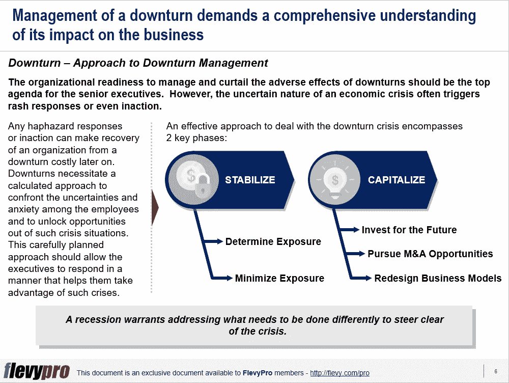

# 如何应对低迷并从中发掘机会？

> 原文：<https://medium.datadriveninvestor.com/how-to-handle-a-downturn-and-unlock-opportunities-out-of-it-2b2588f2d723?source=collection_archive---------20----------------------->

金融危机、不利的供应冲击、技术中断或自然灾害会严重影响全球业务。由这些全球性事件和问题引起的衰退对商品价格、股票市场、经济甚至国家都有严重的影响。

衰退可以被描述为一个收缩的商业周期，整个市场的经济活动显著下降，随之而来的是支出、GDP、实际收入、就业和制造业的下降。经济低迷导致通货膨胀、销售收入和利润下降，以及 R&D 和其他重要支出的削减。由于信贷紧缩、需求放缓、裁员和普遍的不安全感，这种情况给企业带来了挑战。

组织准备好管理和减少衰退的不利影响是高级管理人员的首要任务。然而，经济危机的不确定性常常引发轻率的反应，甚至无所作为。

任何随意的反应或不作为都会使一个组织从低迷中恢复过来的代价很高。[低迷管理](https://flevy.com/browse/flevypro/downturn-management-and-transformation-5212)需要一种经过计算的方法来应对员工的不确定性和焦虑，并从这种危机中释放机会。应对低迷危机的有效方法包括两个关键阶段:

1.  **稳住**

*   确定暴露程度
*   减少暴露

1.  **大写**

*   为未来投资
*   寻找 M&A 的机会
*   重新设计商业模式

让我们更深入地了解这两个阶段。

# 稳定

这一阶段需要采取一系列行动来保护组织免受衰退的影响，并维持维持不确定时期所需的流动性。领先的组织将衰退视为部署有计划但紧急的高优先级干预的机会，以维持企业的标准运作。他们进行仔细的分析，以评估和减少暴露的风险。在低迷时期稳定组织所需的关键步骤包括:

1.  确定暴露程度
2.  减少暴露

## 确定暴露程度

这一步要求对与暴露相关的风险进行系统的评估。这需要评估各种场景及其对组织和行业的影响。这一步骤有助于确定哪些部门更容易受到低迷风险的影响，并保证迅速采取行动。对各种情况的分析有助于向整个组织的人员强调和传达管理衰退所需的干预措施的基本原理。

具体来说，该步骤包括启动 3 个基本操作:

*   进行情景分析
*   量化影响
*   分析竞争

## 减少暴露

一旦高管们确定了经济低迷对其业务的影响，就该着手减少危机风险了。了解经济衰退对企业的影响有助于高级管理人员辨别最合适的生存方法，并在经济衰退期间充分利用他们的组织绩效。

为了生存并最大限度地降低低迷期暴露风险，高级领导层需要保持足够的流动性和获得资本的途径，以便在未来进行稳健的投资，通过生成每周/每月现金报告来检查现金流，削减或推迟可自由支配的支出，实施干预措施以改善基本业务，[改善业务流程](https://flevy.com/browse/stream/process-improvement)，并保持组织的市场价值和对投资者的积极展望。

具体来说，高管必须努力实现这三个目标:

1.  保护财务
2.  保护现有业务
3.  估值最大化。

# 大写

资本化阶段的重点是发展业务，充分利用经济形势。领先的组织以更大的努力和即时、深思熟虑的反应谨慎地管理衰退。经济低迷并不排除高管投资关键干预措施。大多数投资都需要时间来取得成果，当经济状况正常化时，推迟重要的投资可能会使组织陷入被动。

为了利用这些困难时期，高级管理人员需要仔细考虑并优先考虑对提高生产率和收入至关重要的各种投资选项和努力，通过合并或收购巩固业务，抑制在结果不明朗的项目上的支出，搁置对未来成功没有关键作用的努力，并投资发展他们的员工。

具体来说，他们应该制定出 3 个关键行动来利用危机，并在这些艰难时期后恢复活力:

1.  为未来投资
2.  [追求并购&一个机会](https://flevy.com/business-toolkit/manda-mergers-and-acquisitions-ma)
3.  [重新设计商业模式](https://flevy.com/business-toolkit/business-model-design-bmodel)

有兴趣了解更多管理衰退所需的阶段和关键行动吗？你可以在[Flevy documents market place](https://flevy.com/browse)的这里下载[一个关于**低迷管理和转型**的可编辑 PowerPoint。](https://flevy.com/browse/flevypro/downturn-management-and-transformation-5212)

## 你在这个框架中找到价值了吗？

您可以从 [FlevyPro 库](https://flevy.com/pro/library)下载关于这个和数百个类似业务框架的深入介绍。FlevyPro 得到了数千名管理顾问和企业高管的信任和使用。有些人不得不说:

> “我的 FlevyPro 订阅为我提供了当今市场上最受欢迎的框架和平台。它们不仅增加了我现有的咨询和辅导产品和服务，还让我跟上了最新的趋势，为我的实践激发了新产品和服务，并以其他解决方案的一小部分时间和金钱教育了我。我强烈推荐 FlevyPro 给任何认真对待成功的顾问。”

–比尔·布兰森，战略商业建筑师事务所创始人

> “作为一家利基战略咨询公司，Flevy 和 FlevyPro 框架和文件是一个持续的参考，有助于我们为客户构建我们的调查结果和建议，并提高他们的清晰度、力度和视觉效果。对我们来说，这是增加我们影响力和价值的宝贵资源。”

–Cynertia Consulting 的咨询区域经理 David Coloma

> “作为一个小企业主，FlevyPro 提供的资源材料已被证明是非常宝贵的。根据我们的项目事件和客户要求按需搜索材料的能力对我来说很棒，并证明对我的客户非常有益。重要的是，能够针对特定目的轻松编辑和定制材料有助于我们进行演示、知识共享和工具包开发，这是整个计划宣传材料的一部分。虽然 FlevyPro 包含任何咨询、项目或交付公司都必须拥有的资源材料，但它是小公司或独立顾问工具箱中必不可少的一部分。”

–变革战略(英国)董事总经理迈克尔·达夫

> “作为一名独立的成长顾问，FlevyPro 对我来说是一个很好的资源，可以访问大量的演示知识库来支持我与客户的合作。就投资回报而言，我从下载的第一个演示文稿中获得的价值是我订阅费用的好几倍！这些资料的质量让我能够打出超出自己体重的水平，这就像是用很小一部分开销就能获得四大咨询公司的资源一样。”

–Roderick Cameron，SGFE 有限公司的创始合伙人

> “我每个月都会浏览几次 FlevyPro，寻找与我面临的工作挑战相关的演示文稿(我是一名顾问)。当主题需要时，我会进一步探索，并从 Flevy 市场购买。在所有场合，我都阅读它们，分析它们。我采纳与我的工作最相关和最适用的想法；当然，所有这些都转化为我和我的客户的利益。"

量子 SFE 公司首席执行官奥马尔·埃尔南·蒙特斯·帕拉

在 [**管理和企业咨询**](https://app.ddichat.com/category/management-and-corporate-consulting) **:** 中安排一个 DDIChat 会话

 [## 专家-管理和企业咨询- DDIChat

### DDIChat 允许个人和企业直接与主题专家交流。它使咨询变得快速…

app.ddichat.com](https://app.ddichat.com/category/management-and-corporate-consulting) 

在这里申请成为 DDIChat 专家[。
与 DDI 合作:](https://app.ddichat.com/expertsignup)[https://datadriveninvestor.com/collaborate](https://datadriveninvestor.com/collaborate)
点击此处订阅 DDIntel [。](https://ddintel.datadriveninvestor.com/)