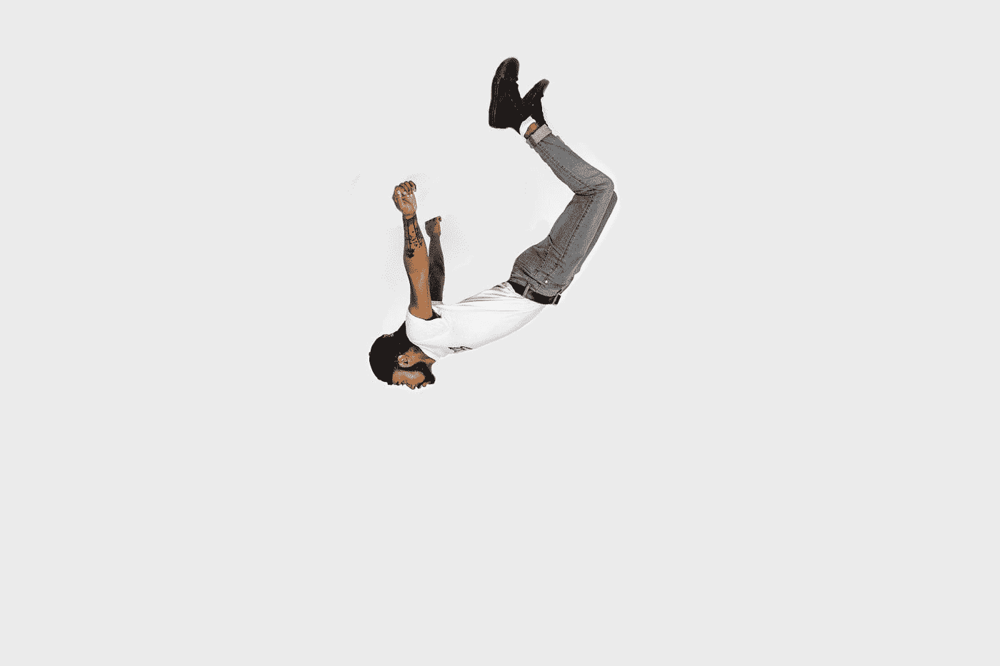

# 如何处理创作焦虑

> 原文：<https://medium.datadriveninvestor.com/how-to-handle-creative-anxiety-8d18ae2b5396?source=collection_archive---------28----------------------->

在你的创造性追求中更加一致

Photo by [visuals](https://unsplash.com/@visuals?utm_source=medium&utm_medium=referral) on [Unsplash](https://unsplash.com?utm_source=medium&utm_medium=referral)

这个帖子可能很烂。我的写作可能不是最好的。这可能不是关于这个特定主题的最有见地的帖子，这没关系…也许吧。

最后一行以“也许”结尾的原因是，我不确定我是否相信本能层面上的声明。我暗暗担心这个帖子没有足够的价值。我真的希望我的作品很棒，我绝对不会对这篇文章很烂的想法感到冷静。最糟糕的是，这种情绪也还好……也许吧。

作为有创造力的人，我们面临的最大问题之一是怀疑。“我不够好怎么办？”后面经常是“如果人们不喜欢呢？”。我们通常认为我们的自我价值与人们对我们所做的反应直接相关。这可能是因为创造性的工作可以是真正的个人工作。

这导致我们拖延，感觉没有动力。这反过来减少了我们成长和成功的机会。

然而，有一种治疗方法……也许吧。

# 确定什么是重要的

Photo by [Kelly Sikkema](https://unsplash.com/@kellysikkema?utm_source=medium&utm_medium=referral) on [Unsplash](https://unsplash.com?utm_source=medium&utm_medium=referral)

你的目标是成长和变得更好还是给人留下深刻印象？你希望你的创造力被公开还是被人看到？

作为一名创意人员，我发现对我来说最重要的是成长，我相信对许多人来说也是如此。

 [## 在家工作如何提高我的工作效率|数据驱动型投资者

### 在家工作确实激发了我最大的潜能，让我更有效率。因为在家工作给了我…

www.datadriveninvestor.com](https://www.datadriveninvestor.com/2020/07/29/how-working-from-home-increased-my-productivity/) 

另一方面，我成长的最好方式是把我的想法放出来。如果我变得如此担心别人的想法，我最终会限制我成长和变得更好的机会。

# 确定你能控制什么

Photo by [Emma Matthews Digital Content Production](https://unsplash.com/@emmamatthews?utm_source=medium&utm_medium=referral) on [Unsplash](https://unsplash.com?utm_source=medium&utm_medium=referral)

我无法控制有多少人会看到我的作品。我不能让人喜欢。如果我把注意力集中在我做不到的事情上，我会慢慢地但肯定地失去做我能做的事情的能力。

那么我能做什么呢？我多久能做一次？

我会画画。我会写字。我能说话。我可以出现，因为我知道我做得越多就越好。

知道该做什么并专注于它，也能让你管理你的期望。良好管理的期望会防止你经历频繁的疲惫和失望。

# 把自己从工作中分离出来

Photo by [David Rotimi](https://unsplash.com/@davidrotimi?utm_source=medium&utm_medium=referral) on [Unsplash](https://unsplash.com?utm_source=medium&utm_medium=referral)

换句话说，学会如何接受反馈。

意识到如果人们不喜欢你的作品，他们不一定是在攻击你，他们只是对你的艺术没有印象。所以听听他们为什么不喜欢它。允许你信任的人仔细检查你的作品，并利用你收集的信息创造更好的艺术。但为了做到这一点，你必须能够在完成创作后，在情感上与你的艺术保持距离。

# 行动

Photo by [Joseph Frank](https://unsplash.com/@josephgruenthal?utm_source=medium&utm_medium=referral) on [Unsplash](https://unsplash.com?utm_source=medium&utm_medium=referral)

很明显，如果你不行动，就不会有任何改变。然而，你也应该注意到这些建议不会根除你的焦虑。你已经得出结论，你的工作是创造，而人们的工作是观察和判断，这一事实并没有消除你的焦虑。它只会帮助你更好地管理它。

就像我在开始所说的，这篇文章可能很糟糕。我的写作可能不是最好的。这可能不是关于这个特定主题的最有见地的帖子，这没关系…也许吧。

> “你的工作是创造，人民的工作是观察和判断”

但我不会让一个也许阻止我成为最好的自己。

**进入专家视角—** [**订阅 DDI 英特尔**](https://datadriveninvestor.com/ddi-intel)