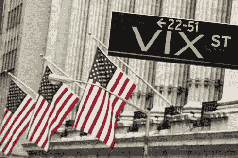
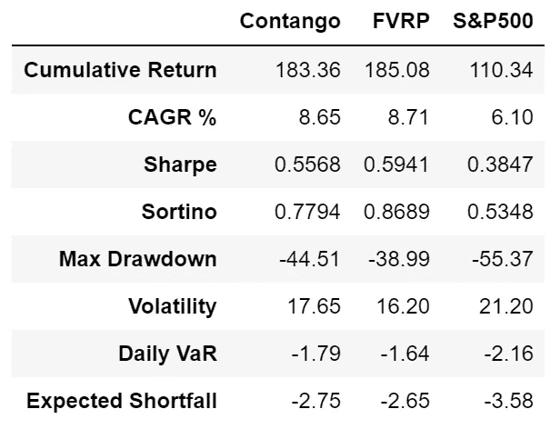
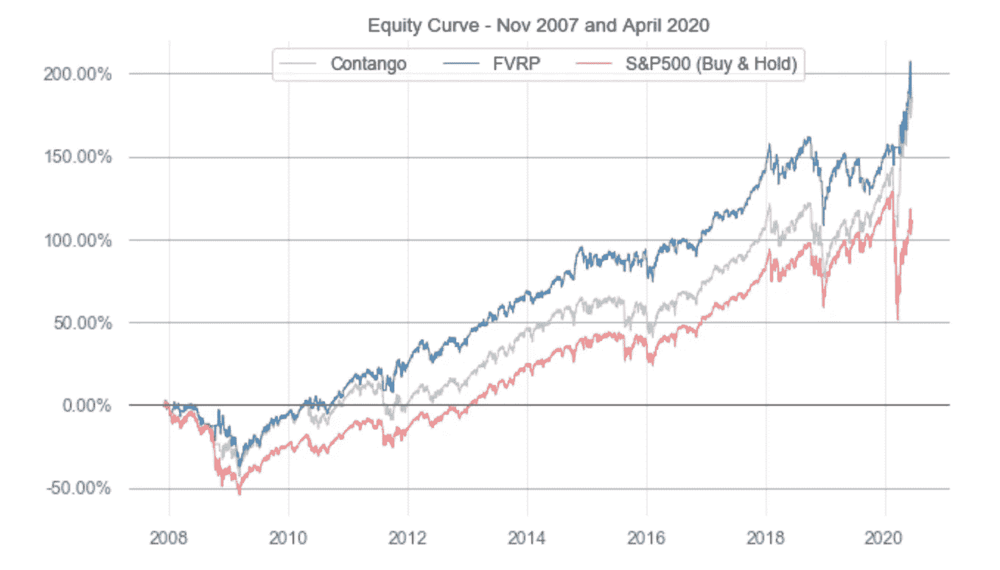
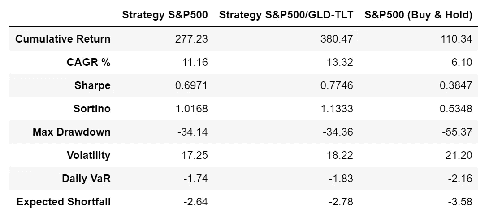
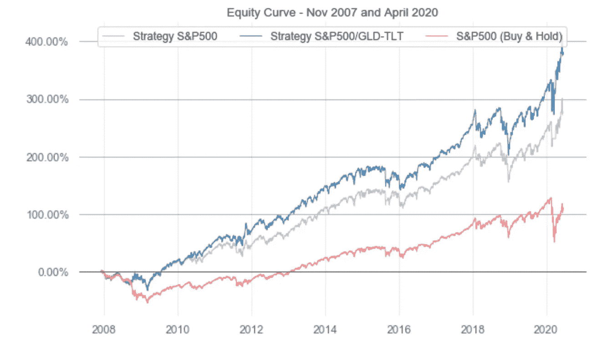
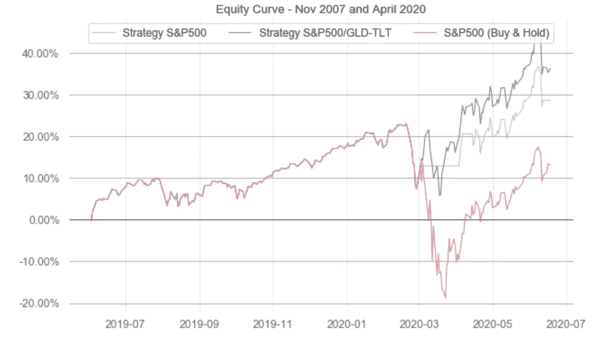

# 如何利用 VIX 的力量来保护你的投资组合？(第三部分)

> 原文：<https://medium.datadriveninvestor.com/how-to-harness-the-power-of-vix-to-protect-your-portfolio-part-3-bbfa12ba7c38?source=collection_archive---------0----------------------->

在[第 1 部分](https://medium.com/@bertrandlenezet/how-to-harness-the-power-of-vix-to-protect-your-stocks-etfs-portfolio-part-2-755dde1ff5fa?source=friends_link&sk=37aded615c585fb35b2bf92e2d02ee80)和[第 2 部分](https://medium.com/@bertrandlenezet/how-to-harness-the-power-of-vix-to-protect-your-stocks-etfs-portfolio-part-2-755dde1ff5fa?source=friends_link&sk=37aded615c585fb35b2bf92e2d02ee80)中，我们通过查看历史报价分布(平均值、四分位数)探讨了 VIX 指数和其他 VIX 相关指数和工具。

我们开发了 8 个来自 VIX 及其前向曲线的信号。这些信号是二进制的，因此返回真(风险开启信号)或假(风险关闭信号)。这些信号非常简单，却非常有力。下面给出了它们的定义，最后展示了一个 python 实现。

8 个指示器和信号:

*   **VRatio** 是 VIX3M 和 VIX 的比值。这个比例上升到 1.1 以上；在熊市中，它会减少并低于 1。VRatio=VIX3M/VIX。更多详情请见第二部分。
    VRatio > 1:风险开启信号
*   **期货溢价**是 VX2(第一个后月合约)和 VX1(前月合约)的比值减一。在牛市中，该指标升至 5%以上，在下跌市场中，该指标降至-5%以下。第二部分中的更多细节。
    期货溢价> -5%:风险信号
*   **期货溢价滚动**是 VX2 第一个后月合约)与 VIX 减一的比率。在牛市中，该指标升至 10%以上，在下跌市场中，该指标降至-10%以下。更多详情请参见第二部分。
    期货溢价滚动> 10%:风险信号
*   **波动率风险溢价(VRP)** 比较隐含波动率与最近实现波动率；它试图量化标普 500 期权卖方为保护投资组合向投资者收取的“额外”溢价(以波动性衡量)。可以看作是保险费。计算 VRP 的一个简单方法是 VRP= VIX -HV10，其中 HV10 是标准普尔 500 的 10 天历史波动率。一些人也看 VRP 的 5 日均线来平滑这个指标。VRP 0:危险信号
*   **快速波动风险溢价(FVRP)** 是 VRP 的变种。FVRP=EMA(VIX，7)-HV5，其中 HV5 是标准普尔& P500 的 5 天历史波动率。
    FVRP > 0:风险开启信号
*   **波动动量**比较今天的 VIX 和过去 50 天。因此，它有相当大的滞后性，但与其他指标结合使用时，它是一个有用的指标。波动动量=SMA(VIX，50) -VIX。
    波动动能> 0:风险信号
*   **VIX 均值回归**将今天的 VIX 与某些阈值进行比较。当 VIX 过高(高于 20)或过低(低于 12)时，我们避免投资标准普尔 500 指数。
    VIX 均值回复> 12 和 VIX 均值回复< 20:风险信号
*   **VIX3M 均值回复**的工作方式与 VIX 均值回复相同。
    VIX3M 均值回复> 12 和 VIX3M 均值回复< 20:风险信号

我们现在要研究如何在交易策略中使用这些信号。但在此之前，先简要说明一下我们用于回溯测试的方法:

*   这些 VIX 指标的阈值/回顾值尚未优化。我们当然可以选择使回溯测试结果更有吸引力的值，但这不是我的观点。我的目标是展示这些信号的有用性，而不是展示最漂亮的回测
*   交易成本估计在 20bp(如今大多数券商提供低 ETF 交易成本；另一种选择(比 ETF 便宜)是利用期货交易这些策略。微型 e-Mini 期货(S&P500 的 MES)使小额交易账户可以进行期货交易)
*   我使用过 Ran Aroussi 开发的优秀分析包 quanta stats([https://github.com/ranaroussi/quantstats](https://github.com/ranaroussi/quantstats))

当我们单独回测这些信号时，我们发现 VRP 和 FVRP 信号是最有希望的。我们将基于这些信号来看 2 种策略:FVRP 策略和期货溢价策略(VRP 策略与 FVRP 太相似了；没意思)。在这两种情况下，

*   如果信号(FVRP，期货溢价)是风险，我们做多 S&P500(如 VOO)
*   否则，我们回到现金

请注意，其他单一指标策略表现相当差(如波动动量，VIX 均值回归)。下面的汇总表和权益曲线比较了期货溢价策略、FVRP 策略和基准(标准普尔 500 买入并持有)的表现。

 [## 利用股市相关性的最佳方式|数据驱动的投资者

### 当阿尔弗雷德·温斯洛·琼斯开创了世界上第一个“对冲”基金(后来“d”被去掉了)时，他让其他投资者大吃一惊…

www.datadriveninvestor.com](https://www.datadriveninvestor.com/2020/02/02/the-best-way-to-use-stock-market-correlations/) 

这两种策略(期货溢价/FVRP)的夏普比率比买入并持有好得多(0.55/0.59 比 0.38)；这是通过获得更好的复合年增长率[CAGR] (8.65%/8.71%比 6.10%)和略低的波动性(17.65%/16.20%比 21.20)实现的。另一方面，这些基本过滤器无助于降低最大压降(-44%/-39%对-55%)。通过观察股票曲线，我们可以看到，这两种策略在次贷危机(2008 年)和 2018 年底的股票抛售期间表现不太好，但在新冠肺炎危机期间表现很好(至少到目前为止；19/06/2020).

尽管如此，这些采用单一 VIX 指标的策略交易起来仍然风险太大，但它们展示了一条道路。如果这些指标并不总是有效(对每个市场体制而言)，为什么不把它们结合起来，创造一个预测能力更强、更稳健的指标呢？

下面是我们如何将这 8 个信号合并成 1 个。如果这 8 个信号中的 4 个或更多在至少连续两天内等于真(这种 2 天规则引入了一点滞后，但防止过于频繁地改变分配；即降低交易成本)，我们认为我们处于风险期(有利于风险可接受的股权投资)，否则，我们认为我们处于风险规避期(对股权投资而言风险过大的时期)。

然后，我们在这一综合 VIX 指标的基础上构建 2 个战略:

S&500 便士/现金

*   冒险:长 S&P500(如 VOO)
*   风险规避:现金

**标普 500 /黄金——美国长期债券**

*   冒险:长 S&P500(如 VOO)
*   规避风险:50%的黄金(如 GLD)和 50%的美国债券(如 TLT)

这两种策略(S&P500 / S&P500-GLD-TLT)的夏普比率比买入并持有好得多(0.70/0.77 比 0.38)；这主要是通过减少提取(深度和持续时间)从而保护我们的权益(即产生更好的复合年增长率/CAGR)来实现的。但是，我们可以观察到，这仍然不是防弹的；例如，这两项战略在 2018 年末表现不佳。但总的来说，这些策略比买入并持有要好很多。

最后，让我们看看这些策略在新冠肺炎危机期间在下面的权益曲线中的表现(2019 年 6 月 1 日至 2020 年 6 月 19 日)。直到二月底，这两种策略相当于买入并持有，但是当股票市场开始崩溃时，我们可以看到这两种策略是如何开始发挥作用的。转向现金或黄金/美国国债保护了我们的权益，甚至从黄金/美国国债中获得了一些利润(安全天堂)。

这两个策略仍然有点太冒险(34%最大下降)，但它们是一个非常好的起点。事实上，S&P500-GLD-TLT 策略和我用真钱交易的策略有 80 %的平均滚动相关性。简而言之，我的策略的大部分回报可以用这个组合 VIX 信号来解释。

在下一篇文章中，我们将研究这 8 个指标是否可以用作训练机器学习模型的特征，该模型将被设计用于预测大规模股权提取。敬请期待！

**进入专家视角—** [**订阅 DDI 英特尔**](https://datadriveninvestor.com/ddi-intel)