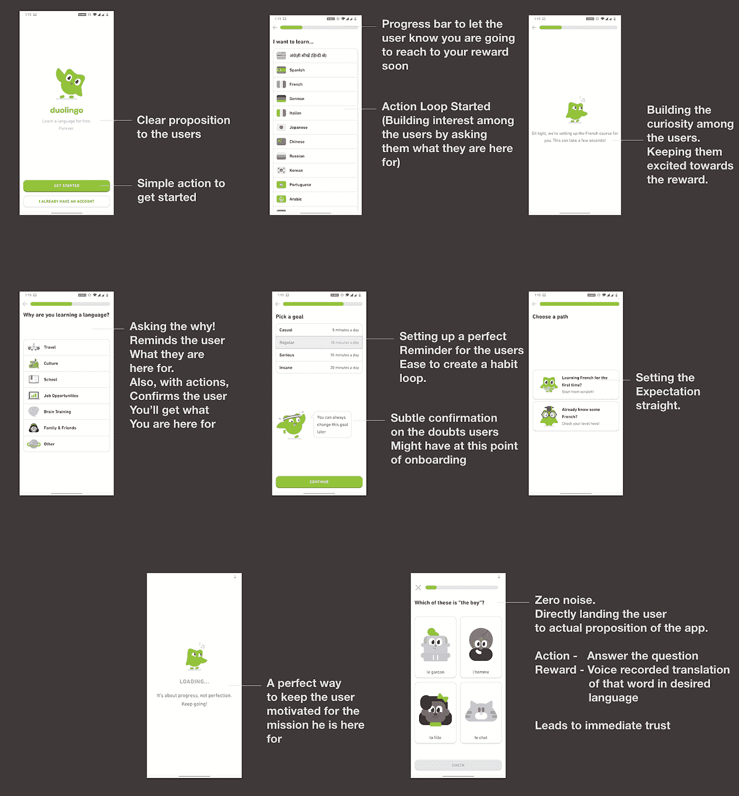

# 如何为您的用户提供完美的入职体验？

> 原文：<https://medium.datadriveninvestor.com/how-to-have-a-perfect-onboarding-experience-for-your-users-88f2decd3a58?source=collection_archive---------16----------------------->

想象一下，一觉醒来，发现自己是一名飞行员，正在驾驶一架飞机。你不知道那里的控制意味着什么，闪烁的灯意味着什么，你应该做什么。

这就是当你在没有产品功能指引的情况下让用户参与进来时，用户的感受。作为产品经理、设计师和研究人员，我们可能对产品如何流动有一个清晰的想法，但我们的用户却没有。定义正确的用户入门体验是设计应用体验最关键的一步。

## **让我们试着了解一下什么是用户入职？**

用户刚刚看到一个广告，并登陆到您的 play store 或 app store 页面。入职体验从那里开始。标题、简短描述、详细描述、评论创造了产品的第一印象。这是用户了解产品如何对他们有用的方式。

当你遇见某人时，你首先通过他们的外表来判断他们。不管怎样，外表创造了你的第一印象。在你和那个人谈过之后，你决定是否要继续这段关系。

 [## 设计隐私|数据驱动的投资者

### 我们生活在一个由技术进步和数字创新主导的时代。关于数据，这些…

www.datadriveninvestor.com](https://www.datadriveninvestor.com/2020/05/18/on-privacy-by-design/) 

同样，用户通过查看 Play Store 页面来判断你的应用程序(以秒为单位)。当用户下载应用程序时，你就在和用户说话，指导用户如何使用应用程序。它可以像问候和解释一样简单，也可以像让用户完成的一系列引导性任务一样复杂。

[查看 Growth design 如何描述 Hey](https://growth.design/case-studies/hey-user-onboarding/) 的入职体验

Onboarding 帮助用户了解他们应该在应用程序上做什么。

在我的应用程序中，我总是试图创造一个行动<>奖励循环。这个灵感来源于 duolingo 如何漂亮的解决。方法如下:

在你所有的用户旅程中有一个行动奖励循环有助于改善用户体验。创建这样的循环有助于用户到达目的地，并验证他们为什么应该保留这个应用程序。

Duolingo 做得很好，它要求用户执行多个动作，并通过帮助他们更接近学习语言的目标来不断奖励他们。

**以一个小练习结束文章:**

在[akshay.reachme@gmail.com](mailto:akshay.reachme@gmail.com)发送你的应用程序的入职体验，我会帮助改进它。

## 访问专家视图— [订阅 DDI 英特尔](https://datadriveninvestor.com/ddi-intel)