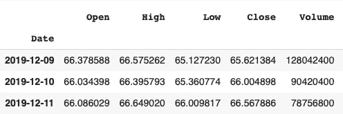
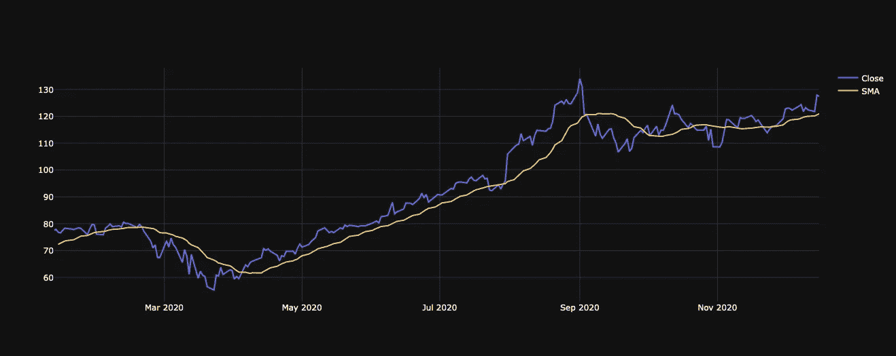
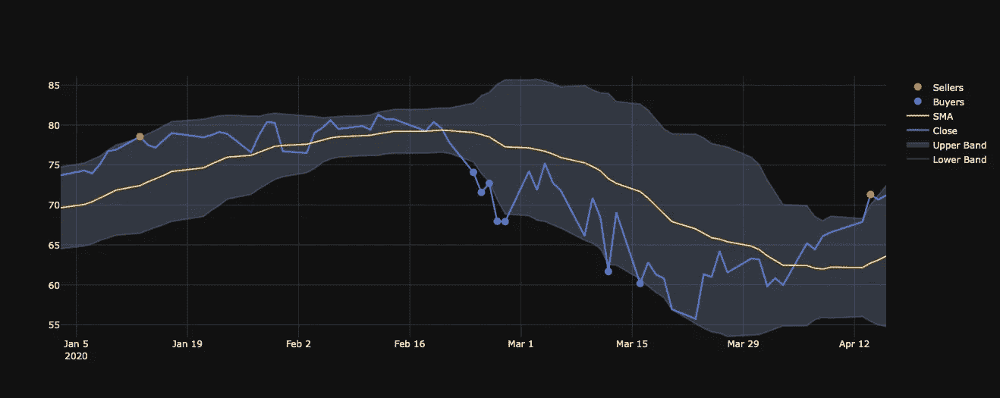

# 如何知道什么时候用 Python 中的布林线交易买股票

> 原文：<https://medium.datadriveninvestor.com/how-to-implement-bollinger-bands-in-python-1106b90da8d1?source=collection_archive---------3----------------------->

## 利用熊猫和 Plotly 来实施一个美丽的布林线策略。


Photo by Author

你花时间看你的股票，寻找机会或异常吗？你愿意平静下来，忘掉这件事，只是在事情发生时得到通知吗？

我不知道你怎么想，但我想平静下来。我浪费了很多时间看我的曲线，统计，预测，这让我浪费了宝贵的时间。

所以我决定做一个通知机器人，告诉我什么时候该买什么时候该卖

[](https://danielcarlander.medium.com/the-most-profitable-investment-in-2020-3a97be030d29) [## 2020 年最安全最赚钱的投资

### 为什么全球指数基金是最有效的投资方式。

danielcarlander.medium.com](https://danielcarlander.medium.com/the-most-profitable-investment-in-2020-3a97be030d29) 

在本文中，我们将研究如何实现该策略，在以后的文章中，我们将研究如何设置电报机器人和托管完整的脚本。

# 战略编码

首先，我们需要选择一个指标。我选择了布林线策略，因为它对我来说很直观。基本上，它告诉你曲线何时便宜，因此，何时是买入的好时机，因为股票可能会上涨。

第二件要做的事是获取我们实施这一战略所需的财务数据。为此，我们将使用 **yfinance** ，这是 python 的雅虎财务库。因为它很简单:

```
import yfinance as yfequity = yf.Ticker("AAPL")
df = equity.history(period='1y')
```

这就是我们所知道的:一个数据框架将会是一个符号的历史数据。



我们可以画出它来感受数据。


Photo by Author

我们现在应该分析曲线。我们要做的第一件事是计算**滚动平均值**。

这是平滑曲线和了解趋势的一种方式。为此，我们只需使用熊猫函数滚动，然后计算平均值:

```
sma = df.rolling(window=20).mean()
```

我们放大一个图来看。



Photo by Author

如你所见，它平滑了曲线，因此给了我们趋势信息。

为何止步于中庸？让我们计算一下**标准偏差。那是什么？它只是给了我们更多关于我们之前计算的平均值的信息:它不是[5，5]的平均值和[0，10]的平均值。嗯，是的，这是一样的，但这并不意味着相同。在第一种情况下，标准偏差为零，而在第二种情况下，为 5。**

为了实现这一点，Pandas 再次用一行简单的代码帮助我们:

```
rstd = df.rolling(window=20).std()
```

计算标准差有助于我们计算过去二十天的波动性。这就是布林理论的由来:

他定义了一个上界和一个下界，它由移动平均值加上/减去两倍的标准差组成。让我们用 python 来看看:

```
upper_band = sma + 2 * rstd
lower_band = sma - 2 * rstd
```

因此，如果过去 20 天波动很大，波段之间的空间会更大，如果市场变化不大，空间会更小。如果我们画出这些带，看起来像这样:


Photo by Author

## 规则

这个策略表明，当曲线的实际值超过上限时，这是卖出指标，因为曲线离滚动平均线很远。同样的，如果股票的实际价值低于较低的波段，这是一个买入信号，因为股票很便宜。

让我们实现它，看看结果。

首先，我们创建一个包含价格和波段的数据框架:

```
bb = df.join(upper_band).join(lower_band)
```

然后，我们可以计算买方和卖方的日期:

```
buyers = bb[bb['Close'] <= bb['lower']]
sellers = bb[bb['Close'] >= bb['upper']]
```

现在我们有了两个带有买入和卖出指标的数据框架。让我们画出它们:



Photo by Author

如你所见，该策略建议在下跌趋势中买入，并建议在大跌前卖出。伙计，如果我在三月份就知道这件事。

这就是你要的:买家，卖家，乐队，只用几行代码。

就我个人而言，我只是用这个指标作为买入信号，因为我相信我买的东西，并以长期眼光投资。你可以点击这里查看[，了解如何使用这个策略来建立一个交易警报的自动通知系统。](https://danielcarlander.medium.com/how-to-set-up-an-automated-trading-strategy-67ad9f8c0a5f)

[](https://danielcarlander.medium.com/how-to-set-up-an-automated-trading-strategy-67ad9f8c0a5f) [## 如何建立自动交易策略

### 使用布林线策略、电报机器人和 Wayscript 接收投资最佳时机的通知…

danielcarlander.medium.com](https://danielcarlander.medium.com/how-to-set-up-an-automated-trading-strategy-67ad9f8c0a5f) 

以下是完整的代码: