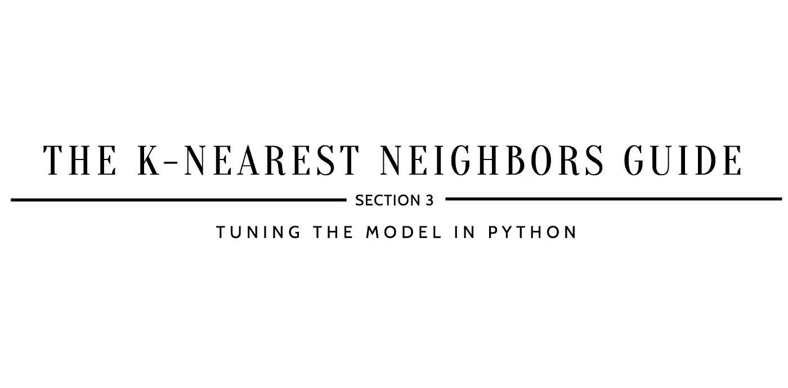
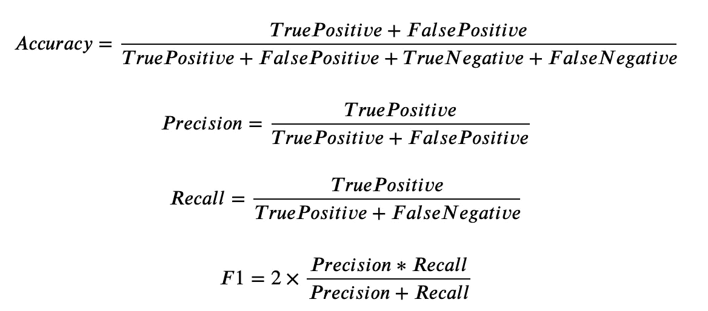

# 如何提高 K 近邻？

> 原文：<https://medium.datadriveninvestor.com/how-to-improve-k-nearest-neighbors-1e9170fb1a89?source=collection_archive---------5----------------------->

## K 近邻指南

## 第 3 节:用 Python 调优模型

*参考* [***如何实现 K 近邻？第 2 节:在继续…* 之前，用 Python**](https://kopaljain95.medium.com/how-to-implement-k-nearest-neighbors-4c46da0396fb) *构建模型*



> ***【10】定义网格搜索参数***

```
param_grid_knn = {
    'n_neighbors': [2, 5, 10, 15],                                   
    'algorithm': ['ball_tree', 'kd_tree', 'brute', 'auto'],          
    'metric': ['minkowski', 'euclidean', 'manhattan', 'chebyshev']
}
```

*   `n_neighbors`是“k”的值-最近邻。
*   `algorithm`是计算最近邻的算法。
*   `metric`是寻找距离的算法。

W hy 这一步:设置所选择的参数用来寻找最佳组合。通过参考[sk learn . neighbors . kneighborsclassifier](https://scikit-learn.org/stable/modules/generated/sklearn.neighbors.KNeighborsClassifier.html)文档，您可以找到可用于网格搜索功能的完整参数列表。

> ***【11】超参数调整使用训练数据***

```
from sklearn.neighbors import KNeighborsClassifier
from sklearn.model_selection import GridSearchCVkNNModel_grid = GridSearchCV(estimator=KNeighborsClassifier(), param_grid=param_grid_knn, verbose=1, cv=10, n_jobs=-1)kNNModel_grid.fit(X_train, y_train)print(kNNModel_grid.best_estimator_)...*Fitting 10 folds for each of 64 candidates, totalling 640 fits**KNeighborsClassifier(algorithm='brute', leaf_size=30, metric='minkowski', metric_params=None, n_jobs=None, n_neighbors=5, p=2, weights='uniform')*
```

注:由于`cv`被定义为 10，有 64 个候选值，因此拟合总数为 640(`n_neighbors`有 4 个定义参数，`algorithm`有 4 个定义参数，`metric`有 4 个定义参数)。因此，总拟合次数的计算→ 10 x [4 x 4 x 4] = 640。

*   `estimator`是感兴趣的机器学习模型，假设该模型具有评分功能；在这种情况下，分配的模型是 KNeighborsClassifier()。
*   `param_grid`是一个字典，参数名(字符串)作为关键字，参数设置列表作为值；这使得能够搜索任何参数设置序列。
*   `verbose`是详细度:越高，消息越多；在这种情况下，它被设置为 1。
*   `cv`是交叉验证生成器还是 iterable，在这种情况下，有 10 重交叉验证。
*   `n_jobs`是并发运行的工人的最大数量；在这种情况下，它被设置为-1，这意味着使用了所有的 CPU。

W 通过这个步骤:找到一个**超参数**的最佳组合，该组合最小化一个预定义的损失函数以给出更好的结果。

> ***【12】对测试数据进行预测***

```
y_pred = kNNModel_grid.predict(X_test)print(y_pred)...*[1 1 0 0 1 1 1 0 0 1 1 1 0 0 0 1 0 1 1 0 0 1 1 1 1 0 1 0 0 0 1 1 0 0 1 0 1 1 1 0 1 0 0 1 1 0 1 0 0 1 1 0 1 1 1 1 0 0 1 0 0 0 1 0 0 0 0 1 0 1 0 1 0 0 0 1 1 1 0 0 1 1 1 0 1 1 1 0 1 0 1 1 1 0 1 0 1 1 1 1 1 1 0 1 0 0 0 0 0 1 1 0 0 0 0 1 1 1 1 0 0 0 1 0 0 1 1 0 0 0 0 1 0 1 0 1 0 1 0 0 0 1 0 1 0 1 1 1 1 0 1 0 1 0 1 1 0 0 1 0 1 1 1 0 0 0 1 0 0 1 0 1 1 0 1 0 0 1 1 1 0 1 0 0 1 1 0 0 1 0 0 1 1 0 0 0 0 1 0 0 0 1 1 1 1 1 0 0]*
```

通过这一步:获得对测试数据的模型预测，以评估模型的准确性和效率。

> ***【十三】数值分析***

```
from sklearn.metrics import confusion_matrix
print(confusion_matrix(y_test, y_pred), ": is the confusion matrix")from sklearn.metrics import accuracy_score
print(accuracy_score(y_test, y_pred), ": is the accuracy score")from sklearn.metrics import precision_score
print(precision_score(y_test, y_pred), ": is the precision score")from sklearn.metrics import recall_score
print(recall_score(y_test, y_pred), ": is the recall score")from sklearn.metrics import f1_score
print(f1_score(y_test, y_pred), ": is the f1 score")...*[[83 32]
[20 73]] : is the confusion matrix 

0.75 : is the accuracy score
0.6952380952380952 : is the precision score
0.7849462365591398 : is the recall score
0.7373737373737373 : is the f1 score*
```

注意:使用混淆矩阵，可以提取真阳性、假阳性、假阴性和真阴性值，这将有助于计算准确度分数、精确度分数、回忆分数和 f1 分数:

*   **真正** = 83
*   **假阳性** = 32
*   **假阴性** = 20
*   **真负值** = 73



Equations for Accuracy, Precision, Recall, and F1.

W 通过这一步:评估调优分类模型的性能。正如您所看到的，通过调整在第 2 节中创建的基本 K-最近邻模型，准确度、精确度、召回率和 F1 分数都得到了提高。

[](https://github.com/kopaljain95/import-data.science-classification/blob/main/KNearestNeighbors%5B2%5D/KNearestNeighbors.ipynb) [## kopaljain 95/import-data . science-分类

### 在 GitHub 上创建一个帐户，为 kopaljain 95/import-data . science-classification 的开发做出贡献。

github.com](https://github.com/kopaljain95/import-data.science-classification/blob/main/KNearestNeighbors%5B2%5D/KNearestNeighbors.ipynb) 

*接下来—* [*为什么要用 K 近邻呢？第 4 部分:评估模型权衡*](https://kopaljain95.medium.com/why-use-k-nearest-neighbors-7535fa8df2c3) *…*