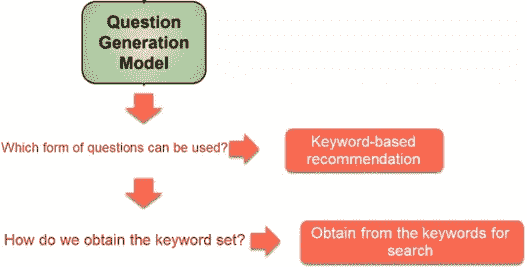
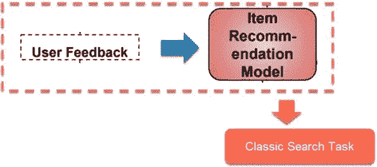
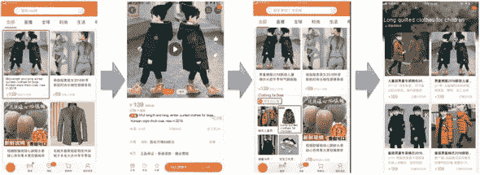
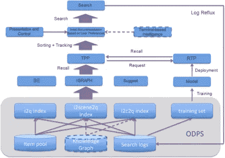
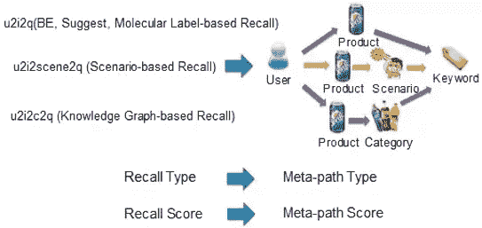
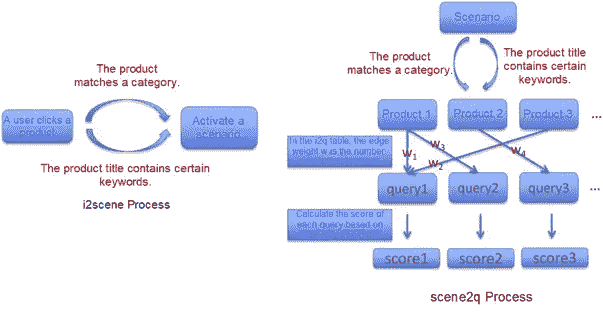
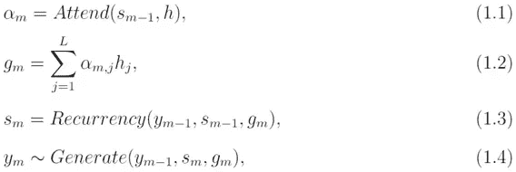
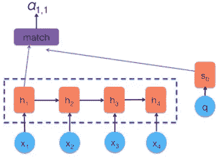

# 如何提高用户参与度:交互式推荐的兴起

> 原文：<https://medium.datadriveninvestor.com/how-to-improve-user-participation-the-rise-of-interactive-recommendations-e8fa9e4d52c2?source=collection_archive---------10----------------------->

不同行业的不同企业广泛使用推荐系统来帮助我们找到我们想要的东西。然而，现有的推荐系统仍然存在两个问题:

1.  这些推荐只关注少数几个主题，并且允许用户只是被动地浏览系统推荐给他们的内容。
2.  有些推荐并不令人满意，因为系统并不了解用户。

用户和推荐系统之间的有效交互可以缓解这两个问题。除此之外，交互给用户更高的参与感，让他们主动浏览推荐结果。另一方面，交互使推荐系统能够更好地理解用户的偏好，从而获得更好的结果。

 [## 算法诱人的商业逻辑|数据驱动的投资者

### 某些机器行为总是让我感到惊讶。我对他们从自己的成就中学习的能力感到惊讶…

www.datadriveninvestor.com](https://www.datadriveninvestor.com/2019/03/22/the-seductive-business-logic-of-algorithms/) 

本文在以下几节中描述了用户如何与推荐系统进行交互。

# 背景

在当今时代，孩子们更喜欢在手机和平板电脑上观看或玩游戏，而不是电视。与电视不同，手机允许用户将节目倒回或快进到他们更感兴趣的部分。看电视时的互动受到限制。但是，当他们在手机或平板电脑上玩王者荣耀时，他们有更多的互动来获得更高的参与感和更多的乐趣。主流推荐系统虽然擅长判断用户的喜好，比如判断用户喜爱的产品，但是在学术上或者从企业应用的角度，在交互推荐方面的探索并不多。

本文参考了大量的学术论文来理解交互在推荐系统中的作用(以下简称交互推荐)。在 2018 年发布的《知识发现和数据挖掘(KDD)》中，我们在论文 Q & r . A Two-Stage Approach to Interactive Recommendation[1]中找到了一个可行的框架。图 1 显示了框架图。(图片摘自《Q&R:走向互动推荐的两阶段方法》，KDD 2018 [1]。)

Figure 1 Interactive recommendation framework

根据这个框架，推荐系统提出一个相关的问题，然后根据从用户反馈中提取的直接兴趣推荐一个项目(例如用户喜爱的产品)。推荐系统的交互反映了整个提问和获得用户反馈的过程。

以下部分描述了框架中的每个模块:

*   问题生成模型:该模型首先确定问题形式和问题生成方法。如果生成一个完整的人类语言的问句，比如“天冷了。你想买一条围巾吗？”虽然自然语言处理已经取得了很大的成就，但是仍然很难基于用户的喜好生成大量这样高质量的问题。因此，该模型将问题生成任务转换为基于关键字的推荐任务，如图 2 所示。

具体来说，模型生成围巾、风衣、帽子等几个关键词，放在卡片里，推荐给用户点击。这些关键词表示问题，“天冷。你想买一条围巾，一件风衣，还是一顶帽子？”从这个例子可以看出，问题是通过基于关键字的推荐产生的。然而，一个新的问题出现了。对于基于关键词的推荐，模型如何获得足够的关键词选项？使用搜索日志中的搜索词作为基于关键字的推荐的选项，因为搜索日志中的搜索词是由用户输入的，并且其中许多是可以表达用户需求的有意义的词。此外，这有助于获得足够多的搜索词，涵盖广泛的需求。所以在不同的环境下，比如不同的季节，会有合适的词推荐给不同的用户。

Figure 2 Question generation logic

*   用户反馈:该模型获取用户反馈信息。让我们回到前面的例子。如果用户点击关键词围巾、风衣或帽子，我们认为用户回答“是的，我想买一条围巾、风衣或帽子。”如果用户没有点击任何关键词，则意味着用户不想购买这些项目中的任何一个。用户反馈还可以包含其他信息，例如用户在点击帽子之前是点击围巾还是风衣，用户是否在商品详情页面上浏览商品，是否将商品添加到购物车，以及是否将商品添加到收藏夹，以及问题生成和用户反馈之间的间隔。(时间间隔越长，表明用户需求越弱。)
*   物品推荐模型:该模型推荐产品。如果用户点击了某个关键词，就暗示用户想购买该关键词所代表的产品。这个关键字然后被用作输入来调用搜索算法以获得产品列表。如图 3 所示，最后两步是经典的搜索任务。

Figure 3 User feedback and product recommendation logic

本质上，这个过程由推荐和搜索顺序组成。推荐是基于用户点击的关键字以及随后的搜索来实现的。搜索任务可能比推荐任务产生更多的交易，但是推荐任务比搜索任务具有更低的交互成本，因为它不需要用户输入。该框架基于明确的用户意图返回满意的产品，而不需要用户输入。它结合了搜索和推荐的优点。

直接调用现有的搜索算法来完成任务，因为最后两步转化为经典的搜索任务。(互动推荐需要定制。)所以第一步基于关键词的推荐是优化重点。

请注意，基于关键字的推荐只是产生问题的一种方式。视频、指南和项目也可用作提问的材料。因此，用户反馈和产品推荐可以是各种形式的。例如，用户对指南的反馈可以从用户行为中收集，如屏幕滑动、喜欢、评论和在指南页面上的停留时间。推荐的产品根据视频、指南或商品进行分类。

# 产品概述

在深入基于关键词的推荐系统之前，我们先来讨论一下产品，为了方便起见，我们称之为“风向标”。风向标有以下特点:

(1)交互式
(2)关注需求、可理解、体感强烈
(3)场景感知

如图 4 所示，用户在淘宝主页(第一张图片)上点击了基于用户偏好预测的推荐商品。在 product details 页面(第二张图片)上，用户在屏幕上滑动，将商品添加到购物车或收藏夹中。当用户返回到上一页时，算法确定是否生成一个风向标和用于风向标的基于场景的文本。比如对于风向标“男生服装”。相关的关键字在第三个图像中。用户点击一个单词后，第二跳搜索结果页面(第四张图片)出现。

Figure 4 Product form of weather vane

# 解决办法

图 5 显示了总体技术框架。首先，在搜索日志、产品信息和知识图数据的基础上生成基本数据表，随后是关键词召回和项目排序。在商品分类过程中，我们不仅考虑用户的历史偏好，还考虑详细信息页面上的用户信息(基于终端的智能)。然后，显示和控制模块用于调整分类结果。在用户点击一个关键词后，搜索过程被触发。最后，生成的日志流回搜索日志。图 5 中的虚线表示将来要优化的模块。

Figure 5 Overall technical framework

接下来，我们来看看四个核心模块。

# 1.回忆

让我们用一个元路径模型来理解整个回忆过程[2]。具体来说，用户、产品、关键词、场景和类别被视为异构信息网络(HINs)中的异构节点，如图 6 所示。使用不同的召回策略来找到匹配每个查询的元路径。召回类型和召回分数分别对应于元路径类型和元路径分数。目的是基于 HINs 中的元路径来确定用户和关键词是否相关以及它们的相关强度。最后将相关性最强的词推荐给用户。本文介绍了三种召回政策。

Figure 6 Meta-path model

*   u2i2q:这个召回政策的核心思想是基于查询到产品的关系(q2i)获得产品到查询的关系(i2q)。i2q 建立了用户点击的产品和查询之间的关系。查询和产品在搜索日志中同时出现的次数越多，它们之间的关系就越密切。在元路径模型中，这种召回策略表明，产品是基于元路径找到的，确切地说，是基于表示查询和产品之间双向关系的元路径找到的。
*   u2i2scene2q:如图 7 所示，这个召回策略由两个进程组成:i2scene(左边)和 scene2q(右边)。在 i2scene 流程中，相应的场景在用户点击产品后激活。在 scene2q 流程中，基于场景生成相关关键词。
*   u2i2c2q:这种召回策略使用知识图和类别信息来提高查询和召回效果。

Figure 7 Scenario-based query and i2score2q recall processes

目前只允许回忆关键词。视频和指南等其他实体将在未来召回。此外，通过使用详细信息页面和知识图表上的操作数据，很有可能提高召回效果。

# 2.整理

排序分为两个过程，精细排序和重排序。精细排序过程有两个版本:

*   版本 1: XFTRL

关于跟随正规化领导(FTRL)的理论研究始于十多年前。谷歌 2013 年在 KDD 发表的论文[3]将这一理论模型带入了实际工程，使得许多企业级在线学习模型得以基于 FTRL 实现。XFTRL 是由基于 FTRL 的 XPS 平台开发的定制模型。它处理淘宝上数千亿个离散的特征。一个离线实验用前四天的数据进行训练，最后一天的数据进行测试。XFTRL 在该测试集中产生 0.67 的 AUC。

*   版本 2:注意 _GRU

(1)动机:XFTRL (FTRL)是有效的，有成熟的工程实现。但是，它有以下缺点:

大量工作证明，用户的短期和长期兴趣以及行动序列[4，5]有助于提高推荐效果。然而，XFTRL (FTRL)通过特征工程仅仅捕获了少量关于短期和长期兴趣以及行动顺序的信息。

XFTRL (FTRL)本质上是一个线性模型。功能交互只能通过向功能工程添加交互功能来实现，这在很大程度上依赖于算法工程师对业务的理解和经验。一般来说，算法工程师在进行特征工程时，只考虑二阶交互特征。这些特征之间的高阶相互作用没有被捕获。简而言之，使用特征工程来捕获特征交互，容易出现无效交互特征的重复或者重要交互特征的不可用。

为了解决这个问题，我们提出了一个定制的注意力 GRU 模型来改善基于关键词的推荐效果。

一方面，注意力 GRU 被证明适用于序列数据(包括历史动作序列)的建模。另一方面，注意力 GRU 本质上是一个神经网络模型。特征之间的(高阶)相互作用由神经网络中的非线性激活函数捕获。在神经网络中输入一些具有高置信度的交互特征，以建立这些交互特征的显式模型。这个定制注意力 _GRU 模型主要是基于 IJCAI 2017 和 IJCAI 2018 发表的两篇论文提出的[4，5]。

(2)模型框架:该模型由四组特征组成:用户端非实时特征、用户端实时特征、查询端特征和其他特征。我们将使用 Concat 方法获得的四组特征连接起来，并将它们输入到一个三层神经网络中。然后，根据神经网络和标签的输出计算损失。

Figure 8 Model framework of weather vane

(3)注意 _GRU:

在前面的公式中，出席和生成是函数。gm 是一个向量。元素 j 指示第 j 个输入的注意力权重。通用叫惊鸿一瞥。递归是一个循环激活函数。在注意力 _GRU 模型中，循环激活函数是 GRU

在 GRU 实现中，前面公式中的 x 对应于图 8 中的 I。

有一系列关于注意力 GRU 模型的实验。在第一个实验中，我们只推荐基于查询端类别特征的项目。我们使用大粒度的类别特征，而不是查询 id，因为查询 id 太稀疏了。

AUC 值为 0.5685，高于 0.5，表明关键词(类别)的流行度有助于基于关键词的推荐。当使用历史动作序列中的产品类别特征时，AUC 分数增加到 0.6037，表明历史产品类别及其序列信息是有用的。由于上述原因，使用产品类别而不是产品 id。

在此基础上，我们添加了产品标题和关键词等文本特征。AUC 值增加到 0.6203，表明文本信息可以进一步提高基于关键词的推荐的效果。最后，我们添加了图 8 中的所有特性。AUC 得分达到 0.6830，超过使用 XFTRL 获得的基准。表 1 列出了实验结果。

表 1 还比较了 XFTRL、Attention_GRU 和 improved Attention_GRU 的离线实验结果

(4)对 Attention_GRU 的改进:为了进一步提高基于关键词推荐的效果，我们对 Attention_GRU 中的注意机制进行了一些创新性的改进，主要动机如下:

用户的历史动作越久远，对基于关键词的推荐的影响越小，关注权重越小。也就是注意力权重随着时间下降。

不同的动作类型对基于关键词的推荐有不同的影响。例如，购买行为的影响大于点击行为的影响，因此两种行为类型的注意力权重不同。因此，注意力权重随着动作类型而变化。

公式 1.1 和 1.2 的计算示意图如下:

Figure 9 Calculate the Attention weight

Figure 10 Time decay and action type considered during the Attention weight calculation

在图 10 中，每个动作类型对应一个

矩阵。假设的维度

是 d。那么，

是一个 d×d 维的矩阵。时间间隔 Time_decay 指示历史动作的发生和基于关键字的推荐的发生之间的时间差。Time_decay 是一个单调递减函数。如表 1 所示，对于改进的 Attention_GRU，AUC 值达到 0.6999，此外，如果我们将 MaxCompute 数据转换为 TFRecord 数据，并将其作为模型输入，训练速度将提高 40%。

(5)一些思考:XFTRL 包含了 Attention_GRU 中所没有的一些特性，但是 XFTRL 在建模中不采用序列和长短期兴趣，这是 Attention_GRU 中实现的，所以 XFTRL 和 Attention_GRU 是相辅相成的。在未来，这两种模型可能会进行整合，以进一步提高推荐效果。

精细分拣流程还有很大的提升空间。例如，考虑如何基于包括关键字、视频和指南在内的多个实体对项目进行排序。细节页面上的用户操作等实时功能对于基于关键字的推荐非常重要。考虑如何基于这些特征更好地建立模型，如何利用知识图数据有效提高建模效果。

重排序过程相对简单。重点是在保证排序效果的同时，生成更加多样化的关键词。

# 3.展示和控制

演示和控制模块由两部分组成:

*   (1)地点、时间和意图控制。
*   (2)情景和行业介入。
*   地点、时间、意图控制:地点和时间控制主要是防止一些不良案例的出现。意图控制使用一个模型来识别用户意图，然后决定是否生成一个风向标。
*   场景和行业干预:排序生成的单词与需求高度相关，但是没有足够的场景意识或差异。所以我们用一个模型，让这四个词更加以场景为中心，生成相应的基于场景的文本(比如图 4 中的“男生的服装”)。另外，我们在双 11 购物节和黑色星期五期间引入行业干预。一方面，我们利用行业知识来提高风向标效应。另一方面，我们完成一些行业目标，实现双赢。

# 4.基于终端的智能

产品详细信息页面上丰富的用户操作信息，包括向购物车和收藏夹添加商品的操作以及停留时间，对于捕捉用户的直接兴趣非常重要。在模型中加入基于终端的智能信息，显著提高了基于关键词的推荐效果。

不管怎么说，这种模式还有很大的改进空间:

许多基于终端的智能信息，包括屏幕滑动轨迹、产品介绍查看和买家评论查看，尚未用于建模。如果加入更多有用的信息，推荐效果一定会提高。

产品详细信息页面上的用户操作构成了序列。利用注意力 GRU 建立基于动作序列的模型，进一步提高推荐效果。

目前，召回、精细分类、重新分类以及呈现和控制过程都在服务器上完成。但是，每个终端都存储自己的型号。如果前面的过程在终端上完成，则终端的模型被实时更新。在服务器端框架中，一个模型服务于所有用户。在终端侧框架中，每个用户都有一个个性化的模型。

# 双 11 购物节

风向标在 2018 年[双 11 购物节](https://www.alibabacloud.com/customers/double-11?spm=a2c41.13948307.0.0)期间效果不错。各项业务指标均超预期。基于用户聚合和被动需求，我们在[双 11 购物节](https://www.alibabacloud.com/customers/double-11?spm=a2c41.13948307.0.0)的不同阶段应用了不同的管控策略。第一阶段，用户有明确的购物意向。我们相应地促进了聚合查询。在下降阶段，被动需求增加。然后，我们主要推广了基于场景的查询。随着夜间购物需求的急剧增加，汇聚查询的数量也随之增加。

Figure 11 Weather vane control policies for the Double 11 Shopping Festival

# 摘要

交互式推荐是一个很有前途的研究方向。我们做了一个创新的尝试，通过风向标在首页实现了基于用户喜好推荐产品的互动推荐。通过我们的努力，风向标在 2018 年双 11 购物节取得了一些成绩。

不过，风向标还有很大的提升空间。我们将在下面介绍其中的一些:

*   产品详细信息页面上的数据有限。仅使用将商品添加到购物车和收藏夹以及停留时间的操作。
*   在未来，我们将获得更多的详细页面数据来优化我们的模型。这些数据包括在详细信息页面上点击的按钮、查看的部分、屏幕滑动跟踪和屏幕滑动速度。
*   基于场景的查询的召回逻辑现在相对简单。我们将使用知识图信息来提高基于场景的查询的召回和精细排序效果。
*   特征系统和目标函数需要改进。目前的特征体系主要包括用户端特征和查询端特征。它没有充分利用触发项信息。目标函数目前主要考虑第一跳点击率。然而，第二跳 IPV 和交易量更重要。因此，我们可以通过对其应用第二跳度量来优化目标函数。
*   目前，第二次跳转时出现的页面是让我们调用搜索 API。而搜索 API 主要考虑的是二跳结果页面与关键词的相关性以及用户个性化。它不考虑第一跳触发项。因此，我们可以优化第二跳算法或设计一个新的算法。

# 参考

*   1) Christakopoulou、Konstantina、Alex Beutel、Rui Li、Sagar Jain 和 Ed H. Chi。Q&R:交互式推荐的两阶段方法。KDD，第 139-148 页。ACM，2018。
*   2)赵、桓、、姚、、宋、、李迪伦。异构信息网络中基于元图的推荐融合。KDD，第 635-644 页。ACM，2017。
*   3) McMahan，H. Brendan，GaryHolt，David Sculley，迈克尔·杨，Dietmar Ebner，Julian Grady，Lan Nie 等人《广告点击预测:来自战壕的观点》。KDD，第 1222-1230 页。美国计算机学会，2013 年。
*   4)朱、于、郝力、廖亦康、王北斗、、关、。下一步做什么:按时间建模用户行为-LSTM。IJCAI，第 3602-3608 页。2017.
*   5)朱、于、朱、、王北斗、关、。定制关注度的品牌级排名系统 _GRU 模型。IJCAI，第 3947-3953 页。2018.
*   6)乔洛夫斯基、扬·k .、迪米特里·巴丹瑙、德米特里·塞尔久克、赵京贤和约舒阿·本吉奥。基于注意力的语音识别模型。NIPS，第 577-585 页，2015 年。
*   7) Mnih、Volodymyr、NicolasHeess 和 Alex Graves。视觉注意的循环模型。NIPS，第 2204–2212 页。2014.

# 原始来源:

 [## 如何提高用户参与度:交互式推荐的兴起

### 阿里巴巴云 2020 年 1 月 21 日 191 个不同行业的企业广泛使用推荐系统…

www.alibabacloud.com](https://www.alibabacloud.com/blog/how-to-improve-user-participation-the-rise-of-interactive-recommendations_595755?spm=a2c41.13948307.0.0)