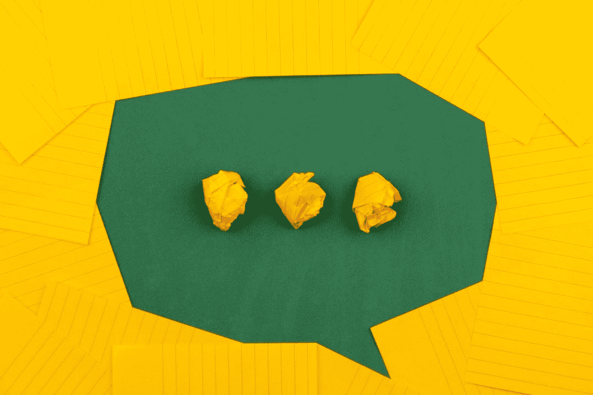

# 如何提高你的电子邮件参与度

> 原文：<https://medium.datadriveninvestor.com/how-to-improve-your-email-engagement-4cd301beeb19?source=collection_archive---------25----------------------->

> “一份想要你提供的东西的小清单比一份没有承诺的大清单要好。”

有必要建立一个电子邮件列表。但一个更重要的因素是你的电子邮件参与度。

它不会随着电子邮件订阅而结束。你必须保持这段关系。把电子邮件订阅想象成一种关系。

你会怎么做来维持你们的关系？你培育它。

但是，当你的订户对你的内容不再感兴趣时，当他们厌倦了这种关系时，会发生什么呢？它发生了。你应该预料到每年会失去 30%的电子邮件用户。人会变的。他们可能对你一年后要说的话不感兴趣。

 [## 影响者在聚光灯下表演|数据驱动的投资者

### 影响者营销是一个脱颖而出的游戏。结果是一个令人难忘的-和可信的-连接到一个产品或…

www.datadriveninvestor.com](https://www.datadriveninvestor.com/2020/01/15/influencers-perform-in-the-spotlight/) 

或者他们订阅了电子书或其他你用来获取他们邮件的线索磁铁，但对你要说的内容不感兴趣。很正常。如果人们取消订阅你的邮件列表，你不应该激动。

但是，每次你发布邮件时，人们会选择留下来阅读你的邮件的唯一方式是，如果你能适当地与他们接触。

以下是一些吸引电子邮件订阅者的方法；

# 从你的邮件主题开始

正如我在之前的文章中提到的，你的主题是你邮件的决定性因素。如果你的主题很无聊，你的打开率就会下降。让你的主题和预览文本更有创意。这才是你的敲门砖。所以，不要在他们看到你的内容之前就搞砸了。

点击查看一些提高邮件打开率的方法

# 不要用电子邮件轰炸你的订户

我说过，这是一种关系。你不想表现得太强势。有时给他们空间。如果你一天给他们发两次邮件，你就有收到垃圾邮件的风险。

没有人喜欢被打扰。太多的电子邮件是一种干扰。试着给你的邮件留出空间。一周一次是完美的。有些人一个月做两次。但我更喜欢每周一次，因为这样，他们会记住你。

# 细分你的清单

电子邮件分段不能被夸大。根据用户与您的互动方式对他们进行细分。

你必须做一些背景工作。不总是数量的问题。质量带给你的是纸。

应该考虑客户人口统计、购买习惯和以前的参与模式。查看经常与您的帖子互动的人，并将他们放在一个列表中。此外，您可以根据链接点击、他们提交的表单域、站点跟踪或其他联系操作来了解他们的兴趣。

分段列表给你更好的打开率和点击率；跳出率提高，退订率降低，客户关系更好。

# 讲故事

每个人买东西都是基于情感，而不是逻辑。为了在情感层面上与你的订户沟通，你必须学习讲故事的艺术。

你的电子邮件订阅者就是你的社区，让他们参与进来。你应该让他们知道你在做什么。试着用一条信息来包装你想要传达的每一条信息。谈谈你经历了什么，你是如何克服具体问题的，一些事情是如何帮助你的，或者一个朋友。

故事自然会吸引注意力。这是一种永不过时的艺术。但是不要无聊，也不要消极。我们都喜欢幸福的结局。这必须是一个激动人心的故事，有一个积极的结局。这个世界够难的；不需要成为一个人悲伤的理由。

确保故事与你想要传达的信息一致。不仅仅是一个随机的故事。

# 发布有价值的信息

有付出就有收获。单方面的关系注定会失败。教给你的听众一些有价值的东西，让他们愿意回头向你了解更多信息。当他们认为你是一个相关的人时，你的观众会更容易接受你出售的材料。

如果你每天都发送促销邮件，你更有可能被忽视。更糟糕的是，你的邮件会被添加到垃圾邮件文件夹中。

每次都尽量给出最好的信息。你可能会想把你的内容分散到下一封邮件中，这样你就可以为将来准备更多的内容。但是最好每次都给出质量——给出完整的信息。

尽量不要把事情复杂化。没有人喜欢学校(好吧，有些人喜欢)。试着为你的读者提供方便。无论你在教什么，都应该尽可能用最基本的形式。

# 庆祝他们的成长和成就

读者有时会因为你教给他们的东西而兴奋不已，以至于他们会回复一条感谢信息，并告诉你他们的成就。

这是一个很好的方式，让你的其他订户知道你教的东西是有效的。你的订阅者会因为你的推荐而认为你是一个可靠的信息来源。另一件好事是，更多的人会想告诉你他们的成就。所以，这是双赢。

# 测试你的电子邮件

没有什么是确定的。一切都是建立在试错的基础上。你应该做一个 A/B 测试。一个实际的步骤是:

*   把你的清单分成两份(A 和 B)
*   使用两个不同的主题行和两份电子邮件副本
*   监控结果

你可以这样做一段时间，以了解什么最适合你的观众。

如果你甚至没有收到他们的收件箱，我给出的所有这些观点都是没有用的。你必须确保你的内容不被标记为垃圾邮件。以下是一些最佳实践；

*   保持事情简单。一个目的地。在你的网站上保留不同的链接是让你的邮件进入垃圾邮件文件夹的一个简单方法
*   给你的邮件留个空间。不要每天发邮件。安排你的电子邮件每周一次或每月两次。
*   不要隐藏退订按钮。每个人都有权取消订阅您的简讯。当你不给他们权利时，你会受到惩罚
*   保持你的内容简短。这不是博客。如果你有很多话要说，可以放一个链接到你的博客。

# 感谢您的阅读。我希望这有所帮助。

如果需要文案和内容写作技巧

点击这里订阅我的简讯

*最初发表于*[T5【https://www.linkedin.com】](https://www.linkedin.com/pulse/how-improve-your-email-engagement-tochukwu-okoro-e-/?trackingId=eSp5DabGS8WcS3odH2vS5w%3D%3D)*。*