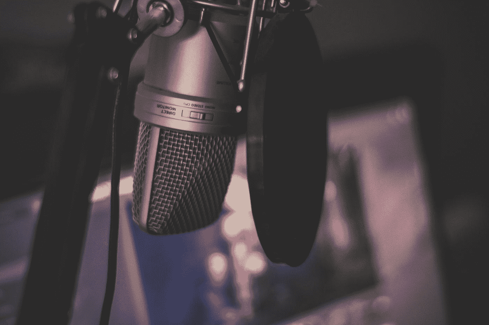

# 如何用智能手机提高你的流质量！

> 原文：<https://medium.datadriveninvestor.com/how-to-improve-your-stream-quality-with-a-smartphone-7f9f4e812753?source=collection_archive---------11----------------------->

所以你决定开始流式传输，这对你有好处，但如果不成功，你不会想在你可能不需要的东西上花很多钱。还有其他方法可以让你更换相机或麦克风。

Photo by [Maik Jonietz](https://unsplash.com/@der_maik_?utm_source=medium&utm_medium=referral) on [Unsplash](https://unsplash.com?utm_source=medium&utm_medium=referral)

其中一种方法是将你的手机作为摄像头或麦克风。如果你可以使用稍微旧一点的手机，那就更好了，这样你就不用担心手机电池会变坏。如果你用的是老款手机，摄像头和麦克风的质量可能会有问题，所以你必须决定你能容忍什么。这个方法安卓和 iphone 都可以，不用管你有什么手机，只要是比较新的就行。

 [## 直播激发人类瞬间|数据驱动的投资者

### Jennifer Quinn 想知道直播到底是什么，于是研究了这个话题并迷上了它。也被称为 JennyQ…

www.datadriveninvestor.com](https://www.datadriveninvestor.com/2019/07/17/live-streaming-inspires-human-moments/) 

## 安卓！

对于安卓手机，你可以使用一款名为 IP 网络摄像头的应用。下载完成后，打开应用程序，找到“启动服务器”。服务器启动并运行后，您会看到屏幕底部显示一个 IP 地址，将其复制并粘贴到浏览器中，同时粘贴到您选择的流媒体软件中作为浏览器源，不要忘记在 IP 地址后添加/video。你也可以启用“场景激活时刷新浏览器”这样做，如果你想的话，你可以快速重置提要。你可能希望改变的另一件事是视频的分辨率；720 便士对于一个普通的流光来说已经足够了。你也可以降低流质量，这样你就不会过度使用手机。

至于 mic，可以去高级设置，复制 Opus 音频格式。然后在流媒体软件上创建一个媒体源，并粘贴到那里；您可能需要取消选中“本地文件”，以便能够看到您需要粘贴它的字段。

## iPhone！

至于 iOS，你得在手机和 PC 上安装一个叫 DroidCam 的 app。你从手机 app 得到的 IP，你需要放到 PC app 上。之后，您可以添加摄像头作为视频采集设备；DroidCam 的画质设定为 480p。首先，你可以通过以管理员身份运行他们的高清模式应用程序来改变这一点，并选择更高的质量。

当你使用这个应用程序时，麦克风直接被检测为音频源，所以你必须进入音频设置并将其更改为音频源。

## 过滤器！

电话麦克风有时并不是最好的，尤其是这种用途，所以你需要在上面安装一些滤波器。只是提醒一下，你需要根据你的设置来查看这些滤波器的设置，因为麦克风质量、电话距离和许多其他原因都会影响性能。

你可以使用的最好的过滤器:增益如果麦克风音量很低，这个会有帮助。噪声抑制，顾名思义，这将有助于消除背景中的噪声。压缩器将帮助您处理多个音频源。噪声增益，你可以用这个来消除所有来自键盘的噪声。

就是这样，你现在可以将你的手机用作摄像头和麦克风，但有一点要记住，当有机会升级它们时，请这样做。

**进入专家视图—** [**订阅 DDI 英特尔**](https://datadriveninvestor.com/ddi-intel)