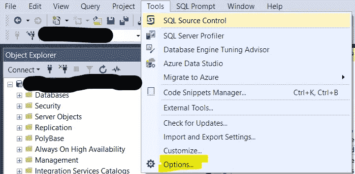
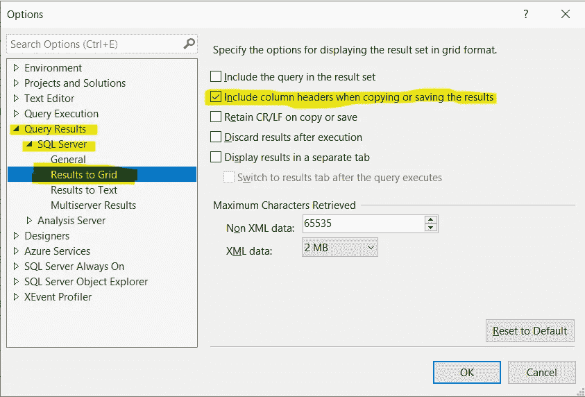

# 如何包含 SSMS SQL 导出的标题

> 原文：<https://medium.datadriveninvestor.com/how-to-include-headers-for-ssms-query-exports-a66ae6edbada?source=collection_archive---------16----------------------->

## 如果没有标题，从 SSMS 复制和导出数据进行共享可能会令人沮丧——以下是包含标题的方法

Photo by [Jonas Jacobsson](https://unsplash.com/@jonasjacobsson?utm_source=medium&utm_medium=referral) on [Unsplash](https://unsplash.com?utm_source=medium&utm_medium=referral)

我不经常需要从 SQL 查询中导出记录。每次我做了(直到今天)，我做了导出，然后不得不手动添加列标题。

由于从 SSMS 出口并不是我经常需要承担的任务，所以这并没有给我带来太大的困扰。我不确定如何对 SSMS 设置进行这种更改，因为我没有花时间去研究它——SSMS 不是我经常使用的东西，因为我通常倾向于使用 Python 库 SQLAlchemy 运行 SQL 查询。

快到圣诞节了，已经开始放松了，我终于决定尝试一下如何添加背景。如果你需要更新标题，我建议你**马上行动**，否则在新的一年里，你仍然需要手动添加标题！

 [## 一瞬间学会数据科学！？数据驱动的投资者

### 在我之前的职业生涯中，我是一名训练有素的古典钢琴家。还记得那些声称你可以…

www.datadriveninvestor.com](https://www.datadriveninvestor.com/2020/07/23/learn-data-science-in-a-flash/) 

# 第一步:

选择**工具>选项**

Photo source: Author

# 第二步:

导航到**查询结果> SQL Server >结果到网格**，然后选择“*复制或保存结果时包含列标题*

# 第三步:

重启 SSMS

## 访问专家视图— [订阅 DDI 英特尔](https://datadriveninvestor.com/ddi-intel)