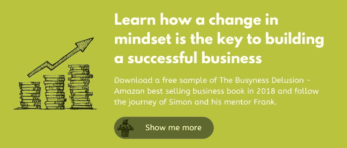

# 如何增强锁定的信心和弹性

> 原文：<https://medium.datadriveninvestor.com/how-to-increase-confidence-and-resilience-in-lockdown-edeb4d6a7e02?source=collection_archive---------41----------------------->

最近你听到多少次人们说“外面真他妈的艰难”？

你可能自己也说过。我知道我有。我不在乎这是不是老生常谈——这是我们大多数人经历过的，或将会经历的最具挑战性的时代之一

那么…你将如何回应？

现在是时候增强你在禁闭中的信心和弹性了，因为我们都有能力做到这一点，无论世界上发生什么，你仍然可以发现[财务安全](https://the3fs.com/what-are-the3fs/#fsp)。

## **这不是适者生存**

饶了我吧。如果这是适者生存，现在只有私人教练会指望他们的祝福。

根据查尔斯·达尔文的观点，生物通过适应环境而生存。这有助于它们茁壮成长，生更多的孩子，并从本质上保持物种的延续。

现在，你可能不想把自己降低到一个纯粹的有机体，但这就是我们所有人，当我们面对今天的挑战时，我们真的应该听从达尔文的话。

你*得*去适应。没有选择。

嗯，有，但它最终会导致信心水平下降，清除目前摆在你面前的障碍的能力大大降低。

暗示只有适者才能生存一直是个麻烦。它暗示了一场战斗——一种战胜生活中每一个艰难时刻的需要。

如果我们看一个常见的业务挑战，我们有一个恰当的例子:[价格上涨](https://the3fs.com/how-to-raise-prices/)。你知道你需要这样做，但是你害怕这样做。

为什么？

你应该与自己斗争来做出这个决定，还是简单地接受你的企业正在适应市场变化？

如果你选择后者，你会经营一家更自信、更有弹性的企业。

## **没有所谓的“坏”环境变化**

诚然，这需要一些思考，但它确实是真的。

当一件事自然地改变时，无论是通过自然的力量，普遍的共识，还是对外部因素的反应，它既不是好的也不是坏的。确实如此。

乍一看，你职业和个人生活中的某些变化似乎很糟糕，但是你可以通过积极应对来让它们变好。

如果我们以封锁为例，考虑一下*如何影响商业，你就会明白我的意思了。*

想象一下，如果企业拒绝改变，而不是转向远程工作技术和家庭办公室。他们会被迫关门，工作会停止，经济会崩溃。

反而大家都适应了。人们把他们的笔记本电脑放在厨房的桌子上、卧室的橱柜上，甚至放在他们的膝盖上——无论他们在哪里——然后继续工作。

结果，产品和服务仍然被拒之门外，而且对许多人来说，它实际上提高了生产率和员工产出的质量。最终结果是什么？更快乐、更高效的员工，以及更可观的利润。

商业中唯一阻碍[动力](https://the3fs.com/motivation-business/)的是你的[心态](https://the3fs.com/adapt-and-recover-your-financial-security/) — *如果*不愿意适应。

## 我让它听起来很简单，对吗？

这才是重点。这不容易——我完全意识到这一点。

进化论并不容易。几代人适应最大挑战的方式从来都不容易。

但这完全取决于你如何定义轻松。对我来说，一旦你意识到“适者生存”是人生中最糟糕的前景，事情就会变得简单。你学会如何积极地适应变化，而不是把它当作一场决斗。

外面很艰难。所以，花时间去适应你的新环境，去适应你迎接生活挑战的方式(因为它不会停止这样做)。

