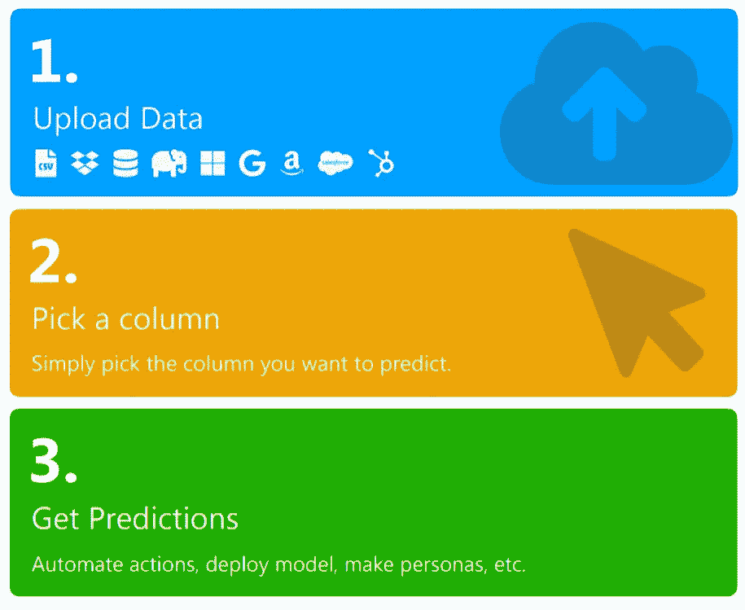

# 如何用无代码人工智能提高转化率

> 原文：<https://medium.datadriveninvestor.com/how-to-increase-conversions-with-no-code-ai-5cd255ce3537?source=collection_archive---------18----------------------->

## 实践指南。

想象一下，你正在往一个桶里装水，但是桶的底部有一个洞。增加注入的水量只是低效的——你需要修补漏洞。

如果你的业务转化率低，那么这就是你的漏斗的样子:一个漏桶。你可以为你的产品或服务得到一千条线索，但是如果这个提议没有引起共鸣，你仍然不会得到转化。

幸运的是，如今使用的无数商业工具兼作数据收集器，可以作为机器学习模型的燃料。例如，两个非常受欢迎的销售 CRM 是 [Salesforce](https://www.obviously.ai/post/7-salesforce-integrations-to-boost-your-productivity) 和 [Hubspot](https://www.obviously.ai/post/7-hubspot-integrations-to-become-a-power-user) ，这两个 CRM 显然都与[有联系。AI](http://obviously.ai) ，一个你可以用来优化销售转化的无代码 AI 工具。

让我们看看它是如何工作的。

# 优化订阅

对于本指南，我们将使用 Kaggle 公开提供的银行订阅销售[数据集](https://www.kaggle.com/prakharrathi25/banking-dataset-marketing-targets)。

这些数据包括客户的年龄、工作类型、在公司的时间以及账户余额等属性。我们将使用这些属性来预测“subscribe”，这是一列“yes”和“no”值，表示客户是否订阅定期存款。

与任何无代码表格人工智能问题一样，预测和优化订阅是一个简单的三步过程。

显然正在将数据集上传到[。AI](http://obviously.ai) 在选择“订阅”作为我们的 KPI 时，有几点见解很突出:

*   随着客户与公司合作时间的增加，订阅费也会增加
*   更富有的顾客以更高的价格订阅
*   担任管理角色的客户订阅费率更高
*   单个客户以(略)高的价格认购

 [## 机器学习和人工智能如何改变电子商务的面貌？|数据驱动…

### 电子商务开发公司，现在，整合先进的客户体验到一个新的水平…

www.datadriveninvestor.com](https://www.datadriveninvestor.com/2020/11/19/how-machine-learning-and-artificial-intelligence-changing-the-face-of-ecommerce/) 

## 采取行动

这些见解为该数据集背后的公司提供了一些可以提高转化率的行为。

营销团队可以把他们的信息和材料的重点放在吸引更富有的，管理级别角色的单一客户上。应该塑造目标人物角色，以反映这些属性会导致更高的转化率这一事实。

此外，公司应该集思广益，尽可能长时间地留住客户，这样可以增加他们转向新订阅的可能性。

一个创造性的策略是跟踪任何访问网站上“取消”页面的用户，并自动向他们发送一封提供折扣的电子邮件。更常见的策略包括定期向现有用户发送更新邮件，甚至在他们的生日和假日发送消息。

然而，归根结底，它是关于密切关注你的漏斗中的每个阶段，看看不同的用户群在哪里下降，并优化你的产品或服务中的这些领域。

# 摘要

无论你使用什么销售工具——如果是 Hubspot、Salesforce 或简单的谷歌表单——你都可以使用无代码人工智能作为优化转化的强大工具。

人工智能过去是一个漫长、昂贵、复杂的过程，但现在任何公司都可以在瞬间建立和部署模型。

进入专家视图— [**订阅 DDI 英特尔**](https://datadriveninvestor.com/ddi-intel)