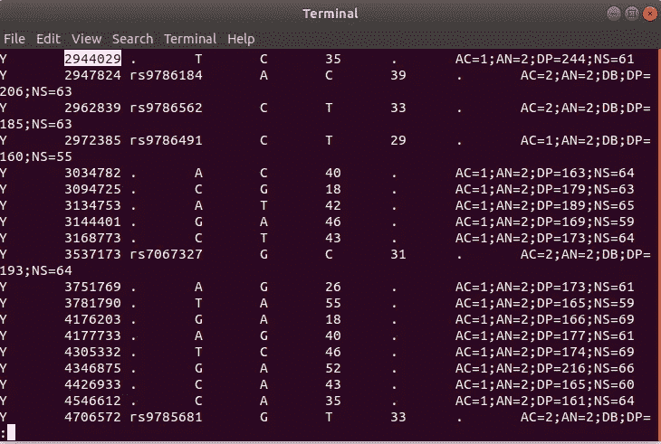

# 如何在 Linux 下检查大数据文件

> 原文：<https://medium.datadriveninvestor.com/how-to-inspect-big-data-files-in-linux-a32962fce047?source=collection_archive---------14----------------------->

## 数据检查

## 作为一名大数据工程师，很多时候我们不得不在大数据文件中寻找内容或进行一些验证。这里有一些流行的工具可以帮助你做到这一点。


Photo by [Markus Spiske](https://unsplash.com/@markusspiske?utm_source=unsplash&utm_medium=referral&utm_content=creditCopyText) on [Unsplash](https://unsplash.com/s/photos/big-data?utm_source=unsplash&utm_medium=referral&utm_content=creditCopyText)

因为我们谈论的是读取大数据文件(通常超过 10 GB)，所以如果我们使用文本编辑器工具，如 **vim** ，或 **nano** ，或 **cat** ，那么查看文件将花费大量时间。我们将使用来自 [diva-gis](http://www.diva-gis.org/datadown) 网站和 vcf_file 的示例文件。如果你想做一些实验，请下载它们。

# 头

顾名思义，“头”支持我们查看文件的开始内容。我们可以使用“head”的选项有很多:

```
NAME
       head - output the first part of filesSYNOPSIS
       head [OPTION]... [FILE]...DESCRIPTION
       Print  the  first  10 lines of each FILE to standard output.  With more
       than one FILE, precede each with a header giving the file name.With no FILE, or when FILE is -, read standard input.Mandatory arguments to long options are  mandatory  for  short  options
       too.-c, --bytes=[-]NUM
              print  the  first  NUM bytes of each file; with the leading '-',
              print all but the last NUM bytes of each file-n, --lines=[-]NUM
              print the first NUM lines instead of  the  first  10;  with  the
              leading '-', print all but the last NUM lines of each file-q, --quiet, --silent
              never print headers giving file names-v, --verbose
              always print headers giving file names-z, --zero-terminated
              line delimiter is NUL, not newline--help display this help and exit--version
              output version information and exitNUM may have a multiplier suffix: b 512, kB 1000, K 1024, MB 1000*1000,
       M 1024*1024, GB 1000*1000*1000, G 1024*1024*1024, and so on for  T,  P,
       E, Z, Y.
```

默认情况下，如果没有任何选项，head 会显示文件的前 10 行。

```
head /path_to/file_name
```

结果会是这样的

```
[general] 
creator=R package 'raster' 
created= 2011-11-12 14:43:02 
[georeference] 
nrows= 1800 
ncols= 912 
xmin= 102 
ymin= 8.5 
xmax= 109.6 
ymax= 23.5
```

或者我们可以自定义第一行的数量

```
head -n 100 /path_to/file_name
```

结果会是这样的

```
[general] 
creator=R package 'raster' 
created= 2011-11-12 14:43:02 
[georeference] 
nrows= 1800 
ncols= 912 
xmin= 102 
ymin= 8.5 
xmax= 109.6 
ymax= 23.5 
projection= +proj=longlat +ellps=WGS84 
[data] 
datatype= INT2S 
byteorder= little 
nbands= 1 
bandorder= BIL 
categorical= FALSE 
minvalue= -14 
maxvalue= 2885 
nodatavalue= -9999 
[legend] 
legendtype=  
values=  
color=  
[description] 
layername= VNM_alt 
history=
```

# 尾巴

与 head 相反，tail 支持显示文件的结束行。

```
TAIL(1)                                                                                      User Commands                                                                                     TAIL(1)NAME
       tail - output the last part of filesSYNOPSIS
       tail [OPTION]... [FILE]...DESCRIPTION
       Print the last 10 lines of each FILE to standard output.  With more than one FILE, precede each with a header giving the file name.With no FILE, or when FILE is -, read standard input.Mandatory arguments to long options are mandatory for short options too.-c, --bytes=[+]NUM
              output the last NUM bytes; or use -c +NUM to output starting with byte NUM of each file-f, --follow[={name|descriptor}]
              output appended data as the file grows;an absent option argument means 'descriptor'-F     same as --follow=name --retry-n, --lines=[+]NUM
              output the last NUM lines, instead of the last 10; or use -n +NUM to output starting with line NUM--max-unchanged-stats=N
              with --follow=name, reopen a FILE which has notchanged size after N (default 5) iterations to see if it has been unlinked or renamed (this is the usual case of rotated log files); with inotify, this option is rarely useful--pid=PID
              with -f, terminate after process ID, PID dies-q, --quiet, --silent
              never output headers giving file names--retry
              keep trying to open a file if it is inaccessible-s, --sleep-interval=N
              with -f, sleep for approximately N seconds (default 1.0) between iterations; with inotify and --pid=P, check process P at least once every N seconds-v, --verbose
              always output headers giving file names-z, --zero-terminated
              line delimiter is NUL, not newline--help display this help and exit--version
```

如果没有任何选项，tail 将显示 10 条结束线。

```
tail path_to\file_name
```

这是结果

```
minvalue= -14 
maxvalue= 2885 
nodatavalue= -9999 
[legend] 
legendtype=  
values=  
color=  
[description] 
layername= VNM_alt 
history=
```

或者显示的行数是 15

```
tail -n 15 path_to\file_name
```

结果将会是

```
datatype= INT2S 
byteorder= little 
nbands= 1 
bandorder= BIL 
categorical= FALSE 
minvalue= -14 
maxvalue= 2885 
nodatavalue= -9999 
[legend] 
legendtype=  
values=  
color=  
[description] 
layername= VNM_alt 
history=
```

# 较少的

Less 是一个命令行实用程序，它一次一页地显示文件或命令输出的内容。与`more`类似，但选项更多。当打开一个内容太大而无法放入一页的文件时，您会看到一个冒号(`:`)。

要前进到下一页，按下`f`键或`Space bar`。如果您想向下移动特定的行数，请键入数字，然后按空格键或`f`键。

您可以按`Down arrow`或`Enter`向前滚动一行，按`Up arrow`向后滚动一行。

要返回上一页，按下`b`键。通过键入数字，然后按`b`键，向上移动特定的行数。

[](https://www.datadriveninvestor.com/2020/05/15/big-data-analytics-in-telemedicine-reshaping-the-healthcare-industry/) [## 远程医疗中的大数据分析重塑医疗保健行业|数据驱动的投资者

### 最近，在冠状病毒疫情的推动下，远程医疗的使用出现了大爆炸。越来越…

www.datadriveninvestor.com](https://www.datadriveninvestor.com/2020/05/15/big-data-analytics-in-telemedicine-reshaping-the-healthcare-industry/) 

如果您想要搜索某个模式，请键入正斜杠(`/`)，后跟您想要搜索的模式。一旦你点击`Enter` less 将向前搜索匹配。要向后搜索，使用(`?`)后跟搜索模式。

当到达文件末尾时，字符串`(END)`显示在屏幕底部。

要退出`less`并返回命令行，请按下`q`。更多高级功能，并允许您在文件中向前和向后导航。启动时，`less`并不读取整个文件，这导致加载速度比像`vim`或`[nano](https://linuxize.com/post/how-to-use-nano-text-editor/)`这样的文本编辑器快得多。

`less`命令主要用于打开[大文件](https://linuxize.com/post/find-large-files-in-linux/)。

当打开一个内容太大而无法放入一页的文件时，您会看到一个冒号(`:`)。

要前进到下一页，按下`f`键或`Space bar`。如果您想向下移动特定的行数，请键入数字，然后按空格键或`f`键。

您可以按`Down arrow`或`Enter`向前滚动一行，按`Up arrow`向后滚动一行。

要返回上一页，按下`b`键。通过键入数字，然后按`b`键，向上移动特定的行数。

如果您想要搜索某个模式，请键入正斜杠(`/`)，后跟您想要搜索的模式。一旦你点击`Enter` less 将向前搜索匹配。要向后搜索，使用(`?`)后跟搜索模式。

当到达文件末尾时，字符串`(END)`显示在屏幕底部。

要退出`less`并返回命令行，请按下`q`。

Less 有相当多的选项供您使用。

没有任何选项，它将显示第一页。

```
less path_to\file_name
```

将显示如下文件

```
##fileformat=VCFv4.0
##fileDate=20100610 
##source=glfTools v3
##reference=1000GenomesPilot-NCBI36 
##phasing=NA
##INFO=<ID=NS,Number=1,Type=Integer,Description="Number of Samples With Mapped Reads">
##INFO=<ID=DP,Number=1,Type=Integer,Description="Total Depth">
##INFO=<ID=DB,Number=0,Type=Flag,Description="dbSNP membership, build 129">
##INFO=<ID=H2,Number=0,Type=Flag,Description="HapMap2 membership">
##FILTER=<ID=NUYR,Description="Variant in non-unique Y region">
##FORMAT=<ID=GT,Number=1,Type=String,Description="Genotype">
##FORMAT=<ID=GQ,Number=1,Type=Integer,Description="Genotype     Quality">
##FORMAT=<ID=DP,Number=1,Type=Integer,Description="Depth">
##INFO=<ID=AC,Number=.,Type=Integer,Description="Allele count in genotypes">
##INFO=<ID=AN,Number=1,Type=Integer,Description="Total number of alleles in called genotypes">
#CHROM  POS     ID      REF     ALT     QUAL    FILTER  INFO
Y       2728456 rs2058276       T       C       32      .       AC=2;AN=2;DB;DP=182;H2;NS=65
Y       2734240 .       G       A       31      .       AC=1;AN=2;DP=196;NS=63
Y       2743242 .       C       T       25      .       AC=1;AN=2;DP=275;NS=66
Y       2746727 .       A       G       34      .       AC=2;AN=2;DP=179;NS=64
```

查看时，您可以搜索内容。

```
/{search_pattern}
```



# 可做文件内的字符串查找

是一个非常强大的搜索文件文本的工具。

```
GREP(1)                          User Commands                         GREP(1)NAME
       grep, egrep, fgrep, rgrep - print lines matching a patternSYNOPSIS
       grep [OPTIONS] PATTERN [FILE...]
       grep [OPTIONS] -e PATTERN ... [FILE...]
       grep [OPTIONS] -f FILE ... [FILE...]DESCRIPTION
       grep  searches  for  PATTERN  in  each  FILE.  A FILE of “-” stands for
       standard input.  If no FILE is given, recursive  searches  examine  the
       working  directory,  and nonrecursive searches read standard input.  By
       default, grep prints the matching lines.In addition, the variant programs egrep, fgrep and rgrep are  the  same
       as  grep -E,  grep -F,  and  grep -r, respectively.  These variants are
       deprecated, but are provided for backward compatibility.
```

例如，我们可以使用 grep 在文件中搜索“2734240”

```
grep "2734240" file_name
```

这是结果

```
% grep "2734240" trio.2010_06.ychr.sites.vcf
Y 2734240 . G A 31 . AC=1;AN=2;DP=196;NS=63
```

# 厕所

代表**字数**。顾名思义，它主要用于计数目的。

*   用于找出文件参数中指定的文件的**行数**、**字数**、**字节数和字符数**。
*   默认显示**四列输出。**
*   第一列显示指定文件中存在的行数，第二列显示文件中存在的字数，第三列显示文件中存在的字符数，第四列本身是作为参数给出的文件名。

```
DESCRIPTION
       Print newline, word, and byte counts for each FILE, and a total line if
       more than one FILE is specified.  A word is a non-zero-length  sequence
       of characters delimited by white space.With no FILE, or when FILE is -, read standard input.The  options  below  may  be  used  to select which counts are printed,
       always in the following order: newline, word, character, byte,  maximum
       line length.-c, --bytes
              print the byte counts-m, --chars
              print the character counts-l, --lines
              print the newline counts--files0-from=F
              read  input  from the files specified by NUL-terminated names in
              file F; If F is - then read names from standard input-L, --max-line-length
              print the maximum display width-w, --words
              print the word counts--help display this help and exit--version
              output version information and exit
```

例如

```
wc path_to\file_name
```

揭露

```
% wc trio.2010_06.ychr.sites.vcf
  975  7720 49128 trio.2010_06.ychr.sites.vcf
```

其中 975 是行数，7720 是字数，49128 是字节数。

# AWK

实际上是一种专门处理文本的领域语言，可以作为一个命令行高效地工作。

```
There’s also GNU Awk, known as Gawk, which
is based on the original Awk but has many extended features (and
an excellent manual; see man gawk ). In the examples in this section,
I’ve stuck to a common subset of Awk functionality shared by all
these Awks. Just take note that there are multiple Awk implementa‐
tions. If you find Awk useful in your work (which can be a personal
preference), it’s worthwhile to use Gawk.
```

我们将用 gawk 作为例子。

```
gawk '{ print $0 }' trio.2010_06.ychr.sites.vcf
```

将打印整个文件

```
##fileformat=VCFv4.0
##fileDate=20100610 
##source=glfTools v3
##reference=1000GenomesPilot-NCBI36 
##phasing=NA
##INFO=<ID=NS,Number=1,Type=Integer,Description="Number of Samples With Mapped Reads">
##INFO=<ID=DP,Number=1,Type=Integer,Description="Total Depth">
##INFO=<ID=DB,Number=0,Type=Flag,Description="dbSNP membership, build 129">
##INFO=<ID=H2,Number=0,Type=Flag,Description="HapMap2 membership">
##FILTER=<ID=NUYR,Description="Variant in non-unique Y region">
##FORMAT=<ID=GT,Number=1,Type=String,Description="Genotype">
##FORMAT=<ID=GQ,Number=1,Type=Integer,Description="Genotype Quality">
##FORMAT=<ID=DP,Number=1,Type=Integer,Description="Depth">
##INFO=<ID=AC,Number=.,Type=Integer,Description="Allele count in genotypes">
##INFO=<ID=AN,Number=1,Type=Integer,Description="Total number of alleles in called genotypes">
#CHROM POS ID REF ALT QUAL FILTER INFO
Y 2728456 rs2058276 T C 32 . AC=2;AN=2;DB;DP=182;H2;NS=65
Y 2734240 . G A 31 . AC=1;AN=2;DP=196;NS=63
Y 2743242 . C T 25 . AC=1;AN=2;DP=275;NS=66
Y 2746727 . A G 34 . AC=2;AN=2;DP=179;NS=64
Y 2777970 . T A 67 . AC=1;AN=2;DP=225;NS=67
Y 2782506 rs2075640 A G 38 . AC=1;AN=2;DB;DP=254;H2;NS=66
Y 2783755 . G A 51 . AC=1;AN=2;DP=217;NS=67
Y 2788927 rs56004558 A G 38 . AC=1;AN=2;DB;DP=173;NS=60
Y 2813908 . T G 46 . AC=1;AN=2;DP=188;NS=67
Y 2815679 . T C 30 . AC=1;AN=2;DP=205;NS=64
Y 2816471 rs9785784 T A 40 . AC=1;AN=2;DB;DP=212;NS=64
Y 2841844 . T G 41 . AC=1;AN=2;DP=176;NS=56
Y 2891375 . T C 29 . AC=1;AN=2;DP=176;NS=61
Y 2899051 . C T 51 . AC=1;AN=2;DP=206;NS=68
Y 2900301 . G A 54 . AC=1;AN=2;DP=167;NS=65
Y 2923665 rs7892924 G A 34 . AC=1;AN=2;DB;DP=171;NS=63
Y 2944029 . T C 35 . AC=1;AN=2;DP=244;NS=61
Y 2947824 rs9786184 A C 39 . AC=2;AN=2;DB;DP=206;NS=63
```

和

```
gawk '{ print $2 "\t" $3 }' trio.2010_06.ychr.sites.vcf
```

这里，我们使用 Awk 的字符串连接。如果两个字符串在没有参数的情况下相邻放置，则它们被连接在一起。因此，对于每条记录，$2"\t"$3 连接第二个字段、一个制表符和第三个字段。这比 cut -f2，3 更典型，但是演示了我们如何使用编号变量$1，$2，$3 等访问当前记录的某一列的值。

```
v3 

of Samples
Depth"> 
membership, build
membership"> 
in non-unique

Quality"> 

count in
number of
POS ID
2728456 rs2058276
2734240 .
2743242 .
2746727 .
2777970 .
2782506 rs2075640
2783755 .
2788927 rs56004558
2813908 .
2815679 .
2816471 rs9785784
2841844 .
2891375 .
2899051 .
2900301 .
2923665 rs7892924
2944029 .
2947824 rs9786184
2962839 rs9786562
2972385 rs9786491
3034782 .
3094725 .
3134753 .
3144401 .
3168773 .
3537173 rs7067327
3751769 .
3781790 .
4176203 .
4177733 .
4305332 .
4346875 .
4426933 .
4546612 .
4706572 rs9785681
4934629 .
5066360 .
5121270 .
5189448 .
5257625 .
5277196 .
5746218 .
5788934 rs9785799
5878860 .
6060464 rs7067483
6067257 .
6520348 .
6667318 .
6690931 rs9785983
6722712 .
6737619 rs17250310
6741979 .
6810775 .
6814490 .
6826034 rs56244518
6886543 .
6893285 .
6907416 .
6908560 .
6928118 rs1865680
6941616 .
6952596 rs56251248
6965504 rs11799224
6972992 rs9786566
6983525 .
6986038 .
6991040 .
6991590 rs9785722
7001218 rs9306845
7003522 rs17250345
7026097 .
7055523 rs7893107
7062912 .
7111360 .
7126305 .
7134048 .
7141561 rs9785707
7158985 rs9786895
7164553 .
7192713 rs3116338
7197088 .
7229899 rs9785675
7233143 rs9786714
7236889 .
7237189 rs9785710
7244644 .
7250277 .
7269744 .
7280727 rs9786755
7304075 .
7337546 .
7346986 .
7366539 rs9786097
7376588 .
7380623 rs9786145
```

# 结论

以上这些工具并不新，但是如果我们把它们结合起来，它们在分析和检查数据时会很有帮助。

谢谢你看我的帖子。

# 参考

[](https://linuxize.com/post/less-command-in-linux/) [## Linux 中的命令更少

### Less 是一个命令行实用程序，它一次一页地显示文件或命令输出的内容。这是…

linuxize.com](https://linuxize.com/post/less-command-in-linux/) [](https://www.geeksforgeeks.org/wc-command-linux-examples/) [## Linux 中的 wc 命令及示例- GeeksforGeeks

### wc 代表字数。顾名思义，它主要用于计数目的。它用于找出…的数量

www.geeksforgeeks.org](https://www.geeksforgeeks.org/wc-command-linux-examples/) 

[生物信息学数据技能书](https://www.google.com/url?sa=t&rct=j&q=&esrc=s&source=web&cd=&cad=rja&uact=8&ved=2ahUKEwiM8tKE663rAhUQxYsBHW04CL8QFjAAegQIAhAB&url=https%3A%2F%2Fwww.amazon.com%2FBioinformatics-Data-Skills-Reproducible-Research%2Fdp%2F1449367372&usg=AOvVaw1E72B-QCwr3pis-OU4mNm_) —作者文斯·布法罗

**访问专家视图—** [**订阅 DDI 英特尔**](https://datadriveninvestor.com/ddi-intel)