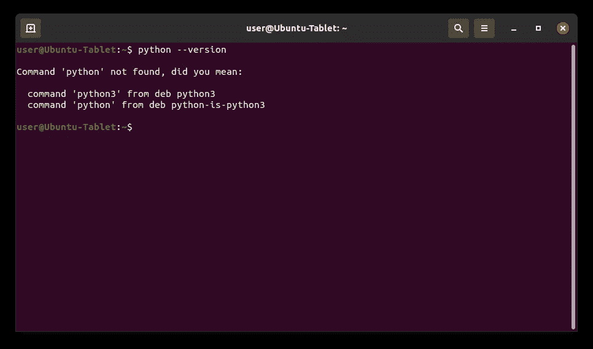
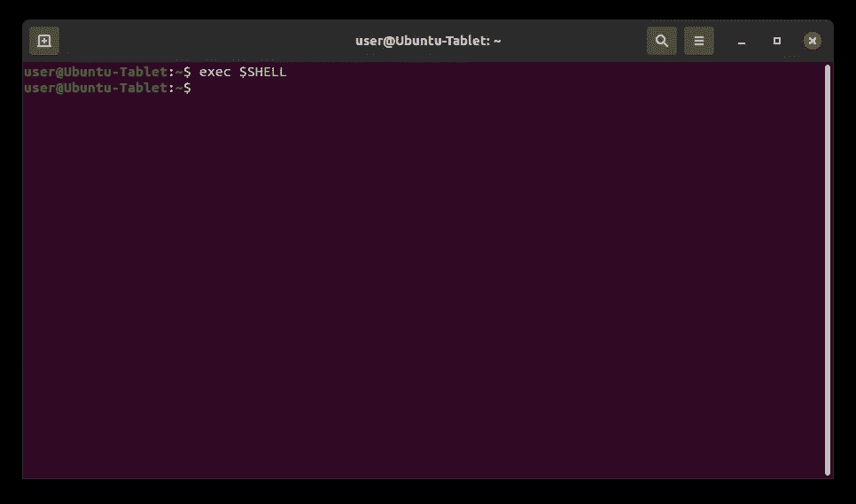
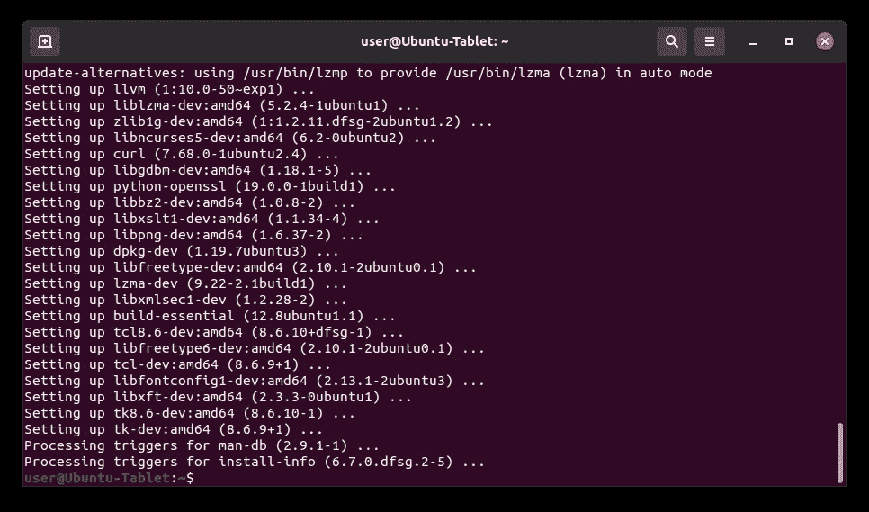
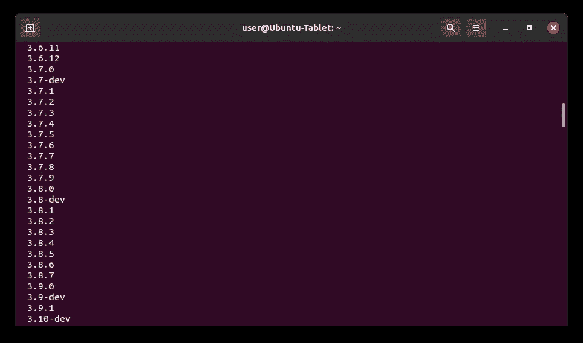
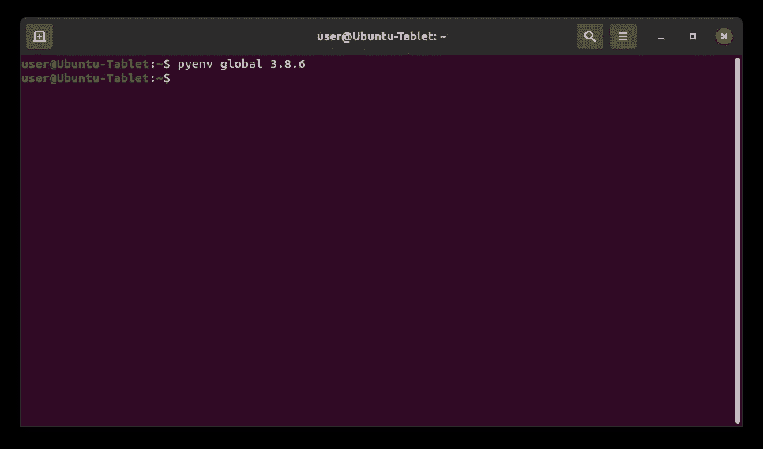
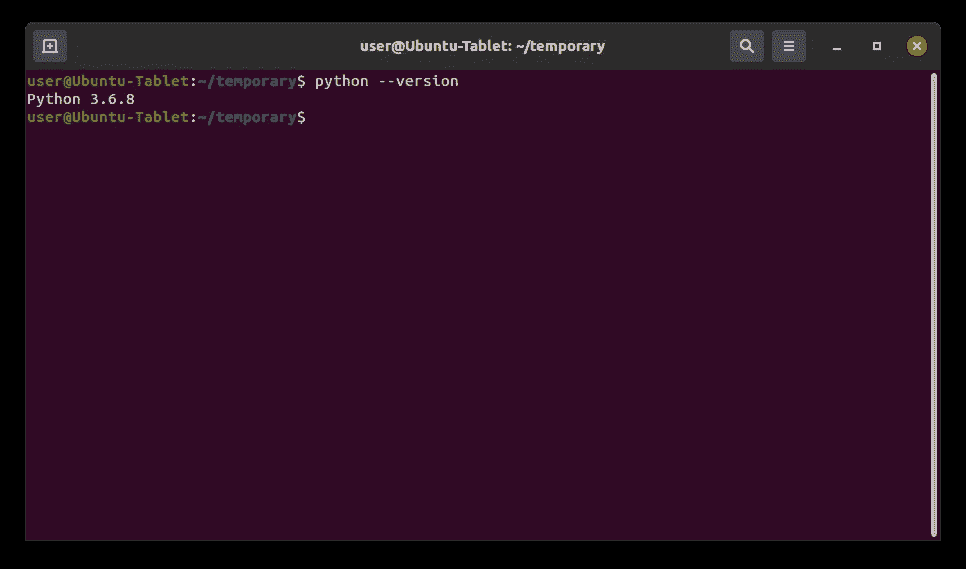
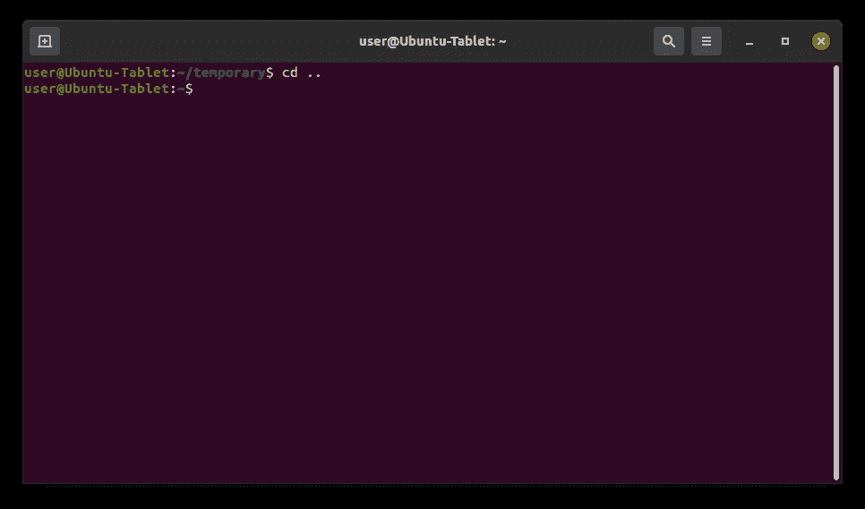
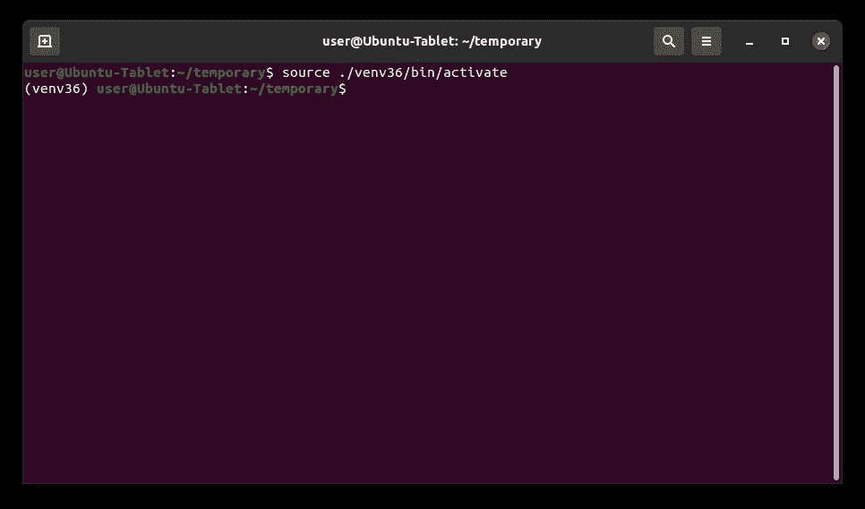

# 如何在 Linux 上安装和管理多个 Python 版本

> 原文：<https://medium.datadriveninvestor.com/how-to-install-and-manage-multiple-python-versions-on-linux-916990dabe4b?source=collection_archive---------0----------------------->

## 创始人指南:

## 带有简明解释和截图的扩展教程


Image by [Isabella and Louisa Fischer](https://unsplash.com/photos/9_5z24t0DFA)

> “本文的[精简版](https://medium.com/p/39167f6a32e6)使用复制和粘贴代码来帮助您尽快获得结果，⚡”

## 开放终端:

*GNOME 终端*是 [Ubuntu](#ed6d) 桌面环境的默认终端模拟器。它可以运行 Bash 命令，处理文件，与其他计算机交互，以及执行管理任务和配置。它还具有多个选项卡、用户配置文件和自定义启动命令。

1.  点击左上角的“活动”
2.  在搜索栏中输入“终端”
3.  点击“终端”


## 检查默认版本:

*Version (V)* 选项用于检查哪个版本的 Python 当前被选为默认版本。它由句点分隔的三个数字组成，分别代表[主](#7870)、[次](#679b)和[微](#ff0b)版本号。如果计算机上尚未安装 Python，它还会显示一条错误消息。

1.  从下面这些指令中复制命令
2.  将命令粘贴到终端
3.  按“回车”

```
python --version
```



## 检查可执行文件:

*哪个*命令用于标识指定命令名的可执行文件的位置。它从 [PATH](#d3e2) 环境变量的目录列表中搜索可执行文件。如果可执行文件存在于其中一个目录中，它还会显示该文件的绝对路径。

1.  从下面这些指令中复制命令
2.  将命令粘贴到终端
3.  按“回车”

```
which python
```


## 打开主目录:

*改变目录(cd)* 命令用于将当前工作目录改变到指定目录。它可以导航到分别从根目录和当前工作目录开始的绝对路径和相对路径。它还可以导航到存储在[变量](#2b28)和[环境变量](#9d2c)中的路径。

1.  从下面这些指令中复制命令
2.  将命令粘贴到终端
3.  按“回车”

```
cd $HOME
```


## 安装 Git:

Git 是一个用来跟踪源代码随时间变化的程序。它可以处理各种规模的项目，并允许多个团队和人员对同一个存储库进行更改。它还可以从存储库的整个历史中将源代码恢复到以前的版本。

1.  从下面这些指令中复制命令
2.  将命令粘贴到终端
3.  按“回车”

```
sudo apt-get install --yes git
```


## 克隆 Pyenv 存储库:

Pyenv 是一个在 macOS 和 Linux 上用于 Python 版本管理的程序。它可以安装多个 Python 版本，指定系统范围内使用的版本，以及指定特定目录中使用的版本。它还可以使用特定版本创建和管理虚拟环境。

1.  从下面这些指令中复制命令
2.  将命令粘贴到终端
3.  按“回车”

```
git [clone](#1b3c) https://github.com/pyenv/pyenv.git ~/.pyenv
```


## 打开 Bash 配置文件:

*外壳配置文件*是当用户打开外壳时自动执行的脚本。它包含用于更改外壳外观、运行脚本和命令、创建别名以及加载环境变量的代码。它还为不同的 shells 创建了单独的配置文件。

1.  从下面这些指令中复制命令
2.  将命令粘贴到终端
3.  按“回车”

```
gedit .bashrc
```


## 编辑 Bash 配置文件:

*Bourne Again Shell (Bash)* 是一个命令行 Shell 和脚本语言，用于自动化管理任务和配置系统设置。它可以用来自动化操作系统中的几乎任何东西。它也是大多数基于 Linux 的操作系统的默认 shell。

1.  从这些指令下面复制代码
2.  将代码粘贴到文本编辑器中
3.  点击“保存”

```
# Pyenv environment variables
export PYENV_ROOT="$HOME/.pyenv"
export PATH="$PYENV_ROOT/bin:$PATH"# Pyenv initialization
if command -v pyenv 1>/dev/null 2>&1; then
  eval "$(pyenv init --path)"
fi
```


## 重新启动 Bash:

*Exec (e)* 命令用于执行作为参数提供的指定命令。它销毁当前进程并用指定的命令替换它，而不创建新的进程。它还可以重新启动 shell，将配置文件重新加载到环境中。

1.  从下面这些指令中复制命令
2.  将命令粘贴到终端
3.  按“回车”

```
exec $SHELL
```



## 更新来源列表和来源列表目录:

*更新*命令用于确保可用软件包列表是最新的。它从系统上的存储库中下载一个软件包列表，其中包含关于新的和可升级的软件包的信息。它只更新关于软件包的信息，并不实际升级软件包。

1.  从下面这些指令中复制命令
2.  将命令粘贴到终端
3.  按“回车”

```
sudo apt-get update --yes
```


## 安装 Pyenv 依赖项:

依赖项是一个附加的二进制包，特定的二进制包需要它才能正常工作。它可能需要多个依赖项来构建几乎所有由包管理器发布的程序。它也会被一些包管理器自动下载和安装。

1.  从下面这些指令中复制命令
2.  将命令粘贴到终端
3.  按“回车”

```
sudo apt-get install --yes libssl-dev zlib1g-dev libbz2-dev libreadline-dev libsqlite3-dev llvm libncurses5-dev libncursesw5-dev xz-utils tk-dev libgdbm-dev lzma lzma-dev tcl-dev libxml2-dev libxmlsec1-dev libffi-dev liblzma-dev wget curl make build-essential python-openssl
```



## 查看 Python 版本:

*List (l)* 标志用于显示 Pyenv 中可用的 Python 版本。它包括从 Python、Anaconda、PyPy、Jython 和 Stackless 发布的最终版本。这包括所有主要、次要和微型版本，但不包括 alpha、beta 或发布候选版本。

1.  从下面这些指令中复制命令
2.  将命令粘贴到终端
3.  按“回车”

```
pyenv install --list
```



## 安装 Python:

Python 是一种面向对象的语言，以其简单的语法、代码可读性、灵活性和可伸缩性而闻名。它主要用于开发 web 和软件应用程序。它也已经成为人工智能、机器学习和数据科学最流行的语言之一。

1.  从以下这些说明中找到版本
2.  复制提供的命令
3.  将命令粘贴到终端
4.  按“回车”
5.  重复

```
**Python 3.5:**
pyenv install 3.5.4**Python 3.6:**
pyenv install 3.6.8**Python 3.7:**
pyenv install 3.7.9**Python 3.8:**
pyenv install 3.8.6**Python 3.9:**
pyenv install 3.9.0
```


## 设定电脑的默认版本:

在 Pyenv 中使用*全局*命令来指定整个系统的默认 Python 版本。它在 Pyenv 目录中创建一个存储指定版本的文本文件。Pyenv 使用它来激活默认版本，但它会被本地 Pyenv 文本文件和环境变量覆盖。

1.  从下面这些指令中复制命令
2.  将命令粘贴到终端
3.  按“回车”

```
pyenv global 3.8.6
```



## 创建临时目录:

*创建目录(mkdir)* 命令用于创建新目录。它可以用要创建的新目录的名称指定一个或多个相对或绝对路径。它还可以与“Parents”标志一起使用，根据需要创建父目录，而不会覆盖已经存在的路径。

1.  从下面这些指令中复制命令
2.  将命令粘贴到终端
3.  按“回车”

```
mkdir temporary
```


## 打开临时目录:

*改变目录(cd)* 命令用于将当前工作目录改变到指定目录。它可以导航到分别从根目录和当前工作目录开始的绝对路径和相对路径。它还可以导航到存储在变量和环境变量中的路径。

1.  从下面这些指令中复制命令
2.  将命令粘贴到终端
3.  按“回车”

```
cd temporary
```


## 设置目录的默认版本:

Pyenv 中使用了 *Local* 命令来指定当前目录的默认 Python 版本。它在当前目录中创建一个文本文件，存储指定的版本。Pyenv 会自动检测到这一点，并在当前目录和子目录中激活 Python 版本。

1.  从下面这些指令中复制命令
2.  将命令粘贴到终端
3.  按“回车”

```
pyenv local 3.6.8
```


## 检查默认版本:

*版本(V)* 选项用于检查哪个版本的 Python 当前被选为默认版本。它由句点分隔的三个数字组成，分别代表主版本号、次版本号和微版本号。如果计算机上尚未安装 Python，它还会显示一条错误消息。

1.  从下面这些指令中复制命令
2.  将命令粘贴到终端
3.  按“回车”

```
python --version
```



## 打开父目录:

*改变目录(cd)* 命令用于将当前工作目录改变到指定目录。它可以导航到分别从根目录和当前工作目录开始的绝对路径和相对路径。它还可以导航到存储在变量和环境变量中的路径。

1.  从下面这些指令中复制命令
2.  将命令粘贴到终端
3.  按“回车”

```
cd ..
```



## 检查默认版本:

*版本(V)* 选项用于检查哪个版本的 Python 当前被选为默认版本。它由句点分隔的三个数字组成，分别代表主版本号、次版本号和微版本号。如果计算机上尚未安装 Python，它还会显示一条错误消息。

1.  从下面这些指令中复制命令
2.  将命令粘贴到终端
3.  按“回车”

```
python --version
```


## 打开临时目录:

*改变目录(cd)* 命令用于将当前工作目录改变到指定目录。它可以导航到分别从根目录和当前工作目录开始的绝对路径和相对路径。它还可以导航到存储在变量和环境变量中的路径。

1.  从下面这些指令中复制命令
2.  将命令粘贴到终端
3.  按“回车”

```
cd temporary
```


## 创建虚拟环境:

虚拟环境是一个独立的 Python 安装目录，有自己的解释器、站点包和脚本。它主要用于防止不同项目之间的版本冲突。它还被用来满足来自 GitHub 的不同程序的依赖需求。

1.  从下面这些指令中复制命令
2.  将命令粘贴到终端
3.  按“回车”

```
python -m venv venv36
```


## 激活虚拟环境:

*激活*脚本用于启动虚拟环境。它将虚拟环境路径添加到 path 环境变量中，该变量将新的 Python 解释器和包管理器设置为默认版本。它还设置要安装在虚拟环境安装目录中的包。

1.  从下面这些指令中复制命令
2.  将命令粘贴到终端
3.  按“回车”

```
source ./venv36/bin/activate
```



## 检查默认版本:

*版本(V)* 选项用于检查哪个版本的 Python 当前被选为默认版本。它由句点分隔的三个数字组成，分别代表主版本号、次版本号和微版本号。如果计算机上尚未安装 Python，它还会显示一条错误消息。

1.  从下面这些指令中复制命令
2.  将命令粘贴到终端
3.  按“回车”

```
python --version
```


## 检查可执行文件:

*哪个*命令用于标识指定命令名的可执行文件的位置。它从 PATH 环境变量的目录列表中搜索可执行文件。如果可执行文件存在于其中一个目录中，它还会显示该文件的绝对路径。

1.  从下面这些指令中复制命令
2.  将命令粘贴到终端
3.  按“回车”

```
which python
```


## 停用虚拟环境:

*停用*命令用于停止虚拟环境。它从 path 环境变量中删除了虚拟环境路径，该变量将最后一个 Python 解释器和包管理器设置为默认版本。它还设置要安装在系统 Python 安装目录中的包。

1.  从下面这些指令中复制命令
2.  将命令粘贴到终端
3.  按“回车”

```
deactivate
```


> “希望这篇文章能帮助您获得👯‍♀️🏆👯‍♀️，记得订阅获取更多内容🏅"

## 后续步骤:

这篇文章是一个迷你系列的一部分，帮助读者设置他们开始学习人工智能、机器学习、深度学习和/或数据科学所需的一切。它包括包含复制和粘贴代码的说明和截图的文章，以帮助读者尽快获得结果。它还包括一些文章，包含带有解释和截图的说明，以帮助读者了解正在发生的事情。

```
**Linux:**
01\. [Install and Manage Multiple Python Versions](https://medium.com/p/916990dabe4b)
02\. [Install the NVIDIA CUDA Driver, Toolkit, cuDNN, and TensorRT](https://medium.com/p/cd5b3a4f824)
03\. [Install the Jupyter Notebook Server](https://medium.com/p/b2c14c47b446)
04\. [Install Virtual Environments in Jupyter Notebook](https://medium.com/p/1556c8655506)
05\. [Install the Python Environment for AI and Machine Learning](https://medium.com/p/765678fcb4fb)**WSL2:**
01\. [Install Windows Subsystem for Linux 2](https://medium.com/p/cbdd835612fb)
02\. [Install and Manage Multiple Python Versions](https://medium.com/p/1131c4e50a58)
03\. [Install the NVIDIA CUDA Driver, Toolkit, cuDNN, and TensorRT](https://medium.com/p/9800abd74409) 
04\. [Install the Jupyter Notebook Server](https://medium.com/p/7c96b3705df1)
05\. [Install Virtual Environments in Jupyter Notebook](https://medium.com/p/3e6bf456041b)
06\. [Install the Python Environment for AI and Machine Learning](https://medium.com/p/612240cb8c0c)
07\. [Install Ubuntu Desktop With a Graphical User Interface](https://medium.com/p/95911ee2997f) (Bonus)**Windows 10:**
01\. [Install and Manage Multiple Python Versions](https://medium.com/p/c90098d7ba5a)
02\. [Install the NVIDIA CUDA Driver, Toolkit, cuDNN, and TensorRT](https://medium.com/p/55febc19b58)
03\. [Install the Jupyter Notebook Server](https://medium.com/p/e8f3e9436044)
04\. [Install Virtual Environments in Jupyter Notebook](https://medium.com/p/5c189856479)
05\. [Install the Python Environment for AI and Machine Learning](https://medium.com/p/23c34b2baf12)**Mac:** 01\. [Install and Manage Multiple Python Versions](https://medium.com/p/ca01a5e398d4)
02\. [Install the Jupyter Notebook Server](https://medium.com/p/2a276f679e0)
03\. [Install Virtual Environments in Jupyter Notebook](https://medium.com/p/e3de97491b3a)
04\. [Install the Python Environment for AI and Machine Learning](https://medium.com/p/2b2353d7bcc3)
```

## 词汇表:

*Ubuntu Desktop 是一款桌面操作系统，以快速、安全和免费著称。它安装了一个元包，其中包含了组成[桌面环境](#4a20)的所有包，默认情况下，桌面环境使用 [GNOME 3](#be9b) 。这为 Ubuntu Linux 发行版提供了一个图形用户界面。
[回车](#852b)*

桌面环境是在操作系统之上的程序的集合，它构成了图形用户界面。它包括窗口管理器、面板、菜单、系统托盘、图标和小部件等组件。它还决定了系统的外观以及如何与之交互。
[ [返回](#ed6d)

GNOME 3 是一个非常流行的桌面环境，拥有简单、易用、可靠的用户体验。它提供了一个独特的用户界面，旨在专注于任务并消除干扰。它还具有一个干净的无图标桌面，强大的搜索，任务概述和桌面扩展。
[ [返回](#ed6d)

*路径*是一个环境变量，包含计算机用来查找可执行文件的目录列表。它从上到下在列表的每个目录中查找请求的可执行文件。一旦找到匹配的可执行文件并运行程序或命令，它也会停止搜索。
[ [返回](#5574)

*主*版本是一个数字，表示对程序进行重大修改的更新。它可以添加与以前版本不兼容的不同架构、特性和功能。这通常会导致用以前版本构建的程序停止工作。
[返回](#a4cd)

*次要*版本是一个表示对程序进行适度修改的更新的数字。它可以添加与最新主要更新兼容的小特性和功能。这通常不会导致用以前的小更新构建的程序出现问题。
[回车](#a4cd)

*Micro* 版本是一个数字，它代表一个对程序进行非常适度的修改的更新。它可以添加与以前的更新兼容的错误修复和性能增强。这不会导致用以前的更新构建的程序出现问题。
[ [返回](#a4cd)

*变量*是用来存储不同类型值的容器。它可以通过在指定的变量名和值之间放置一个等号来赋值或更新一个值。它还可以通过在现有变量名前放置一个美元符号来引用存储的值。
[ [返回](#9dcf) ]

环境变量是一个由计算机自动创建和维护的变量。它帮助系统知道在哪里安装文件、查找程序以及检查用户和系统设置。它也可以被计算机上任何地方的图形和命令行程序使用。
[ [返回](#9dcf)

在 Git 中使用 *Clone* 命令从 GitHub 下载指定的存储库。它复制存储库整个历史中的所有文件、子目录、分支和提交。它还可以与递归标志结合使用，以复制存储库用作依赖项的子模块。
[回车](#435c)

*子模块*是一个存储库，它嵌套在另一个存储库的子目录中。它包含特定版本的存储库在特定时间点的所有文件的副本。它还包含存储库中被视为其依赖项的所有子模块的副本。
[回车](#1b3c)