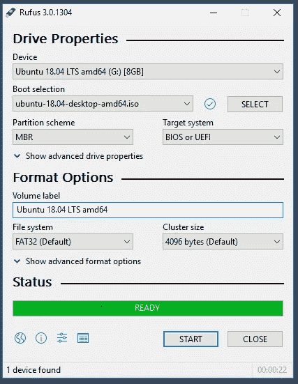
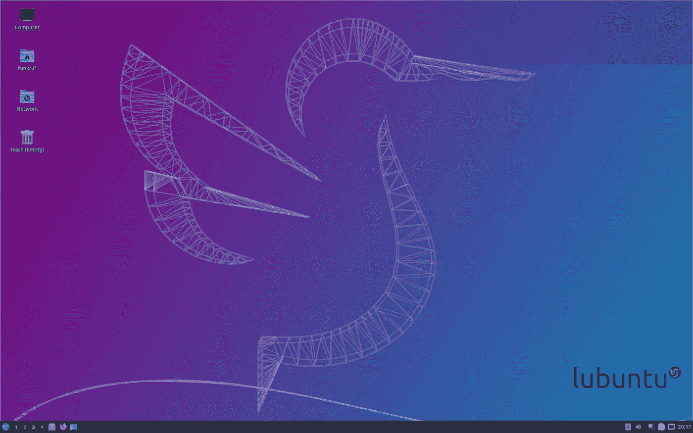

# 如何在任何电脑上安装 Linux？

> 原文：<https://medium.datadriveninvestor.com/how-to-install-linux-on-any-computer-8437481ff702?source=collection_archive---------6----------------------->

## 使用 u 盘在任何计算机上安装 Linux 的步骤。

Tux is the penguin mascot of Linux. Source: [https://en.wikipedia.org/wiki/Linux_kernel#/media/File:Tux.svg](https://en.wikipedia.org/wiki/Linux_kernel#/media/File:Tux.svg) The copyright holder of this file allows anyone to use it for any purpose, provided that the copyright holder is properly attributed. Redistribution, derivative work, commercial use, and all other use is permitted. Attribution: lewing@isc.tamu.edu Larry Ewing and The GIMP

# 步骤 1——明智地选择您的 Linux 发行版

与 Windows 和 macOS 不同，Linux 有许多替代形式，称为发行版。发行版之间的差异可能非常大，特别是对于未初始化的发行版。

如果您已经知道您需要哪个发行版，您当然可以跳过这一步。

对于那些不知道的人，我建议你从一个有图形用户界面的发行版开始，它更类似于 Windows 界面(它有开始菜单等)。

如果你想要一个界面，并且你的电脑硬件不太旧，我建议你选择 Ubuntu。如果你有一台有点慢的老电脑，我建议你选择它的更快更小的兄弟 Lubuntu。

然而，如果你不在乎拥有一个接口，确实有很多选择，每一个都有自己的特点。

# 步骤 2 —下载发行版

Linux 是免费的，所以你可以从网上下载。在下文中，我将对 Lubuntu 版本应用这些步骤，但是您也可以对任何发行版应用相同的步骤。只需找到包含“的网站。iso”文件，您可以通过 Google 具体分发。

1.  在单独的计算机上，下载一个 Lubuntu”。iso”文件，该文件与您的硬件兼容。如果不确定，请使用 32 位版本，该版本在版本 18 之前可用。这将适用于几乎所有的旧电脑。比如这边的。如果你有一台最新的电脑，你可以选择 64 位，然后你可以选择最新的版本。

# 步骤 3-制作一个可启动的 u 盘

仍然在一台单独的计算机上，你需要制作一个可启动的 u 盘来启动你的新的 Linux 计算机。

1.  下载 Rufus，一个有助于从 USB 安装操作系统的工具。https://rufus.ie/[。](https://rufus.ie/)
2.  使用 Rufus，连同你下载的”。iso”文件和一个空的 u 盘，创建一个*可启动的 u 盘。
    -* 在设备中选择您的空 u 盘
    -点击选择以选择您的”。启动选择中的 iso”文件
    -点击开始并等到结束

# 步骤 4-从 u 盘启动计算机

1.将一根以太网电缆插入您的新 Linux 计算机，因为这将使您的安装更容易。配置 Wi-Fi 并不总是像人们希望的那样简单。

2A。将您的可启动 u 盘放入计算机并启动它。如果你没有安装操作系统，电脑会自动从 u 盘启动并进入 Lubuntu 安装菜单。

2B。如果你已经安装了一个操作系统，你需要中断这个操作系统的启动。这是在计算机的 BIOS 设置中完成的，您可以在启动时按下特定的键盘按钮来访问该设置。

确切的按钮取决于你电脑的品牌，所以最简单的方法是谷歌:“如何在<my brand="">上进入 BIOS”以知道要使用的键。从启动计算机的那一刻起，重复按下此键，直到出现蓝屏，这就是 BIOS。</my>

一旦你进入这个蓝色的 BIOS 屏幕，你就可以通过按键在屏幕间移动。你移动到启动，然后你改变启动顺序，开始与你的空 u 盘。就像这样，它会首先开始寻找你的 USB 上是否有什么东西，然后找到 Lubuntu。你将进入 Lubuntu 安装菜单。

# 步骤 5 —遵循特定于发行版的安装说明

遵循 Lubuntu 或您的特定发行版的安装说明。Ubuntu 和 Lubuntu 的安装说明都比较清晰。对于其他一些发行版来说，这可能会更难，所以如果你遇到困难，不要犹豫，从一个“更容易”的发行版开始。

Lubuntu Desktop image for version 20.04\. Source: [https://en.wikipedia.org/wiki/File:Lubuntu_20.04.png](https://en.wikipedia.org/wiki/File:Lubuntu_20.04.png). [GNU General Public License](https://en.wikipedia.org/wiki/en:GNU_General_Public_License).

*祝好运，感谢阅读！*