# 如何在 Linux 上安装 Jupyter 笔记本服务器

> 原文：<https://medium.datadriveninvestor.com/how-to-install-the-jupyter-notebook-server-on-linux-b2c14c47b446?source=collection_archive---------2----------------------->

## 创始人指南:

## 带有简明解释和截图的扩展教程


Image by [Vita Vilcina](https://unsplash.com/photos/KtOid0FLjqU)

> “本文的[精简版](https://medium.com/p/c5c7fa4853cb)使用复制和粘贴代码来帮助您尽快获得结果，⚡”

## 开放终端:

*GNOME 终端*是 [Ubuntu](#75f9) 桌面环境的默认终端模拟器。它可以运行 Bash 命令，处理文件，与其他计算机交互，以及执行管理任务和配置。它还具有多个选项卡、用户配置文件和自定义启动命令。

1.  点击左上角的“活动”
2.  在搜索栏中输入“终端”
3.  点击“终端”


## 安装 Jupyter 笔记本:

Jupyter Notebook 是一个用于创建、修改和分发包含代码、等式、可视化和叙述性文本的笔记本的程序。它提供了一个在 web 浏览器中运行的交互式编码环境。它也已经成为机器学习和数据科学的首选工具。

1.  从下面这些指令中复制命令
2.  将命令粘贴到终端
3.  按“回车”

```
python -m pip install jupyter
```

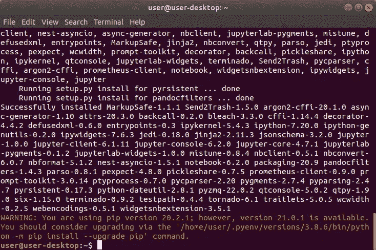

## 安装 WebSocket 扩展:

*WebSocket* 它通过指定的端口传递 HTTP 流量，从而允许 web 浏览器通过互联网访问硬件。

1.  从下面这些指令中复制命令
2.  将命令粘贴到终端
3.  按“回车”

```
python -m pip install jupyter_http_over_ws
```

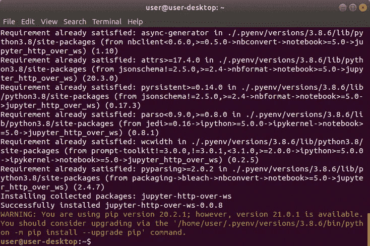

## 重新启动 Bash:

*Exec (e)* 命令用于执行作为参数提供的指定命令。它销毁当前进程并用指定的命令替换它，而不创建新的进程。它还可以重新启动 shell，将配置文件重新加载到环境中。

1.  从下面这些指令中复制命令
2.  将命令粘贴到终端
3.  按“回车”

```
exec $SHELL
```


## 创建配置文件:

*配置文件*是一个 Python 文件，用于定制 Jupyter 笔记本服务器。它生成时包含了所有可能的服务器参数、选项和设置，但默认情况下它们被注释掉了。它也存储在隐藏的。主目录的 jupyter 子目录。

1.  从下面这些指令中复制命令
2.  将命令粘贴到终端
3.  按“回车”

```
jupyter notebook --generate-config
```


## 打开 Jupyter 目录:

*改变目录(cd)* 命令用于将当前工作目录改变到指定目录。它可以导航到分别从根目录和当前工作目录开始的绝对路径和相对路径。它还可以导航到存储在[变量](#ecd0)和[环境变量](#d18a)中的路径。

1.  从下面这些指令中复制命令
2.  将命令粘贴到终端
3.  按“回车”

```
cd $HOME/.jupyter
```


## 创建 SSL 证书:

在 [OpenSSL](#af73) 中使用 *Req* 命令来生成和处理证书请求。它可以与 x509 命令结合使用，以生成自签名证书。它还可以用来生成最大强度加密的非加密私钥，有效期最长可达 825 天。

1.  从下面这些指令中复制命令
2.  将命令粘贴到终端
3.  按“回车”
4.  在“国家名称”中输入“美国”
5.  按“回车”
6.  输入“.”到剩余的字段中
7.  按“回车”

```
openssl req -x509 -nodes -days 365 -newkey rsa:2048 -keyout mykey.key -out mycert.pem
```

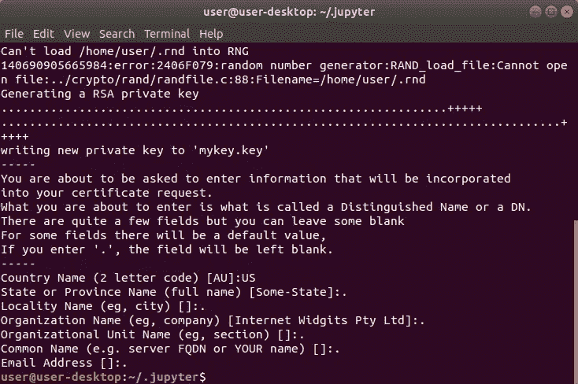

## 创建 JSON 文件:

*Echo* 命令用于将从一个参数接收到的文本打印到屏幕或计算机文件中。它可以在 shell 脚本和批处理文件中用来打印其他命令的输出，或者作为其他命令的一部分来插入文本。它还可以覆盖现有文件中的文本或将其附加到末尾。

1.  从下面这些指令中复制命令
2.  将命令粘贴到终端
3.  按“回车”

```
echo "" > $HOME/.jupyter/jupyter_notebook_config.json
```

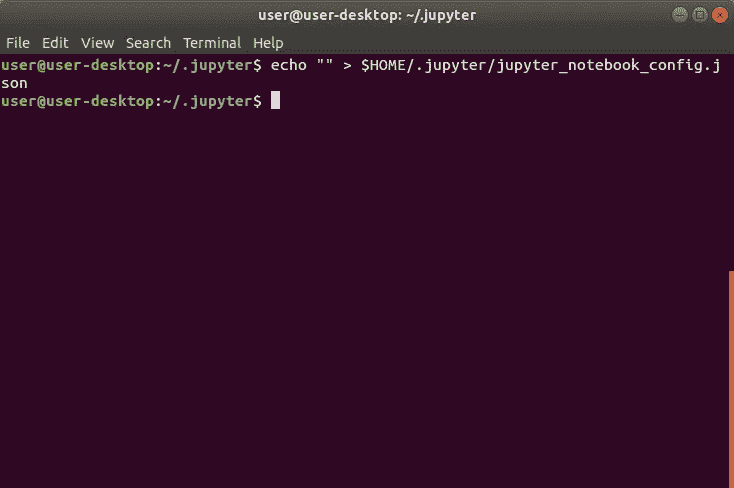

## 打开 JSON 文件:

*JavaScript 对象符号(JSON)* 是一种用于在互联网上存储和传输数据的文件格式。它可以将数据转换成大多数编程语言都能解析的人类和机器可读的文本。它还可以包含字符串、数字、布尔值、数组和对象的键值对。

1.  从下面这些指令中复制命令
2.  将命令粘贴到终端
3.  按“回车”

```
gedit $HOME/.jupyter/jupyter_notebook_config.json
```

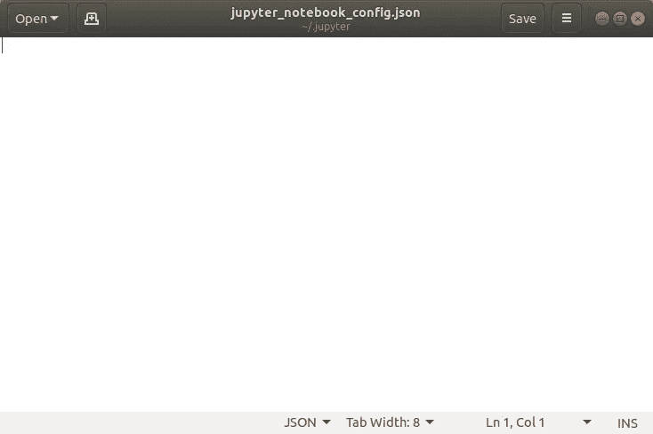

## 编辑 JSON 文件:

*配置文件*是一个 JSON 文件，用于定制 Jupyter 笔记本服务器。它仅包含用户指定的服务器参数、选项和设置，这些参数、选项和设置的优先级高于 Python 文件。它也存储在隐藏的。主目录的 jupyter 子目录。

1.  从这些说明下面复制 JSON
2.  将 JSON 粘贴到文本编辑器中
3.  将“用户”更改为 Unix 用户名
4.  单击“文件”菜单
5.  点击“保存”


## 创建密码:

Jupyter Notebook 使用[基于令牌的认证](#90e1)来限制对服务器的访问。这就产生了一个问题，因为服务器启动时在后台运行，所以令牌是不可见的。它也可以选择使用[基于密码的认证](#907c)，这提供了一种远程访问服务器的安全方式。

1.  从下面这些指令中复制命令
2.  将命令粘贴到终端
3.  按“回车”

```
jupyter notebook password
```


## 安装网络工具:

*Net-Tools* 是在 Linux 中用来控制 Linux 内核的网络子系统的程序集合。它包括几个过时的程序，这些程序已被 iproute2 中的程序所取代。它还包含一些对于执行特定任务仍然有用的程序。

1.  从下面这些指令中复制命令
2.  将命令粘贴到终端
3.  按“回车”

```
sudo apt-get install net-tools
```

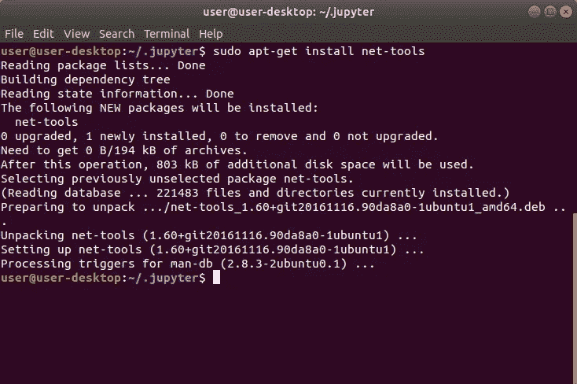

## 获取 IPv4 地址网络掩码:

*接口配置(ifconfig)是一个*命令，在 Linux 中用来查询、配置和控制[传输控制协议/互联网协议](#73e0)网络接口参数。它可用于显示计算机上所有物理和虚拟网络适配器的 [IPv4 地址](#e4ad)和[网络掩码](#6981)。

1.  从下面这些指令中复制命令
2.  将命令粘贴到终端
3.  按“回车”
4.  写下“IPv4 地址”和“网络掩码”

```
ifconfig
```

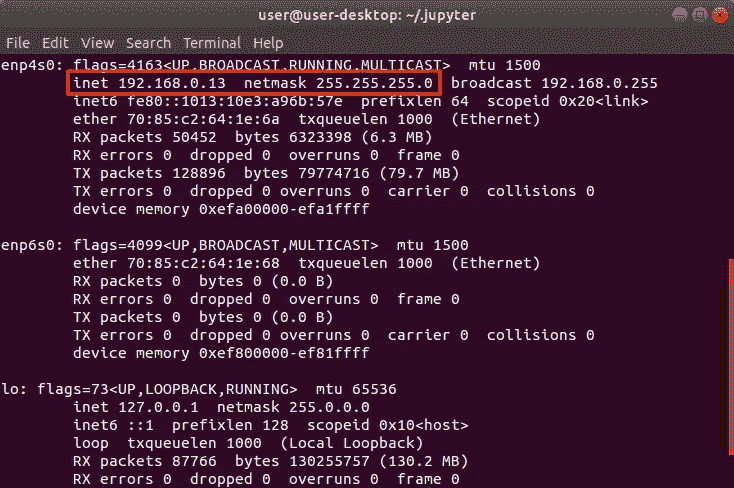

## 登录路由器:

*路由器*是一种用于在互联网和本地网络上的计算机之间传输数据的设备。它使用防火墙通过基于安全规则限制网络流量来保护计算机免受攻击者的攻击。也可以通过访问因品牌而异的[路由器 IP 地址](https://www.techspot.com/guides/287-default-router-ip-addresses/)进行设置。

1.  打开 web 浏览器
2.  从下面这些说明中复制路由器 IP 地址
3.  将路由器 IP 地址粘贴到 web 浏览器中
4.  按“回车”
5.  登录路由器

```
192.168.0.1
```


## 设置端口转发:

*端口转发*是一种路由器功能，用于让本地网络上的计算机通过互联网与其他计算机进行交互。它拦截指定端口号上的传入流量。它还将流量重定向到特定计算机的指定专用 IP 地址和端口号。

1.  找到“端口转发”页面
2.  将 IPv4 地址粘贴到“输入 IP 地址”文本字段中
3.  从下面复制端口这些说明
4.  将端口粘贴到“ [WAN](#1274) Starting Port”文本字段中
5.  将端口粘贴到“WAN 终端端口”文本字段中
6.  选择“所有 IP 地址”
7.  点击“应用”

```
8889
```

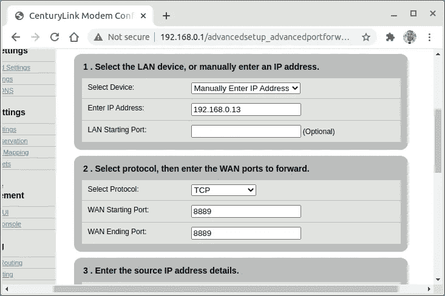

## 获取默认路由和 DNS:

GNOME 控制中心是一个图形用户界面，在 Ubuntu 中用来配置 Gnome 的各个方面。它显示系统设置的概述，默认情况下显示所有配置面板。它还可以指定一个面板名称，或者使用关键字进行搜索以直接转到该面板。

1.  从下面这些指令中复制命令
2.  将命令粘贴到终端
3.  按“回车”
4.  点按“Wifi”或“网络”
5.  点击“⚙”
6.  记下“[默认路由](#ff9e)和“ [DNS](#fd1d)

```
gnome-control-center
```

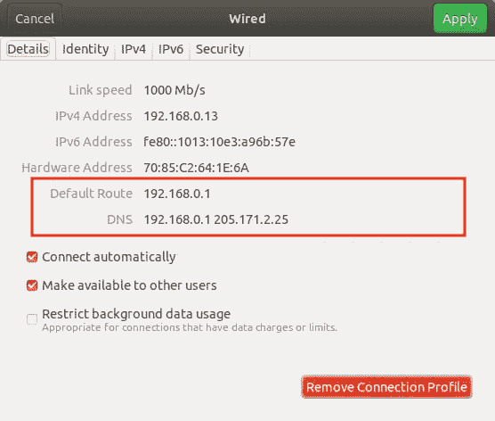

## 设置静态 IP 地址:

*静态 IP 地址*是一个 IP 地址，用于使本地网络上的其他计算机更容易访问使用相同 IP 地址的计算机。它可以分配给计算机，不会随时间而改变。它也需要在网络适配器属性中手动配置。

1.  单击“IPv4”选项卡
2.  选择“手动”
3.  输入之前的“IPv4 地址”、“网络掩码”、“网关”和 DNS
4.  点击“应用”


## 打开 Crontab:

在 Linux 中使用*Cron Table*(*Crontab)*命令来创建、编辑、列出和删除 Crontab 文件中的命令。它可以调用一个编辑会话，该会话安排定期执行命令。它还将给定的命令复制到以当前用户命名的文件中的 contrabs 目录中。

1.  从下面这些指令中复制命令
2.  将命令粘贴到终端
3.  按“回车”

```
crontab -e
```

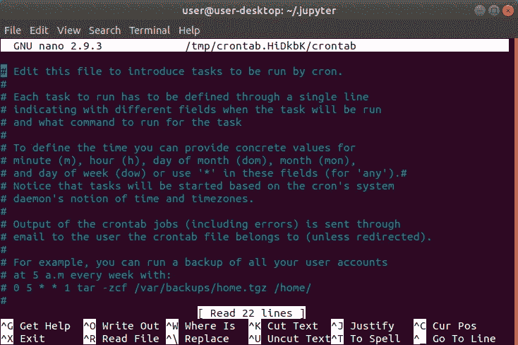

## 编辑 Crontab 文件:

*Cron Table*(*Crontab)文件*是一个文本文件，在 Linux 中用来指定一个 shell 命令在给定的时间表上运行。它使用五个字段来指定日期和时间，这五个字段由空格分隔，后跟一个命令。它还可以使用宏来指定公共间隔，以代替五个字段。

1.  使用“↓”键导航到文件的底部
2.  从这些指令下面复制代码
3.  按“Shift”+“Control”+“V”将代码粘贴到终端
4.  按“控制”+“S”保存更改
5.  按“Control”+“X”退出 Crontab
6.  重新启动计算机

```
[@reboot](http://twitter.com/reboot) cd; source /.bashrc; /home/user/.pyenv/shims/jupyter-notebook >> ~/cronrun.log 2>&1
```

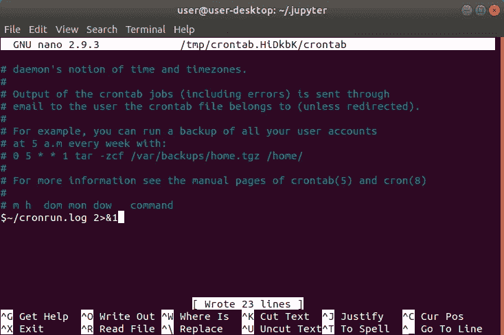

## 从本地网络访问服务器:

警告会出现在 web 浏览器中，因为 SSL 证书没有经过证书颁发机构的验证。它警告用户小心行事，因为它无法确认网站所有者的身份。发生这种情况是因为证书是自签名的，但它提供完全相同的保护。

1.  登录到不同的计算机或笔记本电脑
2.  连接到同一个 WiFi 网络
3.  在 web 浏览器中输入 IPv4 地址
4.  在 IP 地址前添加“https://”
5.  在 IP 地址后附加“8889”
6.  按“回车”
7.  键入“thisisunsafe”
8.  输入密码
9.  点击“登录”


## 获取公共 IP 地址:

*公共 IP 地址*是由互联网服务提供商分配给路由器的唯一 IP 地址。它在本地网络上的计算机之间共享，允许它们访问互联网。它还用于通过互联网从计算机访问本地网络上的计算机。

1.  从这些说明下面复制 URL
2.  将 URL 粘贴到 web 浏览器中
3.  记下公共 IP 地址

```
[https://www.google.com/search?q=whatsmyip](https://www.google.com/search?q=whatsmyip)
```

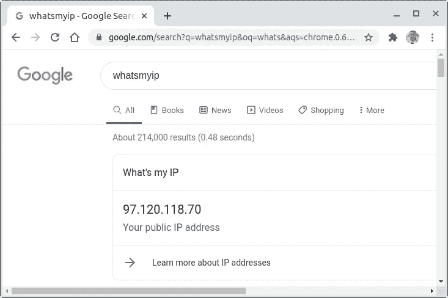

## 从远程网络访问服务器:

警告会出现在 web 浏览器中，因为 SSL 证书没有经过证书颁发机构的验证。它警告用户小心行事，因为它无法确认网站所有者的身份。发生这种情况是因为证书是自签名的，但它提供完全相同的保护。

1.  登录到不同的计算机或笔记本电脑
2.  连接到不同的 WiFi 网络
3.  在 web 浏览器中输入公共 IP 地址
4.  在 IP 地址前添加“https://”
5.  在 IP 地址后附加“8889”
6.  按“回车”
7.  键入“thisisunsafe”
8.  输入密码
9.  点击“登录”

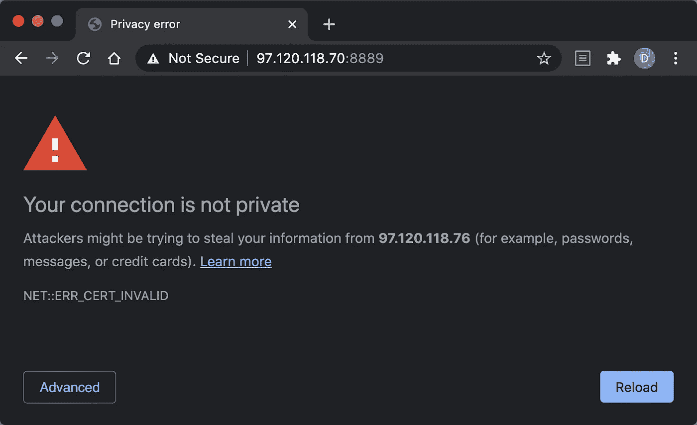

> “希望这篇文章能帮助您获得👯‍♀️🏆👯‍♀️记得订阅以获取更多内容🏅"

## 后续步骤:

这篇文章是一个迷你系列的一部分，帮助读者设置他们开始学习人工智能、机器学习、深度学习和/或数据科学所需的一切。它包括包含复制和粘贴代码的说明和截图的文章，以帮助读者尽快获得结果。它还包括一些文章，包含带有解释和截图的说明，以帮助读者了解正在发生的事情。

```
**Linux:**
01\. [Install and Manage Multiple Python Versions](https://medium.com/p/916990dabe4b)
02\. [Install the NVIDIA CUDA Driver, Toolkit, cuDNN, and TensorRT](https://medium.com/p/cd5b3a4f824)
03\. [Install the Jupyter Notebook Server](https://medium.com/p/b2c14c47b446)
04\. [Install Virtual Environments in Jupyter Notebook](https://medium.com/p/1556c8655506)
05\. [Install the Python Environment for AI and Machine Learning](https://medium.com/p/765678fcb4fb)**WSL2:**
01\. [Install Windows Subsystem for Linux 2](https://medium.com/p/cbdd835612fb)
02\. [Install and Manage Multiple Python Versions](https://medium.com/p/1131c4e50a58)
03\. [Install the NVIDIA CUDA Driver, Toolkit, cuDNN, and TensorRT](https://medium.com/p/9800abd74409) 
04\. [Install the Jupyter Notebook Server](https://medium.com/p/7c96b3705df1)
05\. [Install Virtual Environments in Jupyter Notebook](https://medium.com/p/3e6bf456041b)
06\. [Install the Python Environment for AI and Machine Learning](https://medium.com/p/612240cb8c0c)
07\. [Install Ubuntu Desktop With a Graphical User Interface](https://medium.com/p/95911ee2997f) (Bonus)**Windows 10:**
01\. [Install and Manage Multiple Python Versions](https://medium.com/p/c90098d7ba5a)
02\. [Install the NVIDIA CUDA Driver, Toolkit, cuDNN, and TensorRT](https://medium.com/p/55febc19b58)
03\. [Install the Jupyter Notebook Server](https://medium.com/p/e8f3e9436044)
04\. [Install Virtual Environments in Jupyter Notebook](https://medium.com/p/5c189856479)
05\. [Install the Python Environment for AI and Machine Learning](https://medium.com/p/23c34b2baf12)**Mac:** 01\. [Install and Manage Multiple Python Versions](https://medium.com/p/ca01a5e398d4)
02\. [Install the Jupyter Notebook Server](https://medium.com/p/2a276f679e0)
03\. [Install Virtual Environments in Jupyter Notebook](https://medium.com/p/e3de97491b3a)
04\. [Install the Python Environment for AI and Machine Learning](https://medium.com/p/2b2353d7bcc3)
```

## 词汇表:

Ubuntu Desktop 是一款桌面操作系统，以快速、安全和免费而闻名。它安装了一个元包，这个元包包含了组成默认使用 [GNOME 3](#be9b) 的[桌面环境](#4a20)的所有包。这为 Ubuntu Linux 发行版提供了一个图形用户界面。
[回车](#807f)

桌面环境是在操作系统之上的程序的集合，它构成了图形用户界面。它包括窗口管理器、面板、菜单、系统托盘、图标和小部件等组件。它还决定了系统的外观以及如何与之交互。
[ [返回](#75f9)

GNOME 3 是一个非常流行的桌面环境，拥有简单、易用、可靠的用户体验。它提供了一个独特的用户界面，旨在专注于任务并消除干扰。它还具有一个干净的无图标桌面，强大的搜索，任务概述和桌面扩展。
[ [返回](#75f9)

*同源策略*是一种安全特性，用于网络浏览器中，以阻止网站在其他网站上运行恶意脚本。它会禁用 HTTP 上的跨域通信，这也会阻止 web 浏览器访问运行服务器的计算机上的硬件。
[返回](#30d5)

*变量*是用来存储不同类型值的容器。它可以通过在指定的变量名和值之间放置一个等号来赋值或更新一个值。它还可以通过在现有变量名前放置一个美元符号来引用存储的值。
[返回](#6c20)

*环境变量*是由计算机自动创建和维护的变量。它帮助系统知道在哪里安装文件、查找程序以及检查用户和系统设置。它也可以被计算机上任何地方的图形和命令行程序使用。
[回车](#6c20)

*OpenSSL* 是一个用来实现[安全套接字层](#c75a)的程序。它可以生成私钥，创建证书签名请求，生成[自签名证书](#ab83)，并验证证书信息。这可以用来帮助识别网站所有者，并保护敏感的用户数据免受攻击者的攻击。
[ [返回](#f6f4)

*安全套接字层(SSL)* 是使用密钥对为敏感数据增加一层保护的安全协议。它将私钥存储在服务器上，并将公钥分发给 web 浏览器。它使用密钥在 web 浏览器和服务器之间建立加密连接。
[返回](#af73)

*自签名证书*是用于识别网站所有者的证书。它可以由生成证书的同一个人或公司而不是证书颁发机构来签名。它还可以提供与由证书颁发机构签名的证书相同的保护级别。
[ [返回](#af73)

*基于令牌的认证*是一种实践，用于授权试图使用服务器提供的令牌访问服务器的用户。它创建一个令牌，并且只向拥有该令牌的用户授予访问权限。它还允许 web 浏览器存储和重用令牌，直到服务器复位。
[回车](#484c)

*基于密码的认证*是一种实践，用于授权试图使用用户提供的密码访问服务器的用户。它[散列](#52e0)并存储密码，只授予拥有该密码的用户访问权限。它还允许网络浏览器存储和重复使用密码。
[回车](#484c)

*哈希*是一个用于将密码转换为不可逆转的密码的过程。它使用哈希算法将密码转换成一串简短的字母和数字。这使得攻击者更难使用哈希密码，因为他们仍然必须解码密码才能使用。
[返回](#907c)

[*传输控制协议*](#d3c8) */* [*互联网协议*](#c2aa) 是使计算机能够通过互联网交换信息的互联网协议套件。它定义了信息如何被分解成[包](#5305)，如何被成功地寻址、发送、路由、接收和重组，而没有错误或遗漏。
[返回](#b383)

*传输控制协议(TCP)* 是一种用于将数据分成数据包在互联网上发送的协议。它对数据包进行编号，并按顺序重新组合，然后将它们交给接收计算机。它还检查错误、遗漏，并请求重新发送丢失的数据。
[ [返回](#73e0)

*互联网协议(IP)* 是一种用于通过互联网向 IP 地址传送数据包的协议。它为每台连接到互联网的设备分配一个唯一的 IP 地址，让它们发送和接收数据包。它还将数据包从源 IP 地址路由到目的 IP 地址。
[回车](#73e0)

*数据包*是一小段被分解后通过互联网发送的数据。它包含两个部分，包括正在发送的实际数据和用于发送、接收和重组数据的元数据。它还通过最有效的路径和文件顺序发送。
[回车](#73e0)

*IPv4 地址*是一个唯一的 IP 地址，用于访问互联网和本地网络上的计算机。它可以用作公共 IP 地址，提供对互联网的访问。它也可以用作私有 IP 地址，用于访问本地网络中的其他计算机。
[回车](#b383)

*子网掩码*是一个四个八位字节的数字，在 TCP/IP 协议中用于确定计算机是在本地网络还是远程网络上。它向计算机显示 IP 地址的哪一部分用于代表网络，哪一部分用于代表网络上的其他计算机。
[返回](#b383)

*广域网(WAN)* 是一种用于在相距很远的不同网络上的计算机之间传输数据的网络。它包含一个由局域网组成的网络，跨越了大的地理区域，如城市、州、国家，甚至是世界。
[返回](#e8fe)

*局域网*是一种用于在位于同一物理区域的同一网络上的计算机之间传输数据的网络。它包含一个由计算机和外围设备组成的网络，这些设备局限于家庭、学校、实验室和办公楼等地理区域。
[ [返回](#1274)

*默认网关*是一个 IP 地址，路由器使用它来接收来自本地网络计算机的输出流量。它在计算机和不同网络上的其他计算机之间传输流量。它还在计算机和本地网络上的计算机之间传输流量。
[返回](#5954)

*域名系统(DNS)* 是一种将人类可读的域名转换成公共 IP 地址的服务。它将域名和公共 IP 地址存储在服务器的数据库中。它查找用户请求的域名，并使用公共 IP 地址将它们路由到网站。
[ [返回](#5954)