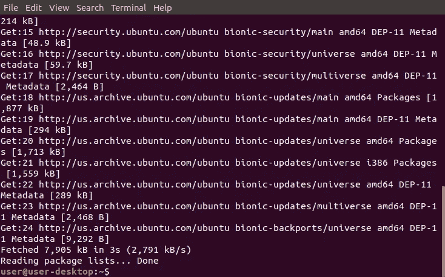
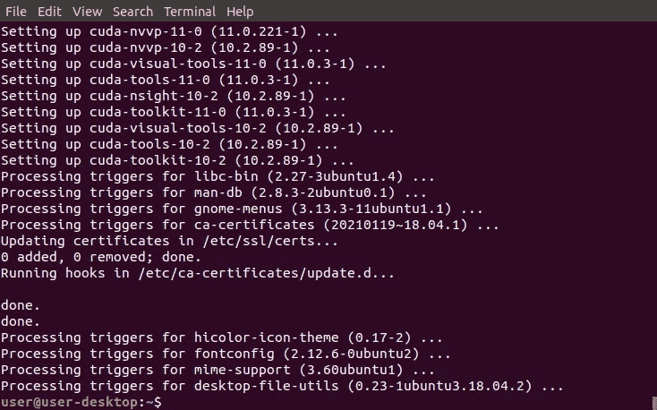
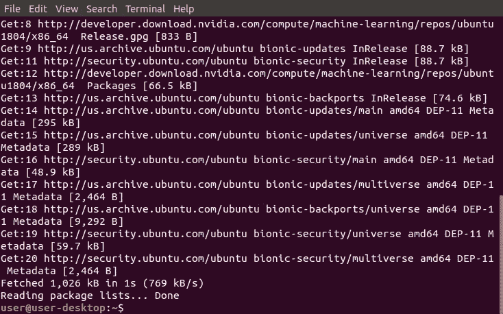
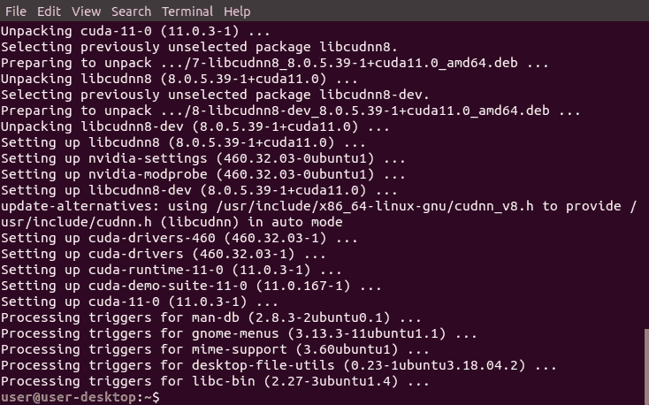
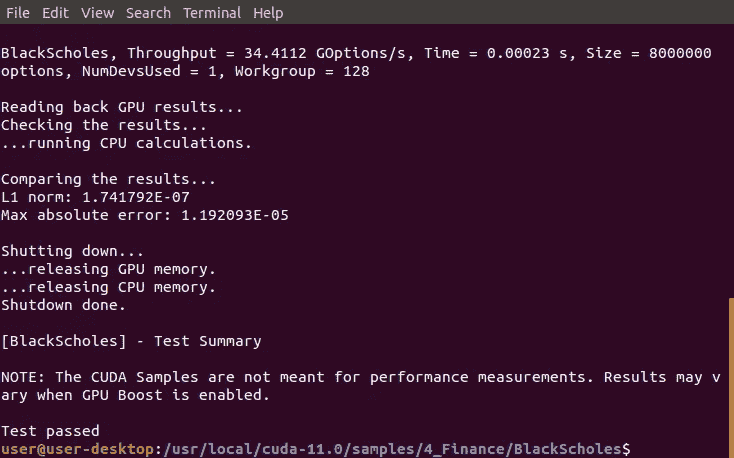

# 如何在 Linux 上安装 NVIDIA CUDA 驱动程序、工具包、cuDNN 和 TensorRT

> 原文：<https://medium.datadriveninvestor.com/how-to-install-the-nvidia-cuda-driver-toolkit-cudnn-and-tensorrt-on-linux-cd5b3a4f824?source=collection_archive---------1----------------------->

## 创始人指南

## 带有解释和截图的扩展教程


Image by [Nana Dua](https://unsplash.com/photos/aVeKubCF-48)

> “本文的[精简版](https://medium.com/p/2b76c1b7b3be)使用复制和粘贴代码来帮助您尽快获得结果，⚡”

## 开放终端:

*GNOME 终端*是 [Ubuntu](#834c) 桌面环境的默认终端模拟器。它可以运行 Bash 命令，处理文件，与其他计算机交互，以及执行管理任务和配置。它还具有多个选项卡、用户配置文件和自定义启动命令。

1.  点击左上角的“活动”
2.  在搜索栏中输入“终端”
3.  点击“终端”


## 安装 NVIDIA CUDA 驱动程序:

*AutoInstall* 命令在 [Ubuntu-Drivers](#ce7f) 中用于安装第三方驱动程序及其依赖关系。它优先考虑开放源代码，而不是偶尔会引起问题的专有驱动程序。它还包含查找适当的 NVIDIA 驱动程序和设置替代符号链接的代码。

1.  从下面这些指令中复制命令
2.  将命令粘贴到终端
3.  按“回车”

```
sudo ubuntu-drivers autoinstall
```


## 获取 NVIDIA 公钥:

*Apt-key* 是一个使用密钥对来防止用户下载包含恶意数据的包的程序。它将私钥存储在存储包的服务器上，并将公钥分发给用户。它还使用公钥来验证私钥，然后才能下载包。

1.  从下面这些指令中复制命令
2.  将命令粘贴到终端
3.  按“回车”

```
sudo apt-key adv --fetch-keys [http://developer.download.nvidia.com/compute/cuda/repos/ubuntu1804/x86_64/7fa2af80.pub](http://developer.download.nvidia.com/compute/cuda/repos/ubuntu1804/x86_64/7fa2af80.pub)
```


## 将 NVIDIA 添加到源列表目录:

*源列表目录*是包含各个[库](#bb28)的单独源列表文件的目录。它存储用于从存储库中下载和更新包的信息。它还补充了主源列表文件，该文件存储了有关计算机上现有存储库的信息。

1.  从下面这些指令中复制命令
2.  将命令粘贴到终端
3.  按“回车”

```
sudo sh -c 'echo "deb [http://developer.download.nvidia.com/compute/cuda/repos/ubuntu1804/x86_64](http://developer.download.nvidia.com/compute/cuda/repos/ubuntu1804/x86_64) /" > /etc/apt/sources.list.d/cuda.list'
```


## 更新来源列表和来源列表目录:

*更新*命令用于确保可用包的列表是最新的。它从系统上的存储库中下载一个软件包列表，其中包含关于新的和可升级的软件包的信息。它只更新关于软件包的信息，并不实际升级软件包。

1.  从下面这些指令中复制命令
2.  将命令粘贴到终端
3.  按“回车”

```
sudo apt-get update
```



## 安装 NVIDIA CUDA 工具包 11:

NVIDIA CUDA Toolkit 11 是一组用于创建、构建和运行 CUDA 加速程序的工具。它包括 CUDA 加速库、编译器、工具、样本和文档。它还可能需要与以前的工具包结合使用，以使用不兼容的程序。

1.  从下面这些指令中复制命令
2.  将命令粘贴到终端
3.  按“回车”

```
sudo apt-get --yes install cuda-toolkit-11-0 cuda-toolkit-10-2
```



## 将 NVIDIA 添加到源列表目录:

*源列表目录*是一个目录，它包含了各个存储库的单独的源列表文件。它存储用于从存储库中下载和更新包的信息。它还补充了主源列表文件，该文件存储了有关计算机上现有存储库的信息。

1.  从下面这些指令中复制命令
2.  将命令粘贴到终端
3.  按“回车”

```
sudo sh -c 'echo "deb [http://developer.download.nvidia.com/compute/machine-learning/repos/ubuntu1804/x86_64](http://developer.download.nvidia.com/compute/machine-learning/repos/ubuntu1804/x86_64) /" > /etc/apt/sources.list.d/nvidia-machine-learning.list'
```


## 更新来源列表和来源列表目录:

*更新*命令用于确保可用软件包列表是最新的。它从系统上的存储库中下载一个软件包列表，其中包含关于新的和可升级的软件包的信息。它只更新关于软件包的信息，并不实际升级软件包。

1.  从下面这些指令中复制命令
2.  将命令粘贴到终端
3.  按“回车”

```
sudo apt-get update
```



## 安装 CUDA 和 cuDDN 库:

*CUDA 深度神经网络(cuDNN)* 是一个 GPU 加速库，包含用于创建深度神经网络的操作。它包括卷积、激活、规范化和池层的实现。它还加速了许多流行的深度学习框架。

1.  从下面这些指令中复制命令
2.  将命令粘贴到终端
3.  按“回车”

```
sudo apt-get install --yes --no-install-recommends cuda-11-0 libcudnn8=8.0.5.39-1+cuda11.0 libcudnn8-dev=8.0.5.39-1+cuda11.0
```



## 安装 TensorRT 库:

*TensorRT* 是一个软件开发套件，用于优化预训练模型，以便在某些 NVIDIA 显卡上实现高性能[推理](#0483)。它可以通过合并层和优化内核选择来提高吞吐量、响应时间、能效和内存消耗。它还可以从大多数深度学习框架中导入预训练的模型。

1.  从下面这些指令中复制命令
2.  将命令粘贴到终端
3.  按“回车”

```
sudo apt-get install --yes --no-install-recommends libnvinfer7=7.1.3-1+cuda11.0 libnvinfer-dev=7.1.3-1+cuda11.0 libnvinfer-plugin7=7.1.3-1+cuda11.0
```


## 打开 BlackScholes 目录:

*改变目录(cd)* 命令用于将当前工作目录改变到指定目录。它可以导航到分别从根目录和当前工作目录开始的绝对路径和相对路径。它还可以导航到存储在[变量](#29bf)和[环境变量](#9d2c)中的路径。

1.  从下面这些说明中找到 Python 版本
2.  复制提供的命令
3.  将命令粘贴到终端
4.  按“回车”

```
cd /usr/local/cuda-11.0/samples/4_Finance/BlackScholes
```


## 运行 MakeFile:

*Make* 命令用于按照 [makefile](#a9ee) 中的指令从源代码构建一个可执行程序。它从当前工作目录加载 makefile。然后，它执行 makefile 中的命令来构建一个为它所运行的计算机定制的程序。

1.  从下面这些指令中复制命令
2.  将命令粘贴到终端
3.  按“回车”

```
sudo make
```


## 运行示例:

*BlackScholes* 示例是一个展示 CUDA 工具包中某些特性的程序。它使用 Black-Scholes 公式评估一组给定期权的公平看涨和看跌价格。它还在 GPU 上并行执行计算，并在 CPU 上顺序执行计算，以比较结果。

1.  从下面这些指令中复制命令
2.  将命令粘贴到终端
3.  按“回车”

```
./BlackScholes
```



> “希望这篇文章能帮助您获得👯‍♀️🏆👯‍♀️，记得订阅获取更多内容🏅"

## 后续步骤:

这篇文章是一个迷你系列的一部分，帮助读者设置他们开始学习人工智能、机器学习、深度学习和/或数据科学所需的一切。它包括包含复制和粘贴代码的说明和截图的文章，以帮助读者尽快获得结果。它还包括一些文章，包含带有解释和截图的说明，以帮助读者了解正在发生的事情。

```
**Linux:**
01\. [Install and Manage Multiple Python Versions](https://medium.com/p/916990dabe4b)
02\. [Install the NVIDIA CUDA Driver, Toolkit, cuDNN, and TensorRT](https://medium.com/p/cd5b3a4f824)
03\. [Install the Jupyter Notebook Server](https://medium.com/p/b2c14c47b446)
04\. [Install Virtual Environments in Jupyter Notebook](https://medium.com/p/1556c8655506)
05\. [Install the Python Environment for AI and Machine Learning](https://medium.com/p/765678fcb4fb)**WSL2:**
01\. [Install Windows Subsystem for Linux 2](https://medium.com/p/cbdd835612fb)
02\. [Install and Manage Multiple Python Versions](https://medium.com/p/1131c4e50a58)
03\. [Install the NVIDIA CUDA Driver, Toolkit, cuDNN, and TensorRT](https://medium.com/p/9800abd74409) 
04\. [Install the Jupyter Notebook Server](https://medium.com/p/7c96b3705df1)
05\. [Install Virtual Environments in Jupyter Notebook](https://medium.com/p/3e6bf456041b)
06\. [Install the Python Environment for AI and Machine Learning](https://medium.com/p/612240cb8c0c)
07\. [Install Ubuntu Desktop With a Graphical User Interface](https://medium.com/p/95911ee2997f) (Bonus)**Windows 10:**
01\. [Install and Manage Multiple Python Versions](https://medium.com/p/c90098d7ba5a)
02\. [Install the NVIDIA CUDA Driver, Toolkit, cuDNN, and TensorRT](https://medium.com/p/55febc19b58)
03\. [Install the Jupyter Notebook Server](https://medium.com/p/e8f3e9436044)
04\. [Install Virtual Environments in Jupyter Notebook](https://medium.com/p/5c189856479)
05\. [Install the Python Environment for AI and Machine Learning](https://medium.com/p/23c34b2baf12)**Mac:** 01\. [Install and Manage Multiple Python Versions](https://medium.com/p/ca01a5e398d4)
02\. [Install the Jupyter Notebook Server](https://medium.com/p/2a276f679e0)
03\. [Install Virtual Environments in Jupyter Notebook](https://medium.com/p/e3de97491b3a)
04\. [Install the Python Environment for AI and Machine Learning](https://medium.com/p/2b2353d7bcc3)
```

## 词汇表:

Ubuntu Desktop 是一款桌面操作系统，以快速、安全和免费而闻名。它安装了一个元包，其中包含了构成桌面环境[的所有包，桌面环境](#4a20)默认使用 [GNOME 3](#be9b) 。这为 Ubuntu Linux 发行版提供了一个图形用户界面。
[ [返回](#0f80)

桌面环境是操作系统之上的程序集合，构成了图形用户界面。它包括窗口管理器、面板、菜单、系统托盘、图标和小部件等组件。它还决定了系统的外观以及如何与之交互。
[ [返回](#834c) ]

GNOME 3 是一个非常流行的桌面环境，拥有简单、易用、可靠的用户体验。它提供了一个独特的用户界面，旨在专注于任务，消除干扰。它还具有一个干净的无图标桌面，强大的搜索，任务概述和桌面扩展。
[ [返回](#834c)

Ubuntu-Drivers 是一个程序，用于显示和安装适用于电脑硬件的第三方驱动程序包。它显示哪些设备需要驱动程序，需要哪些包。默认情况下，它还会安装最新版本，但它可以安装特定版本。
[返回](#a4cd)

*库*是位于远程服务器上的[二进制包](#3166)的存储位置。它需要出现在源列表中，以便计算机安装或更新其包含的软件包。这有助于提供高级别的安全性，同时使在 Linux 发行版中安装程序变得容易。
[返回](#2ee3)

*二进制包*是一个存档文件，包含使其包含的程序正常工作所需的文件和目录。它存储在包含特定 Linux 发行版的所有程序的存储库中。它还需要 Linux 包管理器来访问、提取和安装它。
[ [返回](#bb28)

*推理*是使用训练好的模型对看不见的数据进行预测的过程。它可以通过执行正向传递而不包括反向传递来计算误差和更新权重，从而进行预测。在实际应用之前，还可以对其进行优化，以提高吞吐量、响应时间、功耗和内存消耗。
[返回](#7158)

*变量*是用来存储不同类型值的容器。它可以通过在指定的变量名和值之间放置一个等号来赋值或更新一个值。它还可以通过在现有变量名前放置一个美元符号来引用存储的值。
[ [返回](#284d)

*环境变量*是由计算机自动创建和维护的变量。它帮助系统知道在哪里安装文件、查找程序以及检查用户和系统设置。它也可以被计算机上任何地方的图形和命令行程序使用。
[回车](#284d)

MakeFile 文件是一个文本文件，由 shell 命令组成，除非另有说明。它包含所有用于从源代码为特定计算机构建程序的指令。它也是通过在运行程序的同一台计算机上运行 configure 脚本来创建的。
[回车](#f71c)