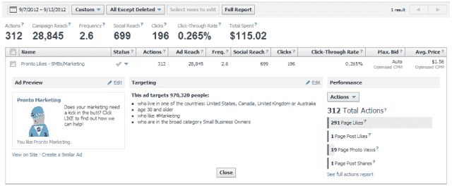
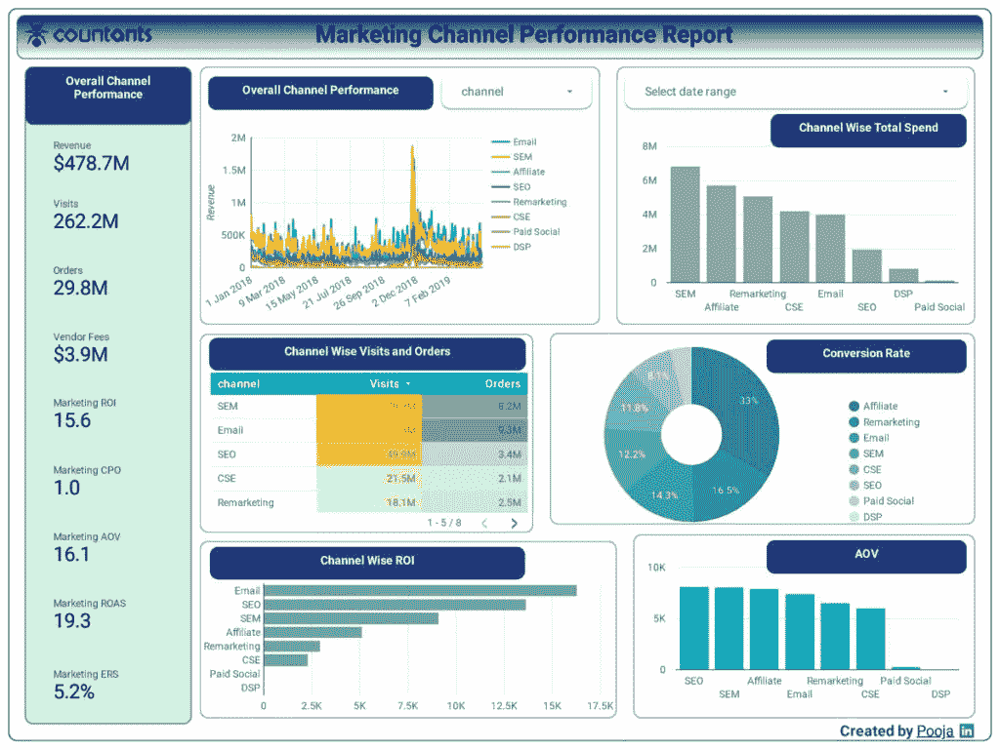
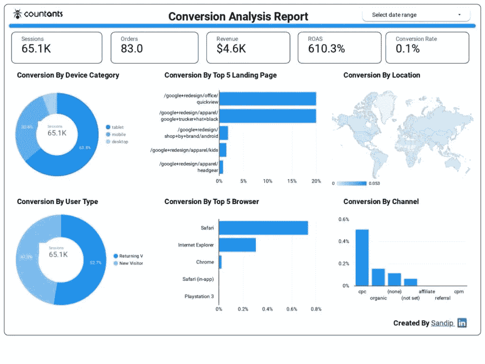

# 如何将脸书广告整合到堆分析工具中

> 原文：<https://medium.datadriveninvestor.com/how-to-integrate-facebook-ads-to-the-heap-analytics-tool-d55f6a111fcf?source=collection_archive---------6----------------------->

拥有超过 700 万数字广告客户的脸书广告显然是全球在线广告客户最青睐的平台。 [2019 年社交媒体营销](https://medium.com/@JBBC/10-key-findings-from-the-2019-social-media-marketing-industry-report-9ffb95b33926)报告得出结论，脸书是大约 72%的 B2C 公司和 43%的 B2B 公司的首选广告渠道。更令人印象深刻的是，脸书赚取了全球数字广告收入的 40%[，紧随其后的是 12%。](https://www.journalism.org/fact-sheet/digital-news/)

除了为数字广告客户提供一个合适的平台，脸书广告还产生数据驱动的洞察力，使公司能够提出正确的营销战略和计划。通过结合脸书广告洞察和分析，在线广告公司可以使用正确的 KPI 和指标来跟踪其在线广告的表现。

希望捕捉脸书上的每一次用户交互(点击、页面滚动等等)，然后分析每一次交互吗？ [Heap Analytics](https://heapanalytics.com/login) 是正确的分析工具，可以自动捕捉每个用户的动作，而无需编写任何手动代码。

 [## 雅虎财经 API |数据驱动投资者的 6 种替代方案

### 长期以来，雅虎金融 API 一直是许多数据驱动型投资者的可靠工具。许多人依赖于他们的…

www.datadriveninvestor.com](https://www.datadriveninvestor.com/2019/02/25/6-alternatives-to-the-yahoo-finance-api/) 

堆分析如何为脸书广告工作？你如何将脸书广告整合到堆分析中？让我们在接下来的章节中讨论这些以及更多。

# 什么是脸书广告洞察？

无论是单个在线广告还是完整的广告活动，脸书广告洞察都是跟踪每次点击成本(或 CPC)、转化率和其他指标的有效模式。简而言之，脸书广告洞察可以帮助您确定您的脸书广告如何为您的公司创造业务和收入。

以下是一些常见的脸书广告指标和 API，帮助您衡量整体广告表现:

*   Ad Insights API 提供了一个单一的用户界面来衡量广告、广告集和广告活动。
*   离线转换 API，跟踪离线客户转换或转换前查看或点击脸书广告的脸书用户数量。
*   跟踪规格，跟踪选定广告的特定用户行为。
*   提升研究，衡量任何脸书广告的效率。
*   脸书像素跟踪用户在你的网站上的脸书广告驱动的行动。

在下一节中，我们将了解堆分析在营销中的作用。

# 什么是堆分析，它如何实现营销？

作为一种网络分析工具，堆分析使数字营销人员能够访问和分析他们的数据，而不需要任何底层分析代码。借助这些数据洞察，堆分析工具有助于营销人员更深入地了解转化、归因和细分。

以下是堆分析在数字营销中发挥作用的一些方式:

*   通过监控推动最大转化率并产生最佳投资回报的营销计划来提高转化率。有了多个堆会话属性的可用性，营销人员可以跟踪推动最多转换的营销渠道。
*   通过自动跟踪传入流量的来源了解客户的归属。凭借其归因渠道，堆分析可以帮助产生销售线索和需求，并为销售确定正确的线索。
*   根据用户的人口统计数据和在线行为对用户进行细分。堆分析数据可用于区分活动用户和空闲用户，并根据用户特定的属性定义段。

接下来，我们将讨论使用堆分析对脸书广告的分析，以及如何集成这两个组件。

# 堆分析如何帮助分析脸书广告洞察

堆分析如何支持脸书分析？这可以通过多种方式实现。例如，考虑一个基于堆 SQL 和红移构建的分析基础架构。有了这个基础设施，数据分析师就可以组合和分析来自不同来源的数据，包括 Heap 系统和脸书广告。堆驱动的数据可以为客户行为和偏好提供清晰的上下文。

另一个例子是一个**脸书广告**和**堆分析仪表板**。作为业务分析师，您可以使用堆工具创建定义，然后将历史数据回填到数据仓库中。

堆工具如何对脸书上的任何用户操作进行即时追溯分析？以下是一些要点:

*   消除任何数据瓶颈，为营销和产品团队提供有价值的见解。
*   自动捕获用户交互，从而为用户行为提供详细的清晰信息。
*   关注对准确数据分析至关重要的正确数据。
*   甚至在制造或设计之前就告知企业市场是否为他们的产品/服务做好了准备。

# 如何将脸书广告整合到堆分析

作为开发人员，您可以使用堆分析 API 将脸书广告集成到堆分析中。堆分析 API 是将堆分析与任何其他应用程序集成的最简单的模式。

这种服务器端 API 方法允许您完成以下任务:

*   将任何后端数据发送到堆中。
*   返回数据
*   管理任何与帐户相关的信息
*   执行任何数据报告。

根据您的功能，您可以使用以下样式配置堆分析 API:

*   REST(RESTful API 的缩写):用作服务器端 REST API
*   RPC(或远程过程调用):用于涉及 GraphQL、SOAP 或 XML-RPC 的 web 服务 API。
*   流:在使用 WebSockets、webhooks、GraphQL 或 gRPC 的单向(或双向)数据流场景中使用。
*   Browser/ Native:主要用于本地可访问性、运行时访问或操作系统相关的 API。例如，网络浏览器上的 JavaScript API 或类似智能手机上的加速度计的设备。
*   间接:当 API 只能通过 SDK 间接访问时使用。例如，Evernote API 基于 Apache Thrift。
*   Email/ Messaging/ FTP:当 FTP、Email 和其他消息应用程序被用来模拟 API 的功能时使用。这种类型的实现的一些例子包括使用基于 SMTP 的因特网邮件或通过 FTP 的数据批次的文件传输。
*   提要:类似于流，这在 API 用户定期轮询更新时使用，这需要一个标准地址(或 URI)。Feed 不要求任何身份验证过程，而是使用标准的 feed 协议，比如 RSS 或 Atom。

# 将堆分析与脸书广告相结合的商业优势

通过将脸书广告整合到堆分析中，您可以从这些分析数据中获得许多商业利益。这包括以下三项:

## 来自脸书平台的强大分析

堆分析工具提供了关于脸书平台上数字广告表现的准确报告和分析。作为商业分析，你不再需要猜测任何广告或活动的表现。通过关键的脸书指标，如每周点击量、页面点赞数、关注人数和点赞帖子，您可以制定有效的决策策略。

此外，您可以从用户行为(如点击、喜欢甚至转化)中获得业务洞察力。

## 创建定制和有针对性的广告。

通过精确的分析，广告商可以创建针对特定用户类别或人口统计的定制广告，以获得最佳回应。脸书广告可以定制，以迎合围绕用户参与度、网站访问量或页面喜欢度的商业目标。

## 瞄准你确切的客户群。

想把你的广告瞄准一个确切的客户群吗？那么数据分析就是你需要的。借助 Heap analytics，你可以根据共同兴趣、人口统计、在线行为，甚至年龄组，让你的广告迎合首选用户群。

通过这种方式，分析可以帮助你筛选目标受众，剔除那些不太可能转化的用户。

# 结论

随着脸书成为最强大的社交媒体营销库之一，脸书广告是接触你的目标受众群的最佳媒介。通过有效的分析，你可以轻松地将你的脸书广告整合到堆分析中，并自动分析每一次用户互动。

Countants 一直致力于通过定制解决方案向其全球客户提供基于云的分析和 T2 可视化服务。作为 Heap 合作伙伴网络不可或缺的一部分，该公司在为其客户构建云计算基础设施和分析方面发挥了重要作用。

如果您正在寻求利用您在脸书广告的商业投资，那么我们可以与您合作。[访问我们的网站](https://www.countants.com/contact-us/?utm_medium=social&utm_source=Medium&utm_campaign=traffic)，留下您的联系方式。