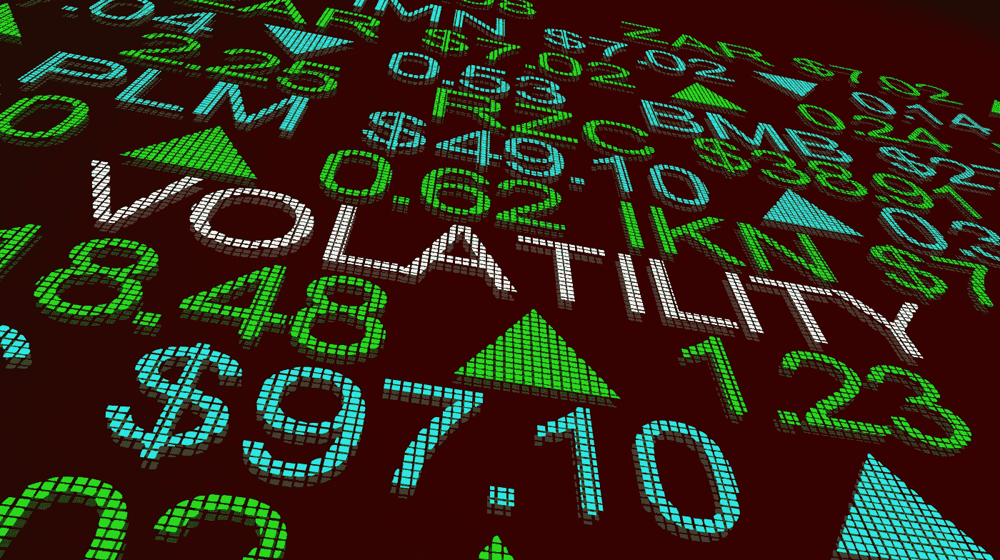

# 冠状病毒期间如何投资

> 原文：<https://medium.datadriveninvestor.com/how-to-invest-during-the-coronavirus-732ab0604f4e?source=collection_archive---------13----------------------->

## 波动可以等同于机会

2020 年 3 月中旬，我坐在这里，不禁想起了芝麻街。

现在，你可能会认为考虑到目前的情况，这是一件奇怪的事情。但是你可能记得在以前的芝麻街节目中，他们总是会说，比如，“今天的节目是由字母 X 和数字 3 带给你的。

## 2020 年 3 月似乎是由字母 v 带给我们的。

**V 为病毒。v 代表波动性。**

这是我暂时想说的第二个 V。

是的，波动很大。大幅下降，虽然不太大，但仍有显著上升。一个接一个，没有特别的韵律或原因。

**我在说什么？**

所有的一切。我说的是股票市场。我说的是油价。我说的是个股和其他金融工具。

> 我在这个领域数十年来学到的一件事是，波动也可以等同于机会。

因此，我的直接建议是，保持头脑冷静，不要惊慌。事情有起有落。从长远来看，事情最终会有可观的回报率。

请记住，你应该尽量不要成为群体中的一员。总体市场对几乎所有事情都反应过度，积极反应过度，消极反应过度，这总是让我感到好笑。当然，你不可能战胜市场。我喜欢称之为“群体的智慧”是深刻的…尽管它确实反应过度了。

 [## 算法交易的机器学习|数据驱动的投资者

### 当你的一个朋友在脸书上传你的新海滩照，平台建议给你的脸加上标签，这是…

www.datadriveninvestor.com](https://www.datadriveninvestor.com/2019/01/30/machine-learning-for-stock-market-investing/) 

鉴于这两个原则，可观的回报率和“群众的智慧”，让我与你分享两个投资策略，两个行动的哲学基础，可能证明是卓有成效的。不仅是在这个高度波动的时期，也是在我们应该说的“平均”时期。

## 1.忽略微观趋势

是的，它们意义重大。大落差。涨幅不太大。我们已经看到一些提供在家工作工具的股票快速增长，如 Zoom，以及旅游和旅行等行业的快速下跌。

所有这些，从更大的角度来看，都是在微观循环中。它们时时刻刻，日复一日，甚至周复一周。根据定义，它们是中长期工具。它们的设计是为了让你的利息随着时间的推移而复利，产生更长期的回报。如果你愿意的话，这就是它们的范围。

他们没有做到的是“本周投资，周末赚钱，然后退出”

举个恰当的例子，我希望在几周内收到我的季度报表。并不是说它们会马上被扔进碎纸机，但总的来说，我会忽略它们，把它们收起来。我的时间范围是 10 年、15 年、20 年后的今天和明天。

虽然正在发生的事情的确很有趣，但我有必要改变策略并感到恐慌吗？ *答案是没有*

从我的经验来看，当我有的时候，我会在底部卖出，在顶部买入。这和你想要的食谱完全相反。不要落入一个更年轻，更缺乏经验的亚伦曾经使用的陷阱。

## 2.相反意见的理论

**如果人们在曲折中前进，那么是时候考虑曲折了。**

用更具体的行业术语来说，如果人们在卖，那么是时候考虑买了。

依我拙见，目前有一些很棒的股票被严重低估了。

他们之所以被打败，是因为新冠肺炎的本质，根据定义，它是有限的。

我们将恢复正常，也许是一种新的正常，当这种情况发生时，航空公司、游乐园、邮轮公司和其他股票将回升到它们的长期平均水平。

那代表着一个机会。

因此，如果明天早上出现大幅下跌，这一周已经出现过几次，也许明天下午我就会考虑买入。因为通常情况下，今天的大幅下跌会促成明天的小幅上涨。

是的，我在打持久战。这并不意味着我不能在不去猜测市场的情况下利用短期潜力。

把短期的事情当成一个快速的机会。当别人在东倒西歪时，我在东倒西歪。但是从长远来看，我基本上忽略了它。

似乎与许多其他人相反，我在过去几天里买了一些好股票。我买它们的价格远低于它们的长期平均价格或运行价格。

就像我们每个人一样，股票和表现总是回归均值。

现在这种情况不会发生了，因为所有的体育赛事都被取消了，但是让我们假设一支运动队在今晚的比赛中表现不佳。之后教练会在更衣室给他们上一堂大课，第二天晚上球队很可能会表现得更好。不，不是因为讲座。事实上，与讲座无关的是，根据他们的平均值，团队表现不佳，并且将趋向于回到平均值。

股票也是如此。迪士尼或嘉年华邮轮公司或联合航空公司，以及许多其他相对类似行业的公司，由于短期问题，目前正在超卖。但是六个月后呢？12 个月？18 个月？他们会重新开业，恢复正常。

**短期波动为积极的前进创造了机会。**

它不应造成恐慌性抛售或与羊群行为一致。

如果你想在今天的市场上有所作为，认真考虑做与市场现在相反的事情。

这两个原则一起工作，不要惊慌，谨慎操作和执行，可以产生巨大的长期回报。市场会回来的，它总是会回来。资产价值会回归，它们总是会回归。

所以不要担心微观趋势，玩长线游戏。你会因此过得更好。

*阿隆·韦伯是一位连续创业者，是* [*韦伯投资有限责任公司*](http://webberinvestments.com/?source=post_page---------------------------) *的首席执行官，也是* [*麦迪森沃尔机构*](http://www.madison-wall.co/?source=post_page---------------------------#home) *的管理合伙人。*