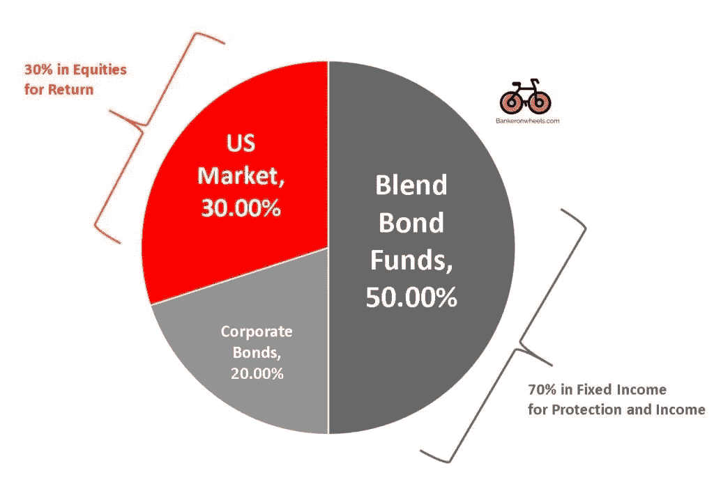
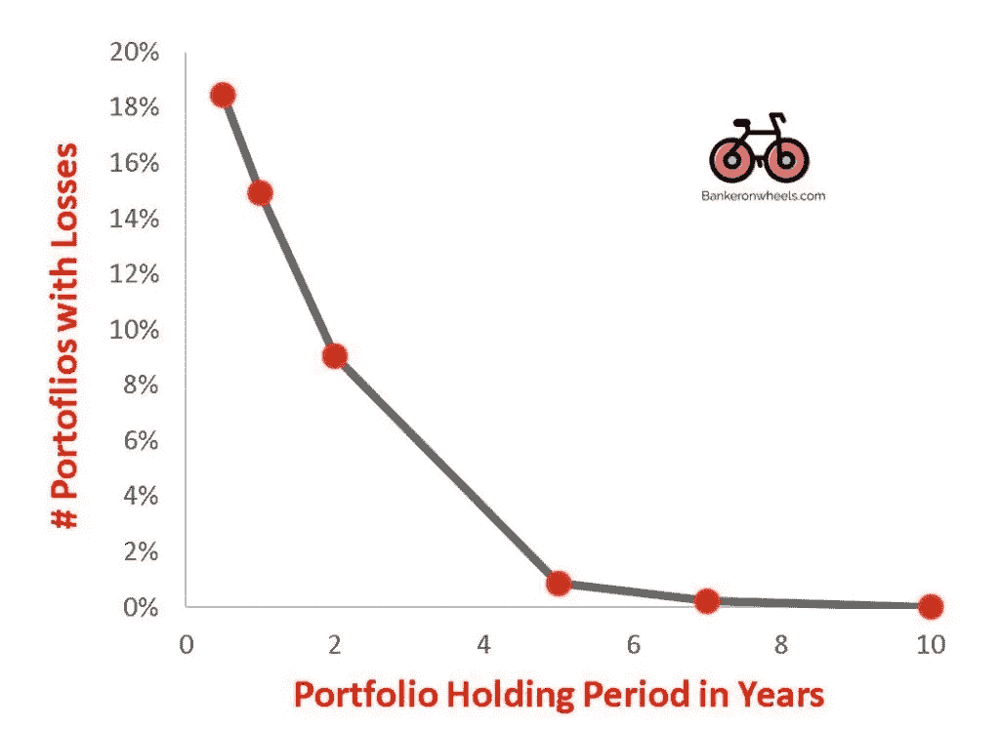
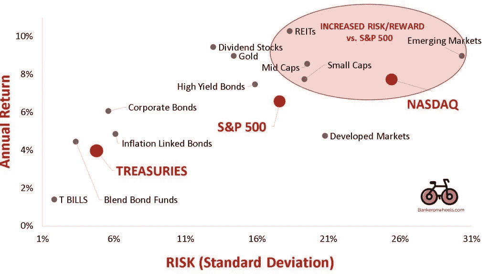
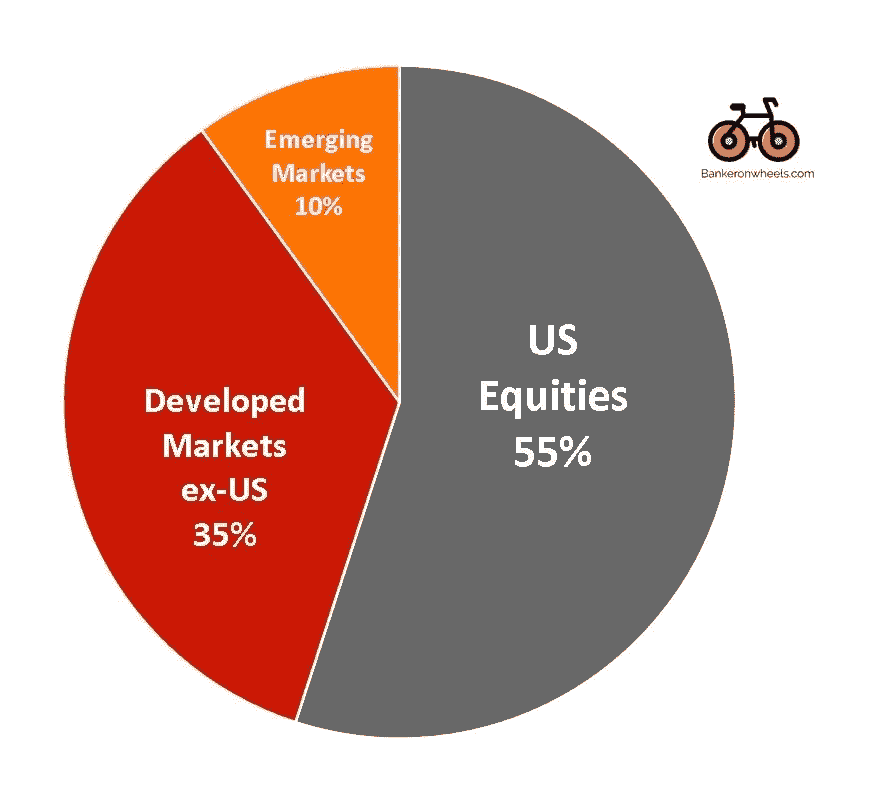
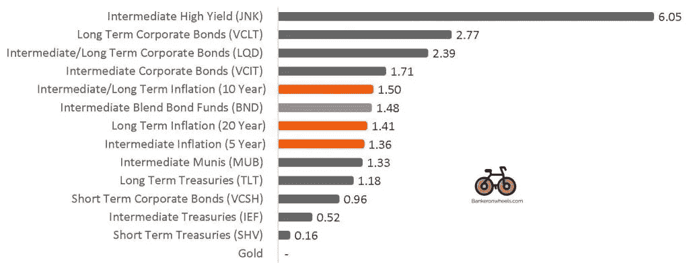
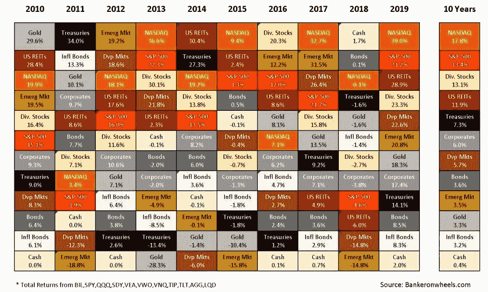
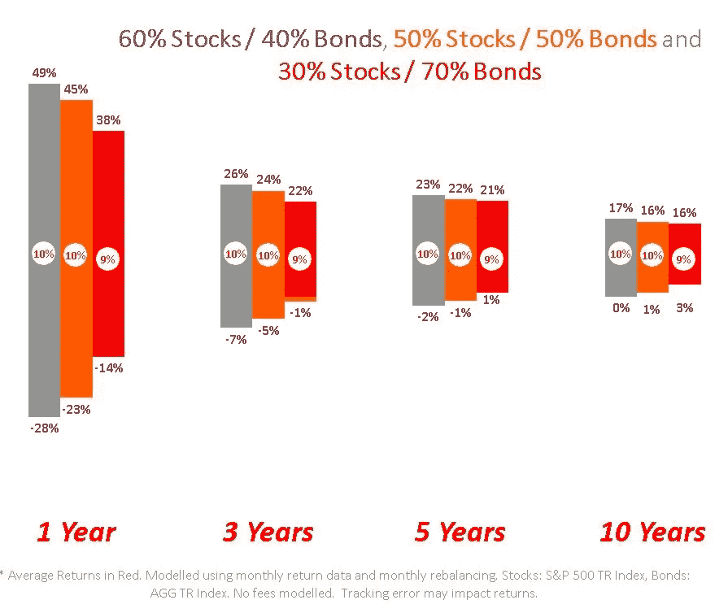
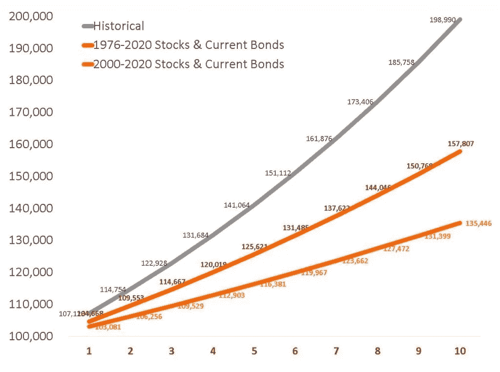

# 如何为中期目标投资

> 原文：<https://medium.datadriveninvestor.com/how-to-invest-for-medium-term-goals-e0e64c3c4cf?source=collection_archive---------1----------------------->

最早发表于[Bankeronwheels.com](https://Bankeronwheels.com)

# 关键要点

*   5 年或 8 年的时间周期相对较短，一个**中期投资组合**应该相对**简单，最多 3 个 ETF**
*   在评估了你的风险状况后，你可以很容易地**构建一个投资组合**并**降低成本/费用。**大多数人没有意识到的是，这个**不需要多少金融知识也能做到**
*   与长期投资不同，由于时间跨度较短，你的风险更高，你需要格外关注你选择的 ETF
*   选择至少一只债券和一只股票 ETF，并**每季度或每半年进行一次再平衡**

# 中期个人理财投资目标

# 实现您的目标并保护您的资本

谈到退休投资，有很多建议。

但是你的中期目标呢？五年后想买房怎么办？或者你的孩子八年后要上大学怎么办？

以下是一些中期个人理财投资目标的例子:

*   **房子首付**
*   **婚礼**
*   **间隔年旅行**
*   **儿童教育**

这篇文章将帮助你构建一个简单且经济高效的 ETF 投资组合来实现你的目标并保护你的资本

# 两个构建模块核心产品组合

# 财务成功的关键因素

为了构建中期投资组合，您至少需要以下各项:

*   **一只美国市场股票 ETF (#1)**
*   **一只美国集合债券 ETF(# 2)**+公司债券 ETF(可选)

# 中期投资策略的资产配置示例

上面的配置是一个**5 年期投资组合的示例，适用于对风险有一定偏好的人**:

*   **30%配置于股票 ETF**
*   **70%至固定收益 ETF**
*   增加一个可选的公司债券 ETF 作为固定收益分配的一部分，以增加固定收益分配的回报(你可以保留混合债券的 70%)

开始之前

## 了解你的需求

我应该持有多少债券？

*   记住，**了解你自己和你的目标最重要** [最重要](https://bankeronwheels.com/risk-aversion-time-horizon-investing/#elementor-toc__heading-anchor-6)——你应该始终让你的投资组合与你的目标保持一致，这就是为什么这个**投资组合应该是个性化的，适合你的需求**而不是以你认识的其他人为基准
*   **先做一份** [问卷](https://personal.vanguard.com/us/FundsInvQuestionnaire)**了解你需要哪些与这个特定目标相关的股票/债券配置**
*   **该问卷将收集一些关键信息，如你的截止日期还有多长时间，或者你对市场涨跌有多适应(例如，你会对在市场崩盘期间你为买房攒下的 30%的钱消失感到舒服吗？)**
*   **使用结果以正确的比例购买下面推荐的 ETF**
*   **明白投资组合的再平衡是任何指数投资策略成功的关键**

# **债券配置是中期目标的关键**

## **60%股票 40%债券组合经历负回报的历史概率**

****

> ***从 1976 年到 2020 年，模拟了 500 多个投资组合，60%的股票/ 40%的债券分配——突然的损失可能会激起你撤回投资或突然改变策略的情绪冲动——没有人喜欢看到自己的投资组合贬值——但保持现状并抵制修改的诱惑最终会有回报。如果你持有一个投资组合超过 4 年，看到亏损的机会就会大大减少***

*   **为了你的目标尽早开始投资有所帮助——记住，时间跨度越长，在长期上涨的股市中亏损的几率就越低。中期投资可能会很棘手，因为按照历史亏损标准，时间不足以消除任何机会**
*   **但是，通过正确的资产配置，你可以通过增加债券的配置获得同样的无损失可能性，例如，在过去的 5 年里，70%债券 30%股票的投资组合没有遭受任何损失**
*   **随着你的投资期限超过 5 年，你可以逐渐增加股票的配置**

# **#1 选择股票 ETF**

## **ETF 基准风险和年回报率(2000 年至 2020 年)**

****

> ***这些是包括来自不同美国资产类别的股息在内的总回报——美国股票每年产生约 7%的回报，包括中小盘股***

**虽然对于[长期投资来说](https://bankeronwheels.com/best-long-term-index-funds/)国际投资是必要的，但 5 年期投资组合可以保持相对简单的美国股票**

# **美国市场——我需要国际曝光吗？**

*   **美国股票约占全球股票资本总额的 55%,应该是投资组合中风险部分的基石**
*   **从收入角度来看，标准普尔 500 公司已经多元化了——超过 [40%的销售额来自全球市场](https://us.spindices.com/indexology/djia-and-sp-500/sp-500-global-sales)**
*   **美国公司以较低的风险提供高回报(就波动性而言，但也包括经营风险，如治理问题/欺诈等)。)**
*   **至少在中短期内，美元仍将是储备货币，外国公司将被吸引到最大的证券交易所上市**

## **发达国家和新兴国家的股票市值**

****

> **在 5 年的时间范围内，我认为美国股票提供了足够的多元化，而不会使投资组合的再平衡变得过于复杂。你可以通过纳入一些额外的资产类别来进一步细化股权分配，但美国大型股已经满足了中短期投资组合的许多要求**

** [## 金融顾问今天应该拥抱虚拟实践模式的 5 个理由|数据驱动…

### 随着对办公空间长期租赁的需求在新冠肺炎疫情时代彻底崩溃，办公空间的需求也在下降

www.datadriveninvestor.com](https://www.datadriveninvestor.com/2020/05/21/5-reasons-why-financial-advisors-should-embrace-the-virtual-practice-model-today/)** 

**简单的方法**

## **买下整个美国市场**

****一个 ETF 解决方案—整个美国市场 ETF****

**总市场 ETF 涵盖了所有上市证券，因此捕捉到了图表的上部，而最大的公司(标准普尔 500)可能没有捕捉到——从长期来看，这是最谨慎的投资方式**

**廉价全市场 ETF 的例子:**

*   **先锋队 [VTI](https://finance.yahoo.com/quote/VTI/)**

# **#2 选择债券 ETF**

# **保持简单**

**我喜欢简单投资。债券可能有点吓人，因为它们比股票复杂。但你可能只需要一只 ETF 就能实现你的目标**

**简单的方法**

## **购买集合债券 ETF**

****一个 ETF 解决方案—混合债券 ETF****

**这是接触债券最简单的方法，是通过高质量的混合债券 ETFS。该 ETF 是一个广泛的市场债券 ETF:**

**我建议两者之一:**

*   ****iShares 核心美国集合债券 ETF (** [AGG](https://www.google.com/search?q=ishares+agg&oq=ishares&aqs=chrome.0.69i59j69i57j69i59j69i60j69i65l3j69i60.1210j0j1&sourceid=chrome&ie=UTF-8) **)** 为债券(费用率 0.04%)**
*   ****先锋全债市场 ETF** ( [BND](https://investor.vanguard.com/etf/profile/BND) )，费用略低(费用率 0.035%)**

**为了理解这种差异，你也可以在这里快速比较一下主要集合债券基金[。](https://bankeronwheels.com/best-etfs-in-2020/#elementor-toc__heading-anchor-10)**

# **可选—增加一些产量**

## **高质量公司债券**

*   **公司债券为你提供了比集合 ETF 更高的收入，因为它们也有一些违约风险(尽管相对较低)**
*   **然而，企业与股票正相关，因此在低迷时期它不会保护你太多(见[此处](https://bankeronwheels.com/vanguard-ishares-lqd-vs-vcit-corporate-bond-etf-review-index-funds-fed-smccf-vcsh-vclt-comparison/)它们在 COVID 期间的反应),所以配置应该相当适度**

## **债券 ETF 的当前收益率(相对于通货膨胀)**

**从下图可以看出，像 BND 这样的集合债券 ETF 目前的收益率约为 1.5%**

**阅读更多关于美联储正在购买的[顶级公司债券 ETF](https://bankeronwheels.com/vanguard-ishares-lqd-vs-vcit-corporate-bond-etf-review-index-funds-fed-smccf-vcsh-vclt-comparison/)或我的[债券 ETF 综合指南](https://bankeronwheels.com/best-bond-etfs/)**

****

> ***如果你的时间跨度超过 5 年，你可以将一小部分投资组合债券配置添加到纯粹的公司债券 ETF，如 VCIT 或 LQD，这将增加你的回报***

# **#3 可选——附加 ETF**

**如果你想保持简单，你应该坚持以上两个 ETF。**

**然而，你可能会忍不住将部分股票和债券配置换成其他资产类别。以下是一些观察结果。**

## **资产类别的表现往往波动很大**

*   **下面是按资产类别每年的回报率和整体回报率排列的矩阵**
*   **在下面的矩阵中,“债券”框对应于核心投资组合的 AGG ETF**
*   **标准普尔 500 可以代表投资组合中的股票部分**

**点击[这里](https://bankeronwheels.com/asset-class-returns-last-10-years/)阅读更多关于一些结论的内容**

## **十年展望**

****

> ***增加其他资产类别可以显著改变你投资组合的风险/回报状况——确保你对自己的目标和时间范围感到满意***

# **我能期待什么？**

# **如果我持有的时间更长，或者需要更早卖出，会发生什么？**

**持有不同的股票/债券组合不会对回报产生实质性的影响，因为债券有几十年的特殊时期，但通过增加债券，回报的范围会大大缩小(因此锁定了更高的回报，降低了风险)。**

****一个 30%股票 70%债券的投资组合:****

*   **自 1976 年以来，**的平均年回报率将达到 9%****
*   **如果持有 5 年的话，会经历最糟糕的 1%年回报率的情况**
*   ****如果持有 3 年而不是 5 年，同样的投资组合在最坏的情况下可能会有 1%的年损失****
*   ****如果时间跨度延长至 **10 年，最小最坏情况年回报率将为正 3%******
*   ****虽然我们在这里侧重于限制下行风险，但下图显示，在某些情况下，有一些异常的两位数年回报率****

## ****基于持有期(1976-2020)的历史年度回报和年度回报范围****

********

> *****上图包含了 1000 多个场景(！)每个月末都有任何可能的进入点，不同的时间跨度使其独立于起点——关键是，无论市场环境如何，你都需要持有你的投资组合 3 年以上，以显著降低下行风险*****

# ****我目前除了什么？****

****当前的投资环境尤其困难。以下是三种情况:****

*   ****取股票和债券的历史平均值(这是一个基准，因为债券不会有相同的回报)。**100，000 英镑的投资在 5 年内的历史平均回报为 141，000 英镑******
*   ****假设标准普尔 500 和当前债券收益率的年回报率为 11.3%—**在这种情况下，100，000 英镑的投资将在 5 年后获得 125，600 英镑的回报******
*   ****以过去 20 年的标准普尔 500 回报率和当前债券收益率为例— **在这种情况下，100，000 英镑的投资将在 5 年内获得 116，400 英镑的回报******

## ****30%股票/ 70%债券投资组合的长期平衡****

********

> *****债券收益率目前如此之低，以至于历史回报不足，并且会高估投资组合的回报，因此当前到期收益率被用作代理——基于历史平均水平，最保守的情况是橙色。如果将一小部分投资于公司债券 ETF(为简单起见，这里只模拟集合基金)，这些回报可能会提高*****

****最早发表于[Bankeronwheels.com](https://Bankeronwheels.com)****

******进入专家视角—** [**订阅 DDI 英特尔**](https://datadriveninvestor.com/ddi-intel)****